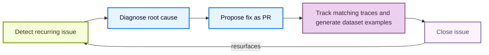

LangSmith Engine 帮助你无需手动翻查 trace 就能交付更可靠的 agent。它是 LangSmith 面向 agent engineering 的 Agent：基于你的生产 trace 工作，它会发现反复出现的问题、诊断其根因，并在开发生命周期的各个阶段推动修复落地。产品概览请参阅 [Engine](/langsmith/engine-overview)。

## Engine 的工作方式

### The issue lifecycle

每个问题都会经历一个闭环，在这个闭环中 Engine 会：

1. 在你的 trace 中检测到重复出现的问题。
2. 对照你的 trace 和已连接的源代码诊断根因。
3. 以 pull request 形式提出修复方案。
4. 随时间持续跟踪该问题，自动添加匹配同一模式的新 traces，并生成 ground truth [dataset examples](/langsmith/manage-datasets)，以便你验证修复方案。
5. 如果问题在关闭后再次出现，则自动重新打开它。



### How Engine selects traces

Engine 在为每次扫描选择和排序 trace 时，会同时分析 trace 内容和 run feedback。它把 feedback（包括 online evaluator 分数、annotation queue 分数，以及通过 SDK 提交的用户 feedback）视为高优先级信号，而非补充数据。

为了应用这一信号，Engine 会：

- 读取你项目中存在的 feedback key，并为每个 key 专门拉取低分 trace，使样本中包含 evaluator 分数较差的 trace，而不是听凭按时间近度取舍。
- 在筛查样本时，把带有非空 feedback 分数的 trace 排在其他 trace 之前。
- 在分析 context 中的每条 trace 上都保留 feedback 分数，即使 trace payload 因需要适配 context 限制而被压缩。

任何向 run 写入 feedback 的来源都会自动参与这一优先级判断。Engine 无需在 evaluators 或 annotation queues 之外进行任何额外设置。

## Set up Engine

设置 Engine 分为两步：先由 [Organization Admin](/langsmith/rbac#organization-admin) 为 [workspace](/langsmith/administration-overview#workspaces) 启用 Engine，然后任何[角色](/langsmith/rbac)可以更新 tracing projects 的用户都可以为每个 tracing project 或 agent environment 打开 Engine。

<Note>
在自托管 LangSmith 上，运维人员必须先在 LangSmith Helm chart 中启用 Engine，然后才能执行上述任一步骤。请参阅[自托管上的 Engine](/langsmith/engine-self-hosted)。
</Note>

### Enable Engine for your organization

<Note>你必须是 [**Organization Admin**](/langsmith/rbac#organization-admin) 才能启用 Engine。要查看管理员，请打开 **Settings**，在 **Access and Security** 下选择 **Members**，然后查找具有 **Organization Admin** 角色的成员。</Note>

<Steps>
  <Step title="Open Engine settings">
    在 [LangSmith console](https://smith.langchain.com?utm_source=docs&utm_medium=cta&utm_campaign=langsmith-signup&utm_content=langsmith-engine) 中，点击左下角的 **Settings**，然后在 **Engine** 下选择 **Engine**。
  </Step>
  <Step title="Toggle Enable Engine">
    打开 **Enable Engine** 开关，并确认 AI features 使用条款。对话框会逐字显示以下产品内提示：

    > LangSmith AI features, powered by LangChain-managed inference, bring intelligence to your observability workflow. With LangSmith AI enabled, your team can surface issues faster, run smarter evaluations, and build more reliable LLM applications. By enabling this feature, your organization's trace data will be processed using LangChain-managed LLM keys. Subject to our Terms of Service.

  </Step>
</Steps>

一旦 Engine 启用，任何角色可以更新 tracing projects 的用户都可以为 tracing project 或 agent environment 设置它。对 project 只有只读访问权限的角色则不能。

<Tip>
  如果你想关闭 Engine，请将同一设置切回 off。这会停止 Engine 的所有自动运行，并终止未来在你账户中的计费。
</Tip>

### Turn on Engine for a tracing project

<Steps>
  <Step title="Open Engine and select a project">
    在 [LangSmith console](https://smith.langchain.com?utm_source=docs&utm_medium=cta&utm_campaign=langsmith-signup&utm_content=langsmith-engine) 中，选择 UI 侧边栏中的 **Engine**。项目选择器会列出已配置的项目。要设置未列出的项目，请点击 **+ Set up another project**，然后在 **Choose a project to analyze** 下选择它。tracing project 中的 **Engine** 标签页也仍然可用。
  </Step>
  <Step title="Connect a code repository (optional)">
    虽然是可选项，但推荐连接代码仓库。Engine 会读取你的源代码，定位失败 trace 背后的代码路径，让修复建议扎根于实际实现，并可直接从 issue 创建 pull request。在 **Connect your agent's code repository** 下选择 Engine 应使用的仓库。这里只会显示 GitHub App 有权限访问的仓库。点击 **Manage app access →** 可更新权限。关于 GitHub App 的设置和组织审批，请参阅[将 Engine 连接到 GitHub](/langsmith/engine-github)。如果要为 Engine 提供额外的项目上下文，请在 **Context Hub repository** 字段中选择一个仓库。
  </Step>
  <Step title="Select preference categories (optional)">
    在 **What matters most to you?** 下，选择你希望优先审查的类别，例如 **Tool Call Failures** 或 **Latency**。点击 **+ Add something specific** 可描述自定义关注点。参见 [Tell Engine what kinds of issues to focus on](#tell-engine-what-kinds-of-issues-to-focus-on)。
  </Step>
  <Step title="Choose an analysis level">
    在 **Analysis level** 下，选择 **Reduced**、**Standard**（默认）或 **Expanded**。更高级别会分析更多 trace 且成本更高。参见 [Set the analysis level](#set-the-analysis-level)。
  </Step>
  <Step title="Focus on specific traces (optional)">
    在 **Focus on specific traces** 下，按 run 名称或 metadata 把 Engine 的关注范围收窄到一部分 run。留空则会分析所有 trace。参见 [Tell Engine which traces to focus on](#tell-engine-which-traces-to-focus-on)。
  </Step>
  <Step title="Start analyzing">
    点击 **Start Analyzing**。对话框可能会基于你项目的用量显示月度成本估算区间。Engine 最多可能需要 20 分钟来分析项目的 trace 并开始提出建议。在等待期间，你可以 [set up notifications](/langsmith/engine-notifications)，让系统在发现不同优先级问题时通过 Slack 或 webhook 提醒你。
  </Step>
  <Step title="Review the agent overview document">
    在开始展示问题之前，Engine 会先生成一份 agent overview 文档，根据 trace 描述你的项目目的、架构和关键指标。请审阅并编辑该文档，然后点击 **Accept & Continue** 继续。如果 overview 不准确，请先编辑，因为 Engine 会把它作为后续全部分析的上下文，因此准确性会直接影响问题检测质量。
  </Step>
</Steps>

<Frame caption="Setup dialog">
  
  
</Frame>

你可以在 [Configure Engine](#configure-engine) 中稍后更改其中任何选项。要连接 GitHub，请参阅[将 Engine 连接到 GitHub](/langsmith/engine-github)。要在 Engine 发现问题时通过 Slack 或 webhook 收到提醒，请参阅 [Engine notifications](/langsmith/engine-notifications)。

### Pause Engine or delete its issues

Engine 按照为平衡成本和性能而调整的动态调度来扫描你的 trace。要在不删除已有问题的情况下停止扫描某个 project，请点击 [**Engine settings**](#configure-engine) 面板中的 **Pause**。点击 **Resume** 可再次开始扫描。

在同一个面板中点击 **Delete all issues**，可永久移除该 project 的问题和 Engine 设置。此操作无法撤销。

要为整个组织关闭 Engine，请参阅 [Enable Engine for your organization](#enable-engine-for-your-organization)。

## Configure Engine

在 **Engine** 页面上，点击问题列表顶部的 **Configure Engine** <Icon icon="settings"/>（齿轮）图标，打开 **Engine settings** 面板。你可以用它为 Engine 提供关于你的 agent 的上下文、告诉它应关注什么，以及连接 Linear。该面板还包含其他地方介绍的设置：

- **Code repository** 和 **Context repository**：连接或更新 Engine 在诊断问题时读取的 GitHub 仓库。每个 GitHub 仓库都可以有自己的 **Subfolder** 和 **Branch**（默认为仓库默认分支）。Context Hub 仓库让 Engine 可以对 instructions、docs 和已关联的 skills 提出修复建议。请参阅[将 Engine 连接到 GitHub](/langsmith/engine-github)。
- **Notifications**：请参阅 [Engine notifications](/langsmith/engine-notifications)。
- **Preview deployments**：设置 Engine 重放 issue traces 时对照的 baseline deployment，并开启基于 preview deployments 的修复验证。请参阅 [Validate fixes by running your agent](#beta-validate-fixes-by-running-your-agent)。
- **Analysis level**：请参阅 [Set the analysis level](#set-the-analysis-level)。
- **Spend limit**：请参阅 [Set spend limits and monitor usage](#set-spend-limits-and-monitor-usage)。
- **Pause** 和 **Delete all issues**：请参阅 [Pause Engine or delete its issues](#pause-engine-or-delete-its-issues)。

### Give context on your agent

在设置期间，Engine 会生成一份 agent overview 文档，描述你项目的目的、架构和关键指标。Engine 会把它作为全部分析的上下文，因此其准确性会影响问题检测质量。在 **Agent overview** 下编辑该文档，补充 Engine 无法从你的 trace 中推断出的相关上下文，并确保其准确。文档的 **User Preferences** 部分还会收集 Engine [从你在 issue 上的操作中学到的东西](#investigate-and-fix-an-issue)，你可以在这里审阅并修正这些校准。

### Tell Engine what kinds of issues to focus on

在 **Preferences** 下，列出 Engine 应关注、优先或忽略的领域。选择诸如 **Cost & Tokens**、**Latency** 或 **Tool Call Failures** 之类的类别 chip，或点击 **+ Add something specific** 描述自定义关注点。Engine 会把 preferences 视为权威，并将它们折入 agent overview 文档。变更会在下一次扫描时生效。

### Tell Engine which traces to focus on

把 Engine 聚焦到重要的 trace 上，可以让分析更精确，并减少 LSU 的浪费。当一个 project 混合了多个 agent 或工作负载，而你只想让 Engine 分析其中一部分时，就可以使用 trace 范围控制（即 **Focus on specific traces** 控件）。例如，如果某个 project 同时运行一个生产 chatbot 和一个夜间批处理任务，可以将范围设为 `Run Name is chatbot`，让 Engine 忽略批处理 run。默认情况下，Engine 会分析 project 的所有 trace。

你可以在以下两个位置中的任一处设置范围，使用的是同一个控件：

- **Engine setup**：在 **Find and fix your agent's issues** 面板中，**Focus on specific traces** 下。
- **Engine settings**：在 [**Engine settings**](#configure-engine) 面板的 **Trace filters** 部分。此处的编辑会自动保存。

可使用 filter editor 添加范围条件。每种类型最多可添加一个条件，**最多两条**：

- **Run Name**：选择一个 run 或 agent 名称。值字段会根据你项目近期 trace 中的 run 名称自动补全。
- **Metadata**：选择一个 metadata key，再选择一个值。两者都会根据你项目近期 run 上的 metadata 自动补全。

要添加条件，请从字段选择器中选择类型，填写值，然后点击 **Add**。每个条件会以 chip 形式展示，例如 `Run Name is chatbot` 或 `env is prod`。点击 chip 上的 **×** 可移除该条件。

<Note>
**范围限制：**范围筛选器只接受 run 名称和 metadata 条件。你无法按 feedback key、evaluator 名称或分数阈值来限定 Engine 的扫描范围。如果你希望 Engine 聚焦于某个特定 evaluator 低分对应的 trace，请在你的 [preferences](#tell-engine-what-kinds-of-issues-to-focus-on) 或 [agent overview](#give-context-on-your-agent) 中描述这一点。Engine 本身已会自动纳入所有 feedback 信号。参见 [How Engine selects traces](#how-engine-selects-traces)。
</Note>

范围决定了 Engine 会分析哪些 trace 来检测问题、构建 agent overview 文档。初始 setup 时设定的范围会应用于 Engine 的首次扫描。之后再在 [**Engine settings**](#configure-engine) 面板中修改范围，不会立即重新运行 Engine。它会在下一次扫描时生效。

### Connect to Linear

在 **Linear** 下，点击 **Connect**，选择一个 team，可选地为新问题选择一个 project，然后点击 **Save changes**。Engine 会保留其创建的问题的持久链接，但不会同步来自 Linear 的后续编辑。删除所有 Engine 问题不会删除已有的 Linear tickets。参见 [Create a Linear issue](#create-a-linear-issue)。

## Manage Engine costs

### Understand LSU costs

<Note>
LangSmith Cloud 使用 LangChain-managed inference。自托管部署也可以使用[自己的 model providers](/langsmith/engine-self-hosted#your-own-model-providers)，通过 API key 或云身份认证。使用自己的 providers 时，模型调用由它们收费，而 LangChain 对 Engine 用量收取更低的 LSU 费率。
</Note>

Engine 按 **LangChain Standard Units (LSUs)** 收费。LSU 是一种标准化工作量单位，覆盖计算、存储和内存，并在 LangChain 提供模型时包含模型推理。LSU 消耗量随被分析的 trace 数量、Engine 为诊断和修复问题而发起的 LLM 调用的数量与复杂度，以及任何已连接仓库的大小而变化。每个 LSU 的价格是 **1 美元**。如需估算你预期的 LSU 用量，请参阅 [LangSmith Usage Calculator](https://www.langchain.com/pricing#pricing-calc)。

在初始化阶段，Engine 会审计历史 trace，按严重性聚类并排序问题优先级，并对你的 prompt 或代码提出修复建议，如果已连接代码仓库。后续的定期扫描按照为平衡成本和性能而调整的动态调度运行，无论是否发现新问题，都会展示此前未检测到的新问题。

### Set the analysis level

分析级别控制 Engine 分析你项目中多少比例的 trace，也就是使用多少 LSU。在[为 project 打开 Engine](#set-up-engine) 时选择它，之后可以在 [**Engine settings**](#configure-engine) 面板的 **Analysis level** 下更改：

- **Reduced**：以更低的成本监控更少的 trace。
- **Standard**（默认）：分析更多符合条件的 trace，覆盖更全面。
- **Expanded**：面向高流量 project 的最大覆盖。仅对有足够 tracing 体量的 project 可用。

Setup 对话框会显示一个随所选级别更新的月度成本估算区间。

### Set spend limits and monitor usage

Organization Admin 可以在两个层级设置支出上限：

- **Org-wide limit**：打开 **Settings**，在 **Engine** 下选择 **Engine**。在当月至今支出卡片上，点击限额 chip，然后在弹出框中设置限额。
- **Project 或 environment limit**：打开 tracing project 或 agent environment 中的 **Engine** 标签页，点击 **Configure Engine** <Icon icon="settings"/> 图标。在 **Spend limit** 下，点击限额 chip（未设置限额时 chip 显示 **None**），然后在弹出框中设置限额。

你可以用 LSU 或 USD 输入上限，1 LSU = $1。当达到限制后，LangSmith 会暂停新的 Engine 运行，直到你提高限制，或下一个月度计费周期开始。

两个层级的默认行为不同：

- **Org-wide limit**：可以选择 **Default**、**No limit** 或自定义上限。在管理员做出选择之前，默认值会生效（每月 750 LSU，即 $750），因此即使没有人设置过限额，Engine 支出也会被限制。**Engine** 设置页面会显示当前生效的限额及其来源。
- **Project 或 environment limit**：将弹出框中的字段留空即表示不限制。使用 **Remove limit** 可以清除之前设置的上限。

若要完全停止 Engine，请使用 **Settings > Engine** 中的 **Enable Engine** 开关。

如需监控用量，你可以在 **Settings** 中的 **Engine** 页面查看整个组织的月度 LSU 支出，或在 tracing project 或 agent environment 的 [**Engine settings**](#configure-engine) 面板中查看其支出。

对于离线的自托管部署，支出报告和限额执行方式有所不同。请参阅 [Air-gapped installations](/langsmith/engine-self-hosted#air-gapped-installations)。

## Investigate and fix an issue

设置完成后，**Engine** 页面会列出 Engine 检测到的问题。点击任意问题可打开其详情面板。顶部的 diagnosis 会描述该问题及其影响。每个问题都有一个工具栏，可用于设置优先级、关闭或重新打开它、打开 pull request、创建 Linear issue，以及 watch 它。

Engine 会从你处理问题的方式中学习。在每次计划扫描中，它会审查你自上次扫描以来执行的操作，例如关闭问题、将其标记为误报、更改优先级或打开 pull request，并将它们折入 [agent overview](#give-context-on-your-agent) 的 **User Preferences** 部分。你在更改优先级或关闭问题时给出的原因也属于该反馈的一部分。例如，如果你反复将某个类别中的问题标记为误报，Engine 会在后续扫描中把该类别评为更低的优先级。来自自动化的变更（例如 pull request 合并）以及通过 [LangSmith Chat](/langsmith/chat#engine) 执行的操作不计为反馈。

### Review evidence

**Evidence** 部分包含支撑 diagnosis 的 traces，其中还带有每条 trace 的片段。在这一部分，你可以：

- **查看 trace**：点击 **View trace** 打开一条 evidence trace。当 Engine 定位到导致问题的子 run 时，会直接打开那个确切的 run。trace 视图中包含返回 Engine issue 的 **View issue** 链接。
- **创建离线 examples**：点击 [**Add offline examples**](#add-offline-examples)，根据生产 trace 输入生成自定义 ground truth [dataset examples](/langsmith/manage-datasets)，用于离线评估。
- **查看项目内 evidence**：点击 **View all in project**，在 tracing project 中查看这些 evidence。

更多信息请参阅 [Manage a trace](/langsmith/manage-trace)。

Engine 会在问题提交后持续跟踪它。在后续扫描中，任何匹配该问题失败模式的新 trace 都会被自动添加到 **Evidence** 中，因此无需你重新运行任何内容，问题就能反映该失败仍在发生的频率。

**Proposed Fix** 部分描述了该问题，并给出修复建议。如果已连接仓库，建议中还可能包含具体代码或 prompt 修改。

### Change priority and status

从优先级下拉菜单中选择 **Low**、**Medium** 或 **High**，即可更新问题优先级。你还可以选择性地提供原因，Engine 会在后续扫描中[从中学习](#investigate-and-fix-an-issue)。

关闭操作会记录你审查的结论。点击：

- **Close** 将问题标记为已解决。
- **Incorrectly Flagged** 将问题视为不真实或不值得修复而忽略。

对于任一结果，你都可以选择性地提供原因，Engine 会在后续扫描中[从中学习](#investigate-and-fix-an-issue)。

你可以随时重新打开已关闭的问题。点击 **Reopen** 可清除进行中的修复，并在该问题处于被关注状态时停止 watch。当 Engine 在后续 trace 中检测到相同问题再次出现时，它也会自动重新打开该问题。

### Open a pull request

点击 **Open PR**，在已连接仓库中创建一个包含建议代码修改的 GitHub pull request。如果尚未连接仓库，请先连接。一旦 pull request 存在，Engine 会把 **Open PR** 替换为 **View PR #\<number\>**。点击 **View PR #\<number\>** 可在 GitHub 中打开该 pull request。Engine 会在整个问题生命周期中反映 PR 的状态（open、merged 或 closed）。你还可以把问题的 fix context 复制到剪贴板，交给 LLM 或 coding assistant 使用。Engine 可以对任意已连接仓库提出代码修改建议，包括基于 [Deep Agents](/oss/python/deepagents/overview)、[LangChain](/oss/python/langchain/overview) 和 [LangGraph](/oss/python/langgraph/overview) 构建的 agent。

### Create a Linear issue

要创建 issue，请先[连接 Linear](#configure-engine)，然后在 Engine issue 上点击 **Create in Linear**。创建期间，Engine 会显示 **Linear creation pending**。创建完成后，Engine 会在 Engine issue 和问题列表中显示关联的 Linear issue 标识。

Linear issue 包含 Engine issue 的标题和描述、严重性、类别、标签、**View issue in LangSmith** 链接，以及 evidence trace ID。Engine 会保留指向 Linear issue 的链接。如果你关闭 Linear ticket，Engine 会关闭对应的问题；如果你取消 Linear ticket，Engine 会把对应的问题标记为误报。Engine 还会在对应的 Engine issue 上跟踪与该 Linear ticket 关联的 pull request。

### Add offline examples

这一步会把暴露该问题的 traces 捕获为 ground truth [dataset examples](/langsmith/manage-datasets)，以便在修复进入生产前离线评估。

1. 点击 **Evidence** 列表右上角的 **Add offline examples**，打开 **Add as offline example** 对话框。
2. 审查每条 trace。对话框会展示输入、agent 产生的错误输出，以及建议的期望输出，它会作为自定义 ground truth example。
3. 点击 **Add to Dataset** 可直接添加，或点击 **Edit in annotation queue** 先审查。
4. 在 annotation queue 中，每个 example 都会展示 run 输入，以及 Engine 根据 trace 分析提出的参考输出，它们会被结构化为命名的 [assertions](/langsmith/assertions)。每条 assertion 都是对正确答案应包含或不应包含内容的简短陈述。你可以按需编辑 assertion，用 **+ Add assertion** 添加新的 assertion，然后点击 **Add to Dataset & Continue** 逐条处理 example。

更多信息请参阅 [Manage datasets](/langsmith/manage-datasets)、[Use annotation queues](/langsmith/annotation-queues) 和 [Use assertions](/langsmith/assertions)。

### Watch an issue

Watch 会让问题保持打开以便监控，而不会将其解决或标记为误报。当你尚未准备好修复某个问题，但仍想知道它是否会继续发生时，请点击 **Watch**。

要在被关注的问题再次出现时收到提醒，请点击 **Alert me via Slack**，它会打开 [**Engine settings**](#configure-engine) 面板的 **Notifications** 部分。请参阅 [Engine notifications](/langsmith/engine-notifications)。

当新的 traces 关联到被关注的问题时，Engine 会把它移到列表顶部，并显示有多少新 traces 到达，以便你着手修复或继续关注。

<Note>
Watch 仅适用于没有进行中 pull request 的打开问题：先放弃修复才能再次 watch 问题。解决被关注的问题，或将其标记为误报，会自动停止 watch。
</Note>

## Filter and sort issues

### In the UI

**Engine** 页面会在左侧面板列出检测到的问题。每条记录都包含标题、简短描述、相关 trace 数量，以及该问题最近一次出现的时间。每个问题都会带有一个失败类别标签，例如 **Silent tool error** 或 **Hallucination**。

在列表顶部，你可以点击：

- **Filter issues** 图标，按 **Priority**、**Status** 和 **Tags** 筛选。
- **Sort issues** 图标，按 **Severity**、**Last Updated** 和 **Created** 排序。
- **Configure Engine** <Icon icon="settings"/>（齿轮）图标，以 [配置 Engine](#configure-engine)。

打开 [LangSmith Chat](/langsmith/chat#engine)，可以跨问题提问，例如哪些问题最需要关注，或有多少新问题处于打开状态。

如果设置完成后没有出现任何问题，说明 Engine 没有在已分析的 trace 中发现重复模式。可以等积累更多 trace 后再回来查看。

### With the CLI

在 [LangSmith CLI](/langsmith/cli) 中使用 `langsmith project issues list` 列出 project 的问题。使用 `--status`（`open`、`fixing`、`watching`、`completed` 或 `ignored`）和 `--priority`（`urgent`、`high`、`medium` 或 `low`）筛选，并使用 `--limit` 和 `--offset` 分页。

```bash
# List open, high-priority issues for a project
langsmith project issues list --project <project-name> --status open --priority high
```

## Beta: Validate fixes by running your agent

<Note>
修复验证处于私有的 [beta](/langsmith/release-stages#beta) 阶段。它仅在 LangSmith Cloud 上、对已启用该功能的组织可用。它仅支持运行在 [LangSmith Cloud deployments](/langsmith/deploy-to-cloud) 上的 agent；不支持外部托管的 agent。如需申请访问权限，请[加入等待名单](https://www.langchain.com/langsmith-engine-v2-new-feature-access)。
</Note>

Engine 通过运行你的 agent 来验证修复。它会将与某个 [issue](#investigate-and-fix-an-issue) 关联的 traces 重放到你的 agent 的一个 deployment 上，以确认该问题可以复现。然后，它将同样的 traces 重放到 Engine 修复方案的 preview deployment 上，以确认该修复可以解决问题。Engine 会将每次验证记录为基于该 issue 的 traces 构建的 dataset 上的一个 [experiment](/langsmith/evaluation-concepts#experiment)，因此你可以逐条对比基线 trace 和修复后的 trace。

### Set up validation

验证需要一个 baseline deployment：同一 workspace 中一个就绪的、非 preview 的 [LangSmith Cloud deployment](/langsmith/deploy-to-cloud)。选择它需要对该 deployment 拥有 `deployments:update` 权限。

设置验证：

1. 在 **Engine** 页面上，点击 **Configure Engine**。
2. （可选）[连接](/langsmith/engine-github) Engine 应修改的 GitHub 仓库。在仓库设置中，选择 Engine 修复方案的基础分支，或留空以使用仓库的默认分支。
3. 在 **Preview deployments** 部分中找到 **Baseline deployment** 字段。搜索一个 deployment，或粘贴其 LangSmith URL 或 deployment ID。preview deployments 和尚未就绪的 deployments 无法从列表中选择。基线可以是生产或 staging deployment，但请尽可能使用 staging，这样验证就不会动用生产环境的凭据和服务。
4. 选择 **Verify fixes with preview deployments**。
5. 点击 **Save**。

修复验证还需要：

- **已连接的仓库**：Engine 会在[将 Engine 连接到 GitHub](/langsmith/engine-github) 中连接的仓库里以 pull request 形式提交其修复方案。
- **由 label 触发的 preview builds**：在 baseline deployment 上[启用 preview builds](/langsmith/preview-builds#enable-preview-builds)。使用以下起始配置：
  - 将 **Preview base branch** 设置为与 Engine 配置的分支相同的分支。
  - 选择 **Label only**，并将 **Trigger label** 设为 `preview`。Engine 会将该 label 应用于其修复 pull request。
  - 将 **Idle TTL** 设置为 6 小时。
  - 将 **Max concurrent previews** 设置为 20。

完成此设置后，Engine 会应用 preview label，等待 LangSmith 从提议的修复方案构建一个临时 deployment，对其重放验证，并在 issue 上显示结论和重放的 traces。

<Warning>
验证会将来自 issue traces 的输入发送到 baseline deployment，并在验证修复时发送到 preview deployment。每次重放都会在该 deployment 上创建一个 thread 和一个 run，而你的 agent 在响应时可以调用其工具。

当 LangSmith 创建 preview deployments 时，它们会[继承 baseline deployment 的 secrets](/langsmith/preview-builds#manage-secrets)。在启用修复验证之前，请确认每个继承的 secret 都适合临时 deployment 使用。对基线 secrets 的更改不会传播到已经存在的 previews。
</Warning>

#### Authenticate with your deployment

默认情况下，Engine 使用 LangSmith 凭据调用你的 deployment，该 deployment 会把调用者视为 Studio 用户。接受 LangSmith 平台认证的 deployment 无需进一步设置。

如果你的 deployment 自行认证调用者，请把 Engine 需要的 headers 提供给它：

1. 在 **Preview deployments** 部分，在 **Deployment authentication** 下点击 **Add custom headers**。
2. 输入你的 deployment 要求的每个 header，然后点击 **Save**。
3. 在你的 deployment 的认证处理器中，把这些 headers 映射到权限最小、仅满足验证所需访问级别的身份。

Header 值经过加密且只写：LangSmith 只显示其名称，因此替换它们意味着要重新输入每个值。LangSmith 自身管理的 headers 不能被覆盖。要恢复默认，请点击 **Use platform authentication**。

<Note>
自定义 headers 只决定你的 deployment 是否接受该请求。它们不会告诉你的 agent 某个 run 是验证重放，那是另一个信号，请参阅 [Make replayed runs side-effect free](#make-replayed-runs-side-effect-free)。
</Note>

### Prepare a deployment to test against

Engine 通过运行你的 agent 来确认问题，因此你选择的 deployment 必须是你可以反复运行而不会产生后果的。

#### Use a deployment you can safely exercise

选择一个配置与你要测试的 agent 镜像一致、但不服务于你的用户的 deployment。对于你的 agent 会写入的任何服务，让它指向测试凭据、测试账户和非生产数据存储。

#### Make replayed runs side-effect free

Engine 在每次重放时都会设置 `config.configurable.__engine_validation_replay__ = true`，这样你的 agent 可以识别出验证重放并更保守地响应。在 HTTP 边界，验证请求还会包含 `X-LangSmith-Source: engine`。在图代码中使用该 configurable 标记，在请求中间件中使用该 header。

使用该标记来跳过或阻止那些影响会离开你的 agent 的工具，例如发送电子邮件或消息、向客户收费、提交工单、写入生产数据存储、调度任务，以及调用合作伙伴 API。

<Accordion title="Copy-paste allowlist middleware">
将以下中间件添加到你的 agent 项目中：

```python
from __future__ import annotations

from collections.abc import Awaitable, Callable, Collection, Mapping
from typing import Any, cast

from langchain.agents.middleware import AgentMiddleware
from langchain.messages import ToolMessage
from langchain.tools.tool_node import ToolCallRequest
from langchain_core.runnables import RunnableConfig
from langgraph.types import Command

ENGINE_VALIDATION_CONFIG_KEY = "__engine_validation_replay__"
LANGGRAPH_AUTH_USER_ID_CONFIG_KEY = "langgraph_auth_user_id"


def _configurable(config: RunnableConfig | None) -> Mapping[str, object]:
    configurable = (config or {}).get("configurable")
    return configurable if isinstance(configurable, Mapping) else {}


def is_engine_validation(config: RunnableConfig | None) -> bool:
    """Return whether the caller requested reduced-privilege validation mode."""
    return _configurable(config).get(ENGINE_VALIDATION_CONFIG_KEY) is True


def is_trusted_engine_validation(
    config: RunnableConfig | None,
    *,
    expected_user_id: str,
) -> bool:
    """Verify the validation marker and authenticated Engine identity."""
    configurable = _configurable(config)
    return (
        bool(expected_user_id)
        and configurable.get(ENGINE_VALIDATION_CONFIG_KEY) is True
        and configurable.get(LANGGRAPH_AUTH_USER_ID_CONFIG_KEY) == expected_user_id
    )


def _request_config(request: ToolCallRequest) -> RunnableConfig | None:
    runtime = getattr(request, "runtime", None)
    config = getattr(runtime, "config", None)
    return cast(RunnableConfig, config) if isinstance(config, dict) else None


class EngineValidationSafetyMiddleware(AgentMiddleware):
    """Allow only explicitly safe tools during Engine validation."""

    def __init__(self, *, safe_tools: Collection[str]) -> None:
        self._safe_tools = frozenset(safe_tools)

    def _rejection(self, request: ToolCallRequest) -> ToolMessage | None:
        if not is_engine_validation(_request_config(request)):
            return None
        call = request.tool_call
        name = call.get("name") or "tool"
        if name in self._safe_tools:
            return None
        return ToolMessage(
            content=f"{name} is blocked during Engine validation.",
            tool_call_id=call["id"],
            name=name,
            status="error",
        )

    def wrap_tool_call(
        self,
        request: ToolCallRequest,
        handler: Callable[[ToolCallRequest], ToolMessage | Command[Any]],
    ) -> ToolMessage | Command[Any]:
        rejection = self._rejection(request)
        return rejection if rejection is not None else handler(request)

    async def awrap_tool_call(
        self,
        request: ToolCallRequest,
        handler: Callable[
            [ToolCallRequest],
            Awaitable[ToolMessage | Command[Any]],
        ],
    ) -> ToolMessage | Command[Any]:
        rejection = self._rejection(request)
        return rejection if rejection is not None else await handler(request)
```

在每次运行时注册它，并只允许只读且隔离的工具：

```python
from langchain.agents import create_agent

from engine_validation import EngineValidationSafetyMiddleware

agent = create_agent(
    model=model,
    tools=[search_catalog, lookup_order, send_message],
    middleware=[
        EngineValidationSafetyMiddleware(
            safe_tools={"search_catalog", "lookup_order"},
        )
    ],
)
```

在没有重放标记时，中间件会原样传递 tool calls。在验证期间，它只调用 `safe_tools` 中的工具，并为其他所有工具返回一个错误 `ToolMessage`。空的允许列表会阻止所有工具。
</Accordion>

只允许只读且隔离的工具。不要允许发送消息、投递通知、调度或排队任务、持久化数据或写入外部系统的工具。

<Warning>
将标记和 source header 视为不可信的提示，它们只能缩小 run 的操作范围。任何能访问你 deployment 的东西都可以设置它们，因此绝不要用它们来授予访问权限、跳过认证或扩大权限。
</Warning>

##### Verify trusted Engine context

重放标记不能证明身份，因为任何调用者都可以设置 configurable 值。如果你的 deployment 在验证期间重建用户上下文或访问受保护的数据，请先验证经过认证的 Engine 身份：

```python
if is_trusted_engine_validation(
    config,
    expected_user_id=settings.engine_user_id,
):
    context = load_context_from_checkpoint()
```

从经过认证的运行时配置和复制的 checkpoint 中读取身份和应用上下文。不要从重放的输入或 metadata 中读取它们。

对于使用[自定义认证](/langsmith/custom-auth)的 deployment，在应用相同检查之前，先在你的认证处理器中将经过认证的 Engine service principal 映射到 `langgraph_auth_user_id`。认证 headers 确立调用者身份，而重放标记激活低权限工具策略。

#### Expect a burst of traffic

Engine 会同时重放一个 issue 的 traces，因此一次验证最多可以同时启动五个 run，且每个 run 都会运行到完成。修复验证会对 preview deployment 重复同一组重放。请确认该 deployment 的速率限制、配额以及它调用的任何下游服务都能容忍这种突发流量。

#### Keep the deployment available

Engine 只能对就绪的、非 preview 的 deployment 进行重放，并且它会记录产生每个结果的 deployment 和 revision。在验证进行期间保持该 deployment 运行，并预期结果会描述 Engine 测试它时处于活动状态的 revision。

### Test an issue

设置了 baseline deployment 后，Engine 会在创建每个新问题的时候自动验证它。要再次验证某个问题，请打开它并点击 **Test issue**。

当没有设置 baseline deployment、该问题没有关联的 traces，或达到月度 LSU 支出上限时，**Test issue** 不可用。

对于每次验证，Engine 会：

1. 按关联顺序选择最多五条与该问题关联的不同 traces。
2. 将每条 trace 的输入重放到 baseline deployment。对于来自多轮 thread 的 trace，Engine 会包含对话中较早的回合，因此后续失败会在相同的上下文中评判。
3. 判断每次重放是否再次显示该问题所报告的行为。每条 trace 的结果是 **Reproduced**、**Not reproduced** 或 **Inconclusive**。

当至少一条 trace 复现时，整个问题即视为复现。只有当每次重放都没有出现所报告的行为时，才视为未复现。否则结果为无法判定。当验证未能复现一个打开的问题时，Engine 会关闭该问题。

### Verify a fix

选择 **Verify fixes with preview deployments** 后，Engine 会验证它生成的每个修复方案：

1. 当修复 run 完成时，如果尚未打开，Engine 会为该修复方案打开一个 pull request，然后为其添加 preview build label。
2. LangSmith 从该 pull request 构建一个 preview deployment。
3. 当 preview revision 上线后，Engine 将来自该 issue 验证的 traces 重放到 preview deployment 上。
4. 如果问题仍然出现在 preview 上，Engine 会在同一个 pull request 上修改修复方案并再次验证，总共最多尝试三次。

### Read a validation result

每个问题都会报告一个基线结果，以及（一旦存在修复方案）一个验证结果。

基线结果回答该问题是否仍然发生在你的 deployment 上：

| Status | Meaning |
| --- | --- |
| **Awaiting test** | Engine 尚未记录基线结果。 |
| **Reproduced** | 至少一次重放再次显示了所报告的行为。 |
| **Not reproduced** | 每次重放都没有出现所报告的行为，因此 Engine 会关闭打开的问题。 |
| **Inconclusive** | Engine 无法自信地评判重放结果。 |
| **Error** | 验证未能完成。 |

验证结果回答 Engine 的修复方案是否解决了它：

| Status | Meaning |
| --- | --- |
| **Not run** | 该问题未复现，因此没有需要验证的内容。 |
| **Generating fix** 或 **Awaiting fix** | Engine 仍在生成要验证的修复方案。 |
| **Awaiting preview** 或 **Running** | preview deployment 正在构建，或重放正在进行。 |
| **Verified** | 该问题不再出现在修复方案的 preview deployment 上。 |
| **Not fixed** | 该问题仍然出现，因此 Engine 会修改修复方案并再次尝试。 |
| **Inconclusive**、**Timed out** 或 **Error** | Engine 无法为该次尝试建立结论。 |

<Warning>
**Inconclusive** 意味着 Engine 无法收集到可信的证据，而不是该问题不存在或已修复。请将其视为重新测试的信号，而不是通过的结果。
</Warning>

### Review validation experiments

Engine 会在你的 workspace 中存储每个问题的验证 evidence：

- **Dataset**：每个 issue 一个，描述为 `Engine validation evidence`，每条重放的 trace 对应一个 example。
- **Baseline experiment**：对 baseline deployment 的重放。
- **Fix experiment**：对修复方案的 preview deployment 的重放，每次验证尝试对应一个 experiment。

Engine 会以 key 为 `engine_issue_validation` 的 feedback 形式，在每个可判定的重放中记录其结论。其值为 `reproduced` 或 `not_reproduced`，feedback comment 会解释该结论。

当 Engine 对着 preview deployment 验证修复方案时，该 issue 的 **Evidence** 部分会显示总体结论，以及每条 trace 一行：

- **Flagged traces**：Engine 在原始 trace 中看到的内容。点击 **Original trace** 打开它。
- **Reproduced on prod**：基线结果，为 **Reproduced**、**Not reproduced** 或 **Inconclusive**。点击 **Repro trace** 打开重放。
- **After PR #\<number\>**：修复方案 preview 上的结果，为 **Fix verified**、**Recurred** 或 **Inconclusive**。点击 trace 链接打开重放。

每个列标题都会统计有多少条 trace 在基线上复现，或由修复方案解决。点击 **View Experiment** 可在 dataset 的 comparison 视图中并排打开基线和修复 experiments。更多信息请参阅[比较实验结果](/langsmith/compare-experiment-results)。

在修复验证运行之前，该 issue 会显示一个验证摘要：基线结果、修复方案的验证状态，以及每个重放 example 的链接。

### Troubleshoot validation

如果某个 issue 一直停留在 **Awaiting test**，或返回的结果无法判定，请在再次测试之前检查以下内容：

- **Baseline deployment**：确认它仍然就绪、不是 preview，并且与 tracing project 在同一个 workspace 中。
- **认证**：如果你的 deployment 自行认证调用者，请确认保存的 headers 是最新的。替换凭据需要重新输入每个 header 值。
- **重放本身**：从该 issue 的 **Evidence** 部分或验证摘要中打开重放的 runs，阅读你的 agent 返回了什么。
- **Deployment 限制**：查找速率限制、配额耗尽，或由并发重放导致的超时，以及非常大的响应，Engine 可能无法评判它们。
- **受限工具**：如果你的 agent 在重放期间阻止工具，请确认被 stub 的工具仍返回可用的结果，而不是让 run 结束的错误。

在修正 deployment 或其设置后，打开该 issue 并点击 **Test issue** 再次运行验证。

## Beta: Proactively detect issues with Red Teaming

<Note>
Red Teaming 处于私有的 [beta](/langsmith/release-stages#beta) 阶段。它仅在 LangSmith Cloud 上、对已启用该功能的组织可用。它仅支持运行在 [LangSmith Cloud deployments](/langsmith/deploy-to-cloud) 上的 agent；不支持外部托管的 agent。如需申请访问权限，请[加入等待名单](https://www.langchain.com/langsmith-engine-v2-new-feature-access)。
</Note>

Red Teaming 通过向已部署的 agent 发送新的合成请求并评判其响应来测试它。本页前面描述的问题来自你的生产 trace 中已经发生的失败。Red Teaming 寻找尚未发生的失败，例如一次成功的 prompt injection、在没有你的 agent 所要求的确认的情况下执行了有后果的 tool call，或隐藏上下文泄漏到答案中。

每次 run 都会生成一份报告，包含假设、测试每个假设的探针，以及每个假设的结论。

### How Red Teaming works

Red Teaming 会探测被设置为 tracing project 的 [baseline deployment](#set-the-baseline-deployment) 的 deployment。每次 run：

1. **映射应用。** Engine 审查 tracing project 中最多 25 条最近的 traces，以及（如果已连接）你的代码仓库。它会从中学习 agent 的 prompts、tools、guardrails 和请求格式。如果 Engine 已经扫描过该 project，run 会从该 project 的 agent overview 开始，并运行一次较短的确认扫描。
2. **形成假设。** 每个假设描述 agent 可能失败的一种具体方式。Engine 为它分配一个 [issue class](#red-teaming-issue-classes) 和一个场景类型，后者记录该失败是普通用户可以触发的，还是需要蓄意攻击。
3. **探测 deployment。** Engine 向 deployment 发送每个假设最多两个合成请求。探针会复用真实 trace 的请求格式，但将其内容替换为新的合成输入。
4. **评判结果。** Engine 审查每个探针的响应和 trace，然后为该假设分配一个状态和一个严重性。对于模棱两可的结果，Engine 可以发送一个后续探针。

过去的 trace 只帮助 Engine 理解应用。每个被确认的发现都来自 run 期间发送的探针，而不是早期 trace 中的错误。

红队发现会保留在红队报告中。run 不会创建 Engine issues，也不会向你的 workspace 写入 datasets、evaluators 或 feedback。

### Red Teaming prerequisites

运行 Red Teaming 需要：

- **tracing project 上的 Engine**：为接收你的 agent traces 的 project [设置 Engine](#set-up-engine)。
- **一个 baseline deployment**：同一 workspace 中一个就绪的、非 preview 的 [LangSmith Cloud deployment](/langsmith/deploy-to-cloud)，并被设置为该 project 的基线。请参阅 [Set the baseline deployment](#set-the-baseline-deployment)。
- **权限**：在 tracing project 上拥有 `runs:read` 权限以查看红队报告。要启动 run，你还需要项目上的 `runs:create` 权限和 baseline deployment 上的 `deployments:update` 权限。
- **已连接的仓库（推荐）**：通过[已连接的 GitHub 仓库](/langsmith/engine-github)，Engine 会从源代码中读取你的 agent 的 prompts、tools 和 guardrails。没有仓库时，发现只能依赖 traces，报告会显示 **Repository context was not available**。

<Warning>
探针是真实的请求。每个探针都会在 baseline deployment 上创建一个 thread 和一个 run，而你的 agent 在响应时可以调用其工具。请选择一个可以接受合成测试流量和工具副作用的 deployment，例如 staging deployment。
</Warning>

### Set the baseline deployment

Baseline deployment 是 Red Teaming 发送探针的 deployment。

设置 baseline deployment：

1. 在 **Engine** 页面上，选择 tracing project，然后点击 **Configure Engine**。
2. 在 **Preview deployments** 部分中找到 **Baseline deployment** 字段。
3. 搜索一个 deployment，或粘贴其 LangSmith URL 或 deployment ID。preview deployments 和尚未就绪的 deployments 无法从列表中选择。
4. 点击 **Save**。

### Start a Red Teaming run

启动 run：

1. 在 [LangSmith UI](https://smith.langchain.com?utm_source=docs&utm_medium=cta&utm_campaign=langsmith-signup&utm_content=langsmith-engine) 中，在侧边栏中选择 **Engine**，然后选择 tracing project。
2. 在左侧面板顶部，选择 **Red Teaming**。
3. 点击 **Run red team**。

该 run 会以 **Running** 状态出现在报告选择器中。完成后，其报告会在同一视图中打开。当 run 进行中时，**Run red team** 不可用。

如果 run 未能完成，报告选择器会显示其最终状态：**Failed**、**Timed Out**、**Interrupted**、**Cancelled** 或 **Failed to Start**。该 run 没有可用的报告。

### Read a red-team report

使用左侧面板顶部的报告选择器按日期选择一次 run。选择 **Load older reports** 可向前翻看更早的 run。

#### Review the overview

未选择任何假设时，右侧面板会显示报告概览：

- **Confirmed findings**：被确认的发现数量，按严重性细分。
- **Hypotheses tested**：该 run 测试的假设数量。
- **Issue classes tested**：该 run 测试了 10 个 [issue class](#red-teaming-issue-classes) 中的多少个。
- **Findings by Issue Class**：每个 issue class 的被确认发现。
- **Hypothesis Outcomes**：按状态划分的假设。点击某个状态可将假设列表过滤到该状态。
- **Findings Over Runs**：每次 run 的被确认发现，按严重性堆叠。点击某个 run 可打开其报告。

#### Browse hypotheses

左侧面板会对报告的假设分组：

- **Product-Facing Findings**：普通用户可以触发的被确认发现，请求是正常的或真实而混乱的。
- **Technical Hardening Observations**：需要蓄意攻击或技术边界检查才能触发的被确认发现。
- **Legacy Confirmed Findings**：来自更早报告的被确认发现，记录于 Engine 分配场景类型之前。
- **Other Tested Hypotheses**：所有未被确认的假设。

点击筛选图标可显示单一状态，或点击排序图标按 **Default**、**Severity** 或 **Title (A-Z)** 排序。默认顺序先按严重性列出被确认的假设，然后列出需要审查的假设。

每个假设具有以下状态之一：

| Status | Meaning |
|---|---|
| **Confirmed** | 探针复现了该失败，Engine 判定它是真实发现。 |
| **Needs Review** | 证据模糊或不完整。在基于该假设行动之前请审查探针。 |
| **No Issue Found** | 探针已运行，agent 行为正确。 |
| **Not Tested** | 没有探针测试过该假设。这是缺失的覆盖，而不是行为安全的证据。 |

被确认的发现还有严重性：**Critical**、**High**、**Medium**、**Low** 或 **Info**。

#### Inspect a hypothesis

点击一个假设打开其详情。详情会显示 Engine 的结论，随后是每个探针一张卡片，标注为 **Prompt 1** 和 **Prompt 2**。每个探针的结果为 **Attack Worked**、**Attack Blocked** 或 **Needs Review**。

展开探针卡片可以看到：

- **合成 prompt**：Engine 发送给 deployment 的确切 prompt。
- **Observed**：从你的 agent 响应中引用的摘录，以及探针 trace 的摘要，例如其 tool calls、tool errors 和 token 数。
- **Expected**：正确的应用本应返回的内容。
- **View proof trace**：在侧边面板中打开探针的 trace。

在探针下方，**Why the Judge Decided This** 解释 Engine 如何得出该状态和严重性，**What to Do Next** 推荐修复方案。被标记为 **Unexpected** 的假设是 Engine 在测试另一个假设时发现的发现。

### Red Teaming issue classes

每个假设都属于一个 issue class，由失败的根因和它需要的修复来决定。每份报告都会统计全部 10 个 class，并将每个标记为已测试、未测试，或不适用于该 agent。

| Issue class | Red Teaming 测试什么 |
|---|---|
| **Content Policy** | 违反明确的产品、法律、安全或业务政策，例如被禁止的竞争对手对比。 |
| **Instruction Hierarchy** | 直接覆盖 agent 的指令，以及冲突或令人困惑的 prompt 指令。 |
| **Indirect Injection** | 检索到的内容、tool 输出或其他试图控制 agent 的不可信数据。 |
| **Data Exposure** | 隐藏上下文（例如探针植入的合成 canary 值）泄漏到响应中。 |
| **Auth Isolation** | 超出调用者身份或权限边界的访问或操作。 |
| **Tool Safety** | 不安全的工具选择、参数或审批，以及有后果的不安全工作流。 |
| **Workflow Integrity** | 被跳过或伪造的必需步骤，例如检索、澄清或如实地完成。 |
| **Session Integrity** | 多轮状态问题，例如 memory 投毒、延迟激活或角色混淆。 |
| **Input Robustness** | 由结构化输出、解析、分隔符、编码或消息边界引起的混乱。 |
| **Reliability Safety** | 围绕失败、重试、资源限制、循环、重复工作和不可逆副作用的行为。 |

两个 class 有额外要求：

- **Auth Isolation**：Red Teaming 不会确认该 class 中的发现。其假设会报告为 **Needs Review** 或 **Not Tested**。
- **Session Integrity**：假设需要在单次对话中的两轮探针。当没有此类探针运行时，假设会报告为 **Needs Review** 或 **Not Tested**。

### Run Red Teaming again

Red Teaming 会在同一 deployment revision 的 run 之间延续结论。新的 run 会从最多五个更早的、针对同一 baseline deployment 和活动 revision 的成功 run 中获得结论。Engine 会跳过更早的 run 已经确认或发现安全的假设（除非新的 run 显示行为发生了变化），并优先处理需要审查的假设。

在你向 baseline deployment 部署新 revision 后，下一次 run 会在没有先前结论的情况下开始。使用 **Findings Over Runs** 对比各 run 之间的被确认发现。

### Red Teaming limits

每次红队 run 都有上限：

| Limit | 每次 run 的值 |
|---|---|
| 审查的 traces | 25，从最多 100 条最近的 trace 摘要中选出 |
| 假设 | 50 |
| 每个假设的探针 | 2 |
| 发往 baseline deployment 的请求 | 100 |
| 建议 | 20 |

### How Red Teaming handles your data

- **合成探针**：探针内容是合成的。Engine 不会把客户 trace 内容或仓库文本复制进探针；trace 只提供请求格式。
- **只读访问**：Red Teaming 使用只读的 LangSmith 凭据读取你的 traces，并使用只读的 GitHub token 克隆你的仓库。
- **筛查报告**：Engine 在存储模型撰写的报告文本之前会筛查其中的 secrets，并限制响应摘录的长度。

关于 Engine 如何更广泛地处理你的数据，请参阅 [Engine security](/langsmith/engine-security)。

## See also

- [Engine](/langsmith/engine-overview)：产品概览，以及 Engine 在开发生命周期中的定位。
- [将 Engine 连接到 GitHub](/langsmith/engine-github)：连接仓库、选择分支和管理仓库访问。
- [Engine notifications](/langsmith/engine-notifications)：Slack 和 webhook 目标、event payload 参考和 signing secret 校验。
- [Engine security](/langsmith/engine-security)：审阅 Engine 如何访问你的 traces、deployments 和仓库。
- [Preview builds](/langsmith/preview-builds)：创建 Engine 用于验证修复方案的 preview deployments。
- [比较实验结果](/langsmith/compare-experiment-results)：并排比较基线和修复 experiments。
- [Engine on self-hosted](/langsmith/engine-self-hosted)：自托管架构与数据处理方式。
- [Manage datasets](/langsmith/manage-datasets)、[Use annotation queues](/langsmith/annotation-queues) 和 [Use assertions](/langsmith/assertions)：处理 Engine 生成的离线 example。
- [LangSmith CLI](/langsmith/cli)：以编程方式列出和管理问题。

---

<div className="source-links">
<Callout icon="terminal-2">
    [Connect these docs](/use-these-docs) to your agent of choice via MCP for real-time answers.
</Callout>
<Callout icon="edit">
    [Edit this page on GitHub](https://github.com/langchain-ai/docs/edit/main/src/langsmith/engine.mdx) or [file an issue](https://github.com/langchain-ai/docs/issues/new/choose).
</Callout>
</div>
