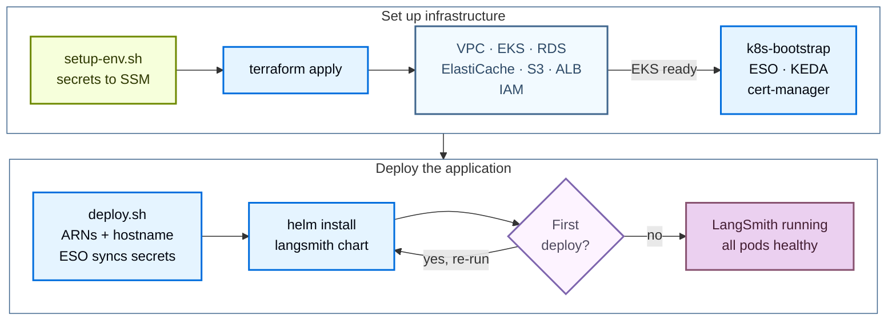

使用公开的 [Terraform modules](https://github.com/langchain-ai/terraform/tree/main/modules/aws) 将 LangSmith 部署到 AWS。以代码方式管理部署，你可以在多个账号之间对 LangSmith 环境进行版本化、审查和复现，而不必在 AWS Console 中逐一点击。

安装分为两个阶段：

1. **Infrastructure**：Terraform 预配 VPC、EKS、RDS、ElastiCache、S3 和 IAM。
2. **Application**：Helm 在集群上安装 LangSmith chart。

完成基础安装后，通过设置开关并重新部署来启用可选 add-on。



## 前置条件

### 所需工具

| 工具 | 版本 | 用途 |
|---|---|---|
| AWS CLI | v2 | 认证、查询 AWS 资源、管理 EKS kubeconfig |
| Terraform | 1.5 | 运行基础设施 module |
| `kubectl` | 1.33 | 检查 EKS 集群 |
| Helm | 3.12 | 安装和管理 LangSmith chart |
| `eksctl` | latest | 可选，便于 kubeconfig 和调试 |

在 macOS 上安装：

```bash
brew install awscli kubectl helm eksctl
brew tap hashicorp/tap && brew install hashicorp/tap/terraform
```

确认每个工具都在 `PATH` 上：

```bash
aws --version
terraform version
kubectl version --client
helm version
```

在 Linux 上，请遵循 [AWS CLI install guide](https://docs.aws.amazon.com/cli/latest/userguide/getting-started-install.html)，其余工具使用你的发行版自带的包管理器安装。

### 所需的 AWS IAM 权限

运行 Terraform 的 IAM 用户或角色需要创建和管理云基础的权限。以下托管策略覆盖了全部权限面。可将它们作为起点，待部署稳定后再收窄为最小权限。

| 策略 | 用途 |
|---|---|
| `AmazonEKSClusterPolicy` | 创建和管理 EKS 集群 |
| `AmazonVPCFullAccess` | 创建 VPC、子网、路由表和 NAT |
| `AmazonRDSFullAccess` | 创建和管理 RDS PostgreSQL 实例 |
| `AmazonElastiCacheFullAccess` | 创建 ElastiCache Redis 集群 |
| `AmazonS3FullAccess` | 创建 S3 bucket 和 VPC endpoint |
| `IAMFullAccess` | 创建 IRSA 角色和策略 |

<Tip>
认证后，在 `modules/aws/` 中运行 `make preflight`。preflight 脚本会确认当前凭证能否执行每个所需操作，并报告第一个缺失的权限，这比在 `terraform apply` 中途才发现缺口要快。
</Tip>

### 认证

使用 CLI 配置 AWS 凭证：

```bash
aws configure
```

或导出环境变量：

```bash
export AWS_ACCESS_KEY_ID="..."
export AWS_SECRET_ACCESS_KEY="..."
export AWS_DEFAULT_REGION="us-west-2"
```

确认凭证有效，且目标 region 已在账号中启用：

```bash
aws sts get-caller-identity
aws ec2 describe-availability-zones --query 'AvailabilityZones[].ZoneName' --output table
```

### License key 与域名

在 `terraform apply` 之前，必须准备好两个非 AWS 项：

- **LangSmith license key。** 可[联系销售团队](https://www.langchain.com/contact-sales)申请。该 key 由 setup 脚本存入 AWS SSM Parameter Store，而不是存放在 `tfvars` 中。
- **域名或子域名**，需能解析到该 AWS 账号，并配有一张覆盖它的 ACM 证书（或为 `tls_certificate_source` 变量使用 `letsencrypt` / `none`）。

### 集群容量参考

容量由两个相互独立的设置控制：

- **Infrastructure capacity** 通过基础设施变量 `eks_managed_node_groups`、`postgres_instance_type` 和 `redis_instance_type` 直接设置实例类型和节点数量。module 默认值为一个 `m5.4xlarge` 节点组（最少 3 个、最多 10 个节点）、RDS 使用 `db.t3.large`、ElastiCache 使用 `cache.m6g.xlarge`。
- **`sizing_profile`** 选择 Helm sizing overlay（pod 资源 requests 和 limits）。由 `init-values.sh` 和 `deploy.sh` 读取；Terraform 不读取它。

部署之前，请按目标层级规划好基础设施容量。各层级建议请参见[扩缩容指引](/langsmith/self-host-scale)。

<Note>
对于生产工作负载，还需计划预配外部的 [LangChain Managed ClickHouse](/langsmith/langsmith-managed-clickhouse) 或自行管理的外部 ClickHouse 集群。In-cluster ClickHouse 仅支持 dev/POC。
</Note>

## 快速开始

<Tip>
关于 `make` 目标、必需变量和常见约束的精简速查表，请参见 [AWS 速查参考](/langsmith/self-host-terraform-aws-quick-reference)。
</Tip>

要从零最快启动一个运行中的 LangSmith 实例，请按顺序执行以下命令：

```bash
# 1. Clone the public modules
git clone https://github.com/langchain-ai/terraform.git
cd terraform/modules/aws

# 2. Generate terraform.tfvars interactively (Enter accepts current values)
make quickstart

# 3. Load secrets into SSM Parameter Store
#    Must be sourced, not executed
source infra/scripts/setup-env.sh

# 4. Provision infrastructure (~20 to 25 min)
make init
make plan
make apply

# 5. Configure kubectl
make kubeconfig
kubectl get nodes

# 6. Deploy LangSmith via Helm (~5 to 10 min)
make init-values
make deploy

# 7. Confirm
kubectl get pods -n langsmith
kubectl get ingress -n langsmith
```

要在一条命令中串联基础设施和应用部署：

```bash
make quickdeploy          # interactive, prompts before terraform apply
make quickdeploy-auto     # non-interactive, auto-approves terraform
```

`make quickdeploy` 按 `terraform apply` → `kubeconfig` → `init-values` → `helm deploy` 的顺序执行。任何一步失败时，命令会退出并给出从该步骤继续的说明。

以下各节详细介绍每个阶段。

## 预配基础设施

Terraform 会预配以下 AWS 资源：

| 资源 | 用途 |
|---|---|
| VPC + subnets + NAT | 集群和托管服务的私有网络 |
| EKS cluster + node groups | Kubernetes 计算资源 |
| RDS PostgreSQL | LangSmith 运营数据 |
| ElastiCache Redis | 队列与缓存 |
| S3 bucket + VPC endpoint | Trace payload blob storage |
| ALB + listeners | 带 TLS 的公共 ingress |
| SSM Parameter Store entries | 应用机密，由 External Secrets Operator 同步到集群 |
| IRSA roles + IAM policies | 每个服务的 AWS 访问权限 |
| KEDA, cert-manager, ESO | 随基础设施一同安装的引导工作负载 |

### 克隆并配置

```bash
git clone https://github.com/langchain-ai/terraform.git
cd terraform/modules/aws
```

后续所有命令都在 `modules/aws/` 中运行。完整目标列表请运行 `make help`。

使用交互式向导生成 `terraform.tfvars`：

```bash
make quickstart
```

向导会依次询问命名前缀、region、EKS 规格、TLS source、外部服务还是 in-cluster 服务，以及可选 add-on 开关，并写入 `infra/terraform.tfvars`。重新运行向导时会预选现有值；在每个提示处按 Enter 即可保留当前配置。

更喜欢手动编辑？复制示例文件并填写必需字段：

```bash
cp infra/terraform.tfvars.example infra/terraform.tfvars
vi infra/terraform.tfvars
```

最少必需的变量：

```hcl
name_prefix = "acme"
environment = "prod"
region      = "us-west-2"

eks_cluster_version = "1.33"
eks_managed_node_groups = {
  default = {
    name           = "node-group-default"
    instance_types = ["m5.4xlarge"]
    min_size       = 3
    max_size       = 10
  }
}

postgres_source = "external"
redis_source    = "external"

tls_certificate_source = "acm"
acm_certificate_arn    = "arn:aws:acm:us-west-2:<account-id>:certificate/<cert-id>"
langsmith_domain       = "langsmith.example.com"
```

所有输入变量请参见 [AWS 变量参考](/langsmith/self-host-terraform-aws-variables)。

<Tip>
在 apply 之前配置远程 state 后端。编辑 `infra/backend.tf`，指向你自己的 S3 bucket 和 DynamoDB 锁表。Terraform 仓库默认提供本地 backend，便于首次评估。
</Tip>

### 将机密写入 SSM Parameter Store

```bash
source infra/scripts/setup-env.sh
```

该脚本读取 `terraform.tfvars`，推导出 SSM 路径 `/langsmith/{name_prefix}-{environment}/`，然后对每个机密依次尝试：复用已导出的值、读取已有的 SSM 参数、自动生成（用于 salt 和 token），或提示你输入。license key 和管理员密码是两个需要交互输入的值。脚本必须以 `source` 方式加载（而非直接执行），因为 `make` 无法把环境变量导回父 shell。

该脚本管理以下 SSM 参数：

| SSM key | 设置方式 | 说明 |
|---|---|---|
| `postgres-password` | 提示输入 | RDS 使用该密码 |
| `redis-auth-token` | 自动生成（`openssl rand -hex 32`） | ElastiCache 要求十六进制 |
| `langsmith-api-key-salt` | 自动生成（`openssl rand -base64 32`） | 切勿轮换，否则所有 API key 失效 |
| `langsmith-jwt-secret` | 自动生成（`openssl rand -base64 32`） | 切勿轮换，否则所有会话失效 |
| `langsmith-license-key` | 提示输入 | 来自[销售团队](https://www.langchain.com/contact-sales) |
| `langsmith-admin-password` | 提示输入 | 必须包含一个符号 |
| `deployments-encryption-key` | 自动生成 Fernet key | LangSmith Deployment add-on |
| `agent-builder-encryption-key` | 自动生成 Fernet key | Agent Builder add-on（由 Fleet 复用） |
| `insights-encryption-key` | 自动生成 Fernet key | Insights add-on |
| `polly-encryption-key` | 自动生成 Fernet key | Polly add-on |

确认机密已存在且 `TF_VAR_*` 环境变量已导出：

```bash
make secrets
```

### 执行 apply

<Note>
在干净的账号上预配 AWS 云基础需要 20 到 25 分钟。不要中断 apply。
</Note>

```bash
make init
make plan
make apply
```

`make plan` 会显示拟议的变更。执行 apply 前请先审查输出。`make apply` 按依赖顺序预配：先 VPC 和安全组，然后 EKS（约 12 分钟）和 RDS（约 8 分钟，并行），再是节点组、ElastiCache、S3 和 ALB。

### 配置 kubectl

```bash
make kubeconfig
kubectl get nodes
kubectl get pods -n kube-system
```

所有节点都应报告 `Ready`，核心 add-on（CoreDNS、kube-proxy、VPC CNI、KEDA、ESO）应处于 `Running` 状态。cert-manager 仅在 `tls_certificate_source = letsencrypt` 或 `create_cert_manager_irsa = true` 时运行。

## 部署 LangSmith

支持两种部署路径，二选一即可。

### 脚本驱动的 Helm 部署（推荐）

适合大多数部署。交互式提示会引导你完成容量和产品选择。

```bash
cd modules/aws

make init-values
make deploy
```

`init-values.sh` 会提示输入管理员邮箱，然后从 `terraform.tfvars` 读取 `sizing_profile` 和 `enable_*` 开关，并把对应的 values 文件从 `helm/values/examples/` 复制到 `helm/values/`。重复运行时会保留你的选择并刷新 Terraform outputs。

`make deploy` 会运行 `helm/scripts/deploy.sh`，它会：

1. 刷新 kubeconfig。
2. 运行 preflight 检查（AWS 凭证、集群可达性、`langchain` Helm 仓库）。
3. 应用 External Secrets Operator 的 `ClusterSecretStore` 和 `ExternalSecret`，让集群直接从 SSM 读取机密。
4. 使用分层 values 文件安装 LangSmith Helm chart。

chart 安装和 pods 就绪预计需要 5 到 10 分钟。

#### 验证

```bash
kubectl get pods -n langsmith
kubectl get ingress -n langsmith
```

当所有 pods 处于 `Running` 且 ingress 显示 ALB DNS 名称时，部署即告就绪。使用你在 `langsmith_domain` 中配置的域名（或 ALB DNS 名称）访问 UI。

如果你完成的是脚本驱动的部署，到这里就结束了。下一节是另一种部署路径，而不是一个额外步骤。

### Terraform 托管的 Helm 部署

适合希望把整个部署纳入 Terraform state 的团队，或自带基础设施的场景。`app/` module 直接管理 External Secrets Operator 的接线、`helm_release` 和功能开关。

```bash
cd modules/aws

# Generate Helm values files from templates (required, the app module reads these)
make init-values

# Pull infra outputs into app/infra.auto.tfvars.json
make init-app

# Configure app-specific settings
cp app/terraform.tfvars.example app/terraform.tfvars
# Edit app/terraform.tfvars, set admin_email, sizing, and feature toggles

# Deploy
make plan-app
make apply-app
```

`app/terraform.tfvars` 文件控制应用配置：

```hcl
admin_email          = "admin@example.com"
sizing               = "production"   # production | production-large | dev | none
enable_agent_deploys = true
enable_agent_builder = true
enable_insights      = true
enable_polly         = true
clickhouse_host      = "clickhouse.example.com"
```

<Warning>
`make plan-app` 之前必须先运行 `make init-values`。app module 会从 `helm/values/` 读取 values 文件，而 `init-values` 根据 `infra/terraform.tfvars` 中的容量和 add-on 选择，从 `helm/values/examples/` 填充这些文件。
</Warning>

对于自带基础设施的场景，跳过 `make init-app`，在 `app/terraform.tfvars` 中手动设置所有变量。

## 启用 add-on

每个 add-on 都由 `infra/terraform.tfvars` 中的一个开关控制。设置开关后，重新运行 `make init-values` 以复制对应的 values 文件，然后重新运行 `make deploy`。

```hcl
enable_deployments     = true   # LangGraph Platform (required for Fleet, Agent Builder, and Polly)
enable_fleet           = true   # Fleet (formerly Agent Builder), standalone service (chart v0.15+)
enable_agent_builder   = false  # Older agent-builder path; mutually exclusive with enable_fleet
enable_insights        = true   # ClickHouse-backed analytics
enable_polly           = true   # Polly AI eval and monitoring
enable_usage_telemetry = false  # Extended usage telemetry
```

```bash
make init-values
make deploy
```

各 add-on 的详细信息请参见 [LangSmith Deployment](/langsmith/deploy-self-hosted-full-platform)。

### Fleet

<Note>
Fleet 是原 Agent Builder 功能的现有形态，以独立服务形式部署（chart v0.15+）。
</Note>

可以通过 `enable_fleet` 启用 Fleet。在 AWS 上，它要求 `enable_deployments = true`，因为 Fleet chat UI 需要通过 LangSmith Deployment 附带的 host-backend 解析 OAuth provider 和 token 连接。它还要求外部 Postgres 和 Redis（`postgres_source = "external"` 和 `redis_source = "external"`）。

Terraform 会在 RDS 上创建专用的 `langsmith_fleet` 数据库，并把 `langsmith-fleet-postgres` 和 `langsmith-fleet-redis` 机密接到现有的 RDS 和 ElastiCache 实例上。Fleet 复用 `langsmith_agent_builder_encryption_key`，因此从 `enable_agent_builder` 迁移会保留相同的 key 和数据。

<Note>
Fleet 要求 LangSmith Helm chart 0.15.0 或更高版本，且 license 中包含 Agent Builder 或 Fleet entitlement。
</Note>

Fleet 会安装 `standalone-fleet-api-server`、`standalone-fleet-tool-server`、`standalone-fleet-trigger-server` 和 `standalone-fleet-queue` 服务。

<Warning>
不要同时启用 `enable_fleet` 和 `enable_agent_builder`。Fleet values 文件会设置 `config.agentBuilder.enabled: false`，因此这两个 add-on 互斥。
</Warning>

## 可选：带 bastion 的私有 EKS 集群

对于必须运行完全私有 EKS API endpoint 的部署，这些 module 提供了 bastion 主机模式：

1. 首先，在工作站上以 `create_bastion = true` 和 `enable_public_eks_cluster = true` 运行，以便创建 bastion。
2. 初始部署完成后，设置 `enable_public_eks_cluster = false` 并重新 apply。EKS API endpoint 将变为仅私有。
3. 后续所有 Terraform 工作都在 bastion 上进行。通过 SSM 登录 bastion，克隆仓库，复制你的 `terraform.tfvars` 和 SSM 机密，然后从那里运行部署。

```hcl
enable_public_eks_cluster = false
create_bastion            = true

# Optional SSH access (SSM is the default and requires no key):
# bastion_key_name          = "my-keypair"
# bastion_enable_ssh        = true
# bastion_ssh_allowed_cidrs = ["203.0.113.0/24"]
```

通过 SSM Session Manager 连接：

```bash
terraform output bastion_ssm_command
aws ssm start-session --target <instance-id> --region us-west-2
```

<Note>
bastion 位于公共子网以保证 SSM agent 连通性，但如果你的 VPC 配有 SSM、SSMMessages 和 EC2Messages 的 VPC endpoint，则不需要公网 IP。bastion 预装了 `kubectl`、`helm`、`terraform`、`git` 和 `jq`，kubeconfig 已为 EKS 集群配置好。请在你的工作站上为 AWS CLI 安装 [Session Manager plugin](https://docs.aws.amazon.com/systems-manager/latest/userguide/session-manager-working-with-install-plugin.html)。
</Note>

## 可选：Envoy Gateway ingress

默认 ingress 是 AWS Load Balancer Controller（ALB）。在 `terraform.tfvars` 中设置 `enable_envoy_gateway = true` 可改为安装 [Envoy Gateway](https://gateway.envoyproxy.io/)。当 `langgraph-dataplane` chart 运行在独立 namespace 的多 namespace dataplane 部署中时，必须使用 Envoy Gateway。

```hcl
# infra/terraform.tfvars
enable_envoy_gateway = true
```

```bash
source infra/scripts/setup-env.sh
make apply

make init-values
cp helm/values/examples/langsmith-values-ingress-envoy-gateway.yaml helm/values/
make deploy
```

当 `tls_certificate_source = "acm"` 时，部署脚本会自动为 Envoy Gateway NLB service 标注 ACM 证书 ARN。TLS 在 NLB 处终止；Envoy 内部看到的是明文 HTTP。

当 dataplane chart 运行在独立 namespace 时，每个 dataplane namespace 需应用一次 RBAC manifest：

```bash
kubectl apply -f helm/values/examples/dataplane-rbac.yaml
```

这会授予 `langsmith-host-backend` ServiceAccount 对 dataplane namespace 中 pods、pod 日志、deployments 和 ReplicaSets 的读取权限。缺少它时，agent 运行日志不会在 LangSmith UI 中流式显示。

## 后续步骤

- 查阅 [AWS 变量](/langsmith/self-host-terraform-aws-variables)和[速查参考](/langsmith/self-host-terraform-aws-quick-reference)。
- 查看 [AWS 架构](/langsmith/self-host-terraform-aws-architecture)，了解平台分层、IRSA 和 module 依赖。
- 出现问题时，请查阅 [AWS 故障排查指南](/langsmith/self-host-terraform-aws-troubleshooting)。
- 使用 [LangSmith Deployment](/langsmith/deploy-self-hosted-full-platform) 在 UI 中启用 agent 部署。

---

<div className="source-links">
<Callout icon="terminal-2">
    [Connect these docs](/use-these-docs) to your agent of choice via MCP for real-time answers.
</Callout>
<Callout icon="edit">
    [Edit this page on GitHub](https://github.com/langchain-ai/docs/edit/main/src/langsmith/self-host-terraform-aws-deploy.mdx) or [file an issue](https://github.com/langchain-ai/docs/issues/new/choose).
</Callout>
</div>
