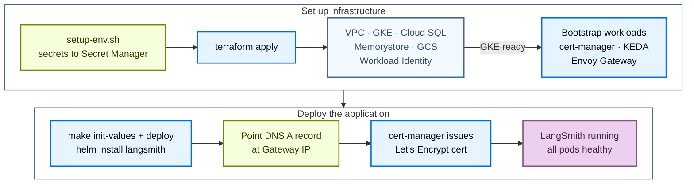

使用公开的 [Terraform modules](https://github.com/langchain-ai/terraform/tree/main/modules/gcp) 将 LangSmith 部署到 GCP。以代码方式管理部署，你可以在多个项目之间对 LangSmith 环境进行版本化、审查和复现，而不必在 Google Cloud console 中逐一点击。

安装分为两个阶段：

1. **Infrastructure**：Terraform 预配 VPC、GKE、Cloud SQL、Memorystore、GCS 和 Workload Identity。
2. **Application**：LangSmith chart，通过部署脚本或 Terraform `app` 层安装。

完成基础安装后，通过设置开关并重新部署来启用可选 add-on。



## 前置条件

### 所需工具

| 工具 | 版本 | 用途 |
|---|---|---|
| Google Cloud SDK (`gcloud`) | 450 | 认证、查询 GCP 资源、管理 GKE 凭证 |
| Terraform | 1.5 | 运行基础设施 module |
| `kubectl` | 1.28 | 检查 GKE 集群 |
| Helm | 3.12 | 安装和管理 LangSmith chart |

在 macOS 上安装：

```bash
brew install --cask google-cloud-sdk
brew install kubectl helm
brew tap hashicorp/tap && brew install hashicorp/tap/terraform

gcloud version
terraform version
kubectl version --client
helm version
```

### 所需的 GCP API

首次 apply 时 Terraform 会自动启用这些 API，但必须先启用 `cloudresourcemanager.googleapis.com`，Terraform 才能启用其余 API。为了加快首次运行，可以手动启用全部 API：

```bash
gcloud services enable \
  container.googleapis.com \
  compute.googleapis.com \
  sqladmin.googleapis.com \
  redis.googleapis.com \
  storage.googleapis.com \
  iam.googleapis.com \
  secretmanager.googleapis.com \
  certificatemanager.googleapis.com \
  servicenetworking.googleapis.com \
  cloudresourcemanager.googleapis.com \
  logging.googleapis.com \
  monitoring.googleapis.com \
  --project <your-project-id>
```

### 所需的 IAM 角色

运行 Terraform 的主体需要在目标项目上拥有以下角色。待初始部署稳定后，再收窄为最小权限。

| 角色 | 用途 |
|---|---|
| `roles/container.admin` | 创建和管理 GKE 集群 |
| `roles/compute.networkAdmin` | 创建 VPC、子网、防火墙规则 |
| `roles/iam.serviceAccountAdmin` | 为 Workload Identity 创建 service account |
| `roles/cloudsql.admin` | 创建和管理 Cloud SQL 实例 |
| `roles/redis.admin` | 创建和管理 Memorystore Redis |
| `roles/storage.admin` | 创建 GCS bucket 和 lifecycle 策略 |
| `roles/resourcemanager.projectIamAdmin` | 在预配过程中授予 IAM 绑定 |
| `roles/servicenetworking.networksAdmin` | 创建私有服务连接（Cloud SQL 和 Redis 必需） |

### 认证

```bash
gcloud auth login
gcloud config set project <your-project-id>
gcloud auth application-default login
```

你还需要 LangSmith license key（可[联系销售团队](https://www.langchain.com/contact-sales)申请），以及一个能解析到 GCP 的域名或子域名。

## 快速开始

<Tip>
有关 `make` targets、所需变量和常见约束的精简速查表，参见 [GCP quick reference](/langsmith/self-host-terraform-gcp-quick-reference)。
</Tip>

要从零开始以最快路径得到一个运行中的 LangSmith 实例，请按顺序运行以下命令：

```bash
# 1. Clone the public modules
git clone https://github.com/langchain-ai/terraform.git
cd terraform/modules/gcp

# 2. Generate terraform.tfvars interactively (Enter accepts current values)
make quickstart

# 3. Load secrets into Secret Manager
#    Must be sourced, not executed
source infra/scripts/setup-env.sh

# 4. Validate environment
make preflight

# 5. Provision infrastructure (~25 to 35 min)
make init
make plan
make apply

# 6. Configure kubectl
make kubeconfig
kubectl get nodes

# 7. Deploy LangSmith via Helm (~8 to 12 min)
make init-values
make deploy

# 8. Get the Gateway IP for DNS
kubectl get gateway -n langsmith \
  -o jsonpath='{.items[0].status.addresses[0].value}'
```

以下各节详细介绍每个阶段。

## 预配基础设施

Terraform 会预配以下 GCP 资源：

| 资源 | 用途 |
|---|---|
| VPC + subnet + Cloud NAT | 集群和托管服务的私有网络 |
| Private service connection | 用于 Cloud SQL 和 Memorystore 私有 IP 的 VPC peering |
| GKE cluster（Standard 或 Autopilot） | Kubernetes 计算，启用 Workload Identity |
| Cloud SQL PostgreSQL | LangSmith 运营数据、HA 备用实例、私有 IP |
| Memorystore Redis | 队列和缓存、STANDARD_HA 层级、私有 IP |
| GCS bucket | Trace payload blob 存储、lifecycle 规则 |
| Workload Identity service account | 每个 pod 的 GCP 访问，无需静态 key |
| cert-manager、KEDA、Envoy Gateway | 随基础设施一同安装的 bootstrap 工作负载 |

### 克隆与配置

```bash
git clone https://github.com/langchain-ai/terraform.git
cd terraform/modules/gcp
```

后续所有命令都在 `modules/gcp/` 中运行。运行 `make help` 查看完整的 target 列表。

使用交互式向导生成 `terraform.tfvars`：

```bash
make quickstart
```

向导会提示输入 project ID、命名前缀、region、GKE 规格、TLS 来源、外部还是 in-cluster 服务，以及可选的 add-on 开关。它会写入 `infra/terraform.tfvars`。重新运行时会预填现有值；在每个提示处按 Enter 即可保留当前配置。

也可以手动编辑：

```bash
cp infra/terraform.tfvars.example infra/terraform.tfvars
vi infra/terraform.tfvars
```

最低要求的变量：

```hcl
project_id            = "<your-gcp-project-id>"
name_prefix           = "ls"
environment           = "prod"
langsmith_license_key = "<your-license-key>"
langsmith_domain      = "langsmith.example.com"

region = "us-west2"
zone   = "us-west2-a"

postgres_source   = "external"
postgres_password = "<strong-password>"   # or: export TF_VAR_postgres_password=...

redis_source = "external"

clickhouse_source = "in-cluster"

tls_certificate_source = "letsencrypt"
letsencrypt_email      = "ops@example.com"

enable_langsmith_deployment = true
```

所有输入变量参见 [GCP variables reference](/langsmith/self-host-terraform-gcp-variables)。

<Tip>
在 apply 之前配置 remote state backend。将 `infra/backend.tf.example` 复制为 `infra/backend.tf`，并指向你控制的 GCS bucket。本地 state 很脆弱，在目录结构调整过程中可能丢失。
</Tip>

### 将 secrets 载入 Secret Manager

```bash
source infra/scripts/setup-env.sh
```

脚本会读取 `terraform.tfvars`，推导 secret 前缀，然后对每个 secret 依次尝试：复用已导出的值、读取现有的 Secret Manager secret、自动生成（针对 salts 和 Fernet keys），或提示你输入。license key 和 admin 密码是需要你交互输入的两个值。该脚本必须以 source 方式运行，因为 `make` 无法将环境变量导出回父 shell。

确认 secrets 已就位：

```bash
make secrets
```

### Preflight 检查

```bash
make preflight
```

`make preflight` 会验证当前 `gcloud` 凭证能否执行每个所需操作、所需的 GCP API 是否已启用，以及目标 region 是否具备 module 请求的 SKU。在这里发现缺口，比在 `terraform apply` 中途才发现要快。

### Apply

<Note>
在干净的项目上，预配 GCP 云基础需要 25 到 35 分钟。不要中断 apply。
</Note>

```bash
make init
make plan
make apply
```

`make plan` 显示拟议的 diff。apply 前请审查输出。`make apply` 按依赖顺序预配：VPC 和网络，然后是 GKE（约 10 到 15 分钟）、私有服务连接、Cloud SQL（启用 HA 时约 10 分钟）、Memorystore、GCS，最后是 bootstrap 工作负载。

等价的直接 Terraform 流程：

```bash
cd modules/gcp/infra

terraform init
terraform plan -var-file=terraform.tfvars
terraform apply -var-file=terraform.tfvars
```

### 配置 kubectl

```bash
make kubeconfig
kubectl get nodes
```

所有节点都应报告 `Ready`。

### 验证 bootstrap 组件

```bash
kubectl get pods -n cert-manager
kubectl get pods -n keda
kubectl get secrets -n langsmith
```

cert-manager、KEDA 和 LangSmith namespace 的 secrets 应全部就位。

## 部署 LangSmith

使用三种受支持的部署路径之一：

| 路径 | 命令 | 适用场景 |
|---|---|---|
| [脚本驱动的 Helm 部署 _（推荐）_](#script-driven-helm-deploy-recommended) | `make init-values && make deploy` | 交互式输出、刷新 kubeconfig、preflight 检查。最适合首次部署和日常重新部署。 |
| [Terraform 管理的 Helm release](#terraform-managed-helm-release) | `make init-app && make apply-app` | Helm release 与基础设施一起纳入 Terraform state 管理。最适合 GitOps 和 CI/CD 流水线。 |
| [手动 Helm 安装](#manual-helm-install) | `helm upgrade --install langsmith langchain/langsmith ...` | 不使用包装脚本、直接使用 `helm`。最适合已有 Helm 工具链的团队。 |

### 脚本驱动的 Helm 部署（推荐）

两条命令即可安装 LangSmith chart，默认值来自 Terraform 输出：

```bash
cd modules/gcp

make init-values
make deploy
```

`init-values.sh` 会提示输入 admin email，然后从 `terraform.tfvars` 读取 `sizing_profile` 和 `enable_*` 开关，并把匹配的 values 文件从 `helm/values/examples/` 复制到 `helm/values/`。它还会生成包含你的 hostname、Workload Identity annotation 和 GCS bucket 名称的 `values-overrides.yaml`。

`make deploy` 会运行 `helm/scripts/deploy.sh`，它会刷新 kubeconfig、运行 preflight 检查、应用分层 values 文件，并执行 `helm upgrade --install`。

chart 安装和 pods 就绪预计需要 8 到 12 分钟。

如果已完成脚本驱动的部署，直接跳到[验证并配置 DNS](#verify-and-configure-dns)。以下两种路径是脚本驱动部署的替代方案。

### Terraform 管理的 Helm release

将整个部署纳入 Terraform 管理。`app` 层包装与部署脚本相同的 chart 和分层 values 文件，作为 `helm_release` 资源管理。

```bash
cd modules/gcp

make init-values  # generate the layered values files
make init-app     # pull infra outputs into app/infra.auto.tfvars.json
make apply-app    # terraform apply the Helm release
```

在 `app/terraform.tfvars` 中设置 app 层的输入（`admin_email` 为必需；`hostname`、`chart_version`、`sizing` 和 `enable_*` 开关为可选）。`app` 层使用自己的变量名：`sizing`（不是 `sizing_profile`）和 `enable_agent_deploys`（不是 `enable_deployments`）。`make init-app` 会把来自 infra 的输入（cluster、bucket、Workload Identity annotation）填入 `app/infra.auto.tfvars.json`。

release 以 `wait = false` 应用，因为 operator 拉起的 agent 在冷集群上可能需要 10 分钟以上；`terraform apply` 通过只表示 release 已被接受，并不表示每个 pod 都已就绪。

如果已完成 Terraform 管理的 Helm release，直接跳到[验证并配置 DNS](#verify-and-configure-dns)。以下路径是另一种替代方案。

### 手动 Helm 安装

最适合不使用脚本、直接运行 `helm` 的团队。先生成所需的 secrets：

```bash
export API_KEY_SALT=$(openssl rand -base64 32)
export JWT_SECRET=$(openssl rand -base64 32)
export AGENT_BUILDER_ENCRYPTION_KEY=$(python3 -c \
  "from cryptography.fernet import Fernet; print(Fernet.generate_key().decode())")
export INSIGHTS_ENCRYPTION_KEY=$(python3 -c \
  "from cryptography.fernet import Fernet; print(Fernet.generate_key().decode())")
export ADMIN_EMAIL="admin@example.com"
export ADMIN_PASSWORD="<strong-password>"
```

随附的 `helm/values/values.yaml` 设置了 `config.blobStorage.engine: GCS`（原生 GCS 模式），因此 blob 存储通过 Workload Identity 认证，无需 HMAC keys。每个组件的 Workload Identity annotation 位于 `values-overrides.yaml` 中；使用 `make init-values` 生成它，或手动添加每个组件的 `serviceAccount.annotations."iam.gke.io/gcp-service-account"`。

```bash
helm repo add langchain https://langchain-ai.github.io/helm
helm repo update

helm upgrade --install langsmith langchain/langsmith \
  --namespace langsmith \
  --create-namespace \
  --version ~0.15.1 \
  -f ../helm/values/values.yaml \
  -f ../helm/values/values-overrides.yaml \
  --set config.langsmithLicenseKey="<your-license-key>" \
  --set config.apiKeySalt="$API_KEY_SALT" \
  --set config.basicAuth.jwtSecret="$JWT_SECRET" \
  --set config.hostname="<your-langsmith-domain>" \
  --set config.basicAuth.initialOrgAdminEmail="$ADMIN_EMAIL" \
  --set config.basicAuth.initialOrgAdminPassword="$ADMIN_PASSWORD" \
  --set config.agentBuilder.encryptionKey="$AGENT_BUILDER_ENCRYPTION_KEY" \
  --set config.insights.encryptionKey="$INSIGHTS_ENCRYPTION_KEY" \
  --set config.blobStorage.bucketName="$(terraform output -raw storage_bucket_name)" \
  --set gateway.enabled=true \
  --set ingress.enabled=false \
  --wait --timeout 15m
```

<Note>
要改用 S3 兼容的 blob 存储而不是 Workload Identity，添加 `--set config.blobStorage.engine=S3`，并使用 `--set config.blobStorage.accessKey=<key>` 和 `--set config.blobStorage.accessKeySecret=<secret>` 传入 HMAC keys。在 Cloud Storage → Settings → Interoperability 下创建 HMAC key。
</Note>

### 验证并配置 DNS

```bash
kubectl get pods -n langsmith

EXTERNAL_IP=$(kubectl get svc -n envoy-gateway-system \
  -l gateway.envoyproxy.io/owning-gateway-name=langsmith-gateway \
  -o jsonpath='{.items[0].status.loadBalancer.ingress[0].ip}')

echo "Create A record: $EXTERNAL_IP -> <your-langsmith-domain>"

kubectl get certificate -n langsmith
```

在 DNS A record 解析到 Gateway IP 之前，cert-manager 无法签发 Let's Encrypt 证书。在你的 DNS 服务商处创建该记录，等待传播完成，然后重新检查证书状态。

### 规格档位

在 `terraform.tfvars` 中设置 `sizing_profile`，然后重新运行 `make init-values && make deploy`。

```hcl
sizing_profile = "production"   # default | minimum | dev | production | production-large
```

| 档位 | 适用场景 |
|---|---|
| `default` | Chart 默认值，不应用任何 overlay |
| `minimum` | 绝对下限，适配 `e2-standard-4`。用于成本占位或 CI 冒烟测试 |
| `dev` | 单副本，最小资源 |
| `production` | 多副本加 HPA。推荐用于真实工作负载 |
| `production-large` | 高内存、高 CPU。50+ 用户或 1000+ traces/秒 |

### 预期的 pods

```txt
langsmith-ace-backend-xxx          1/1  Running    0
langsmith-backend-xxx              1/1  Running    0
langsmith-backend-auth-bootstrap   0/1  Completed  0
langsmith-backend-migrations       0/1  Completed  0
langsmith-clickhouse-0             1/1  Running    0
langsmith-frontend-xxx             1/1  Running    0
langsmith-ingest-queue-xxx         1/1  Running    0
langsmith-platform-backend-xxx     1/1  Running    0
langsmith-playground-xxx           1/1  Running    0
langsmith-queue-xxx                1/1  Running    0
```

## 启用 add-on

每个 add-on 都由 `infra/terraform.tfvars` 中的一个开关控制。设置开关，重新 apply Terraform，然后重新运行 `make init-values && make deploy`。

### LangSmith Deployment

添加 `host-backend`、`listener` 和 `operator`。启用 Agent Builder 或 Insights 之前必须先启用它。当 `enable_langsmith_deployment = true` 时，KEDA 会自动安装。

```hcl
# infra/terraform.tfvars
enable_deployments = true
```

```bash
cd modules/gcp

make apply        # push the enable_deployments flag
make init-values  # pick up the change
make deploy       # roll out host-backend + listener + operator
```

验证：

```bash
kubectl get pods -n langsmith | grep -E "host-backend|listener|operator"
kubectl get lgp -n langsmith
kubectl get crd | grep langchain
kubectl get pods -n keda
```

<Warning>
`config.deployment.url` 必须包含 `https://`。缺少协议时，operator 拉起的 agent 会一直卡在 `DEPLOYING` 状态。
</Warning>

### Fleet

<Note>
Fleet 是原名为 Agent Builder 的功能的当前形态，以独立 service 形式部署（chart v0.15+）。
</Note>

可以使用 `enable_fleet` 启用 Fleet。与已弃用的 `enable_agent_builder` 路径不同，它不要求 LangSmith Deployment。Terraform 会在 Cloud SQL 上预配一个专用的 `fleet` 数据库，并将 `langsmith-fleet-postgres` 和 `langsmith-fleet-redis` secrets 关联到现有的 Cloud SQL 和 Memorystore 实例。Fleet 复用 `langsmith_agent_builder_encryption_key`，因此从 `enable_agent_builder` 迁移会保留相同的 key 和数据。

<Note>
Fleet 要求 LangSmith Helm chart 0.15.0 或更高版本，且 license 中包含 Agent Builder 或 Fleet entitlement。
</Note>

```hcl
# infra/terraform.tfvars
enable_fleet = true
```

```bash
cd modules/gcp

make apply        # provision the fleet Cloud SQL database + secrets
make init-values  # copy langsmith-values-fleet.yaml
make deploy       # roll out the standalone-fleet-* services
```

验证：

```bash
kubectl get pods -n langsmith | grep standalone-fleet
```

<Warning>
不要同时启用 `enable_fleet` 和 `enable_agent_builder`。Fleet values 文件设置了 `config.agentBuilder.enabled: false`，因此这两个 add-on 互斥。
</Warning>

### Agent Builder（已弃用）

<Note>
在 GCP 上，`enable_agent_builder` 已被 [Fleet](#fleet)（`enable_fleet`，chart v0.15+）取代。新部署请使用 Fleet。本节为现有安装记录旧路径。
</Note>

前置条件：LangSmith Deployment 处于健康状态。添加 `agent-builder-tool-server`、`agent-builder-trigger-server`，以及一个注册 Polly agent URL 的 `agentBootstrap` Job。

```hcl
# infra/terraform.tfvars
enable_agent_builder = true
```

```bash
make init-values
make deploy
```

验证：

```bash
kubectl get pods -n langsmith | grep -E "tool-server|trigger-server|bootstrap"
```

在 `agentBootstrap` 完成后重启 frontend，使其加载 `langsmith-polly-config` ConfigMap：

```bash
kubectl rollout restart deployment langsmith-frontend -n langsmith
```

<Warning>
跳过 frontend 重启会导致 Polly 显示 "Unable to connect to LangGraph server"。
</Warning>

### Insights 和 Polly

前置条件：Agent Builder 处于健康状态。Insights 启用基于 ClickHouse 的 trace 分析。Polly 是 AI eval 和监控 agent。请同时启用两者。

```hcl
# infra/terraform.tfvars
enable_insights = true
enable_polly    = true
```

```bash
make init-values
make deploy
```

验证：

```bash
kubectl get pods -n langsmith | grep -E "clio|polly"
kubectl get pods -n langsmith -w
```

<Warning>
`insights_encryption_key` 和 `polly_encryption_key` 在首次启用后绝不能更改。轮换其中任何一个都会永久破坏现有加密数据。
</Warning>

### 各 add-on 的预期 pods

**LangSmith Deployment 添加：** `langsmith-host-backend`、`langsmith-listener`、`langsmith-operator`。

**Fleet 添加：** `standalone-fleet-api-server`、`standalone-fleet-tool-server`、`standalone-fleet-trigger-server`、`standalone-fleet-queue`。

**Agent Builder 添加：** `langsmith-agent-builder-tool-server`、`langsmith-agent-builder-trigger-server`、`langsmith-agent-builder-bootstrap`（Completed）、`agent-builder-<hash>`（operator 拉起）。

**Insights 和 Polly 添加：** `clio-<hash>`（Insights 分析）、`smith-polly-<hash>`（Polly agent）、`lg-<hash>-0`（LangGraph StatefulSet）。

## 关键注意事项

- `config.deployment.url` 必须包含 `https://`。缺少它时，operator 拉起的 agent 会一直卡在 `DEPLOYING` 状态。
- LangSmith Deployment 需要 `config.deployment.enabled: true`。只设置 URL 而不设置 `enabled: true`，chart 会静默跳过 `listener` 和 `operator`。
- 加密 key 在首次启用后绝不能更改。轮换 `insights_encryption_key` 或 `polly_encryption_key` 会永久破坏现有加密数据。
- 首次启用 Polly 后要重启 frontend。`agentBootstrap` 在注册之后才创建 `langsmith-polly-config` ConfigMap。在 bootstrap 完成前启动的 frontend pods 不会自动加载它。
- Envoy Gateway IP 在拆除时会变化。删除 Gateway 后 GCP 会释放 external IP。重新 apply 之后会分配新的 IP，因此需要更新你的 DNS A record。
- `langsmith-ksa` annotation 不是永久的。operator 在运行时创建 `langsmith-ksa`；namespace 删除后它不会保留。`deploy.sh` 会以幂等方式重新添加 annotation。如果集群重建后 operator pods 失去 GCS 访问权限，重新运行 `make deploy`。

## 后续步骤

- 查阅 [GCP variables](/langsmith/self-host-terraform-gcp-variables) 和 [quick reference](/langsmith/self-host-terraform-gcp-quick-reference)。
- 阅读 [GCP 架构](/langsmith/self-host-terraform-gcp-architecture)，了解 module 结构、流量流向和 Workload Identity。
- 出现故障时，查看 [GCP 故障排查指南](/langsmith/self-host-terraform-gcp-troubleshooting)。
- 在 UI 中通过 [LangSmith Deployment](/langsmith/deploy-self-hosted-full-platform) 启用 agent 部署。

---

<div className="source-links">
<Callout icon="terminal-2">
    [Connect these docs](/use-these-docs) to your agent of choice via MCP for real-time answers.
</Callout>
<Callout icon="edit">
    [Edit this page on GitHub](https://github.com/langchain-ai/docs/edit/main/src/langsmith/self-host-terraform-gcp-deploy.mdx) or [file an issue](https://github.com/langchain-ai/docs/issues/new/choose).
</Callout>
</div>
