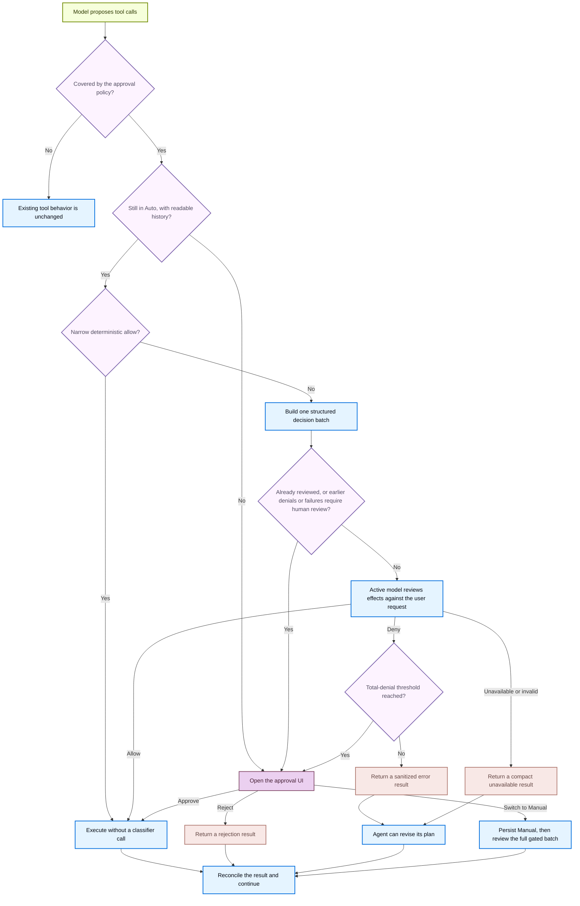

默认情况下，Deep Agents Code 在运行可能产生重大后果的操作之前会请求你的批准。这些操作称为**受控操作（gated actions）**，包括：

- 编辑或删除文件（`write_file`、`edit_file`、`delete`）
- 运行 shell 命令（`execute`）
- 发起 web 请求（`web_search`、`fetch_url`）
- 将工作委派给 subagents（`task`）

`ls`、`read_file`、`glob` 和 `grep` 等只读工具始终直接运行而不会提示。Approval modes 允许你选择每个会话对受控操作需要多少监督。

## 选择模式

| 模式 | 作用 |
|---|---|
| **Manual**（默认） | 在每个受控操作之前请求批准 |
| **Auto** | 自动批准常规操作；请模型审查任何不确定的操作；在反复拒绝或失败后回退给你 |
| **YOLO** | 运行受控操作，完全不审查 |

<Warning>
    Auto 是面向本地 coding agent 的授权启发式机制。它**不是** sandbox 隔离、操作系统边界，也不保证模型生成的操作是安全的。
</Warning>

## 启用 Auto

Auto 仅适用于交互式、未使用 sandbox 的会话。

<Steps>

    <Step title="以 Auto 模式启动" icon="terminal">
        ```bash
        dcode -y
        ```

        或者在 `~/.deepagents/config.toml` 中将其设为默认值：

        ```toml
        [startup]
        mode = "auto"
        ```

        你也可以在会话中途用 `Shift+Tab` 切换到 Auto。
    </Step>
</Steps>

## 启用 YOLO

YOLO 会在没有任何审查的情况下运行受控操作。只有当你接受 agent 可以在不询问的情况下执行任何操作时才使用它。

<Steps>

    <Step title="以 YOLO 模式启动" icon="terminal">
        ```bash
        dcode --yolo
        ```

        在提示出现时接受一次性风险确认。该确认会存储在本地，因此之后的启动不会再显示。

        或者在 `~/.deepagents/config.toml` 中将其设为默认值：

        ```toml
        [startup]
        mode = "yolo"
        ```
    </Step>
</Steps>

按 `Shift+Tab` 可以循环切换 YOLO → Manual → Auto → YOLO。设置 [`startup.yolo_switcher = false`](/oss/deepagents/code/config-file#startup-approval-mode) 可以把 YOLO 从循环中移除。

## Auto 的工作原理

Auto 保留与 Manual 相同的受控操作规则，但改变这些操作的审查方式。它使用两个阶段：

1. **常规操作自动运行。** 对 `src/parser.py` 等源文件的写入或 `git status` 等只读 Git 命令会直接进行而不会提示。`.github/workflows/ci.yml` 等敏感目标或 `git commit` 等会修改状态的命令会进入下一阶段。
2. **模型审查其余操作。** 对于任何不明确属于常规的操作，当前模型会检查该操作是否符合你请求的结果。为实现该结果而合理必需的普通步骤可以继续进行，即使你没有逐一列出每个实现细节。高风险影响（例如把本地内容发送到未配置的目标）仍然需要显式授权。如果模型拒绝了某个调用，agent 会收到错误结果并可以修订其计划。

在反复拒绝或分类器失败之后，Auto 会停止并为下一批显示正常的批准提示，然后继续以 Auto 模式运行。

<Accordion title="Auto 决策流程" icon="flow">


</Accordion>

### 选择分类器模型

当你没有配置 Auto 分类器时，Deep Agents Code 会根据主模型的 provider 选择一个延迟更低的默认分类器：

| 主模型 provider | 默认分类器 |
|---|---|
| Anthropic | `anthropic:claude-sonnet-5` |
| Google AI | `google_genai:gemini-3.8-flash` |
| Google Vertex AI | `google_vertexai:gemini-3.8-flash` |
| OpenAI | `openai:gpt-5.6-luna` |
| OpenAI Codex | `openai_codex:gpt-5.6-luna` |

对于其他 provider，分类器会使用主 agent 模型。你可以选择不同的模型来控制 Auto 审查期间的成本和延迟。

可以通过以下任一来源设置分类器模型：

<Tabs>
    <Tab title="TUI 命令">
        运行 `/auto model` 打开交互式模型选择器，并为当前会话选择一个分类器模型。要直接指定模型，请将其作为参数传入：

        ```txt
        /auto model openai:gpt-5.6-luna
        /auto model clear
        ```

        使用 `/auto model clear` 可以回到继承主模型的状态。
    </Tab>
    <Tab title="CLI flag">
        ```bash
        dcode -y --auto-classifier-model openai:gpt-5.6-luna
        ```

        `--auto-classifier-model` 仅在交互式 TUI 会话中被接受。
    </Tab>
    <Tab title="环境变量">
        ```bash
        export DEEPAGENTS_CODE_AUTO_CLASSIFIER_MODEL="openai:gpt-5.6-luna"
        ```

        <Warning>
            **项目 `.env`** 无法设置 `DEEPAGENTS_CODE_AUTO_CLASSIFIER_MODEL`。只有 shell 导出、`~/.deepagents/.env`、CLI flag 和 `/auto model` 有效。
        </Warning>
    </Tab>
    <Tab title="config.toml">
        ```toml title="~/.deepagents/config.toml"
        [models]
        auto_classifier = "openai:gpt-5.6-luna"
        ```
    </Tab>
</Tabs>
<br />
<Accordion title="优先级顺序">
    1. **`/auto model` TUI 命令**：立即对当前会话生效。
    2. **`--auto-classifier-model` flag**：在启动时设置分类器（仅限交互式 TUI 会话）。
    3. **`DEEPAGENTS_CODE_AUTO_CLASSIFIER_MODEL` 环境变量**：在启动时应用。
    4. **`config.toml` 中的 `[models].auto_classifier`**：你的持久默认值。
    5. **Provider 默认值**：当主模型使用受支持的 provider 时，使用上表中延迟更低的模型。
    6. **继承**：对于没有内置默认值的 provider，使用主 agent 模型。

    未设置的值会向下落到下一个来源。通过 `/auto model clear` 或空的 CLI flag 显式清除分类器时，会选择主 agent 模型而不是 provider 默认值。
</Accordion>

当 Auto 开启时以及在 `/auto model` 输出中，TUI 会显示当前由哪个模型进行审查。

### 在产生副作用之前重新校验

决策计划与 thread、模式、批次以及确切的受控调用绑定。状态缺失或无效、模式竞争或重放都会回退到人工审查。例如，如果你在分类器审查进行期间切换到 Manual，之前的 Auto 决策不会静默执行；而是会打开正常的批准 UI。

### 了解作用域与限制

- Manual 批准菜单可以为当前 thread 启用 Auto。阈值回退可以永久切换到 Manual，或在保持 Auto 启用的情况下执行一次性审查。
- 当前模型不是独立的安全权威。[MCP 只读注解](/oss/deepagents/code/mcp-tools#read-only-tool-annotations-in-auto-mode)被作为有意为之的 beta 权衡予以信任。
- 父级 Auto 审查不覆盖在受委派 subagent 内部执行的操作，也不覆盖更广泛的显式配置的 `js_eval` 扇出。即使 TUI 隐藏了分类器的输入和输出，模型 provider 和 tracing backend 仍可能观察到它们。

## Auto 和 YOLO 的可用场景

Auto 和 YOLO 是交互式模式的功能。Auto 仅适用于交互式、未使用 sandbox 的会话；远程 `--sandbox` 会强制其回到 Manual。YOLO 也仅适用于交互式模式，并且无论是否使用 sandbox 都需要风险确认。Headless 运行使用 fail-closed MCP 路由和 `--shell-allow-list` 来获得 shell 访问。

在非交互式模式（`-n` 或管道 stdin）下，`-y`/`--auto-approve` 和 `--yolo` 会被忽略。Headless 运行使用 fail-closed MCP 路由和 `--shell-allow-list` 来获得 shell 访问。

### 跨会话记住上次的模式

当没有任何 flag 或配置的模式适用时，Deep Agents Code 会恢复上次选择的 Manual 或 Auto 模式。YOLO 必须被显式选择。请参见 [Startup approval mode](/oss/deepagents/code/config-file#startup-approval-mode)。

关于 flag 和配置的优先级，请参见 [Startup approval mode](/oss/deepagents/code/config-file#startup-approval-mode)。

## See also

- [CLI reference](/oss/deepagents/code/cli-reference)
- [Configuration](/oss/deepagents/code/configuration)
- [Remote sandboxes](/oss/deepagents/code/remote-sandboxes)

---

<div className="source-links">
<Callout icon="terminal-2">
    [Connect these docs](/use-these-docs) to your agent of choice via MCP for real-time answers.
</Callout>
<Callout icon="edit">
    [Edit this page on GitHub](https://github.com/langchain-ai/docs/edit/main/src/oss/deepagents/code/approval-modes.mdx) or [file an issue](https://github.com/langchain-ai/docs/issues/new/choose).
</Callout>
</div>
