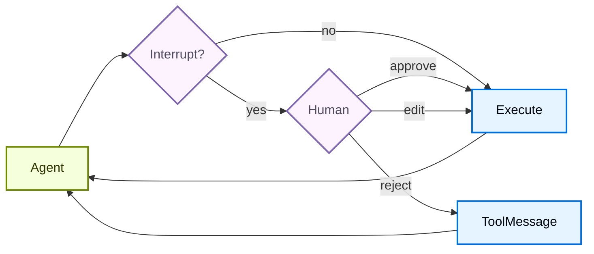

import HitlBasicConfigPy from '/snippets/javascript/code-samples/hitl-basic-config-py.mdx';
import HitlBasicConfigJs from '/snippets/javascript/code-samples/hitl-basic-config-js.mdx';
import HitlConditionalInterruptsPy from '/snippets/javascript/code-samples/hitl-conditional-interrupts-py.mdx';
import HitlDecisionTypesTable from '/snippets/javascript/oss/hitl-decision-types-table.mdx';

某些工具操作可能比较敏感，需要在执行前获得人工批准。Deep Agents 通过 LangGraph 的 interrupt 能力支持 human-in-the-loop 工作流。你可以使用 `interrupt_on` 参数配置哪些工具需要批准。设置 `interrupt_on` 后，`HumanInTheLoopMiddleware` 会被添加到 [Deep Agents 栈](/oss/javascript/deepagents/customization#deep-agents-stack)中。如果在工具返回结果之前运行被取消或中断，堆栈中的 [PatchToolCallsMiddleware](https://reference.langchain.com/javascript/deepagents/middleware/createPatchToolCallsMiddleware) 会自动修复消息历史。





## 基本配置

`interrupt_on` 参数接收一个字典，把工具名映射到 interrupt 配置。每个工具可以配置为：

- **`True`**：使用默认行为启用中断

  （允许 approve、edit、reject）

- **`False`**：为这个工具禁用中断
- **`InterruptOnConfig`**：自定义配置。设置 `allowed_decisions` 来控制审核选项。


<HitlBasicConfigJs />


## 决策类型

`allowed_decisions` 列表控制人工在审查 tool call 时可以执行哪些动作：

<HitlDecisionTypesTable />


当人工拒绝某个拟执行动作时，使用 `reject`。


<Tip>
在**编辑**工具参数时，请尽量保守。对原始参数做大幅修改，可能会让模型重新评估自己的方案，并可能多次执行该工具，或者做出意外动作。
</Tip>

你可以为每个工具自定义可用决策：


```typescript
const interruptOn = {
  // Sensitive operations: allow all options
  delete_file: { allowedDecisions: ["approve", "edit", "reject"] },

  // Moderate risk: approval or rejection only
  write_file: { allowedDecisions: ["approve", "reject"] },

  // Must approve (no rejection allowed)
  critical_operation: { allowedDecisions: ["approve"] },
};
```


## 处理 interrupts

当触发 interrupt 时，agent 会暂停执行并返回控制权。请在结果中检查 interrupts，并据此处理。如果用户拒绝某个动作，请提供清晰的 `message`，告诉 agent 该工具未执行，以及下一步应该做什么。


```typescript
const config = { configurable: { thread_id: uuid7() } };

let result = await agent.invoke({
  messages: [{
    role: "user",
    content: "Delete temp.txt and send an email to admin@example.com"
  }]
}, config);

if (result.__interrupt__) {
  const interrupts = result.__interrupt__[0].value;
  const actionRequests = interrupts.actionRequests;

  // 需要批准两个工具
  console.assert(actionRequests.length === 2);

  // 按 actionRequests 的顺序提供决策
  const decisions = [
    { type: "approve" },  // 第一个工具：delete_file
    {
      type: "reject",
      message: "用户拒绝该动作。不要重试这个 tool call。",
    }  // 第二个工具：send_email
  ];

  result = await agent.invoke(
    new Command({ resume: { decisions } }),
    config
  );
}
```


## 处理流式传输中的 interrupts

对于实时 UI，请使用 `.stream()` 而不是 `.invoke()`，以便在处理 HITL interrupts 的同时显示 token 和工具调用进度。Interrupts 会以 `__interrupt__` 条目的形式出现在 `updates` 流中。流结束后，收集人工决策，并使用 `Command(resume=...)` 再次流式传输以恢复执行。

<Note>
对于典型的 `interrupt_on` HITL 暂停，请使用扁平的 `{"decisions": [...]}` 负载恢复，与 `.invoke()` 的形状相同。当同时有多个 interrupt 待处理时（例如并行分支），请改为把每个 interrupt ID 映射到它的恢复值。参见 [处理多个 interrupts](/oss/javascript/langgraph/interrupts#handling-multiple-interrupts)。
</Note>


```typescript
import { v7 as uuid7 } from "uuid";
import { Command } from "@langchain/langgraph";

const config = { configurable: { thread_id: uuid7() } };
let streamInput: Record<string, any> | Command = {
  messages: [{ role: "user", content: "Delete the file temp.txt" }],
};

while (true) {
  let pendingInterrupt: { value: any } | undefined;

  for await (const chunk of await agent.stream(  // [!code highlight]
    streamInput,
    {
      streamMode: ["messages", "updates"],  // [!code highlight]
      ...config,
    }
  )) {
    const [mode, data] = chunk;

    if (mode === "messages") {
      const [token] = data;
      // Display tokens in real time
      if (token.text) {
        process.stdout.write(token.text);
      }
    }

    if (mode === "updates" && data?.__interrupt__) {  // [!code highlight]
      pendingInterrupt = data.__interrupt__[0];  // [!code highlight]
    }
  }

  // If no interrupt occurred, the agent finished
  if (!pendingInterrupt) break;

  const interruptValue = pendingInterrupt.value;
  const actionRequests = interruptValue.actionRequests;
  const reviewConfigs = interruptValue.reviewConfigs;
  const configMap = Object.fromEntries(
    reviewConfigs.map((cfg: any) => [cfg.actionName, cfg])
  );

  for (const action of actionRequests) {
    const review = configMap[action.name];
    console.log(`\nTool: ${action.name}`);
    console.log(`Arguments: ${JSON.stringify(action.args)}`);
    console.log(`Allowed: ${review.allowedDecisions}`);
  }

  // Collect one decision per actionRequest, in order
  const decisions = actionRequests.map(() => ({ type: "approve" }));
  streamInput = new Command({ resume: { decisions } });  // [!code highlight]
}

process.stdout.write("\n");
```


<Tip>
组合 `"messages"` 和 `"updates"` 两种流模式，既能向用户实时展示 LLM token，又能捕获 HITL interrupts。`"messages"` 模式流式传输 token；`"updates"` 模式传递 interrupt 负载。
</Tip>

## 拒绝消息

当审查者返回 `reject` 决策时，Deep Agents 会跳过该 tool call，并把拒绝反馈发回给 agent。如果你省略 `message`，默认反馈会告诉模型该工具没有执行，并且除非用户要求，否则不要重试同一个 tool call。

对于敏感或有副作用的工具，请随决策提供一个领域相关的 `message`。要明确说明 agent 是应该放弃该动作、发起后续问题，还是尝试一个更安全的替代方案。


```typescript
const decisions = [
  {
    type: "reject",
    message: "用户拒绝删除这个文件。不要重试删除。请改为询问要归档哪个文件。",
  },
];
```


## 编辑工具参数

当 `allowed_decisions` 中包含 `"edit"` 时，你可以在执行前修改工具参数：


```typescript
if (result.__interrupt__) {
  const interrupts = result.__interrupt__[0].value;
  const actionRequest = interrupts.actionRequests[0];

  // 来自 agent 的原始参数
  console.log(actionRequest.args);  // { to: "everyone@company.com", ... }

  // 用户决定编辑收件人
  const decisions = [{
    type: "edit",
    editedAction: {
      name: actionRequest.name,  // Must include the tool name
      args: { to: "team@company.com", subject: "...", body: "..." }
    }
  }];

  result = await agent.invoke(
    new Command({ resume: { decisions } }),
    config
  );
}
```


## 子 agent interrupts

使用 subagent 时，你既可以在 [tool call 上](#interrupts-on-tool-calls) 使用 interrupts，也可以在 [tool 内部](#interrupts-within-tool-calls) 使用 interrupts。

### Tool call 上的 interrupts

每个 subagent 都可以有自己的 `interrupt_on` 配置，用来覆盖主 agent 的设置：


```typescript
const agent = createDeepAgent({
  tools: [deleteFile, readFile],
  interruptOn: {
    delete_file: true,
    read_file: false,
  },
  subagents: [{
    name: "file-manager",
    description: "Manages file operations",
    systemPrompt: "You are a file management assistant.",
    tools: [deleteFile, readFile],
    interruptOn: {
      // Override: require approval for reads in this subagent
      delete_file: true,
      read_file: true,  // Different from main agent!
    }
  }],
  checkpointer
});
```


当 subagent 触发 interrupt 时，处理方式相同：检查结果中的 `__interrupt__`，然后用 `Command` 恢复。

流式传输时，subagent interrupts 也会以 `__interrupt__` 条目的形式出现在父级的 `updates` 流中。interrupt 传递不需要 `subgraphs=True`。如果你还想流式传输 subagent 的 token 和进度事件，请启用 `subgraphs=True`。完整模式请参见 [处理流式传输中的 interrupts](#handle-interrupts-with-streaming)。

### Tool 内部的 interrupts

subagent 工具可以直接调用 `interrupt()` 来暂停执行并等待批准：


```typescript
import { createAgent, tool } from "langchain";
import { ChatOpenAI } from "@langchain/openai";
import { HumanMessage } from "@langchain/core/messages";
import { MemorySaver, Command, interrupt } from "@langchain/langgraph";
import { createDeepAgent } from "deepagents";
import { z } from "zod";

const requestApproval = tool(
  async ({ actionDescription }: { actionDescription: string }) => {
    const approval = interrupt({
      type: "approval_request",
      action: actionDescription,
      message: `Please approve or reject: ${actionDescription}`,
    }) as { approved?: boolean; reason?: string };

    if (approval.approved) {
      return `Action '${actionDescription}' was APPROVED. Proceeding...`;
    } else {
      return `Action '${actionDescription}' was REJECTED. Reason: ${
        approval.reason || "No reason provided"
      }`;
    }
  },
  {
    name: "request_approval",
    description: "Request human approval before proceeding with an action.",
    schema: z.object({
      actionDescription: z
        .string()
        .describe("The action that requires approval"),
    }),
  }
);

async function main() {
  const checkpointer = new MemorySaver();
  const model = new ChatOpenAI({
    model: "gpt-5.4-mini",
    maxTokens: 4096,
  });

  const compiledSubagent = createAgent({
    model: model,
    tools: [requestApproval],
    name: "approval-agent",
  });

  const parentAgent = await createDeepAgent({
    checkpointer: checkpointer,
    subagents: [
      {
        name: "approval-agent",
        description: "An agent that can request approvals",
        runnable: compiledSubagent as any,
      },
    ],
  });

  const threadId = "test_interrupt_directly";
  const config = { configurable: { thread_id: threadId } };

  console.log("Invoking agent - sub-agent will use request_approval tool...");

  let result = await parentAgent.invoke(
    {
      messages: [
        new HumanMessage({
          content:
            "Use the task tool to launch the approval-agent sub-agent. " +
            "Tell it to use the request_approval tool to request approval for 'deploying to production'.",
        }),
      ],
    },
    config
  );

  if (result.__interrupt__) {
    const interruptValue = result.__interrupt__[0].value as {
      type?: string;
      action?: string;
      message?: string;
    };
    console.log("\nInterrupt received!");
    console.log(`  Type: ${interruptValue.type}`);
    console.log(`  Action: ${interruptValue.action}`);
    console.log(`  Message: ${interruptValue.message}`);

    console.log("\nResuming with Command(resume={'approved': true})...");
    const result2 = await parentAgent.invoke(
      new Command({ resume: { approved: true } }),
      config
    );

    if (!result2.__interrupt__) {
      console.log("\nExecution completed!");
      // Find the tool response
      const toolMsgs = result2.messages?.filter((m) => m.type === "tool") || [];
      if (toolMsgs.length > 0) {
        const lastToolMsg = toolMsgs[toolMsgs.length - 1];
        console.log(`  Tool result: ${lastToolMsg.content}`);
      }
    } else {
      console.log("\nAnother interrupt occurred");
    }
  } else {
    console.log(
      "\n  No interrupt - the model may not have called request_approval"
    );
  }
}

main().catch(console.error);
```

运行时，输出如下：

```text
Invoking agent - sub-agent will use request_approval tool...

Interrupt received!
  Type: approval_request
  Action: deploying to production
  Message: Please approve or reject: deploying to production

Resuming with Command(resume={'approved': True})...

Execution completed!
  Tool result: Great! The approval request has been processed. The action **"deploying to production"** was **APPROVED**. You can now proceed with the production deployment.
```


```typescript
import { v7 as uuid7 } from "uuid";
import { Command } from "@langchain/langgraph";

// 创建包含 thread_id 的 config，用于状态持久化
const config = { configurable: { thread_id: uuid7() } };

// 调用 agent
let result = await agent.invoke({
  messages: [{ role: "user", content: "Delete the file temp.txt" }],
}, config);

// 检查是否被中断
if (result.__interrupt__) {
  // 提取 interrupt 信息
  const interrupts = result.__interrupt__[0].value;
  const actionRequests = interrupts.actionRequests;
  const reviewConfigs = interrupts.reviewConfigs;

  // 从工具名创建 review config 查找表
  const configMap = Object.fromEntries(
    reviewConfigs.map((cfg) => [cfg.actionName, cfg])
  );

  // 向用户展示待处理动作
  for (const action of actionRequests) {
    const reviewConfig = configMap[action.name];
    console.log(`Tool: ${action.name}`);
    console.log(`Arguments: ${JSON.stringify(action.args)}`);
    console.log(`Allowed decisions: ${reviewConfig.allowedDecisions}`);
  }

  // 获取用户决策（与 actionRequest 一一对应，按顺序）
  const decisions = [
    {
      type: "reject",
      message: "用户拒绝删除 temp.txt。不要重试删除。",
    }
  ];

  // 用决策恢复执行
  result = await agent.invoke(
    new Command({ resume: { decisions } }),
    config  // 必须使用同一个 config！
  );
}

// 处理最终结果
console.log(result.messages[result.messages.length - 1].content);
```


## 多个 tool call

当 agent 调用多个需要批准的工具时，所有 interrupts 会一起打包进一个 interrupt。你必须按顺序为每个工具提供决策。

---

<div className="source-links">
<Callout icon="terminal-2">
    [Connect these docs](/use-these-docs) to your agent of choice via MCP for real-time answers.
</Callout>
<Callout icon="edit">
    [Edit this page on GitHub](https://github.com/langchain-ai/docs/edit/main/src/oss/deepagents/human-in-the-loop.mdx) or [file an issue](https://github.com/langchain-ai/docs/issues/new/choose).
</Callout>
</div>
