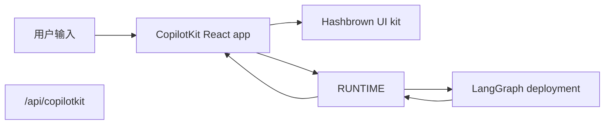

[CopilotKit](https://www.copilotkit.ai/) 提供了完整的 React chat runtime，特别适合与 LangGraph 搭配使用，尤其是在你希望 agent 返回 **结构化 UI payload**，而不仅仅是纯文本的时候。前端与一个 CopilotKit runtime URL 通信，并把 assistant messages 解析成动态 React 组件。

在这种模式下，你的 LangGraph 部署在同一个进程中同时提供 graph API 和一个自定义 CopilotKit endpoint。


在服务端，[copilotkit](https://pypi.org/project/copilotkit/) 包提供 [`CopilotKitMiddleware`](https://docs.copilotkit.ai)，因此 LangGraph graph、LangChain agent 或 [Deep Agent](/oss/javascript/deepagents/overview) 都可以说 [Agent UI (AG-UI)](https://docs.ag-ui.com/) wire protocol，向 chat UI 流式发送 tool 和 message 事件，并读写共享的 **CopilotKit** 状态片段，同时还附带工具来在 graph 前面挂载兼容 CopilotKit 的 HTTP endpoint。TypeScript 方案通常把 CopilotKit runtime 挂在 graph API 旁边。Python 方案在部署上挂载 AG-UI FastAPI bridge，并在它前面用 Node 运行 CopilotKit runtime。

这种方式适合以下场景：

- 想要一个现成的 chat runtime，而不是自己手动把 `stream.messages` 串起来
- 想要一个自定义服务端 endpoint，在已部署 graph 旁边叠加 provider-specific 行为
- 想要从受限组件注册表中渲染结构化生成式 UI

[CopilotKit for LangGraph](https://docs.copilotkit.ai/langgraph) 还记录了基于同一 middleware 和 clients 的 [generative UI](https://docs.copilotkit.ai/langgraph/generative-ui)、[human in the loop](https://docs.copilotkit.ai/langgraph/human-in-the-loop)（HITL）以及 [shared state](https://docs.copilotkit.ai/langgraph/shared-state)。

<Info>
  关于 CopilotKit 专属 API、UI 模式和运行时配置，请查看
  [CopilotKit docs](https://docs.copilotkit.ai/langgraph)。如果你想看 Deep Agent 的讲解，请查看
  CopilotKit 文档中的 [Deep Agents and CopilotKit](https://docs.copilotkit.ai/langgraph/deep-agents)。
</Info>

import { ExampleEmbed } from "/snippets/example-embed.jsx"
import ChannelsTsconfig from "/snippets/javascript/code-samples/copilotkit-channels-tsconfig.mdx"
import ChannelsAgent from "/snippets/javascript/code-samples/copilotkit-channels-agent-js.mdx"
import ChannelsChannel from "/snippets/javascript/code-samples/copilotkit-channels-channel-js.mdx"

<ExampleEmbed example="copilotkit" minHeight={700} />

## 工作原理

从高层看，CopilotKit 夹在你的 React 应用和 LangGraph 部署之间。

前端把会话状态发送到与 graph API 并列挂载的一个自定义 `/api/copilotkit` route。该 route 再把请求转发给 LangGraph，响应则同时带回 assistant messages 和组件注册表可以渲染的结构化 UI payload。

1. **正常部署 graph**，使用 LangSmith 或 LangGraph 开发服务器。
2. **用 HTTP app 扩展部署**，在 graph API 旁边挂载一个 CopilotKit route。
3. **用 `CopilotKit` 包裹前端**，并把它指向那个自定义 runtime URL。
4. **注册动态 UI 组件**，并在渲染时把 assistant responses 解析成这些组件。





## 安装

对于后端 endpoint：

```bash
bun add @copilotkit/runtime hono
```


对于前端 app：

```bash
bun add @copilotkit/react-core @copilotkit/react-ui @hashbrownai/core @hashbrownai/react
```


## 通过自定义 endpoint 扩展 LangGraph 部署

关键点在于，LangGraph deployment 不只是服务 graph。它也可以加载 HTTP app，这样你就能在 deployment 旁边挂载额外 route。

在 `langgraph.json` 中，把 `http.app` 指向你的自定义 app 入口：

```json
{
  "graphs": {
    "copilotkit_shadify": "./src/agents/copilotkit-shadify.ts:agent"
  },
  "http": {
    "app": "./src/api/app.ts:app"
  }
}
```


然后创建 Hono app，并注册 CopilotKit route：

```ts app.ts
import { Hono } from "hono";
import { registerCopilotKit } from "./copilotkit.js";

export const app = new Hono();

registerCopilotKit(app);
```


这个自定义 app 是最重要的扩展点：它会挂载一个支持 CopilotKit 的 runtime，而不会替换底层的 LangGraph deployment。


在这个 route 内，创建一个 `CopilotRuntime`，并通过 `LangGraphAgent` 指向已部署的 graph：

```ts expandable copilotkit.ts
import { type Hono } from "hono";

import { createCopilotEndpointSingleRoute, CopilotRuntime } from "@copilotkit/runtime/v2";
import { LangGraphAgent } from "@copilotkit/runtime/langgraph";

const defaultAgentHost = process.env.LANGGRAPH_DEPLOYMENT_URL || "http://127.0.0.1:2024";
const agentUrl = defaultAgentHost.startsWith("http")
  ? defaultAgentHost
  : `http://${defaultAgentHost}`;

class BridgedLangGraphAgent extends LangGraphAgent {
  override prepareRunAgentInput(
    input: Parameters<LangGraphAgent["prepareRunAgentInput"]>[0],
  ): ReturnType<LangGraphAgent["prepareRunAgentInput"]> {
    const prepared = super.prepareRunAgentInput(input);

    return {
      ...prepared,
      context: normalizeCopilotContext(prepared.context) as ReturnType<
        LangGraphAgent["prepareRunAgentInput"]
      >["context"],
    };
  }

  override async getAssistant(): Promise<Awaited<ReturnType<LangGraphAgent["getAssistant"]>>> {
    const assistants = await this.client.assistants.search({
      graphId: this.graphId,
      limit: 100,
    });

    const assistant = assistants.find((candidate) => candidate.graph_id === this.graphId);
    if (assistant) {
      return assistant;
    }

    return super.getAssistant();
  }
}

export function registerCopilotKit(app: Hono) {
  const runtime = new CopilotRuntime({
    agents: {
      default: new BridgedLangGraphAgent({
        deploymentUrl: agentUrl,
        graphId: "copilotkit_shadify",
      }),
    },
  });

  const copilotApp = createCopilotEndpointSingleRoute({
    runtime,
    basePath: "/api/copilotkit",
  });

  app.route("/", copilotApp);
}

function normalizeCopilotContext(context: unknown): unknown {
  if (!Array.isArray(context)) {
    return context;
  }

  const normalizedEntries = context.flatMap((item) => {
    if (!item || typeof item !== "object") {
      return [];
    }

    const entry = item as { description?: unknown; value?: unknown };
    return typeof entry.description === "string" ? [[entry.description, entry.value] as const] : [];
  });

  return Object.fromEntries(normalizedEntries);
}
```

这个 route adapter 只是 TypeScript 方案的一半。你的 LangChain agent 还需要 middleware，读取转发过来的 `output_schema`，并把它转换成模型的结构化 `responseFormat`：

```ts expandable agent.ts
import { createAgent, createMiddleware, toolStrategy } from "langchain";
import { z } from "zod";

import { deepSearchTool, searchWebTool } from "../tools/index.js";

const contextSchema = z.object({
  output_schema: z.unknown().optional(),
});

const structuredOutputMiddleware = createMiddleware({
  name: "CopilotKitStructuredOutput",
  contextSchema,
  wrapModelCall: async (request, handler) => {
    const rawOutputSchema = getRuntimeOutputSchema(request.runtime);
    const schema = normalizeOutputSchema(rawOutputSchema);
    if (!schema) {
      return handler(request);
    }

    const responseFormat = toolStrategy(
      schema as unknown as Parameters<typeof toolStrategy>[0],
      {
        toolMessageContent: "Structured UI response generated.",
      },
    );

    return handler({
      ...request,
      responseFormat,
    });
  },
});

export const agent = createAgent({
  model: process.env.COPILOTKIT_MODEL ?? "google:gemini-3.5-flash",
  contextSchema,
  middleware: [structuredOutputMiddleware],
  tools: [searchWebTool, deepSearchTool],
  systemPrompt: `You are a helpful UI assistant inspired by the CopilotKit Shadify example.

Build rich visual responses with the available UI components when they add value.
Only wrap actual UI layouts inside cards. Plain Markdown answers should stay as Markdown.
Use rows for side-by-side layouts with at most two columns.
Prefer simple, polished outputs over dense dashboards.
When using charts, make labels and values concise and easy to read.
When showing code, prefer the code_block component.
When researching topics, use the available search tools first and then present the result cleanly.`,
});

function normalizeOutputSchema(value: unknown): Record<string, unknown> | null {
  let schema = value;

  if (typeof schema === "string") {
    try {
      schema = JSON.parse(schema);
    } catch {
      return null;
    }
  }

  if (!schema || typeof schema !== "object" || Array.isArray(schema)) {
    return null;
  }

  const normalized = { ...(schema as Record<string, unknown>) };

  if (!normalized.title) {
    normalized.title = "CopilotKitStructuredOutput";
  }

  if (!normalized.description) {
    normalized.description = "Structured response schema for the CopilotKit preview.";
  }

  return normalized;
}

function getRuntimeOutputSchema(runtime: {
  context?: { output_schema?: unknown };
  configurable?: Record<string, unknown>;
}): unknown {
  if (runtime.context?.output_schema !== undefined) {
    return runtime.context.output_schema;
  }

  const configurable = runtime.configurable;
  if (!configurable || typeof configurable !== "object" || Array.isArray(configurable)) {
    return undefined;
  }

  return configurable.output_schema;
}
```

这个 middleware 正是让前端的 `useAgentContext({ description: "output_schema", ... })` 发挥作用的关键。CopilotKit runtime 会转发 schema，而 agent 则把它转换成模型必须遵守的结构化输出契约。


这样就把职责拆开了：

- LangGraph 仍然负责 graph 执行和持久化
- CopilotKit 负责面向聊天的 runtime contract
- 你的自定义 endpoint 把两者粘合在同一个部署里


## 组织前端 app

在前端，用 `CopilotKit` 包裹你的 app，并把它指向自定义 runtime URL：

```tsx
import { CopilotKit } from "@copilotkit/react-core";
import { CopilotChat, useAgentContext } from "@copilotkit/react-core/v2";
import { s } from "@hashbrownai/core";

import { useChatKit } from "@/components/chat/chat-kit";
import { chatTheme } from "@/lib/chat-theme";

export function App() {
  return (
    <CopilotKit runtimeUrl={import.meta.env.VITE_RUNTIME_URL ?? "/api/copilotkit"}>
      <Page />
    </CopilotKit>
  );
}

function Page() {
  const chatKit = useChatKit();

  useAgentContext({
    description: "output_schema",
    value: s.toJsonSchema(chatKit.schema),
  });

  return <CopilotChat {...chatTheme} />;
}
```

这里有两个关键点：

- `runtimeUrl="/api/copilotkit"` 会把 chat 发到你的自定义后端 route，而不是直接发给原始 LangGraph API
- `useAgentContext(...)` 会把 UI schema 发送给 agent，这样模型就知道它应该生成什么结构化输出格式

## 注册动态组件

组件注册表位于 `useChatKit()` 中。你要在这里定义 agent 允许生成的组件集合，例如 cards、rows、columns、charts、code blocks 和 buttons。

```tsx
import { s } from "@hashbrownai/core";
import { exposeComponent, exposeMarkdown, useUiKit } from "@hashbrownai/react";

import { Button } from "@/components/ui/button";
import { Card } from "@/components/ui/card";
import { CodeBlock } from "@/components/ui/code-block";
import { Row, Column } from "@/components/ui/layout";
import { SimpleChart } from "@/components/ui/simple-chart";

export function useChatKit() {
  return useUiKit({
    components: [
      exposeMarkdown(),
      exposeComponent(Card, {
        name: "card",
        description: "Card to wrap generative UI content.",
        children: "any",
      }),
      exposeComponent(Row, {
        name: "row",
        props: {
          gap: s.string("Tailwind gap size") as never,
        },
        children: "any",
      }),
      exposeComponent(Column, {
        name: "column",
        children: "any",
      }),
      exposeComponent(SimpleChart, {
        name: "chart",
        props: {
          labels: s.array("Category labels", s.string("A label")),
          values: s.array("Numeric values", s.number("A value")),
        },
        children: false,
      }),
      exposeComponent(CodeBlock, {
        name: "code_block",
        props: {
          code: s.streaming.string("The code to display"),
          language: s.string("Programming language") as never,
        },
        children: false,
      }),
      exposeComponent(Button, {
        name: "button",
        children: "text",
      }),
    ],
  });
}
```

这个注册表就是 agent 和 UI 之间的契约。模型不是在生成任意 JSX，而是在生成必须通过你暴露出来的组件和 props 校验的结构化数据。

## 把 assistant messages 渲染为动态 UI

assistant response 到达后，自定义 message renderer 会决定如何展示它。这个示例里：

- assistant messages 会被按 UI kit schema 解析为结构化 JSON
- 合法的结构化输出会被渲染成真正的 React 组件
- user messages 则继续显示为普通 chat bubble

```tsx
import type { AssistantMessage } from "@ag-ui/core";
import type { RenderMessageProps } from "@copilotkit/react-ui";
import { useJsonParser } from "@hashbrownai/react";
import { memo } from "react";

import { useChatKit } from "@/components/chat/chat-kit";
import { Squircle } from "@/components/squircle";

const AssistantMessageRenderer = memo(function AssistantMessageRenderer({
  message,
}: {
  message: AssistantMessage;
}) {
  const kit = useChatKit();
  const { value } = useJsonParser(message.content ?? "", kit.schema);

  if (!value) return null;

  return (
    <div className="group/msg mt-2 flex w-full justify-start">
      <div className="magic-text-output w-full px-1 py-1">{kit.render(value)}</div>
    </div>
  );
});

export function CustomMessageRenderer({ message }: RenderMessageProps) {
  if (message.role === "assistant") {
    return <AssistantMessageRenderer message={message} />;
  }

  return (
    <div className="flex w-full justify-end">
      <Squircle className="w-full max-w-[64ch] px-4 py-3">
        <pre>{typeof message.content === "string" ? message.content : JSON.stringify(message.content, null, 2)}</pre>
      </Squircle>
    </div>
  );
}
```

这个 renderer 模式正是让集成体验像原生应用的原因：

- CopilotKit 负责 chat state 和 transport
- 自定义 renderer 负责把 assistant payload 变成 UI
- [Hashbrown](https://hashbrown.dev/) 把经过校验的结构化数据变成具体的 React elements

## Channels

驱动应用内 copilot 的同一个 agent，也可以作为 bot 运行在 Slack 及其他消息平台上。[CopilotKit Channels](https://docs.copilotkit.ai/channels) 通过一个托管的 CopilotKit Intelligence 连接，把你的 LangChain agent 接入消息平台：Intelligence 负责保管平台凭证和消息投递，而你的进程负责运行 agent。

<Note>
  Channels 要求 `@copilotkit/channels` 0.6.1 和 `@copilotkit/runtime` 1.65.0，两者需要作为经过测试的配套版本一起安装，宿主机还需要 Node.js 22 或更高版本。Channel 连接的 LangChain 部署可以是 Python，也可以是 TypeScript。
</Note>

<Info>
  本页说明 Channels 如何与 LangChain agent 配合。关于 LangGraph 后端的完整 Slack 实操指南，请参见 [Connect and run your agent in Slack](https://docs.copilotkit.ai/slack/langgraph-typescript/connect)。关于其他 agent 后端和平台支持情况，请参见 [Channels overview](https://docs.copilotkit.ai/channels)。
</Info>

### 整体如何协作

CopilotKit Intelligence 持有平台连接（Slack、Microsoft Teams 等）及其凭证；你的长期运行的 Channels listener 持有 agent、工具和应用逻辑。每一轮对话都遵循相同的路径：

1. 用户在 Slack 里给你的应用发消息。
2. Intelligence 使用为该 Channel 配置的凭证接收平台事件。
3. 一条持久的 Intelligence 网关连接把这一轮对话投递给你的 Channels listener。
4. listener 通过 [AG-UI](https://docs.ag-ui.com/) 运行你的 LangChain agent 并渲染回复。
5. Intelligence 以原生 Slack Block Kit 的形式返回结果。

平台凭证永远不会进入 agent 进程。在 [CopilotKit Intelligence](https://docs.copilotkit.ai/slack/intelligence) 中创建一个托管 Channel 并连接 Slack：Intelligence 会保存 Slack 凭证，并提供 **Channel code**（`CHANNEL_CODE`）和项目作用域的 **Intelligence API key**（`INTELLIGENCE_API_KEY`）给 listener 使用。

### 安装

先安装经过测试的 SDK 配对版本，再安装 TypeScript 工具链：

<CodeGroup>
```bash npm
npm install --save-exact @copilotkit/channels@0.6.1 @copilotkit/runtime@1.65.0
npm install -D tsx typescript @types/node
```

```bash pnpm
pnpm add --save-exact @copilotkit/channels@0.6.1 @copilotkit/runtime@1.65.0
pnpm add -D tsx typescript @types/node
```

```bash yarn
yarn add --exact @copilotkit/channels@0.6.1 @copilotkit/runtime@1.65.0
yarn add -D tsx typescript @types/node
```
</CodeGroup>

使用 NodeNext 的 TypeScript 配置：

<ChannelsTsconfig />

### 连接你的 LangChain agent

每个会话都返回一个全新的 agent，并按 thread 区分，避免状态在 Slack thread 之间泄漏。LangGraph Server 使用 LangGraph API 协议，所以要使用 `@copilotkit/runtime/langgraph` 中的 `LangGraphAgent`，而不是 `HttpAgent`。把它指向你[已经在运行的 deployment](#extend-the-langgraph-deployment-with-a-custom-endpoint)：

<ChannelsAgent />

### 运行 Channel listener

使用 Intelligence 给出的 `Code` 声明 Channel，并把每条消息转发给 agent。创建 Node listener 这一步就是连接 Channel 的动作。在创建 listener 之前先注册进程退出清理逻辑，这样在连接窗口期间按下 Ctrl-C 也能干净地停止 Channel。

<ChannelsChannel />

设置运行时密钥，然后启动进程：

```bash .env
INTELLIGENCE_API_KEY=<project-api-key>
CHANNEL_CODE=support-slack
LANGGRAPH_DEPLOYMENT_URL=http://127.0.0.1:2024
PORT=3000
```

```bash Terminal
node --env-file=.env --import tsx channel.ts
```

进程连接成功后，Intelligence 中的 Channel 会从 **Waiting for runtime** 转为 **Online**。

### 其他平台

托管的 Slack 已正式可用。托管的 Teams 是受控的集成目标。Channels SDK 还为 Teams、Discord、Telegram 和 WhatsApp 提供直连适配器。当前支持的平台列表和各平台的配置方法，请参见 [Channels overview](https://docs.copilotkit.ai/slack)。

## 资源

- [Deep Agents and CopilotKit](https://docs.copilotkit.ai/langgraph/deep-agents) in the CopilotKit documentation - 端到端 Next.js、dev server 和 **Deep Agent** 路线
- [CopilotKit: LangGraph features](https://docs.copilotkit.ai/langgraph) - generative UI、HITL、shared state
- [LangGraph deployment](/oss/javascript/langgraph/deploy) - 生产环境和开发服务器

## 最佳实践

- **保持 custom endpoint 轻薄**：它用来适配 CopilotKit 与 graph deployment，而不是重复实现已经在 graph 里的业务逻辑
- **显式发送 schema**：`useAgentContext` 应当在页面挂载时就描述 UI contract
- **注册受限的组件集合**：只暴露你真正希望模型使用的组件和 props
- **把渲染当成解析步骤**：先把 assistant content 按你的 schema 解析，再进行渲染
- **让 user messages 保持普通文本**：只有 assistant messages 需要结构化 renderer；user messages 可以维持普通 chat bubble

---

<div className="source-links">
<Callout icon="terminal-2">
    [Connect these docs](/use-these-docs) to your agent of choice via MCP for real-time answers.
</Callout>
<Callout icon="edit">
    [Edit this page on GitHub](https://github.com/langchain-ai/docs/edit/main/src/oss/langchain/frontend/integrations/copilotkit.mdx) or [file an issue](https://github.com/langchain-ai/docs/issues/new/choose).
</Callout>
</div>
