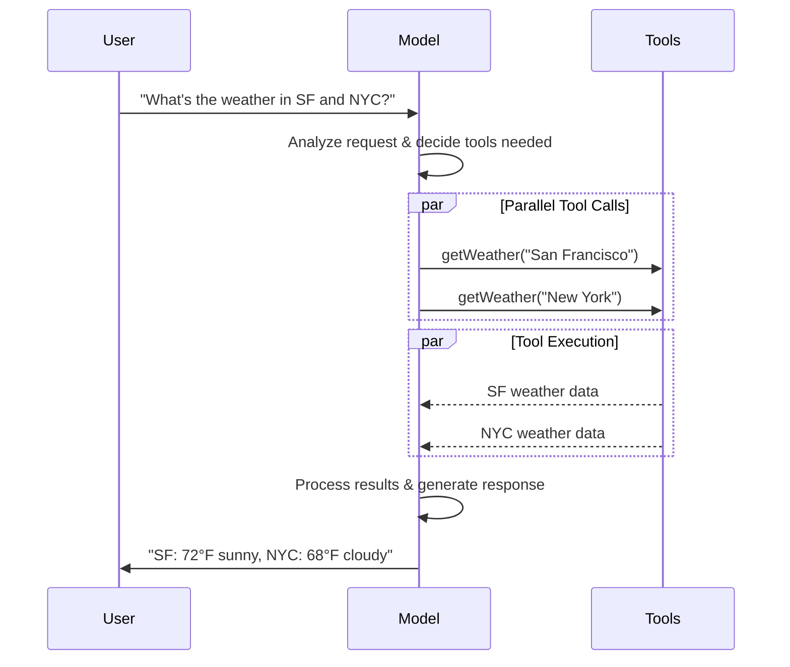

import ChatModelTabsPy from '/snippets/javascript/chat-model-tabs.mdx';
import ChatModelTabsJS from '/snippets/javascript/chat-model-tabs-js.mdx';

[LLMs](https://en.wikipedia.org/wiki/Large_language_model) 是强大的 AI 工具，能够像人类一样理解和生成文本。它们用途很广，可以写内容、翻译语言、总结信息并回答问题，而不需要针对每个任务单独训练。

除了文本生成外，许多模型还支持：

* <Icon icon="hammer" size={16} /> [工具调用](#tool-calling) - 调用外部工具（例如数据库查询或 API 调用），并把结果用于回复。
* <Icon icon="layout-grid" size={16} /> [结构化输出](#structured-output) - 将模型响应约束为定义好的格式。
* <Icon icon="photo" size={16} /> [多模态](#multimodal) - 处理并返回文本之外的数据，例如图片、音频和视频。
* <Icon icon="brain" size={16} /> [推理](#reasoning) - 模型通过多步推理得出结论。

模型是 [agents](/oss/javascript/langchain/agents) 的推理引擎。它们驱动智能体的决策过程，决定要调用哪些工具、如何解释结果，以及何时给出最终答案。

你选择的模型的质量和能力会直接影响智能体的基础可靠性和性能。不同模型擅长的任务不同，有些更擅长遵循复杂指令，有些更擅长结构化推理，还有些支持更大的上下文窗口，能处理更多信息。

LangChain 的标准模型接口让你可以接入许多不同提供商的集成，方便你试验并在模型之间切换，找到最适合自己用例的方案。

关于特定提供商的集成信息和能力，请参见该提供商的 [chat model page](/oss/javascript/integrations/chat)。

<Tip>
[LangSmith](/langsmith/observability) 会追踪每次模型调用，方便你对比提供商、检查工具路由并调试失败。请按照 [tracing quickstart](/langsmith/trace-with-langchain) 完成设置。

我们也建议你设置 [LangSmith Engine](/langsmith/engine)，它会监控你的追踪记录、检测问题并提出修复建议。
</Tip>

## 基本用法

模型有两种使用方式：

1. **和智能体一起用** - 在创建 [agent](/oss/javascript/langchain/agents#model) 时，可以动态指定模型。
2. **独立使用** - 可以直接调用模型（不经过智能体循环）来做文本生成、分类或提取等任务，而不需要智能体框架。

同一个模型接口在这两种场景下都能工作，这让你可以先从简单场景开始，需要时再扩展到更复杂的基于智能体的工作流。

### 初始化模型


在 LangChain 中开始使用独立模型的最简单方式，是用 `initChatModel` 从你选择的 [chat model provider](/oss/javascript/integrations/chat) 初始化一个模型（下面有示例）：

<ChatModelTabsJS />
```typescript
const response = await model.invoke("Why do parrots talk?");
```
更多细节请参见 [`initChatModel`](https://reference.langchain.com/javascript/langchain/chat_models/universal/initChatModel)，包括如何传递模型 [parameters](#parameters)。


## 工具调用

模型可以请求调用工具来完成诸如查询数据库、搜索网页或运行代码等任务。工具通常由两部分组成：

1. 一个 schema，包括工具名称、描述和/或参数定义（通常是 JSON schema）
2. 一个要执行的函数或 <Tooltip tip="A method that can suspend execution and resume at a later time">coroutine</Tooltip>

<Note>
    你可能会听到 “function calling” 这个术语。我们会把它和 “tool calling” 交替使用。
</Note>

下面是用户和模型之间的基本 tool calling 流程：





要让你定义的工具可供模型使用，必须先用 [`bindTools`](https://reference.langchain.com/javascript/classes/_langchain_core.language_models_chat_models.BaseChatModel.html#bindTools) 绑定它们。后续调用中，模型就可以按需选择任意已绑定工具。


某些模型提供商还支持可以通过模型参数或调用参数启用的 <Tooltip tip="Tools that are executed server-side, such as web search and code interpreters">内置工具</Tooltip>（例如 [`ChatOpenAI`](/oss/javascript/integrations/chat/openai)、[`ChatAnthropic`](/oss/javascript/integrations/chat/anthropic)）。具体细节请查看相应的 [provider reference](/oss/javascript/integrations/providers/overview)。

<Tip>
    关于创建工具的更多细节和其他选项，请参见 [tools guide](/oss/javascript/langchain/tools)。
</Tip>


```typescript 绑定用户工具
import { tool } from "langchain";
import * as z from "zod";
import { ChatOpenAI } from "@langchain/openai";

const getWeather = tool(
  (input) => `It's sunny in ${input.location}.`,
  {
    name: "get_weather",
    description: "Get the weather at a location.",
    schema: z.object({
      location: z.string().describe("The location to get the weather for"),
    }),
  },
);

const model = new ChatOpenAI({ model: "gpt-5.5" });
const modelWithTools = model.bindTools([getWeather]);  // [!code highlight]

const response = await modelWithTools.invoke("What's the weather like in Boston?");
const toolCalls = response.tool_calls || [];
for (const tool_call of toolCalls) {
  // 查看模型发起的 tool call
  console.log(`Tool: ${tool_call.name}`);
  console.log(`Args: ${tool_call.args}`);
}
```


当绑定了用户定义的工具后，模型响应里会包含一个要执行工具的**请求**。如果你单独使用模型而不是 [agent](/oss/javascript/langchain/agents)，那么就需要你自己执行被请求的工具，并把结果传回模型，供后续推理使用。使用 [agent](/oss/javascript/langchain/agents) 时，agent loop 会替你处理这个执行循环。

下面我们展示一些常见的 tool calling 用法。

<AccordionGroup>
    <Accordion title="工具执行循环" icon="refresh">
        当模型返回 tool calls 时，你需要执行这些工具，并把结果传回模型。这样就形成一个对话循环，模型可以利用工具结果生成最终回复。LangChain 提供了 [agent](/oss/javascript/langchain/agents) 抽象来帮你完成这套编排。

        下面是一个简单示例：


        ```typescript Tool execution loop
        // 将一个或多个工具绑定到模型
        const tools = [getWeather]
        const toolsByName = Object.fromEntries(tools.map((tool) => [tool.name, tool]))
        const modelWithTools = model.bindTools(tools)

        // 第 1 步：模型生成 tool calls
        const messages = [{"role": "user", "content": "What's the weather in Boston?"}]
        const ai_msg = await modelWithTools.invoke(messages)
        messages.push(ai_msg)

        // 第 2 步：执行工具并收集结果
        for (const tool_call of ai_msg.tool_calls) {
            // 使用生成的参数执行工具
            const tool = toolsByName[tool_call.name]
            const tool_result = await tool.invoke(tool_call)
            messages.push(tool_result)
        }

        // 第 3 步：把结果传回模型，生成最终回复
        const final_response = await modelWithTools.invoke(messages)
        console.log(final_response.text)
        // "The current weather in Boston is 72°F and sunny."
        ```


        每个由工具返回的 [`ToolMessage`](https://reference.langchain.com/javascript/langchain-core/messages/ToolMessage) 都包含一个与原始 tool call 对应的 `tool_call_id`，便于模型把结果和请求关联起来。
    </Accordion>
    <Accordion title="强制调用工具" icon="asterisk">
        默认情况下，模型可以根据用户输入自由选择要使用的已绑定工具。不过，你可能希望强制它选择某个工具，确保模型使用某个特定工具，或者使用给定列表中的 **任意** 一个工具：


        <CodeGroup>
            ```typescript Force use of any tool
            const modelWithTools = model.bindTools([tool_1], { toolChoice: "any" })
            ```
            ```typescript Force use of specific tools
            const modelWithTools = model.bindTools([tool_1], { toolChoice: "tool_1" })
            ```
        </CodeGroup>

    </Accordion>
    <Accordion title="并行工具调用" icon="stack-2">
        许多模型在合适的时候都支持并行调用多个工具。这样模型就能同时从不同来源收集信息。


        ```typescript Parallel tool calls
        const tools = [getWeather]
        const toolsByName = Object.fromEntries(tools.map((tool) => [tool.name, tool]))
        const modelWithTools = model.bindTools(tools)

        const response = await modelWithTools.invoke(
            "What's the weather in Boston and Tokyo?"
        )


        // 模型可能会生成多个 tool calls
        console.log(response.tool_calls)
        // [
        //   { name: 'get_weather', args: { location: 'Boston' }, id: 'call_1' },
        //   { name: 'get_weather', args: { location: 'Tokyo' }, id: 'call_2' }
        // ]


        // 执行所有工具（可以通过 async 并行执行）
        const results = []
        for (const tool_call of response.tool_calls || []) {
            const tool = toolsByName[tool_call.name]
            const result = await tool.invoke(tool_call)
            results.push(result)
        }
        ```


        模型会根据所请求操作之间是否相互独立，智能判断何时适合并行执行。

        <Tip>
        大多数支持工具调用的模型默认都会启用并行工具调用。有些模型（包括 [OpenAI](/oss/javascript/integrations/chat/openai) 和 [Anthropic](/oss/javascript/integrations/chat/anthropic)）允许你关闭这一功能。要关闭时，请设置 `parallel_tool_calls=False`：
        ```python
        model.bind_tools([get_weather], parallel_tool_calls=False)
        ```
        </Tip>
    </Accordion>
    <Accordion title="流式工具调用" icon="rss">
        在流式响应中，tool calls 会通过 [`ToolCallChunk`](https://reference.langchain.com/javascript/langchain-core/messages/ContentBlock/Tools/ToolCallChunk) 逐步构建。这让你能在 tool call 生成过程中就看到它们，而不必等到完整响应结束。


        ```typescript Streaming tool calls
        const stream = await modelWithTools.stream(
            "What's the weather in Boston and Tokyo?"
        )
        for await (const chunk of stream) {
            // tool call chunks 会逐步到达
            if (chunk.tool_call_chunks) {
                for (const tool_chunk of chunk.tool_call_chunks) {
                console.log(`Tool: ${tool_chunk.get('name', '')}`)
                console.log(`Args: ${tool_chunk.get('args', '')}`)
                }
            }
        }

        // 输出：
        // Tool: get_weather
        // Args:
        // Tool:
        // Args: {"loc
        // Tool:
        // Args: ation": "BOS"}
        // Tool: get_time
        // Args:
        // Tool:
        // Args: {"timezone": "Tokyo"}
        ```

        你可以把这些 chunk 累积起来，拼出完整的 tool call：

        ```typescript Accumulate tool calls
        let full: AIMessageChunk | null = null
        const stream = await modelWithTools.stream("What's the weather in Boston?")
        for await (const chunk of stream) {
            full = full ? full.concat(chunk) : chunk
            console.log(full.contentBlocks)
        }
        ```


    </Accordion>
</AccordionGroup>

---

## Structured output

模型可以被要求以符合给定 schema 的格式返回回复。这有助于确保输出可以被轻松解析，并用于后续处理。LangChain 支持多种 schema 类型和结构化输出强制方式。

<Tip>
    想了解结构化输出，请参见 [Structured output](/oss/javascript/langchain/structured-output)。
</Tip>


<Tabs>
    <Tab title="Zod">
        [zod schema](https://zod.dev/) 是定义输出 schema 的首选方式。请注意，当提供 zod schema 时，模型输出也会通过 zod 的 parse 方法进行校验。

        ```typescript
        import * as z from "zod";

        const Movie = z.object({
          title: z.string().describe("电影标题"),
          year: z.number().describe("电影上映年份"),
          director: z.string().describe("电影导演"),
          rating: z.number().describe("电影评分，满分 10 分"),
        });

        const modelWithStructure = model.withStructuredOutput(Movie);

        const response = await modelWithStructure.invoke("Provide details about the movie Inception");
        console.log(response);
        // {
        //   title: "Inception",
        //   year: 2010,
        //   director: "Christopher Nolan",
        //   rating: 8.8,
        // }
        ```
    </Tab>
    <Tab title="JSON Schema">
        为了获得最大的控制力或互操作性，你也可以提供原始 JSON Schema。

        ```typescript
        const jsonSchema = {
          "title": "Movie",
          "description": "A movie with details",
          "type": "object",
          "properties": {
            "title": {
              "type": "string",
              "description": "电影标题",
            },
            "year": {
              "type": "integer",
              "description": "电影上映年份",
            },
            "director": {
              "type": "string",
              "description": "电影导演",
            },
            "rating": {
              "type": "number",
              "description": "电影评分，满分 10 分",
            },
          },
          "required": ["title", "year", "director", "rating"],
        }

        const modelWithStructure = model.withStructuredOutput(
          jsonSchema,
          { method: "jsonSchema" },
        )

        const response = await modelWithStructure.invoke("Provide details about the movie Inception")
        console.log(response)  // {'title': 'Inception', 'year': 2010, ...}
        ```
    </Tab>
    <Tab title="Standard Schema">
        任何实现了 [Standard Schema](https://standardschema.dev/) 规范的库提供的 schema 也都受支持。Standard Schema 对象会通过 schema 的 `~standard.validate()` 方法在运行时校验。

        ```typescript
        import * as v from "valibot";
        import { toStandardJsonSchema } from "@valibot/to-json-schema";

        const Movie = toStandardJsonSchema(
          v.object({
            title: v.pipe(v.string(), v.description("电影标题")),
            year: v.pipe(v.number(), v.description("电影上映年份")),
            director: v.pipe(v.string(), v.description("电影导演")),
            rating: v.pipe(v.number(), v.description("电影评分，满分 10 分")),
          })
        );

        const modelWithStructure = model.withStructuredOutput(Movie);

        const response = await modelWithStructure.invoke("Provide details about the movie Inception");
        console.log(response);
        // {
        //   title: "Inception",
        //   year: 2010,
        //   director: "Christopher Nolan",
        //   rating: 8.8,
        // }
        ```
    </Tab>
</Tabs>


<Note>
    **结构化输出的关键注意事项：**

    - **Method 参数**：某些提供方支持不同的方法（`'jsonSchema'`、`'functionCalling'`、`'jsonMode'`）
    - **Include raw**：使用 [`includeRaw: true`](https://reference.langchain.com/javascript/classes/_langchain_core.language_models_chat_models.BaseChatModel.html#withStructuredOutput) 可同时拿到解析后的输出和原始 [`AIMessage`](https://reference.langchain.com/javascript/langchain-core/messages/AIMessage)
    - **Validation**：Zod 和 Standard Schema 对象会自动校验，而 JSON Schema 需要手动校验
    - **Standard Schema**：任何实现了 [Standard Schema](https://standardschema.dev/) 规范的 schema 库都受支持，并会在运行时校验

    有关支持的方法和配置选项，请参见对应的 [provider's integration page](/oss/javascript/integrations/providers/overview)。
</Note>


<Accordion title="示例：消息输出与解析后的结构并存">

有时在返回解析后的表示之外，同时返回原始 [`AIMessage`](https://reference.langchain.com/javascript/langchain-core/messages/AIMessage) 对象会很有用，这样你就可以访问诸如 [token counts](#token-usage) 之类的响应元数据。要这样做，请在调用 [`with_structured_output`](https://reference.langchain.com/javascript/classes/_langchain_core.language_models_chat_models.BaseChatModel.html#withStructuredOutput) 时设置 [`include_raw=True`](https://reference.langchain.com/javascript/classes/_langchain_core.language_models_chat_models.BaseChatModel.html#withStructuredOutput)：


    ```typescript
    import * as z from "zod";

    const Movie = z.object({
      title: z.string().describe("电影标题"),
      year: z.number().describe("电影上映年份"),
      director: z.string().describe("电影导演"),  // [!code highlight]
      rating: z.number().describe("电影评分，满分 10 分"),
    });

    const modelWithStructure = model.withStructuredOutput(Movie, { includeRaw: true });

    const response = await modelWithStructure.invoke("Provide details about the movie Inception");
    console.log(response);
    // {
    //   raw: AIMessage { ... },
    //   parsed: { title: "Inception", ... }
    // }
    ```

</Accordion>
<Accordion title="示例：嵌套结构">
    schema 可以嵌套：


    ```typescript
    import * as z from "zod";

    const Actor = z.object({
      name: z.string(),
      role: z.string(),
    });

    const MovieDetails = z.object({
      title: z.string(),
      year: z.number(),
      cast: z.array(Actor),
      genres: z.array(z.string()),
      budget: z.number().nullable().describe("预算，单位为百万美元"),
    });

    const modelWithStructure = model.withStructuredOutput(MovieDetails);
    ```

</Accordion>

---

## Advanced topics

### 模型配置文件

<Info>
    模型配置文件需要 `langchain>=1.1`。
</Info>


LangChain 聊天模型可以通过 `profile` 属性暴露一组受支持的特性和能力：

```typescript
model.profile;
// {
//   maxInputTokens: 400000,
//   imageInputs: true,
//   reasoningOutput: true,
//   toolCalling: true,
//   ...
// }
```

完整字段请参见 [API reference](https://reference.langchain.com/javascript/langchain-core/language_models/profile/ModelProfile)。

模型配置文件中的大部分数据由 [models.dev](https://github.com/sst/models.dev) 项目提供，这是一个提供模型能力数据的开源项目。这些数据会与 LangChain 额外添加的字段一起使用，并随着上游项目演进保持同步。

模型配置文件数据可以帮助应用动态适配模型能力。例如：

1. [Summarization middleware](/oss/javascript/langchain/middleware/built-in#summarization) 可以根据模型的上下文窗口大小触发总结。
2. `createAgent` 中的 [Structured output](/oss/javascript/langchain/structured-output) 策略可以自动推断，例如通过检查是否支持原生结构化输出特性。
3. 模型输入可以根据支持的 [modalities](#multimodal) 和最大输入 token 数进行门控。
4. [Deep Agents Code](/oss/deepagents/code) 会把 [interactive model switcher](/oss/deepagents/code/providers#which-models-appear-in-the-switcher) 过滤到那些 profile 报告支持 `tool_calling` 且支持文本 I/O 的模型，并在选择器详情视图中显示上下文窗口大小和能力标记。

<Accordion title="修改 profile 数据">
    如果 profile 数据缺失、过期或错误，可以修改它。

    **选项 1，快速修复**

    你可以用任意有效 profile 实例化聊天模型：

    ```typescript
    const customProfile = {
    maxInputTokens: 100_000,
    toolCalling: true,
    structuredOutput: true,
    // ...
    };
    const model = initChatModel("...", { profile: customProfile });
    ```

    **选项 2，修复上游数据**

    这些数据的主要来源是 [models.dev](https://models.dev/) 项目。这些数据会与 LangChain [integration packages](/oss/javascript/integrations/providers/overview) 中的额外字段和覆盖项合并，并随这些包一起发布。

    可以通过以下流程更新 model profile 数据：

    1. （如有需要）通过向 [models.dev](https://models.dev/) 的 [GitHub repository](https://github.com/sst/models.dev) 提交 pull request 来更新源数据。
    2. （如有需要）通过向 LangChain [integration package](/oss/javascript/integrations/providers/overview) 提交 pull request，更新 `langchain-<package>/profiles.toml` 中的额外字段和覆盖项。
</Accordion>


<Warning>
    模型配置文件是一个 beta 功能。profile 的格式可能会变化。
</Warning>

### 多模态

某些模型可以处理并返回图像、音频和视频等非文本数据。你可以通过提供 [content blocks](/oss/javascript/langchain/messages#message-content) 向模型传入非文本数据。

<Tip>
    所有具备多模态能力的 LangChain 聊天模型都支持：

    1. 跨 provider 的标准格式（见 [our messages guide](/oss/javascript/langchain/messages)）
    2. OpenAI [chat completions](https://platform.openai.com/docs/api-reference/chat) 格式
    3. 该特定 provider 的原生格式（例如 Anthropic 模型接受 Anthropic 原生格式）
</Tip>

查看消息指南中的 [multimodal section](/oss/javascript/langchain/messages#multimodal) 了解详情。

<Tooltip tip="并不是所有 LLM 都一样！" cta="查看 reference" href="https://models.dev/">Some models</Tooltip> 也可以在回复中返回多模态数据。如果被要求这样做，生成的 [`AIMessage`](https://reference.langchain.com/javascript/langchain-core/messages/AIMessage) 会包含多模态类型的 content blocks。


```typescript Multimodal output
const response = await model.invoke("Create a picture of a cat");
console.log(response.contentBlocks);
// [
//   { type: "text", text: "Here's a picture of a cat" },
//   { type: "image", data: "...", mimeType: "image/jpeg" },
// ]
```


有关具体 provider 的细节，请参见 [integrations page](/oss/javascript/integrations/providers/overview)。

### 推理

许多模型都能进行多步推理，从而得出结论。这意味着它们会把复杂问题拆解为更小、更容易处理的步骤。

**如果底层模型支持，** 你可以把这个推理过程暴露出来，更好地理解模型是如何得到最终答案的。


<CodeGroup>
    ```typescript Stream reasoning output
    const stream = model.stream("Why do parrots have colorful feathers?");
    for await (const chunk of stream) {
        const reasoningSteps = chunk.contentBlocks.filter(b => b.type === "reasoning");
        console.log(reasoningSteps.length > 0 ? reasoningSteps : chunk.text);
    }
    ```

    ```typescript Complete reasoning output
    const response = await model.invoke("Why do parrots have colorful feathers?");
    const reasoningSteps = response.contentBlocks.filter(b => b.type === "reasoning");
    console.log(reasoningSteps.map(step => step.reasoning).join(" "));
    ```
</CodeGroup>


根据模型不同，你有时可以指定其在推理上投入多少努力。类似地，你也可以要求模型完全关闭推理。这可能表现为分类式的“档位”（例如 `'low'` 或 `'high'`），也可能是整数 token 预算。

有关详情，请参见你对应聊天模型的 [integrations page](/oss/javascript/integrations/providers/overview) 或 [reference](https://reference.langchain.com/python/integrations/)。


### 本地模型

LangChain 支持在你自己的硬件上本地运行模型。这在数据隐私至关重要、你想调用自定义模型，或者想避免使用云模型产生费用时尤其有用。

[Ollama](/oss/javascript/integrations/chat/ollama) 是在本地运行聊天模型和嵌入模型最简单的方法之一。

{/* TODO: whenever we have a better integrations directory, x-ref to that page with a local query filter */}

### Prompt 缓存

许多 provider 提供 prompt 缓存功能，可以减少重复处理相同 token 时的延迟和成本。你可以在三个层级使用缓存：

- **隐式 provider 缓存：** 如果请求命中缓存，provider 会自动把节省的成本返还给你，无需任何配置。示例：[OpenAI](/oss/javascript/integrations/chat/openai) 和 [Gemini](/oss/javascript/integrations/chat/google_generative_ai)。
- **provider 级显式控制：** provider 允许你手动标记缓存点，以便更好地控制或保证成本节省。这些控制方式与底层 provider/API 行为一致。示例：
    - [`ChatOpenAI`](https://reference.langchain.com/javascript/langchain-openai/ChatOpenAI)（通过 `prompt_cache_key`）
    - Anthropic content-block [`cache_control`](/oss/javascript/integrations/chat/anthropic#prompt-caching)
    - [Gemini](https://reference.langchain.com/python/integrations/langchain_google_genai/)。


<Warning>
    Prompt 缓存通常只会在超过最小输入 token 阈值后生效。详情请参见 [provider pages](/oss/javascript/integrations/chat)。
</Warning>

缓存使用情况会体现在模型响应的 [usage metadata](/oss/javascript/langchain/messages#token-usage) 中。

### 服务端工具使用

某些 provider 支持服务端 [tool-calling](#tool-calling) 循环：模型可以与网页搜索、代码解释器和其他工具交互，并在一次对话回合中分析结果。

如果模型在服务端调用了工具，响应消息的内容会包含表示工具调用及其结果的内容。访问响应的 [content blocks](/oss/javascript/langchain/messages#standard-content-blocks) 会以 provider 无关的格式返回服务端工具调用和结果：


```typescript
import { initChatModel } from "langchain";

const model = await initChatModel("gpt-5.4-mini");
const modelWithTools = model.bindTools([{ type: "web_search" }])

const message = await modelWithTools.invoke("What was a positive news story from today?");
console.log(message.contentBlocks);
```

这表示的是一次单独的对话回合；与客户端 [tool-calling](#tool-calling) 不同，这里不需要传入对应的 [ToolMessage](/oss/javascript/langchain/messages#tool-message) 对象。

请参见你所用 provider 的 [integration page](/oss/javascript/integrations/chat)，查看可用工具及其使用细节。


### 速率限制

许多聊天模型 provider 会对给定时间段内可发起的调用次数设置限制。如果触发速率限制，通常会收到 provider 返回的速率限制错误，需要等待一段时间后再发起更多请求。

为了帮助管理速率限制，聊天模型集成在初始化时接受 `rate_limiter` 参数，用来控制请求发送速率。

<Accordion title="初始化并使用 rate limiter" icon="gauge">
    LangChain 内置了一个（可选的）@[`InMemoryRateLimiter`]。它是线程安全的，可以被同一进程中的多个线程共享。

    ```python Define a rate limiter
    from langchain_core.rate_limiters import InMemoryRateLimiter

    rate_limiter = InMemoryRateLimiter(
        requests_per_second=0.1,  # 1 request every 10s
        check_every_n_seconds=0.1,  # Check every 100ms whether allowed to make a request
        max_bucket_size=10,  # Controls the maximum burst size.
    )

    model = init_chat_model(
        model="gpt-5.5",
        model_provider="openai",
        rate_limiter=rate_limiter  # [!code highlight]
    )
    ```

    <Warning>
        提供的 rate limiter 只能限制单位时间内的请求数量。如果你还需要按请求大小限制，它不会帮上忙。
    </Warning>
</Accordion>
:::

### Base URL 和代理设置

对于实现了 OpenAI Chat Completions API 的 provider，你可以配置自定义 base URL。

<Warning>
    `model_provider="openai"`（或直接使用 `ChatOpenAI`）面向的是官方 OpenAI API 规范。路由器和代理提供的 provider-specific 字段可能不会被提取或保留。

    对于 OpenRouter 和 LiteLLM，更推荐使用专门的集成：
    - [通过 `ChatOpenRouter` 使用 OpenRouter](/oss/javascript/integrations/chat/openrouter)（`langchain-openrouter`）
    - [通过 `ChatLiteLLM` / `ChatLiteLLMRouter` 使用 LiteLLM](/oss/javascript/integrations/chat)（`langchain-litellm`）
</Warning>

<Accordion title="自定义 base URL" icon="link">


    许多模型 provider 都提供 OpenAI 兼容 API（例如 [Together AI](https://www.together.ai/)、[vLLM](https://github.com/vllm-project/vllm)）。你可以通过指定合适的 `base_url` 参数来使用 `initChatModel`：

    ```python
    model = initChatModel(
        "MODEL_NAME",
        {
            modelProvider: "openai",
            baseUrl: "BASE_URL",
            apiKey: "YOUR_API_KEY",
        }
    )
    ```


    <Note>
        当直接实例化聊天模型类时，参数名可能因 provider 不同而异。请查看对应的 [reference](/oss/javascript/integrations/providers/overview)。
    </Note>
</Accordion>


### Log probabilities

某些模型可以通过在初始化时设置 `logprobs` 参数，返回 token 级别的 log probability，用于表示某个 token 出现的可能性：


```typescript
const model = new ChatOpenAI({
    model: "gpt-5.5",
    logprobs: true,
});

const responseMessage = await model.invoke("Why do parrots talk?");

responseMessage.response_metadata.logprobs.content.slice(0, 5);
```


### Token usage

许多模型 provider 会在调用响应中返回 token usage 信息。可用时，这些信息会包含在相应模型生成的 [`AIMessage`](https://reference.langchain.com/javascript/langchain-core/messages/AIMessage) 对象上。更多细节请参见 [messages](/oss/javascript/langchain/messages) 指南。


### 调用配置


调用模型时，可以通过 `config` 参数传入 [`RunnableConfig`](https://reference.langchain.com/javascript/langchain-core/runnables/RunnableConfig) 对象来提供额外配置。这能让你在运行时控制执行行为、回调和元数据跟踪。


常见配置项包括：


```typescript Invocation with config
const response = await model.invoke(
    "Tell me a joke",
    {
        runName: "joke_generation",      // Custom name for this run
        tags: ["humor", "demo"],          // Tags for categorization
        metadata: {"user_id": "123"},     // Custom metadata
        callbacks: [my_callback_handler], // Callback handlers
    }
)
```


这些配置值在以下场景尤其有用：
- 通过 [LangSmith](/langsmith/observability) tracing 进行调试
- 实现自定义日志或监控
- 在生产环境中控制资源使用
- 在复杂流水线中跟踪调用


<Accordion title="关键配置属性">
    <ParamField body="runName" type="string">
        在日志和 tracing 中标识这次具体调用。不会继承给子调用。
    </ParamField>

    <ParamField body="tags" type="string[]">
        由所有子调用继承的标签，用于在调试工具中筛选和组织。
    </ParamField>

    <ParamField body="metadata" type="object">
        用于跟踪额外上下文的自定义键值对，由所有子调用继承。
    </ParamField>

    <ParamField body="maxConcurrency" type="number">
        使用 `batch()` 时，控制并行调用的最大数量。
    </ParamField>

    <ParamField body="callbacks" type="CallbackHandler[]">
        用于在执行期间监控并响应事件的处理器。
    </ParamField>

    <ParamField body="recursion_limit" type="number">
        用于防止复杂流水线中无限循环的最大递归深度。
    </ParamField>
</Accordion>


<Tip>
    查看完整 [`RunnableConfig`](https://reference.langchain.com/javascript/langchain-core/runnables/RunnableConfig) reference 了解所有受支持的属性。
</Tip>


### 动态模型选择

动态模型会在 <Tooltip tip="你的 agent 执行环境，包含不可变配置和会在整个执行过程中持续存在的上下文数据（例如用户 ID、会话详情或应用特定配置）。">runtime</Tooltip> 根据当前 <Tooltip tip="在 agent 执行过程中流动的数据，包括消息、自定义字段以及需要在处理期间跟踪和可能修改的任何信息（例如用户偏好或工具使用统计）。">state</Tooltip> 和上下文被选中。这支持更复杂的路由逻辑和成本优化。


要使用动态模型，可以创建 `wrapModelCall` middleware，在请求中修改模型：

```ts
import { ChatOpenAI } from "@langchain/openai";
import { createAgent, createMiddleware } from "langchain";

const basicModel = new ChatOpenAI({ model: "gpt-5.4-mini" });
const advancedModel = new ChatOpenAI({ model: "gpt-5.5" });

const dynamicModelSelection = createMiddleware({
  name: "DynamicModelSelection",
  wrapModelCall: (request, handler) => {
    // 根据对话复杂度选择模型
    const messageCount = request.messages.length;

    return handler({
        ...request,
        model: messageCount > 10 ? advancedModel : basicModel,
    });
  },
});

const agent = createAgent({
  model: "gpt-5.4-mini", // 基础模型（messageCount ≤ 10 时使用）
  tools: [],
  middleware: [dynamicModelSelection],
});
```

有关 middleware 和高级模式的更多细节，请参见 [middleware documentation](/oss/javascript/langchain/middleware)。


<Tip>
有关模型配置的细节，请参见 [Models](/oss/javascript/langchain/models)。有关动态模型选择模式，请参见 [Dynamic model in middleware](/oss/javascript/langchain/middleware#dynamic-model)。
</Tip>

```typescript Batch
const responses = await model.batch([
  "Why do parrots have colorful feathers?",
  "How do airplanes fly?",
  "What is quantum computing?",
  "Why do parrots have colorful feathers?",
  "How do airplanes fly?",
  "What is quantum computing?",
]);
for (const response of responses) {
  console.log(response);
}
```

<Tip>
    当使用 `batch()` 处理大量输入时，你可能希望控制最大并发数。可以在 [`RunnableConfig`](https://reference.langchain.com/javascript/langchain-core/runnables/RunnableConfig) 字典中设置 `maxConcurrency` 属性。

    ```typescript Batch with max concurrency
    model.batch(
      listOfInputs,
      {
        maxConcurrency: 5,  // 限制为 5 个并发调用
      }
    )
    ```

    更多支持属性请参见 [`RunnableConfig`](https://reference.langchain.com/javascript/langchain-core/runnables/RunnableConfig) reference。
</Tip>

更多批处理细节请参见 [reference](https://reference.langchain.com/javascript/classes/_langchain_core.language_models_chat_models.BaseChatModel.html#batch)。

---

<div className="source-links">
<Callout icon="terminal-2">
    [Connect these docs](/use-these-docs) to your agent of choice via MCP for real-time answers.
</Callout>
<Callout icon="edit">
    [Edit this page on GitHub](https://github.com/langchain-ai/docs/edit/main/src/oss/langchain/models.mdx) or [file an issue](https://github.com/langchain-ai/docs/issues/new/choose).
</Callout>
</div>
