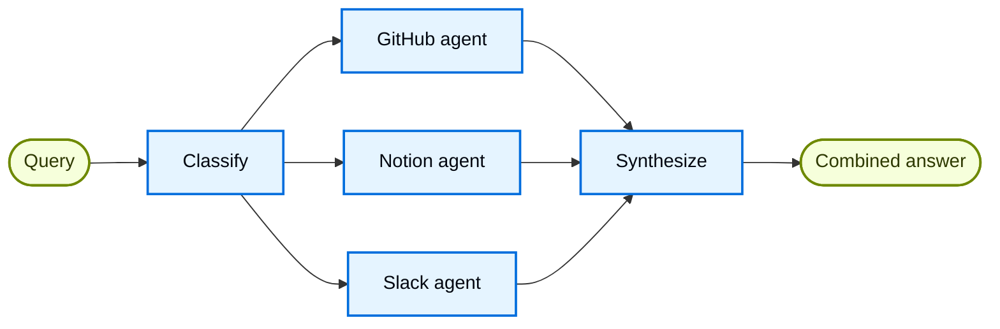

import ChatModelTabsPy from '/snippets/javascript/chat-model-tabs.mdx';
import ChatModelTabsJs from '/snippets/javascript/chat-model-tabs-js.mdx';

## 概览

**router pattern** 是一种 [multi-agent](/oss/javascript/langchain/multi-agent) 架构：先做一次路由分类，再把输入分发给专门的 agent，最后把结果综合成一个统一回复。当你的组织知识分散在不同的 **verticals**（不同知识域，各自需要专门的 agent、工具和 prompt）里时，这种模式尤其合适。

在本教程里，你会构建一个多来源知识库 router，用一个现实的企业场景来演示这些优势。这个系统会协调三个 specialist：

- 一个 **GitHub agent**，负责搜索代码、issues 和 pull requests。
- 一个 **Notion agent**，负责搜索内部文档和 wiki。
- 一个 **Slack agent**，负责搜索相关 thread 和讨论。

当用户问“我该怎么认证 API 请求？”时，router 会把问题拆成针对各个 source 的子问题，把它们并行路由到相关 agent，再把结果综合成一个连贯答案。



### 为什么要用 router？

router pattern 有几个优点：

- **并行执行**：同时查询多个 source，比串行方法更低延迟。
- **专门化 agent**：每个 vertical 都有自己的工具和 prompt，能针对各自领域做优化。
- **选择性路由**：并不是每个问题都需要所有 source，router 会智能选择相关 vertical。
- **定向子问题**：每个 agent 收到的都是针对它所属领域定制的问题，结果质量更高。
- **干净的综合**：来自多个 source 的结果会被合并成一个统一、连贯的回复。

### 概念

我们会覆盖下面这些概念：

- [Multi-agent systems](/oss/javascript/langchain/multi-agent)
- 用于工作流编排的 [StateGraph](/oss/javascript/langgraph/graph-api)
- 用于并行执行的 [Send API](/oss/javascript/langgraph/graph-api#send)

<Tip>
**Router vs. Subagents**： [subagents pattern](/oss/javascript/langchain/multi-agent/subagents) 也可以路由到多个 agent。若你需要专门的预处理、自定义路由逻辑，或者想显式控制并行执行，就用 router pattern。若你希望 LLM 动态决定调用哪些 agent，就用 subagents pattern。
</Tip>

## 设置

### 安装

本教程需要 `langchain` 和 `langgraph` 包：


<CodeGroup>
```bash npm
npm install langchain @langchain/langgraph
```
```bash yarn
yarn add langchain @langchain/langgraph
```
```bash pnpm
pnpm add langchain @langchain/langgraph
```
</CodeGroup>


更多信息请看 [安装指南](/oss/javascript/langchain/install)。

### LangSmith

设置 [LangSmith](https://smith.langchain.com?utm_source=docs&utm_medium=cta&utm_campaign=langsmith-signup&utm_content=oss-langchain-multi-agent-router-knowledge-base) 来检查 agent 内部发生了什么。然后设置下面这些环境变量：


<CodeGroup>
```bash bash
export LANGSMITH_TRACING="true"
export LANGSMITH_API_KEY="..."
```
```typescript typescript
process.env.LANGSMITH_TRACING = "true";
process.env.LANGSMITH_API_KEY = "...";
```
</CodeGroup>


### 选择 LLM

从 LangChain 的集成套件里选择一个 chat model：


<ChatModelTabsJs />


## 1. 定义 state

先定义 state schema。我们会用三种类型：

- **`AgentInput`**：传给每个 subagent 的简单 state（只包含一个 query）
- **`AgentOutput`**：每个 subagent 返回的结果（source 名称 + result）
- **`RouterState`**：主工作流 state，跟踪 query、分类结果、各 source 返回的结果，以及最终答案


```typescript
import { StateSchema, ReducedValue } from "@langchain/langgraph";
import { z } from "zod/v4";

const AgentOutput = z.object({
  source: z.string(),
  result: z.string(),
});

const RouterState = new StateSchema({
  query: z.string(),
  classifications: z.array(
    z.object({
      source: z.enum(["github", "notion", "slack"]),
      query: z.string(),
    })
  ),
  results: new ReducedValue(
    z.array(AgentOutput).default(() => []),
    { reducer: (current, update) => current.concat(update) }
  ),
  finalAnswer: z.string(),
});
```


`results` 字段使用了一个 **reducer**（Python 里是 `operator.add`，JS 里是 concat 函数）来把并行 agent 执行的输出收集到一个列表里。

## 2. 为每个 vertical 定义工具

为每个知识域创建工具。在生产系统里，这些工具会调用真实 API。在本教程里，我们用 stub 实现来返回 mock 数据。我们会为 3 个 vertical 定义 7 个工具：GitHub（搜索代码、issues、PR），Notion（搜索文档、获取页面），Slack（搜索消息、获取 thread）。


```typescript expandable
import { tool } from "langchain";
import { z } from "zod";

const searchCode = tool(
  async ({ query, repo }) => {
    return `Found code matching '${query}' in ${repo || "main"}: authentication middleware in src/auth.py`;
  },
  {
    name: "search_code",
    description: "Search code in GitHub repositories.",
    schema: z.object({
      query: z.string(),
      repo: z.string().optional().default("main"),
    }),
  }
);

const searchIssues = tool(
  async ({ query }) => {
    return `Found 3 issues matching '${query}': #142 (API auth docs), #89 (OAuth flow), #203 (token refresh)`;
  },
  {
    name: "search_issues",
    description: "Search GitHub issues and pull requests.",
    schema: z.object({
      query: z.string(),
    }),
  }
);

const searchPrs = tool(
  async ({ query }) => {
    return `PR #156 added JWT authentication, PR #178 updated OAuth scopes`;
  },
  {
    name: "search_prs",
    description: "Search pull requests for implementation details.",
    schema: z.object({
      query: z.string(),
    }),
  }
);

const searchNotion = tool(
  async ({ query }) => {
    return `Found documentation: 'API Authentication Guide' - covers OAuth2 flow, API keys, and JWT tokens`;
  },
  {
    name: "search_notion",
    description: "Search Notion workspace for documentation.",
    schema: z.object({
      query: z.string(),
    }),
  }
);

const getPage = tool(
  async ({ pageId }) => {
    return `Page content: Step-by-step authentication setup instructions`;
  },
  {
    name: "get_page",
    description: "Get a specific Notion page by ID.",
    schema: z.object({
      pageId: z.string(),
    }),
  }
);

const searchSlack = tool(
  async ({ query }) => {
    return `Found discussion in #engineering: 'Use Bearer tokens for API auth, see docs for refresh flow'`;
  },
  {
    name: "search_slack",
    description: "Search Slack messages and threads.",
    schema: z.object({
      query: z.string(),
    }),
  }
);

const getThread = tool(
  async ({ threadId }) => {
    return `Thread discusses best practices for API key rotation`;
  },
  {
    name: "get_thread",
    description: "Get a specific Slack thread.",
    schema: z.object({
      threadId: z.string(),
    }),
  }
);
```


## 3. 创建专门化 agent

为每个 vertical 创建一个 agent。每个 agent 都有自己领域的工具和优化过的 prompt。三个 agent 遵循同一模式，只是工具和 system prompt 不同。


```typescript expandable
import { createAgent } from "langchain";
import { ChatOpenAI } from "@langchain/openai";

const llm = new ChatOpenAI({ model: "gpt-5.5" });

const githubAgent = createAgent({
  model: llm,
  tools: [searchCode, searchIssues, searchPrs],
  systemPrompt: `
You are a GitHub expert. Answer questions about code,
API references, and implementation details by searching
repositories, issues, and pull requests.
  `.trim(),
});

const notionAgent = createAgent({
  model: llm,
  tools: [searchNotion, getPage],
  systemPrompt: `
You are a Notion expert. Answer questions about internal
processes, policies, and team documentation by searching
the organization's Notion workspace.
  `.trim(),
});

const slackAgent = createAgent({
  model: llm,
  tools: [searchSlack, getThread],
  systemPrompt: `
You are a Slack expert. Answer questions by searching
relevant threads and discussions where team members have
shared knowledge and solutions.
  `.trim(),
});
```


## 4. 构建 router workflow

现在用 StateGraph 构建 router workflow。这个 workflow 有四个主要步骤：

1. **Classify**：分析 query，决定要调用哪些 agent，以及各自该问什么子问题
2. **Route**：使用 `Send` 把任务 fan out 到被选中的 agent，并行执行
3. **Query agents**：每个 agent 接收一个简单的 `AgentInput`，并返回一个 `AgentOutput`
4. **Synthesize**：把收集到的结果合并成一个连贯的回复


```typescript
async function querySlack(state: AgentInput) {
  const result = await slackAgent.invoke({
    messages: [{ role: "user", content: state.query }]  // [!code highlight]
  });
  return { results: [{ source: "slack", result: result.messages.at(-1)?.content }] };
}


async function synthesizeResults(state: typeof RouterState.State) {
  if (state.results.length === 0) {
    return { finalAnswer: "No results found from any knowledge source." };
  }

  // 为 synthesis 格式化结果
  const formatted = state.results.map(
    (r) => `**From ${r.source.charAt(0).toUpperCase() + r.source.slice(1)}:**\n${r.result}`
  );

  const synthesisResponse = await routerLlm.invoke([
    {
      role: "system",
      content: `Synthesize these search results to answer the original question: "${state.query}"

- Combine information from multiple sources without redundancy
- Highlight the most relevant and actionable information
- Note any discrepancies between sources
- Keep the response concise and well-organized`
    },
    { role: "user", content: formatted.join("\n\n") }
  ]);

  return { finalAnswer: synthesisResponse.content };
}
```


## 5. 编译 workflow

现在把各个节点连接起来，组装 workflow。关键是使用 `add_conditional_edges` 和 routing function 来实现并行执行：


```typescript
const workflow = new StateGraph(RouterState)
  .addNode("classify", classifyQuery)
  .addNode("github", queryGithub)
  .addNode("notion", queryNotion)
  .addNode("slack", querySlack)
  .addNode("synthesize", synthesizeResults)
  .addEdge(START, "classify")
  .addConditionalEdges("classify", routeToAgents, ["github", "notion", "slack"])
  .addEdge("github", "synthesize")
  .addEdge("notion", "synthesize")
  .addEdge("slack", "synthesize")
  .addEdge("synthesize", END)
  .compile();
```


`add_conditional_edges` 会通过 `route_to_agents` 函数把 classify 节点连接到各个 agent 节点。当 `route_to_agents` 返回多个 `Send` 对象时，这些节点会并行执行。

## 6. 使用 router

用覆盖多个知识域的 query 来测试 router：


```typescript
const result = await workflow.invoke({
  query: "How do I authenticate API requests?"
});

console.log("Original query:", result.query);
console.log("\nClassifications:");
for (const c of result.classifications) {
  console.log(`  ${c.source}: ${c.query}`);
}
console.log("\n" + "=".repeat(60) + "\n");
console.log("Final Answer:");
console.log(result.finalAnswer);
```


预期输出：
```
Original query: How do I authenticate API requests?

Classifications:
  github: What authentication code exists? Search for auth middleware, JWT handling
  notion: What authentication documentation exists? Look for API auth guides

============================================================

Final Answer:
To authenticate API requests, you have several options:

1. **JWT Tokens**: The recommended approach for most use cases.
   Implementation details are in `src/auth.py` (PR #156).

2. **OAuth2 Flow**: For third-party integrations, follow the OAuth2
   flow documented in Notion's 'API Authentication Guide'.

3. **API Keys**: For server-to-server communication, use Bearer tokens
   in the Authorization header.

For token refresh handling, see issue #203 and PR #178 for the latest
OAuth scope updates.
```

router 分析了 query，分类出需要调用哪些 agent（这个技术问题会调用 GitHub 和 Notion，但不会调用 Slack），并行查询了两个 agent，最后把结果综合成一个连贯答案。

## 7. 理解架构

router workflow 遵循一个清晰的模式：

### 分类阶段

`classify_query` 函数使用 **structured output** 来分析用户 query，并决定要调用哪些 agent。路由智能就体现在这里：

- 使用 Pydantic model（Python）或 Zod schema（JS）确保输出有效
- 返回一组 `Classification` 对象，每个对象都包含 `source` 和目标 `query`
- 只包含相关 source，不相关的 source 会直接省略

这种结构化方法比自由格式 JSON 解析更可靠，也让路由逻辑更明确。

### 使用 send 做并行执行

`route_to_agents` 函数会把 classifications 映射成 `Send` 对象。每个 `Send` 都指定目标节点和要传递的 state：


```typescript
// Classifications: [{ source: "github", query: "..." }, { source: "notion", query: "..." }]
// 变成：
[new Send("github", { query: "..." }), new Send("notion", { query: "..." })]
// 两个 agent 同时执行，每个只接收自己需要的 query
```


每个 agent 节点接收的都是只有 `query` 字段的简单 `AgentInput`，而不是完整的 router state。这样接口更干净，也更明确。

### 使用 reducer 收集结果

agent 的结果通过 **reducer** 回流到主 state。每个 agent 返回：


```typescript
{ results: [{ source: "github", result: "..." }] }
```


reducer（Python 中是 `operator.add`）会把这些列表拼接起来，把所有并行结果收集到 `state["results"]` 中。

### 综合阶段

在所有 agent 完成后，`synthesize_results` 函数会遍历收集到的结果：

- 等待所有并行分支完成（LangGraph 会自动处理）
- 引用原始 query，确保答案真正回应了用户的问题
- 把来自多个 source 的信息合并起来，不重复赘述

<Note>
**部分结果**：在本教程里，所有被选中的 agent 都必须完成后才能进入 synthesis。
</Note>

## 8. 完整可运行示例

下面是一份可以直接运行的完整脚本：

<Expandable title="查看完整代码" defaultOpen={false}>


```typescript
import { StateGraph, START, END, Send } from "@langchain/langgraph";
import { z } from "zod";

const routerLlm = new ChatOpenAI({ model: "gpt-5.4-mini" });

// Define structured output schema for the classifier
const ClassificationResultSchema = z.object({
  classifications: z.array(z.object({
    source: z.enum(["github", "notion", "slack"]),
    query: z.string(),
  })).describe("List of agents to invoke with their targeted sub-questions"),
});


async function classifyQuery(state: typeof RouterState.State) {
  const structuredLlm = routerLlm.withStructuredOutput(ClassificationResultSchema);

  const result = await structuredLlm.invoke([
    {
      role: "system",
      content: `Analyze this query and determine which knowledge bases to consult.
For each relevant source, generate a targeted sub-question optimized for that source.

Available sources:
- github: Code, API references, implementation details, issues, pull requests
- notion: Internal documentation, processes, policies, team wikis
- slack: Team discussions, informal knowledge sharing, recent conversations

Return ONLY the sources that are relevant to the query. Each source should have
a targeted sub-question optimized for that specific knowledge domain.

Example for "How do I authenticate API requests?":
- github: "What authentication code exists? Search for auth middleware, JWT handling"
- notion: "What authentication documentation exists? Look for API auth guides"
(slack omitted because it's not relevant for this technical question)`
    },
    { role: "user", content: state.query }
  ]);

  return { classifications: result.classifications };
}


function routeToAgents(state: typeof RouterState.State): Send[] {
  return state.classifications.map(
    (c) => new Send(c.source, { query: c.query })
  );
}


async function queryGithub(state: AgentInput) {
  const result = await githubAgent.invoke({
    messages: [{ role: "user", content: state.query }]
  });
  return { results: [{ source: "github", result: result.messages.at(-1)?.content }] };
}


async function queryNotion(state: AgentInput) {
  const result = await notionAgent.invoke({
    messages: [{ role: "user", content: state.query }]
  });
  return { results: [{ source: "notion", result: result.messages.at(-1)?.content }] };
}


async function querySlack(state: AgentInput) {
  const result = await slackAgent.invoke({
    messages: [{ role: "user", content: state.query }]
  });
  return { results: [{ source: "slack", result: result.messages.at(-1)?.content }] };
}


async function synthesizeResults(state: typeof RouterState.State) {
  if (state.results.length === 0) {
    return { finalAnswer: "No results found from any knowledge source." };
  }

  // 为 synthesis 格式化结果
  const formatted = state.results.map(
    (r) => `**From ${r.source.charAt(0).toUpperCase() + r.source.slice(1)}:**\n${r.result}`
  );

  const synthesisResponse = await routerLlm.invoke([
    {
      role: "system",
      content: `Synthesize these search results to answer the original question: "${state.query}"

- Combine information from multiple sources without redundancy
- Highlight the most relevant and actionable information
- Note any discrepancies between sources
- Keep the response concise and well-organized`
    },
    { role: "user", content: formatted.join("\n\n") }
  ]);

  return { finalAnswer: synthesisResponse.content };
}
```


## 5. 编译 workflow

现在把各个节点连接起来，组装 workflow。关键是用 `add_conditional_edges` 和 routing function 来实现并行执行：


```typescript
const workflow = new StateGraph(RouterState)
  .addNode("classify", classifyQuery)
  .addNode("github", queryGithub)
  .addNode("notion", queryNotion)
  .addNode("slack", querySlack)
  .addNode("synthesize", synthesizeResults)
  .addEdge(START, "classify")
  .addConditionalEdges("classify", routeToAgents, ["github", "notion", "slack"])
  .addEdge("github", "synthesize")
  .addEdge("notion", "synthesize")
  .addEdge("slack", "synthesize")
  .addEdge("synthesize", END)
  .compile();
```


`add_conditional_edges` 会通过 `route_to_agents` 函数把 classify 节点连接到各个 agent 节点。当 `route_to_agents` 返回多个 `Send` 对象时，这些节点会并行执行。

## 6. 使用 router

用覆盖多个知识域的 query 来测试 router：


```typescript
const result = await workflow.invoke({
  query: "How do I authenticate API requests?"
});

console.log("Original query:", result.query);
console.log("\nClassifications:");
for (const c of result.classifications) {
  console.log(`  ${c.source}: ${c.query}`);
}
console.log("\n" + "=".repeat(60) + "\n");
console.log("Final Answer:");
console.log(result.finalAnswer);
```


预期输出：
```
Original query: How do I authenticate API requests?

Classifications:
  github: What authentication code exists? Search for auth middleware, JWT handling
  notion: What authentication documentation exists? Look for API auth guides

============================================================

Final Answer:
To authenticate API requests, you have several options:

1. **JWT Tokens**: The recommended approach for most use cases.
   Implementation details are in `src/auth.py` (PR #156).

2. **OAuth2 Flow**: For third-party integrations, follow the OAuth2
   flow documented in Notion's 'API Authentication Guide'.

3. **API Keys**: For server-to-server communication, use Bearer tokens
   in the Authorization header.

For token refresh handling, see issue #203 and PR #178 for the latest
OAuth scope updates.
```

router 分析了 query，分类出需要调用哪些 agent（这个技术问题会调用 GitHub 和 Notion，但不会调用 Slack），并行查询了两个 agent，然后把结果综合成一个连贯答案。

## 7. 理解架构

router workflow 遵循一个清晰的模式：

### 分类阶段

`classify_query` 函数使用 **structured output** 来分析用户 query，并决定要调用哪些 agent。路由智能就体现在这里：

- 使用 Pydantic model（Python）或 Zod schema（JS）确保输出有效
- 返回一组 `Classification` 对象，每个对象都包含 `source` 和目标 `query`
- 只包含相关 source，不相关的 source 会直接省略

这种结构化方法比自由格式 JSON 解析更可靠，也让路由逻辑更明确。

### 使用 send 做并行执行

`route_to_agents` 函数会把 classifications 映射成 `Send` 对象。每个 `Send` 都指定目标节点和要传递的 state：


```typescript
// Classifications: [{ source: "github", query: "..." }, { source: "notion", query: "..." }]
// 变成：
[new Send("github", { query: "..." }), new Send("notion", { query: "..." })]
// 两个 agent 同时执行，每个只接收自己需要的 query
```


每个 agent 节点接收的都是只有 `query` 字段的简单 `AgentInput`，而不是完整的 router state。这样接口更干净，也更明确。

### 使用 reducer 收集结果

agent 的结果通过 **reducer** 回流到主 state。每个 agent 返回：


```typescript
{ results: [{ source: "github", result: "..." }] }
```


reducer（Python 中是 `operator.add`）会把这些列表拼接起来，把所有并行结果收集到 `state["results"]` 中。

### 综合阶段

在所有 agent 完成后，`synthesize_results` 函数会遍历收集到的结果：

- 等待所有并行分支完成（LangGraph 会自动处理）
- 引用原始 query，确保答案真正回应了用户的问题
- 把来自多个 source 的信息合并起来，不重复赘述

<Note>
**部分结果**：在本教程里，所有被选中的 agent 都必须完成后才能进入 synthesis。
</Note>

## 8. 完整可运行示例

下面是一份可以直接运行的完整脚本：

<Expandable title="查看完整代码" defaultOpen={false}>


```typescript
import { StateGraph, START, END, Send } from "@langchain/langgraph";
import { z } from "zod";

const routerLlm = new ChatOpenAI({ model: "gpt-5.4-mini" });

// Define structured output schema for the classifier
const ClassificationResultSchema = z.object({
  classifications: z.array(z.object({
    source: z.enum(["github", "notion", "slack"]),
    query: z.string(),
  })).describe("List of agents to invoke with their targeted sub-questions"),
});


async function classifyQuery(state: typeof RouterState.State) {
  const structuredLlm = routerLlm.withStructuredOutput(ClassificationResultSchema);

  const result = await structuredLlm.invoke([
    {
      role: "system",
      content: `Analyze this query and determine which knowledge bases to consult.
For each relevant source, generate a targeted sub-question optimized for that source.

Available sources:
- github: Code, API references, implementation details, issues, pull requests
- notion: Internal documentation, processes, policies, team wikis
- slack: Team discussions, informal knowledge sharing, recent conversations

Return ONLY the sources that are relevant to the query. Each source should have
a targeted sub-question optimized for that specific knowledge domain.

Example for "How do I authenticate API requests?":
- github: "What authentication code exists? Search for auth middleware, JWT handling"
- notion: "What authentication documentation exists? Look for API auth guides"
(slack omitted because it's not relevant for this technical question)`
    },
    { role: "user", content: state.query }
  ]);

  return { classifications: result.classifications };
}


function routeToAgents(state: typeof RouterState.State): Send[] {
  return state.classifications.map(
    (c) => new Send(c.source, { query: c.query })
  );
}


async function queryGithub(state: AgentInput) {
  const result = await githubAgent.invoke({
    messages: [{ role: "user", content: state.query }]
  });
  return { results: [{ source: "github", result: result.messages.at(-1)?.content }] };
}


async function queryNotion(state: AgentInput) {
  const result = await notionAgent.invoke({
    messages: [{ role: "user", content: state.query }]
  });
  return { results: [{ source: "notion", result: result.messages.at(-1)?.content }] };
}


async function querySlack(state: AgentInput) {
  const result = await slackAgent.invoke({
    messages: [{ role: "user", content: state.query }]
  });
  return { results: [{ source: "slack", result: result.messages.at(-1)?.content }] };
}


async function synthesizeResults(state: typeof RouterState.State) {
  if (state.results.length === 0) {
    return { finalAnswer: "No results found from any knowledge source." };
  }

  // 为 synthesis 格式化结果
  const formatted = state.results.map(
    (r) => `**From ${r.source.charAt(0).toUpperCase() + r.source.slice(1)}:**\n${r.result}`
  );

  const synthesisResponse = await routerLlm.invoke([
    {
      role: "system",
      content: `Synthesize these search results to answer the original question: "${state.query}"

- Combine information from multiple sources without redundancy
- Highlight the most relevant and actionable information
- Note any discrepancies between sources
- Keep the response concise and well-organized`
    },
    { role: "user", content: formatted.join("\n\n") }
  ]);

  return { finalAnswer: synthesisResponse.content };
}
```


## 5. 编译 workflow

现在把各个节点连接起来，组装 workflow。关键是用 `add_conditional_edges` 和 routing function 来实现并行执行：


```typescript
const workflow = new StateGraph(RouterState)
  .addNode("classify", classifyQuery)
  .addNode("github", queryGithub)
  .addNode("notion", queryNotion)
  .addNode("slack", querySlack)
  .addNode("synthesize", synthesizeResults)
  .addEdge(START, "classify")
  .addConditionalEdges("classify", routeToAgents, ["github", "notion", "slack"])
  .addEdge("github", "synthesize")
  .addEdge("notion", "synthesize")
  .addEdge("slack", "synthesize")
  .addEdge("synthesize", END)
  .compile();
```


`add_conditional_edges` 会通过 `route_to_agents` 函数把 classify 节点连接到各个 agent 节点。当 `route_to_agents` 返回多个 `Send` 对象时，这些节点会并行执行。

## 6. 使用 router

用覆盖多个知识域的 query 来测试 router：


```typescript
const result = await workflow.invoke({
  query: "How do I authenticate API requests?"
});

console.log("Original query:", result.query);
console.log("\nClassifications:");
for (const c of result.classifications) {
  console.log(`  ${c.source}: ${c.query}`);
}
console.log("\n" + "=".repeat(60) + "\n");
console.log("Final Answer:");
console.log(result.finalAnswer);
```


预期输出：
```
Original query: How do I authenticate API requests?

Classifications:
  github: What authentication code exists? Search for auth middleware, JWT handling
  notion: What authentication documentation exists? Look for API auth guides

============================================================

Final Answer:
To authenticate API requests, you have several options:

1. **JWT Tokens**: The recommended approach for most use cases.
   Implementation details are in `src/auth.py` (PR #156).

2. **OAuth2 Flow**: For third-party integrations, follow the OAuth2
   flow documented in Notion's 'API Authentication Guide'.

3. **API Keys**: For server-to-server communication, use Bearer tokens
   in the Authorization header.

For token refresh handling, see issue #203 and PR #178 for the latest
OAuth scope updates.
```

router 分析了 query，分类出需要调用哪些 agent（这个技术问题会调用 GitHub 和 Notion，但不会调用 Slack），并行查询了两个 agent，然后把结果综合成一个连贯答案。

## 7. 理解架构

router workflow 遵循一个清晰的模式：

### 分类阶段

`classify_query` 函数使用 **structured output** 来分析用户 query，并决定要调用哪些 agent。路由智能就体现在这里：

- 使用 Pydantic model（Python）或 Zod schema（JS）确保输出有效
- 返回一组 `Classification` 对象，每个对象都包含 `source` 和目标 `query`
- 只包含相关 source，不相关的 source 会直接省略

这种结构化方法比自由格式 JSON 解析更可靠，也让路由逻辑更明确。

### 使用 send 做并行执行

`route_to_agents` 函数会把 classifications 映射成 `Send` 对象。每个 `Send` 都指定目标节点和要传递的 state：


```typescript
// Classifications: [{ source: "github", query: "..." }, { source: "notion", query: "..." }]
// 变成：
[new Send("github", { query: "..." }), new Send("notion", { query: "..." })]
// 两个 agent 同时执行，每个只接收自己需要的 query
```


每个 agent 节点接收的都是只有 `query` 字段的简单 `AgentInput`，而不是完整的 router state。这样接口更干净，也更明确。

### 使用 reducer 收集结果

agent 的结果通过 **reducer** 回流到主 state。每个 agent 返回：


```typescript
{ results: [{ source: "github", result: "..." }] }
```


reducer（Python 中是 `operator.add`）会把这些列表拼接起来，把所有并行结果收集到 `state["results"]` 中。

### 综合阶段

在所有 agent 完成后，`synthesize_results` 函数会遍历收集到的结果：

- 等待所有并行分支完成（LangGraph 会自动处理）
- 引用原始 query，确保答案真正回应了用户的问题
- 把来自多个 source 的信息合并起来，不重复赘述

<Note>
**部分结果**：在本教程里，所有被选中的 agent 都必须完成后才能进入 synthesis。
</Note>

## 8. 完整可运行示例

下面是一份可以直接运行的完整脚本：

<Expandable title="查看完整代码" defaultOpen={false}>


```typescript
import { StateGraph, START, END, Send } from "@langchain/langgraph";
import { z } from "zod";

const routerLlm = new ChatOpenAI({ model: "gpt-5.4-mini" });

// Define structured output schema for the classifier
const ClassificationResultSchema = z.object({
  classifications: z.array(z.object({
    source: z.enum(["github", "notion", "slack"]),
    query: z.string(),
  })).describe("List of agents to invoke with their targeted sub-questions"),
});


async function classifyQuery(state: typeof RouterState.State) {
  const structuredLlm = routerLlm.withStructuredOutput(ClassificationResultSchema);

  const result = await structuredLlm.invoke([
    {
      role: "system",
      content: `Analyze this query and determine which knowledge bases to consult.
For each relevant source, generate a targeted sub-question optimized for that source.

Available sources:
- github: Code, API references, implementation details, issues, pull requests
- notion: Internal documentation, processes, policies, team wikis
- slack: Team discussions, informal knowledge sharing, recent conversations

Return ONLY the sources that are relevant to the query. Each source should have
a targeted sub-question optimized for that specific knowledge domain.

Example for "How do I authenticate API requests?":
- github: "What authentication code exists? Search for auth middleware, JWT handling"
- notion: "What authentication documentation exists? Look for API auth guides"
(slack omitted because it's not relevant for this technical question)`
    },
    { role: "user", content: state.query }
  ]);

  return { classifications: result.classifications };
}


function routeToAgents(state: typeof RouterState.State): Send[] {
  return state.classifications.map(
    (c) => new Send(c.source, { query: c.query })
  );
}


async function queryGithub(state: AgentInput) {
  const result = await githubAgent.invoke({
    messages: [{ role: "user", content: state.query }]
  });
  return { results: [{ source: "github", result: result.messages.at(-1)?.content }] };
}


async function queryNotion(state: AgentInput) {
  const result = await notionAgent.invoke({
    messages: [{ role: "user", content: state.query }]
  });
  return { results: [{ source: "notion", result: result.messages.at(-1)?.content }] };
}


async function querySlack(state: AgentInput) {
  const result = await slackAgent.invoke({
    messages: [{ role: "user", content: state.query }]
  });
  return { results: [{ source: "slack", result: result.messages.at(-1)?.content }] };
}


async function synthesizeResults(state: typeof RouterState.State) {
  if (state.results.length === 0) {
    return { finalAnswer: "No results found from any knowledge source." };
  }

  // 为 synthesis 格式化结果
  const formatted = state.results.map(
    (r) => `**From ${r.source.charAt(0).toUpperCase() + r.source.slice(1)}:**\n${r.result}`
  );

  const synthesisResponse = await routerLlm.invoke([
    {
      role: "system",
      content: `Synthesize these search results to answer the original question: "${state.query}"

- Combine information from multiple sources without redundancy
- Highlight the most relevant and actionable information
- Note any discrepancies between sources
- Keep the response concise and well-organized`
    },
    { role: "user", content: formatted.join("\n\n") }
  ]);

  return { finalAnswer: synthesisResponse.content };
}
```


## 5. 编译 workflow

现在把各个节点连接起来，组装 workflow。关键是用 `add_conditional_edges` 和 routing function 来实现并行执行：


```typescript
const workflow = new StateGraph(RouterState)
  .addNode("classify", classifyQuery)
  .addNode("github", queryGithub)
  .addNode("notion", queryNotion)
  .addNode("slack", querySlack)
  .addNode("synthesize", synthesizeResults)
  .addEdge(START, "classify")
  .addConditionalEdges("classify", routeToAgents, ["github", "notion", "slack"])
  .addEdge("github", "synthesize")
  .addEdge("notion", "synthesize")
  .addEdge("slack", "synthesize")
  .addEdge("synthesize", END)
  .compile();
```


`add_conditional_edges` 会通过 `route_to_agents` 函数把 classify 节点连接到各个 agent 节点。当 `route_to_agents` 返回多个 `Send` 对象时，这些节点会并行执行。

## 6. 使用 router

用覆盖多个知识域的 query 来测试 router：


```typescript
const result = await workflow.invoke({
  query: "How do I authenticate API requests?"
});

console.log("Original query:", result.query);
console.log("\nClassifications:");
for (const c of result.classifications) {
  console.log(`  ${c.source}: ${c.query}`);
}
console.log("\n" + "=".repeat(60) + "\n");
console.log("Final Answer:");
console.log(result.finalAnswer);
```


预期输出：
```
Original query: How do I authenticate API requests?

Classifications:
  github: What authentication code exists? Search for auth middleware, JWT handling
  notion: What authentication documentation exists? Look for API auth guides

============================================================

Final Answer:
To authenticate API requests, you have several options:

1. **JWT Tokens**: The recommended approach for most use cases.
   Implementation details are in `src/auth.py` (PR #156).

2. **OAuth2 Flow**: For third-party integrations, follow the OAuth2
   flow documented in Notion's 'API Authentication Guide'.

3. **API Keys**: For server-to-server communication, use Bearer tokens
   in the Authorization header.

For token refresh handling, see issue #203 and PR #178 for the latest
OAuth scope updates.
```

router 分析了 query，分类出需要调用哪些 agent（这个技术问题会调用 GitHub 和 Notion，但不会调用 Slack），并行查询了两个 agent，然后把结果综合成一个连贯答案。

## 7. 理解架构

router workflow 遵循一个清晰的模式：

### 分类阶段

`classify_query` 函数使用 **structured output** 来分析用户 query，并决定要调用哪些 agent。路由智能就体现在这里：

- 使用 Pydantic model（Python）或 Zod schema（JS）确保输出有效
- 返回一组 `Classification` 对象，每个对象都包含 `source` 和目标 `query`
- 只包含相关 source，不相关的 source 会直接省略

这种结构化方法比自由格式 JSON 解析更可靠，也让路由逻辑更明确。

### 使用 send 做并行执行

`route_to_agents` 函数会把 classifications 映射成 `Send` 对象。每个 `Send` 都指定目标节点和要传递的 state：


```typescript
// Classifications: [{ source: "github", query: "..." }, { source: "notion", query: "..." }]
// 变成：
[new Send("github", { query: "..." }), new Send("notion", { query: "..." })]
// 两个 agent 同时执行，每个只接收自己需要的 query
```


每个 agent 节点接收的都是只有 `query` 字段的简单 `AgentInput`，而不是完整的 router state。这样接口更干净，也更明确。

### 使用 reducer 收集结果

agent 的结果通过 **reducer** 回流到主 state。每个 agent 返回：


```typescript
{ results: [{ source: "github", result: "..." }] }
```


reducer（Python 中是 `operator.add`）会把这些列表拼接起来，把所有并行结果收集到 `state["results"]` 中。

### 综合阶段

在所有 agent 完成后，`synthesize_results` 函数会遍历收集到的结果：

- 等待所有并行分支完成（LangGraph 会自动处理）
- 引用原始 query，确保答案真正回应了用户的问题
- 把来自多个 source 的信息合并起来，不重复赘述

<Note>
**部分结果**：在本教程里，所有被选中的 agent 都必须完成后才能进入 synthesis。
</Note>

## 8. 完整可运行示例

下面是一份可以直接运行的完整脚本：

<Expandable title="查看完整代码" defaultOpen={false}>


```typescript
import { StateGraph, START, END, Send } from "@langchain/langgraph";
import { z } from "zod";

const routerLlm = new ChatOpenAI({ model: "gpt-5.4-mini" });

// Define structured output schema for the classifier
const ClassificationResultSchema = z.object({
  classifications: z.array(z.object({
    source: z.enum(["github", "notion", "slack"]),
    query: z.string(),
  })).describe("List of agents to invoke with their targeted sub-questions"),
});


async function classifyQuery(state: typeof RouterState.State) {
  const structuredLlm = routerLlm.withStructuredOutput(ClassificationResultSchema);

  const result = await structuredLlm.invoke([
    {
      role: "system",
      content: `Analyze this query and determine which knowledge bases to consult.
For each relevant source, generate a targeted sub-question optimized for that source.

Available sources:
- github: Code, API references, implementation details, issues, pull requests
- notion: Internal documentation, processes, policies, team wikis
- slack: Team discussions, informal knowledge sharing, recent conversations

Return ONLY the sources that are relevant to the query. Each source should have
a targeted sub-question optimized for that specific knowledge domain.

Example for "How do I authenticate API requests?":
- github: "What authentication code exists? Search for auth middleware, JWT handling"
- notion: "What authentication documentation exists? Look for API auth guides"
(slack omitted because it's not relevant for this technical question)`
    },
    { role: "user", content: state.query }
  ]);

  return { classifications: result.classifications };
}


function routeToAgents(state: typeof RouterState.State): Send[] {
  return state.classifications.map(
    (c) => new Send(c.source, { query: c.query })
  );
}


async function queryGithub(state: AgentInput) {
  const result = await githubAgent.invoke({
    messages: [{ role: "user", content: state.query }]
  });
  return { results: [{ source: "github", result: result.messages.at(-1)?.content }] };
}


async function queryNotion(state: AgentInput) {
  const result = await notionAgent.invoke({
    messages: [{ role: "user", content: state.query }]
  });
  return { results: [{ source: "notion", result: result.messages.at(-1)?.content }] };
}


async function querySlack(state: AgentInput) {
  const result = await slackAgent.invoke({
    messages: [{ role: "user", content: state.query }]
  });
  return { results: [{ source: "slack", result: result.messages.at(-1)?.content }] };
}


async function synthesizeResults(state: typeof RouterState.State) {
  if (state.results.length === 0) {
    return { finalAnswer: "No results found from any knowledge source." };
  }

  // 为 synthesis 格式化结果
  const formatted = state.results.map(
    (r) => `**From ${r.source.charAt(0).toUpperCase() + r.source.slice(1)}:**\n${r.result}`
  );

  const synthesisResponse = await routerLlm.invoke([
    {
      role: "system",
      content: `Synthesize these search results to answer the original question: "${state.query}"

- Combine information from multiple sources without redundancy
- Highlight the most relevant and actionable information
- Note any discrepancies between sources
- Keep the response concise and well-organized`
    },
    { role: "user", content: formatted.join("\n\n") }
  ]);

  return { finalAnswer: synthesisResponse.content };
}
```


## 5. 编译 workflow

现在把各个节点连接起来，组装 workflow。关键是用 `add_conditional_edges` 和 routing function 来实现并行执行：


```typescript
const workflow = new StateGraph(RouterState)
  .addNode("classify", classifyQuery)
  .addNode("github", queryGithub)
  .addNode("notion", queryNotion)
  .addNode("slack", querySlack)
  .addNode("synthesize", synthesizeResults)
  .addEdge(START, "classify")
  .addConditionalEdges("classify", routeToAgents, ["github", "notion", "slack"])
  .addEdge("github", "synthesize")
  .addEdge("notion", "synthesize")
  .addEdge("slack", "synthesize")
  .addEdge("synthesize", END)
  .compile();
```


`add_conditional_edges` 会通过 `route_to_agents` 函数把 classify 节点连接到各个 agent 节点。当 `route_to_agents` 返回多个 `Send` 对象时，这些节点会并行执行。

## 6. 使用 router

用覆盖多个知识域的 query 来测试 router：


```typescript
const result = await workflow.invoke({
  query: "How do I authenticate API requests?"
});

console.log("Original query:", result.query);
console.log("\nClassifications:");
for (const c of result.classifications) {
  console.log(`  ${c.source}: ${c.query}`);
}
console.log("\n" + "=".repeat(60) + "\n");
console.log("Final Answer:");
console.log(result.finalAnswer);
```


预期输出：
```
Original query: How do I authenticate API requests?

Classifications:
  github: What authentication code exists? Search for auth middleware, JWT handling
  notion: What authentication documentation exists? Look for API auth guides

============================================================

Final Answer:
To authenticate API requests, you have several options:

1. **JWT Tokens**: The recommended approach for most use cases.
   Implementation details are in `src/auth.py` (PR #156).

2. **OAuth2 Flow**: For third-party integrations, follow the OAuth2
   flow documented in Notion's 'API Authentication Guide'.

3. **API Keys**: For server-to-server communication, use Bearer tokens
   in the Authorization header.

For token refresh handling, see issue #203 and PR #178 for the latest
OAuth scope updates.
```

router 分析了 query，分类出需要调用哪些 agent（这个技术问题会调用 GitHub 和 Notion，但不会调用 Slack），并行查询了两个 agent，然后把结果综合成一个连贯答案。

## 7. 理解架构

router workflow 遵循一个清晰的模式：

### 分类阶段

`classify_query` 函数使用 **structured output** 来分析用户 query，并决定要调用哪些 agent。路由智能就体现在这里：

- 使用 Pydantic model（Python）或 Zod schema（JS）确保输出有效
- 返回一组 `Classification` 对象，每个对象都包含 `source` 和目标 `query`
- 只包含相关 source，不相关的 source 会直接省略

这种结构化方法比自由格式 JSON 解析更可靠，也让路由逻辑更明确。

### 使用 send 做并行执行

`route_to_agents` 函数会把 classifications 映射成 `Send` 对象。每个 `Send` 都指定目标节点和要传递的 state：


```typescript
// Classifications: [{ source: "github", query: "..." }, { source: "notion", query: "..." }]
// 变成：
[new Send("github", { query: "..." }), new Send("notion", { query: "..." })]
// 两个 agent 同时执行，每个只接收自己需要的 query
```


每个 agent 节点接收的都是只有 `query` 字段的简单 `AgentInput`，而不是完整的 router state。这样接口更干净，也更明确。

### 使用 reducer 收集结果

agent 的结果通过 **reducer** 回流到主 state。每个 agent 返回：


```typescript
{ results: [{ source: "github", result: "..." }] }
```


reducer（Python 中是 `operator.add`）会把这些列表拼接起来，把所有并行结果收集到 `state["results"]` 中。

### 综合阶段

在所有 agent 完成后，`synthesize_results` 函数会遍历收集到的结果：

- 等待所有并行分支完成（LangGraph 会自动处理）
- 引用原始 query，确保答案真正回应了用户的问题
- 把来自多个 source 的信息合并起来，不重复赘述

<Note>
**部分结果**：在本教程里，所有被选中的 agent 都必须完成后才能进入 synthesis。
</Note>

## 8. 完整可运行示例

下面是一份可以直接运行的完整脚本：

<Expandable title="查看完整代码" defaultOpen={false}>


```typescript
import { StateGraph, START, END, Send } from "@langchain/langgraph";
import { z } from "zod";

const routerLlm = new ChatOpenAI({ model: "gpt-5.4-mini" });

// Define structured output schema for the classifier
const ClassificationResultSchema = z.object({
  classifications: z.array(z.object({
    source: z.enum(["github", "notion", "slack"]),
    query: z.string(),
  })).describe("List of agents to invoke with their targeted sub-questions"),
});


async function classifyQuery(state: typeof RouterState.State) {
  const structuredLlm = routerLlm.withStructuredOutput(ClassificationResultSchema);

  const result = await structuredLlm.invoke([
    {
      role: "system",
      content: `Analyze this query and determine which knowledge bases to consult.
For each relevant source, generate a targeted sub-question optimized for that source.

Available sources:
- github: Code, API references, implementation details, issues, pull requests
- notion: Internal documentation, processes, policies, team wikis
- slack: Team discussions, informal knowledge sharing, recent conversations

Return ONLY the sources that are relevant to the query. Each source should have
a targeted sub-question optimized for that specific knowledge domain.

Example for "How do I authenticate API requests?":
- github: "What authentication code exists? Search for auth middleware, JWT handling"
- notion: "What authentication documentation exists? Look for API auth guides"
(slack omitted because it's not relevant for this technical question)`
    },
    { role: "user", content: state.query }
  ]);

  return { classifications: result.classifications };
}


function routeToAgents(state: typeof RouterState.State): Send[] {
  return state.classifications.map(
    (c) => new Send(c.source, { query: c.query })
  );
}


async function queryGithub(state: AgentInput) {
  const result = await githubAgent.invoke({
    messages: [{ role: "user", content: state.query }]
  });
  return { results: [{ source: "github", result: result.messages.at(-1)?.content }] };
}


async function queryNotion(state: AgentInput) {
  const result = await notionAgent.invoke({
    messages: [{ role: "user", content: state.query }]
  });
  return { results: [{ source: "notion", result: result.messages.at(-1)?.content }] };
}


async function querySlack(state: AgentInput) {
  const result = await slackAgent.invoke({
    messages: [{ role: "user", content: state.query }]
  });
  return { results: [{ source: "slack", result: result.messages.at(-1)?.content }] };
}


async function synthesizeResults(state: typeof RouterState.State) {
  if (state.results.length === 0) {
    return { finalAnswer: "No results found from any knowledge source." };
  }

  // 为 synthesis 格式化结果
  const formatted = state.results.map(
    (r) => `**From ${r.source.charAt(0).toUpperCase() + r.source.slice(1)}:**\n${r.result}`
  );

  const synthesisResponse = await routerLlm.invoke([
    {
      role: "system",
      content: `Synthesize these search results to answer the original question: "${state.query}"

- Combine information from multiple sources without redundancy
- Highlight the most relevant and actionable information
- Note any discrepancies between sources
- Keep the response concise and well-organized`
    },
    { role: "user", content: formatted.join("\n\n") }
  ]);

  return { finalAnswer: synthesisResponse.content };
}
```


## 5. 编译 workflow

现在把各个节点连接起来，组装 workflow。关键是用 `add_conditional_edges` 和 routing function 来实现并行执行：


```typescript
const workflow = new StateGraph(RouterState)
  .addNode("classify", classifyQuery)
  .addNode("github", queryGithub)
  .addNode("notion", queryNotion)
  .addNode("slack", querySlack)
  .addNode("synthesize", synthesizeResults)
  .addEdge(START, "classify")
  .addConditionalEdges("classify", routeToAgents, ["github", "notion", "slack"])
  .addEdge("github", "synthesize")
  .addEdge("notion", "synthesize")
  .addEdge("slack", "synthesize")
  .addEdge("synthesize", END)
  .compile();
```


`add_conditional_edges` 会通过 `route_to_agents` 函数把 classify 节点连接到各个 agent 节点。当 `route_to_agents` 返回多个 `Send` 对象时，这些节点会并行执行。

## 6. 使用 router

用覆盖多个知识域的 query 来测试 router：


```typescript
const result = await workflow.invoke({
  query: "How do I authenticate API requests?"
});

console.log("Original query:", result.query);
console.log("\nClassifications:");
for (const c of result.classifications) {
  console.log(`  ${c.source}: ${c.query}`);
}
console.log("\n" + "=".repeat(60) + "\n");
console.log("Final Answer:");
console.log(result.finalAnswer);
```


预期输出：
```
Original query: How do I authenticate API requests?

Classifications:
  github: What authentication code exists? Search for auth middleware, JWT handling
  notion: What authentication documentation exists? Look for API auth guides

============================================================

Final Answer:
To authenticate API requests, you have several options:

1. **JWT Tokens**: The recommended approach for most use cases.
   Implementation details are in `src/auth.py` (PR #156).

2. **OAuth2 Flow**: For third-party integrations, follow the OAuth2
   flow documented in Notion's 'API Authentication Guide'.

3. **API Keys**: For server-to-server communication, use Bearer tokens
   in the Authorization header.

For token refresh handling, see issue #203 and PR #178 for the latest
OAuth scope updates.
```

router 分析了 query，分类出需要调用哪些 agent（这个技术问题会调用 GitHub 和 Notion，但不会调用 Slack），并行查询了两个 agent，然后把结果综合成一个连贯答案。

## 7. 理解架构

router workflow 遵循一个清晰的模式：

### 分类阶段

`classify_query` 函数使用 **structured output** 来分析用户 query，并决定要调用哪些 agent。路由智能就体现在这里：

- 使用 Pydantic model（Python）或 Zod schema（JS）确保输出有效
- 返回一组 `Classification` 对象，每个对象都包含 `source` 和目标 `query`
- 只包含相关 source，不相关的 source 会直接省略

这种结构化方法比自由格式 JSON 解析更可靠，也让路由逻辑更明确。

### 使用 send 做并行执行

`route_to_agents` 函数会把 classifications 映射成 `Send` 对象。每个 `Send` 都指定目标节点和要传递的 state：


```typescript
// Classifications: [{ source: "github", query: "..." }, { source: "notion", query: "..." }]
// 变成：
[new Send("github", { query: "..." }), new Send("notion", { query: "..." })]
// 两个 agent 同时执行，每个只接收自己需要的 query
```


每个 agent 节点接收的都是只有 `query` 字段的简单 `AgentInput`，而不是完整的 router state。这样接口更干净，也更明确。

### 使用 reducer 收集结果

agent 的结果通过 **reducer** 回流到主 state。每个 agent 返回：


```typescript
{ results: [{ source: "github", result: "..." }] }
```


reducer（Python 中是 `operator.add`）会把这些列表拼接起来，把所有并行结果收集到 `state["results"]` 中。

### 综合阶段

在所有 agent 完成后，`synthesize_results` 函数会遍历收集到的结果：

- 等待所有并行分支完成（LangGraph 会自动处理）
- 引用原始 query，确保答案真正回应了用户的问题
- 把来自多个 source 的信息合并起来，不重复赘述

<Note>
**部分结果**：在本教程里，所有被选中的 agent 都必须完成后才能进入 synthesis。
</Note>

## 8. 完整可运行示例

下面是一份可以直接运行的完整脚本：

<Expandable title="查看完整代码" defaultOpen={false}>


```typescript
import { StateGraph, START, END, Send } from "@langchain/langgraph";
import { z } from "zod";

const routerLlm = new ChatOpenAI({ model: "gpt-5.4-mini" });

// Define structured output schema for the classifier
const ClassificationResultSchema = z.object({
  classifications: z.array(z.object({
    source: z.enum(["github", "notion", "slack"]),
    query: z.string(),
  })).describe("List of agents to invoke with their targeted sub-questions"),
});


async function classifyQuery(state: typeof RouterState.State) {
  const structuredLlm = routerLlm.withStructuredOutput(ClassificationResultSchema);

  const result = await structuredLlm.invoke([
    {
      role: "system",
      content: `Analyze this query and determine which knowledge bases to consult.
For each relevant source, generate a targeted sub-question optimized for that source.

Available sources:
- github: Code, API references, implementation details, issues, pull requests
- notion: Internal documentation, processes, policies, team wikis
- slack: Team discussions, informal knowledge sharing, recent conversations

Return ONLY the sources that are relevant to the query. Each source should have
a targeted sub-question optimized for that specific knowledge domain.

Example for "How do I authenticate API requests?":
- github: "What authentication code exists? Search for auth middleware, JWT handling"
- notion: "What authentication documentation exists? Look for API auth guides"
(slack omitted because it's not relevant for this technical question)`
    },
    { role: "user", content: state.query }
  ]);

  return { classifications: result.classifications };
}


function routeToAgents(state: typeof RouterState.State): Send[] {
  return state.classifications.map(
    (c) => new Send(c.source, { query: c.query })
  );
}


async function queryGithub(state: AgentInput) {
  const result = await githubAgent.invoke({
    messages: [{ role: "user", content: state.query }]
  });
  return { results: [{ source: "github", result: result.messages.at(-1)?.content }] };
}


async function queryNotion(state: AgentInput) {
  const result = await notionAgent.invoke({
    messages: [{ role: "user", content: state.query }]
  });
  return { results: [{ source: "notion", result: result.messages.at(-1)?.content }] };
}


async function querySlack(state: AgentInput) {
  const result = await slackAgent.invoke({
    messages: [{ role: "user", content: state.query }]
  });
  return { results: [{ source: "slack", result: result.messages.at(-1)?.content }] };
}


async function synthesizeResults(state: typeof RouterState.State) {
  if (state.results.length === 0) {
    return { finalAnswer: "No results found from any knowledge source." };
  }

  // 为 synthesis 格式化结果
  const formatted = state.results.map(
    (r) => `**From ${r.source.charAt(0).toUpperCase() + r.source.slice(1)}:**\n${r.result}`
  );

  const synthesisResponse = await routerLlm.invoke([
    {
      role: "system",
      content: `Synthesize these search results to answer the original question: "${state.query}"

- Combine information from multiple sources without redundancy
- Highlight the most relevant and actionable information
- Note any discrepancies between sources
- Keep the response concise and well-organized`
    },
    { role: "user", content: formatted.join("\n\n") }
  ]);

  return { finalAnswer: synthesisResponse.content };
}
```


## 9. 高级：有状态 router

有时你需要让 router 在多次调用之间保留状态，比如追踪已经查询过哪些 source，或者让后续 query 依赖之前的结果。这里有两种常见做法。

### 工具封装方法

你可以把 state 逻辑封装进每个 tool 或 agent，而不是把它塞进 router 节点里。这样每个 vertical 都能独立维护自己的状态，同时仍然由 router 统一协调。


```typescript
import { tool } from "langchain";

const rememberQuery = tool(
  async ({ query }, runtime) => {
    runtime.state.lastQuery = query;
    return `Stored query: ${query}`;
  },
  {
    name: "remember_query",
    description: "记住当前 query，供后续步骤使用。",
    schema: z.object({
      query: z.string(),
    }),
  }
);
```


### 完整持久化方法

如果 router 需要跨会话保存历史结果，就把 state 存在持久化 store 里，而不是只存在内存中。

<Warning>
如果你存的是用户特定或组织特定数据，请确保你使用了合适的命名空间和访问控制。
</Warning>

## 10. 关键要点

这个 router pattern 的核心是：

- 先分类，再路由
- 并行调用最相关的 agent
- 用 reducer 收集结果
- 在最后一步综合成一个统一回答

<Tip>
当你的知识分散在不同系统、不同团队，或者不同权限边界里时，router pattern 尤其有用。
</Tip>

## 后续步骤

- 试着把一个新的 vertical 加进 router
- 把示例工具替换成真实 API
- 用 LangSmith 检查分类、并行执行和综合质量

</Expandable>
</Expandable>
</Expandable>
</Expandable>
</Expandable>
</Expandable>

---

<div className="source-links">
<Callout icon="terminal-2">
    [Connect these docs](/use-these-docs) to your agent of choice via MCP for real-time answers.
</Callout>
<Callout icon="edit">
    [Edit this page on GitHub](https://github.com/langchain-ai/docs/edit/main/src/oss/langchain/multi-agent/router-knowledge-base.mdx) or [file an issue](https://github.com/langchain-ai/docs/issues/new/choose).
</Callout>
</div>
