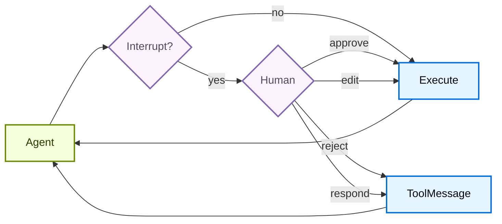

import HitlBasicConfigPy from '/snippets/python/code-samples/hitl-basic-config-py.mdx';
import HitlBasicConfigJs from '/snippets/python/code-samples/hitl-basic-config-js.mdx';
import HitlConditionalInterruptsPy from '/snippets/python/code-samples/hitl-conditional-interrupts-py.mdx';
import HitlDecisionTypesTable from '/snippets/python/oss/hitl-decision-types-table.mdx';

某些工具操作可能比较敏感，需要在执行前获得人工批准。Deep Agents 通过 LangGraph 的 interrupt 能力支持 human-in-the-loop 工作流。你可以使用 `interrupt_on` 参数配置哪些工具需要批准。设置 `interrupt_on` 后，`HumanInTheLoopMiddleware` 会被添加到 [Deep Agents 栈](/oss/python/deepagents/customization#deep-agents-stack)中。如果在工具返回结果之前运行被取消或中断，堆栈中的 [PatchToolCallsMiddleware](https://reference.langchain.com/python/deepagents/middleware/patch_tool_calls/PatchToolCallsMiddleware) 会自动修复消息历史。




## 基本配置

`interrupt_on` 参数接收一个字典，把工具名映射到 interrupt 配置。每个工具可以配置为：

- **`True`**：使用默认行为启用中断
  （允许 approve、edit、reject、respond）


- **`False`**：为这个工具禁用中断
- **`InterruptOnConfig`**：自定义配置。设置 `allowed_decisions` 来控制审核选项。
  在 Python 中，你还可以添加一个可选 `when` 谓词，只对特定调用中断（见[条件中断](#conditional-interrupts)）。


<HitlBasicConfigPy />


## 决策类型

`allowed_decisions` 列表控制人工在审查 tool call 时可以执行哪些动作：

<HitlDecisionTypesTable />

当人工拒绝某个拟执行动作时，使用 `reject`。只有当人工是在充当工具时才使用 `respond`，比如回答 `ask_user` 提示时。不要用 `respond` 来拒绝有副作用的工具，因为模型可能会把这条消息当成成功的 tool result。


<Tip>
在**编辑**工具参数时，请尽量保守。对原始参数做大幅修改，可能会让模型重新评估自己的方案，并可能多次执行该工具，或者做出意外动作。
</Tip>

你可以为每个工具自定义可用决策：

```python
interrupt_on = {
    # 敏感操作：允许所有选项
    "delete_file": {"allowed_decisions": ["approve", "edit", "reject"]},

    # 中等风险：只允许批准或拒绝
    "write_file": {"allowed_decisions": ["approve", "reject"]},

    # 必须批准（不允许拒绝）
    "critical_operation": {"allowed_decisions": ["approve"]},
}
```


## 条件中断

默认情况下，`interrupt_on` 中列出的每个 tool call 都会暂停等待审查。若只想让部分调用暂停，可以给某个工具的 `InterruptOnConfig` 添加 `when` 谓词。该谓词接收一个 [ToolCallRequest](https://reference.langchain.com/python/langgraph.prebuilt/tool_node/ToolCallRequest)，并返回 `True` 表示中断、`False` 表示自动批准，因此你可以根据工具参数进行拦截。

<Note>
条件中断需要 `langchain>=1.3.3`。
</Note>

<HitlConditionalInterruptsPy />

当 `when` 谓词返回 `False` 时，调用会直接执行，不会中断。返回 `True`，或者省略 `when` 时，调用都会像平常一样暂停。计算结果为 `False` 的调用不会加入 interrupt batch，因此审查者只会看到需要决策的动作。

更多配置选项和示例请参见 [LangChain human-in-the-loop documentation](/oss/python/langchain/human-in-the-loop#conditional-interrupts)。


## 处理 interrupts

当触发 interrupt 时，agent 会暂停执行并返回控制权。请在结果中检查 interrupts，并据此处理。如果用户拒绝某个动作，请提供清晰的 `message`，告诉 agent 该工具未执行，以及下一步应该做什么。

```python
from langchain_core.utils.uuid import uuid7
from langgraph.types import Command

# 创建包含 thread_id 的 config，用于状态持久化
config = {"configurable": {"thread_id": str(uuid7())}}

# 调用 agent
result = agent.invoke(
    {"messages": [{"role": "user", "content": "Delete the file temp.txt"}]},
    config=config
)

# 检查是否被中断
if result.get("__interrupt__"):  # [!code highlight]
    # 提取 interrupt 信息
    interrupt_value = result["__interrupt__"][0].value  # [!code highlight]
    action_requests = interrupt_value["action_requests"]
    review_configs = interrupt_value["review_configs"]

    # 从工具名创建 review config 查找表
    config_map = {cfg["action_name"]: cfg for cfg in review_configs}

    # 向用户展示待处理动作
    for action in action_requests:
        review_config = config_map[action["name"]]
        print(f"Tool: {action['name']}")
        print(f"Arguments: {action['args']}")
        print(f"Allowed decisions: {review_config['allowed_decisions']}")

    # 获取用户决策（与 action_request 一一对应，按顺序）
    decisions = [
        {
            "type": "reject",
            "message": "用户拒绝删除 temp.txt。不要重试删除。",
        }
    ]

    # 用决策恢复执行
    result = agent.invoke(
        Command(resume={"decisions": decisions}),
        config=config  # 必须使用同一个 config！
    )
```


## 处理流式传输中的 interrupts

对于实时 UI，请使用 `.stream()` 而不是 `.invoke()`，以便在处理 HITL interrupts 的同时显示 token 和工具调用进度。Interrupts 会以 `__interrupt__` 条目的形式出现在 `updates` 流中。流结束后，收集人工决策，并使用 `Command(resume=...)` 再次流式传输以恢复执行。

<Note>
对于典型的 `interrupt_on` HITL 暂停，请使用扁平的 `{"decisions": [...]}` 负载恢复，与 `.invoke()` 的形状相同。当同时有多个 interrupt 待处理时（例如并行分支），请改为把每个 interrupt ID 映射到它的恢复值。参见 [处理多个 interrupts](/oss/python/langgraph/interrupts#handling-multiple-interrupts)。
</Note>

```python
from langchain_core.utils.uuid import uuid7
from langgraph.types import Command

config = {"configurable": {"thread_id": str(uuid7())}}
stream_input = {"messages": [{"role": "user", "content": "Delete the file temp.txt"}]}

while True:
    pending_interrupt = None

    for mode, data in agent.stream(  # [!code highlight]
        stream_input,
        stream_mode=["messages", "updates"],  # [!code highlight]
        config=config,
    ):
        if mode == "messages":
            token, metadata = data
            # Display tokens in real time
            if token.content:
                print(token.content, end="", flush=True)

        elif mode == "updates" and isinstance(data, dict):
            if "__interrupt__" in data:  # [!code highlight]
                pending_interrupt = data["__interrupt__"][0]  # [!code highlight]

    # If no interrupt occurred, the agent finished
    if pending_interrupt is None:
        break

    interrupt_value = pending_interrupt.value
    action_requests = interrupt_value["action_requests"]
    review_configs = interrupt_value["review_configs"]
    config_map = {cfg["action_name"]: cfg for cfg in review_configs}

    for action in action_requests:
        review = config_map[action["name"]]
        print(f"\nTool: {action['name']}")
        print(f"Arguments: {action['args']}")
        print(f"Allowed: {review['allowed_decisions']}")

    # Collect one decision per action_request, in order
    decisions = [{"type": "approve"} for _ in action_requests]
    stream_input = Command(resume={"decisions": decisions})  # [!code highlight]

print()
```


<Tip>
组合 `"messages"` 和 `"updates"` 两种流模式，既能向用户实时展示 LLM token，又能捕获 HITL interrupts。`"messages"` 模式流式传输 token；`"updates"` 模式传递 interrupt 负载。
</Tip>

## 拒绝消息

当审查者返回 `reject` 决策时，Deep Agents 会跳过该 tool call，并把拒绝反馈发回给 agent。如果你省略 `message`，默认反馈会告诉模型该工具没有执行，并且除非用户要求，否则不要重试同一个 tool call。

对于敏感或有副作用的工具，请随决策提供一个领域相关的 `message`。要明确说明 agent 是应该放弃该动作、发起后续问题，还是尝试一个更安全的替代方案。

```python
decisions = [
    {
        "type": "reject",
        "message": "用户拒绝删除这个文件。不要重试删除。请改为询问要归档哪个文件。",
    }
]
```


## 编辑工具参数

当 `allowed_decisions` 中包含 `"edit"` 时，你可以在执行前修改工具参数：

```python
if result.get("__interrupt__"):  # [!code highlight]
    interrupt_value = result["__interrupt__"][0].value  # [!code highlight]
    action_request = interrupt_value["action_requests"][0]

    # 来自 agent 的原始参数
    print(action_request["args"])  # {"to": "everyone@company.com", ...}

    # 用户决定编辑收件人
    decisions = [{
        "type": "edit",
        "edited_action": {
            "name": action_request["name"],  # 必须包含工具名
            "args": {"to": "team@company.com", "subject": "...", "body": "..."}
        }
    }]

    result = agent.invoke(
        Command(resume={"decisions": decisions}),
        config=config
    )
```


## 子 agent interrupts

使用 subagent 时，你既可以在 [tool call 上](#interrupts-on-tool-calls) 使用 interrupts，也可以在 [tool 内部](#interrupts-within-tool-calls) 使用 interrupts。

### Tool call 上的 interrupts

每个 subagent 都可以有自己的 `interrupt_on` 配置，用来覆盖主 agent 的设置：

```python
agent = create_deep_agent(
    model="google_genai:gemini-3.5-flash",
    tools=[delete_file, read_file],
    interrupt_on={
        "delete_file": True,
        "read_file": False,
    },
    subagents=[{
        "name": "file-manager",
        "description": "Manages file operations",
        "system_prompt": "You are a file management assistant.",
        "tools": [delete_file, read_file],
        "interrupt_on": {
            # Override: require approval for reads in this subagent
            "delete_file": True,
            "read_file": True,  # Different from main agent!
        }
    }],
    checkpointer=checkpointer
)
```


当 subagent 触发 interrupt 时，处理方式相同：检查结果中的 `__interrupt__`，然后用 `Command` 恢复。

流式传输时，subagent interrupts 也会以 `__interrupt__` 条目的形式出现在父级的 `updates` 流中。interrupt 传递不需要 `subgraphs=True`。如果你还想流式传输 subagent 的 token 和进度事件，请启用 `subgraphs=True`。完整模式请参见 [处理流式传输中的 interrupts](#handle-interrupts-with-streaming)。

### Tool 内部的 interrupts

subagent 工具可以直接调用 `interrupt()` 来暂停执行并等待批准：

```python
from langchain.agents import create_agent
from langchain_anthropic import ChatAnthropic
from langchain.messages import HumanMessage
from langchain.tools import tool
from langgraph.checkpoint.memory import InMemorySaver
from langgraph.types import Command, interrupt

from deepagents.graph import create_deep_agent
from deepagents.middleware.subagents import CompiledSubAgent


@tool(description="Request human approval before proceeding with an action.")
def request_approval(action_description: str) -> str:
    """Request human approval using the interrupt() primitive."""
    # interrupt() 会暂停执行，并返回传给 Command(resume=...) 的值
    approval = interrupt({
        "type": "approval_request",
        "action": action_description,
        "message": f"Please approve or reject: {action_description}",
    })

    if approval.get("approved"):
        return f"Action '{action_description}' was APPROVED. Proceeding..."
    else:
        return f"Action '{action_description}' was REJECTED. Reason: {approval.get('reason', 'No reason provided')}"


def main():
    checkpointer = InMemorySaver()
    model = ChatAnthropic(
        model_name="claude-sonnet-4-6",
        max_tokens=4096,
    )

    compiled_subagent = create_agent(
        model=model,
        tools=[request_approval],
        name="approval-agent",
    )

    parent_agent = create_deep_agent(
        model="google_genai:gemini-3.5-flash",
        checkpointer=checkpointer,
        subagents=[
            CompiledSubAgent(
                name="approval-agent",
                description="An agent that can request approvals",
                runnable=compiled_subagent,
            )
        ],
    )

    thread_id = "test_interrupt_directly"
    config = {"configurable": {"thread_id": thread_id}}

    print("Invoking agent - sub-agent will use request_approval tool...")

    result = parent_agent.invoke(
        {
            "messages": [
                HumanMessage(
                    content="Use the task tool to launch the approval-agent sub-agent. "
                    "Tell it to use the request_approval tool to request approval for 'deploying to production'."
                )
            ]
        },
        config=config
    )

    # 检查是否有 interrupt
    if result.get("__interrupt__"):  # [!code highlight]
        interrupt_value = result["__interrupt__"][0].value  # [!code highlight]
        print(f"\nInterrupt received!")
        print(f"  Type: {interrupt_value.get('type')}")
        print(f"  Action: {interrupt_value.get('action')}")
        print(f"  Message: {interrupt_value.get('message')}")

        print("\nResuming with Command(resume={'approved': True})...")
        result2 = parent_agent.invoke(
            Command(resume={"approved": True}),
            config=config
        )

        if "__interrupt__" not in result2:  # [!code highlight]
            print("\nExecution completed!")
            # 查找 tool 返回值
            tool_msgs = [m for m in result2.get("messages", []) if m.type == "tool"]  # [!code highlight]
            if tool_msgs:
                print(f"  Tool result: {tool_msgs[-1].content}")
        else:
            print("\nAnother interrupt occurred")
    else:
        print("\n  No interrupt - the model may not have called request_approval")


if __name__ == "__main__":
    main()
```


## 多个 tool call

当 agent 调用多个需要批准的工具时，所有 interrupts 会一起打包进一个 interrupt。你必须按顺序为每个工具提供决策。

```python
config = {"configurable": {"thread_id": str(uuid7())}}

result = agent.invoke(
    {"messages": [{
        "role": "user",
        "content": "Delete temp.txt and send an email to admin@example.com"
    }]},
    config=config
)

if result.get("__interrupt__"):  # [!code highlight]
    interrupt_value = result["__interrupt__"][0].value  # [!code highlight]
    action_requests = interrupt_value["action_requests"]

    # 需要批准两个工具
    assert len(action_requests) == 2

    # 按 action_requests 的顺序提供决策
    decisions = [
        {"type": "approve"},  # 第一个工具：delete_file
        {
            "type": "reject",
            "message": "用户拒绝该动作。不要重试这个 tool call。",
        }  # 第二个工具：send_email
    ]

    result = agent.invoke(
        Command(resume={"decisions": decisions}),
        config=config
    )
```

---

<div className="source-links">
<Callout icon="terminal-2">
    [Connect these docs](/use-these-docs) to your agent of choice via MCP for real-time answers.
</Callout>
<Callout icon="edit">
    [Edit this page on GitHub](https://github.com/langchain-ai/docs/edit/main/src/oss/deepagents/human-in-the-loop.mdx) or [file an issue](https://github.com/langchain-ai/docs/issues/new/choose).
</Callout>
</div>
