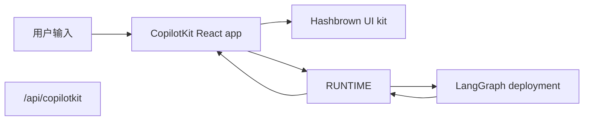

[CopilotKit](https://www.copilotkit.ai/) 提供了完整的 React chat runtime，特别适合与 LangGraph 搭配使用，尤其是在你希望 agent 返回 **结构化 UI payload**，而不仅仅是纯文本的时候。前端与一个 CopilotKit runtime URL 通信，并把 assistant messages 解析成动态 React 组件。


在这种模式下，你的 LangGraph 部署提供 graph API 和一个 AG-UI FastAPI bridge。一个小的 Node CopilotKit runtime 位于该 bridge 前面，是 React 客户端实际调用的对象。


在服务端，[copilotkit](https://pypi.org/project/copilotkit/) 包提供 [`CopilotKitMiddleware`](https://docs.copilotkit.ai)，因此 LangGraph graph、LangChain agent 或 [Deep Agent](/oss/python/deepagents/overview) 都可以说 [Agent UI (AG-UI)](https://docs.ag-ui.com/) wire protocol，向 chat UI 流式发送 tool 和 message 事件，并读写共享的 **CopilotKit** 状态片段，同时还附带工具来在 graph 前面挂载兼容 CopilotKit 的 HTTP endpoint。TypeScript 方案通常把 CopilotKit runtime 挂在 graph API 旁边。Python 方案在部署上挂载 AG-UI FastAPI bridge，并在它前面用 Node 运行 CopilotKit runtime。

这种方式适合以下场景：

- 想要一个现成的 chat runtime，而不是自己手动把 `stream.messages` 串起来
- 想要一个自定义服务端 endpoint，在已部署 graph 旁边叠加 provider-specific 行为
- 想要从受限组件注册表中渲染结构化生成式 UI

[CopilotKit for LangGraph](https://docs.copilotkit.ai/langgraph) 还记录了基于同一 middleware 和 clients 的 [generative UI](https://docs.copilotkit.ai/langgraph/generative-ui)、[human in the loop](https://docs.copilotkit.ai/langgraph/human-in-the-loop)（HITL）以及 [shared state](https://docs.copilotkit.ai/langgraph/shared-state)。

<Info>
  关于 CopilotKit 专属 API、UI 模式和运行时配置，请查看
  [CopilotKit docs](https://docs.copilotkit.ai/langgraph)。如果你想看 Deep Agent 的讲解，请查看
  CopilotKit 文档中的 [Deep Agents and CopilotKit](https://docs.copilotkit.ai/langgraph/deep-agents)。
</Info>

import { ExampleEmbed } from "/snippets/example-embed.jsx"
import ChannelsTsconfig from "/snippets/python/code-samples/copilotkit-channels-tsconfig.mdx"
import ChannelsAgent from "/snippets/python/code-samples/copilotkit-channels-agent-js.mdx"
import ChannelsChannel from "/snippets/python/code-samples/copilotkit-channels-channel-js.mdx"

<ExampleEmbed example="copilotkit" minHeight={700} />

## 工作原理

从高层看，CopilotKit 夹在你的 React 应用和 LangGraph 部署之间。


前端把会话状态发送到一个 Node CopilotKit runtime。该 runtime 调用你 LangGraph 部署上的 AG-UI FastAPI bridge，响应则同时带回 assistant messages 和组件注册表可以渲染的结构化 UI payload。

1. **正常部署 graph**，使用 LangSmith 或 LangGraph 开发服务器。
2. **用 HTTP app 扩展部署**，在 graph API 旁边挂载 AG-UI FastAPI bridge。
3. **运行一个 Node CopilotKit runtime**，把一个 `HttpAgent` 指向该 bridge，然后用 `CopilotKit` 包裹前端并指向该 runtime URL。
4. **注册动态 UI 组件**，并在渲染时把 assistant responses 解析成这些组件。




在 Python 中，CopilotKit runtime 是一个独立的 Node 进程。LangGraph 部署只托管 graph API 和 AG-UI FastAPI bridge。参见[添加 CopilotKit runtime](#add-the-copilotkit-runtime)。


## 你在 Python 服务端能得到什么

[copilotkit](https://pypi.org/project/copilotkit/) 及相关包负责桥接 LangGraph deployment 和 CopilotKit clients。

| 组件 | 作用 |
| --------- | ---- |
| `CopilotKitMiddleware` | 把 CopilotKit 和 AG-UI 状态、请求合并进你的 agent，包括前端 [tool calls](/oss/python/langchain/agents#tools) 和上下文。把它加到 [create_agent](https://reference.langchain.com/python/langchain/agents/factory/create_agent) 或 [create_deep_agent](https://reference.langchain.com/python/deepagents/graph/create_deep_agent) 的 `middleware` 列表里。 |
| `CopilotKitState`（子类） | [自定义状态](/oss/python/langchain/short-term-memory)：扩展 `CopilotKitState`，把 CopilotKit key 放进 graph state。 |
| `LangGraphAGUIAgent` | 把一个编译后的 graph 打包成一个 runtime 可用的 name 和 description。 |
| `add_langgraph_fastapi_endpoint`（来自 [ag-ui-langgraph](https://pypi.org/project/ag-ui-langgraph/)） | 在与你的 graph 相同的 [LangGraph](/oss/python/langgraph/overview) 进程上连接一个 **FastAPI** AG-UI bridge。通过在 `langgraph.json` 中添加 [custom `http` app](#extend-the-langgraph-deployment-with-a-custom-endpoint) 来挂载它。React 客户端仍然需要一个独立的 Node [CopilotKit runtime](#add-the-copilotkit-runtime)，通过 AG-UI 调用这个 bridge。 |

`CopilotKitMiddleware` 对于 [create_deep_agent](https://reference.langchain.com/python/deepagents/graph/create_deep_agent) 和通过 [create_agent](https://reference.langchain.com/python/langchain/agents/factory/create_agent) 创建、并把它加入 `middleware` 列表的 graph 来说是同一个 middleware。对于带 `CopilotKitState` 和 FastAPI bridge 的 `create_agent` graph，请参考下面的 [Python `main.py` 示例](#extend-the-langgraph-deployment-with-a-custom-endpoint)。结构化生成式 UI（例如客户端的 `useAgentContext` 和 `output_schema`）还需要额外的 middleware，把 Copilot state 映射成 [structured output](/oss/python/langchain/agents#structured-output) 策略，和同一节里可展开的 `src/middleware.py` 示例一样。

把 `app` 挂到 `langgraph.json` 的 `http` key 上，遵循的就是通常的 [LangGraph or LangSmith deployment](/oss/python/langgraph/deploy) 方式：一个进程同时服务 graph API 和 AG-UI FastAPI bridge。CopilotKit React 客户端与 Node runtime 通信，由后者调用这个 bridge。


## 安装

对于后端 endpoint：


```bash
uv add copilotkit ag-ui-langgraph fastapi uvicorn
```

middleware 包与 Deep Agents stack 一起使用。请把它和你的 [chat model](/oss/python/integrations/chat) 包一起安装（这个示例使用 OpenAI）：

<CodeGroup>
```python pip
pip install -U deepagents copilotkit langchain-openai
```

```python uv
uv add deepagents copilotkit langchain-openai
```
</CodeGroup>

前端调用的 CopilotKit runtime 是一个 Node 包，因此 Python 方案还需要一个小的 Node server。下面的版本是一个已知可用的配套组合。如果你升级 `@copilotkit/runtime`，请安装该版本列为依赖的 `@ag-ui/client` 版本，以便 `HttpAgent` 类型匹配：

```bash
bun add @copilotkit/runtime@1.73.3 @ag-ui/client@0.0.59
```


对于前端 app：

```bash
bun add @copilotkit/react-core @copilotkit/react-ui @hashbrownai/core @hashbrownai/react
```

## 在 Deep Agent 中使用 CopilotKit

把 `CopilotKitMiddleware` 加到你传给 [create_deep_agent](https://reference.langchain.com/python/deepagents/graph/create_deep_agent) 的 `middleware` 列表里。这个 middleware 让 CopilotKit 可以路由前端 tool calls，并把 chat state 和你的 graph 对齐。把你配置的其他 [middleware](/oss/python/deepagents/customization#middleware) 也放在同一个列表里。

编译后的 graph 就可以接到支持 CopilotKit 或 AG-UI 的进程里，例如下面的 [FastAPI 模式](#extend-the-langgraph-deployment-with-a-custom-endpoint)，或者 CopilotKit 文档中的 [Deep Agents and CopilotKit](https://docs.copilotkit.ai/langgraph/deep-agents) 这类指南。如果你把它列在 `langgraph.json` 的 `graphs` 下，就不要在导出的 agent 上传入 checkpointer。下面的 [FastAPI 示例](#extend-the-langgraph-deployment-with-a-custom-endpoint)只在 AG-UI route 副本上附加 checkpointer。

```python
from deepagents import create_deep_agent
from copilotkit import CopilotKitMiddleware


def get_weather(location: str) -> str:
    """Return a simple weather string for a location."""
    return f"The weather in {location} is sunny."


agent = create_deep_agent(
    model="openai:gpt-5.5",
    tools=[get_weather],
    middleware=[CopilotKitMiddleware()],  # AG-UI、frontend tools 和 context
    system_prompt="You are a helpful research assistant.",
)
```


## 通过自定义 endpoint 扩展 LangGraph 部署

关键点在于，LangGraph deployment 不只是服务 graph。它也可以加载 HTTP app，这样你就能在 deployment 旁边挂载额外 route。

在 `langgraph.json` 中，把 `http.app` 指向你的自定义 app 入口：


```json
{
  "dependencies": ["."],
  "graphs": {
    "copilotkit_shadify": "./main.py:agent"
  },
  "http": {
    "app": "./main.py:app"
  }
}
```


在 Python 中，创建一个 `FastAPI` app，并通过 CopilotKit 的 AG-UI bridge 暴露 LangGraph agent：

```python main.py
from typing import Any, TypedDict

from ag_ui_langgraph import add_langgraph_fastapi_endpoint
from copilotkit import CopilotKitMiddleware, CopilotKitState, LangGraphAGUIAgent
from fastapi import FastAPI
from langchain.agents import create_agent
from langgraph.checkpoint.memory import MemorySaver

from src.middleware import apply_structured_output_schema, normalize_context


class AgentState(CopilotKitState):
    pass


class AgentContext(TypedDict, total=False):
    output_schema: dict[str, Any]


agent = create_agent(
    model="openai:gpt-5.5",
    middleware=[
        normalize_context,
        CopilotKitMiddleware(),
        apply_structured_output_schema,
    ],
    context_schema=AgentContext,
    state_schema=AgentState,
    system_prompt=(
        "You are a helpful UI assistant. Build visual responses using the "
        "available components."
    ),
)

app = FastAPI()

add_langgraph_fastapi_endpoint(
    app=app,
    agent=LangGraphAGUIAgent(
        name="copilotkit_shadify",
        description="A UI assistant that returns structured component payloads.",
        # AG-UI bridge 会读取 graph state，所以这个 route 需要 checkpointer。
        graph=agent.copy(update={"checkpointer": MemorySaver()}),
    ),
    path="/",
)
```

AG-UI bridge 在每次运行时都会读取 graph 的 state，因此 FastAPI route 背后的 graph 需要 checkpointer。请把 checkpointer 从 `agent` 本身上移除：`agent` 也会列在 `graphs` 下，而 `langgraph dev` 拒绝加载自带 checkpointer 的已列 graph，因为 LangGraph API 会为已列 graph 处理持久化。带 `MemorySaver` 的副本只服务于 FastAPI route。它的 thread 保存在进程内存中，因此不会在重启后保留，不会跨副本共享，也不会出现在部署的 threads API 中。对于这个 route 上的生产流量，请改用持久的 [checkpointer](/oss/python/langgraph/persistence)。


这个自定义 app 是最重要的扩展点：它会挂载 AG-UI FastAPI bridge，而不会替换底层的 LangGraph deployment。Node CopilotKit runtime 保持独立；参见[添加 CopilotKit runtime](#add-the-copilotkit-runtime)。


在 Python 中，等价的工作发生在 middleware 里：先规范化 CopilotKit context，再把 `useAgentContext(...)` 里的 `output_schema` 传给模型的结构化输出配置。Hashbrown 生成的 schema 没有顶层 `title`，而 OpenAI integration 需要一个 `title` 来命名结构化输出 schema，因此 middleware 会在缺失时补上 `title` 和 `description`。

```python expandable src/middleware.py
import json
from collections.abc import Mapping

from langchain.agents.middleware import before_agent, wrap_model_call
from langchain.agents.structured_output import ProviderStrategy


@wrap_model_call
async def apply_structured_output_schema(request, handler):
    schema = None
    runtime = getattr(request, "runtime", None)
    runtime_context = getattr(runtime, "context", None)

    if isinstance(runtime_context, Mapping):
        schema = runtime_context.get("output_schema")

    if schema is None and isinstance(getattr(request, "state", None), dict):
        copilot_context = request.state.get("copilotkit", {}).get("context")
        if isinstance(copilot_context, list):
            for item in copilot_context:
                if isinstance(item, dict) and item.get("description") == "output_schema":
                    schema = item.get("value")
                    break

    if isinstance(schema, str):
        try:
            schema = json.loads(schema)
        except json.JSONDecodeError:
            schema = None

    if isinstance(schema, dict):
        # OpenAI 使用顶层 title 作为结构化输出的名称。
        schema = {
            **schema,
            "title": schema.get("title") or "CopilotKitStructuredOutput",
            "description": schema.get("description")
            or "Structured response schema for the CopilotKit preview.",
        }
        request = request.override(
            response_format=ProviderStrategy(schema=schema, strict=True),
        )

    return await handler(request)


@before_agent
def normalize_context(state, runtime):
    copilotkit_state = state.get("copilotkit", {})
    context = copilotkit_state.get("context")

    if isinstance(context, list):
        normalized = [
            item.model_dump() if hasattr(item, "model_dump") else item
            for item in context
        ]
        return {"copilotkit": {**copilotkit_state, "context": normalized}}

    return None
```


这样就把职责拆开了：

- LangGraph 仍然负责 graph 执行和持久化
- CopilotKit 负责面向聊天的 runtime contract
- 你的自定义 endpoint 把两者粘合在同一个部署里

### 添加 CopilotKit runtime

FastAPI route 说的是 AG-UI 协议，而不是 CopilotKit runtime 协议，因此前端无法直接调用它：把 `runtimeUrl` 指向 FastAPI route 会失败并报 `runtime_info_fetch_failed`。请在一个小的 Node server 中运行 [CopilotKit runtime](https://docs.copilotkit.ai/langgraph)，并把一个 `HttpAgent` 指向 FastAPI route。Python graph 和 middleware 仍然负责定义 tool 行为和 agent 逻辑。

```ts server.ts
import { createServer } from "node:http";

import { HttpAgent } from "@ag-ui/client";
import { CopilotRuntime } from "@copilotkit/runtime/v2";
import { createCopilotNodeListener } from "@copilotkit/runtime/v2/node";

// The FastAPI route is mounted at the root of the LangGraph deployment.
const agentUrl = process.env.LANGGRAPH_DEPLOYMENT_URL || "http://127.0.0.1:2024";

const runtime = new CopilotRuntime({
  agents: {
    default: new HttpAgent({ url: agentUrl }),
  },
});

createServer(
  createCopilotNodeListener({
    runtime,
    basePath: "/api/copilotkit",
    cors: true,
  }),
).listen(4000);
```

在 LangGraph 部署旁边启动该 runtime：

```bash
bun server.ts
```

该 runtime 在端口 4000 上服务 `/api/copilotkit`。把前端指向它，可以设置 `VITE_RUNTIME_URL=http://localhost:4000/api/copilotkit`，或者在开发服务器中把 `/api/copilotkit` 代理到端口 4000。

这个 runtime 是基础的应用内集成。[Channels](#channels) 不使用 FastAPI route：它通过部署的 graph API 使用 `LangGraphAgent` 连接到 graph。


## 组织前端 app

在前端，用 `CopilotKit` 包裹你的 app，并把它指向自定义 runtime URL：

```tsx
import { CopilotKit } from "@copilotkit/react-core";
import { CopilotChat, useAgentContext } from "@copilotkit/react-core/v2";
import { s } from "@hashbrownai/core";

import { useChatKit } from "@/components/chat/chat-kit";
import { chatTheme } from "@/lib/chat-theme";

export function App() {
  return (
    <CopilotKit runtimeUrl={import.meta.env.VITE_RUNTIME_URL ?? "/api/copilotkit"}>
      <Page />
    </CopilotKit>
  );
}

function Page() {
  const chatKit = useChatKit();

  useAgentContext({
    description: "output_schema",
    value: s.toJsonSchema(chatKit.schema),
  });

  return <CopilotChat {...chatTheme} />;
}
```

这里有两个关键点：

- `runtimeUrl="/api/copilotkit"` 会把 chat 发到你的自定义后端 route，而不是直接发给原始 LangGraph API
- `useAgentContext(...)` 会把 UI schema 发送给 agent，这样模型就知道它应该生成什么结构化输出格式

## 注册动态组件

组件注册表位于 `useChatKit()` 中。你要在这里定义 agent 允许生成的组件集合，例如 cards、rows、columns、charts、code blocks 和 buttons。

```tsx
import { s } from "@hashbrownai/core";
import { exposeComponent, exposeMarkdown, useUiKit } from "@hashbrownai/react";

import { Button } from "@/components/ui/button";
import { Card } from "@/components/ui/card";
import { CodeBlock } from "@/components/ui/code-block";
import { Row, Column } from "@/components/ui/layout";
import { SimpleChart } from "@/components/ui/simple-chart";

export function useChatKit() {
  return useUiKit({
    components: [
      exposeMarkdown(),
      exposeComponent(Card, {
        name: "card",
        description: "Card to wrap generative UI content.",
        children: "any",
      }),
      exposeComponent(Row, {
        name: "row",
        props: {
          gap: s.string("Tailwind gap size") as never,
        },
        children: "any",
      }),
      exposeComponent(Column, {
        name: "column",
        children: "any",
      }),
      exposeComponent(SimpleChart, {
        name: "chart",
        props: {
          labels: s.array("Category labels", s.string("A label")),
          values: s.array("Numeric values", s.number("A value")),
        },
        children: false,
      }),
      exposeComponent(CodeBlock, {
        name: "code_block",
        props: {
          code: s.streaming.string("The code to display"),
          language: s.string("Programming language") as never,
        },
        children: false,
      }),
      exposeComponent(Button, {
        name: "button",
        children: "text",
      }),
    ],
  });
}
```

这个注册表就是 agent 和 UI 之间的契约。模型不是在生成任意 JSX，而是在生成必须通过你暴露出来的组件和 props 校验的结构化数据。

## 把 assistant messages 渲染为动态 UI

assistant response 到达后，自定义 message renderer 会决定如何展示它。这个示例里：

- assistant messages 会被按 UI kit schema 解析为结构化 JSON
- 合法的结构化输出会被渲染成真正的 React 组件
- user messages 则继续显示为普通 chat bubble

```tsx
import type { AssistantMessage } from "@ag-ui/core";
import type { RenderMessageProps } from "@copilotkit/react-ui";
import { useJsonParser } from "@hashbrownai/react";
import { memo } from "react";

import { useChatKit } from "@/components/chat/chat-kit";
import { Squircle } from "@/components/squircle";

const AssistantMessageRenderer = memo(function AssistantMessageRenderer({
  message,
}: {
  message: AssistantMessage;
}) {
  const kit = useChatKit();
  const { value } = useJsonParser(message.content ?? "", kit.schema);

  if (!value) return null;

  return (
    <div className="group/msg mt-2 flex w-full justify-start">
      <div className="magic-text-output w-full px-1 py-1">{kit.render(value)}</div>
    </div>
  );
});

export function CustomMessageRenderer({ message }: RenderMessageProps) {
  if (message.role === "assistant") {
    return <AssistantMessageRenderer message={message} />;
  }

  return (
    <div className="flex w-full justify-end">
      <Squircle className="w-full max-w-[64ch] px-4 py-3">
        <pre>{typeof message.content === "string" ? message.content : JSON.stringify(message.content, null, 2)}</pre>
      </Squircle>
    </div>
  );
}
```

这个 renderer 模式正是让集成体验像原生应用的原因：

- CopilotKit 负责 chat state 和 transport
- 自定义 renderer 负责把 assistant payload 变成 UI
- [Hashbrown](https://hashbrown.dev/) 把经过校验的结构化数据变成具体的 React elements

## Channels

驱动应用内 copilot 的同一个 agent，也可以作为 bot 运行在 Slack 及其他消息平台上。[CopilotKit Channels](https://docs.copilotkit.ai/channels) 通过一个托管的 CopilotKit Intelligence 连接，把你的 LangChain agent 接入消息平台：Intelligence 负责保管平台凭证和消息投递，而你的进程负责运行 agent。

<Note>
  Channels 要求 `@copilotkit/channels` 0.6.1 和 `@copilotkit/runtime` 1.65.0，两者需要作为经过测试的配套版本一起安装，宿主机还需要 Node.js 22 或更高版本。Channel 连接的 LangChain 部署可以是 Python，也可以是 TypeScript。
</Note>

<Info>
  本页说明 Channels 如何与 LangChain agent 配合。关于 LangGraph 后端的完整 Slack 实操指南，请参见 [Connect and run your agent in Slack](https://docs.copilotkit.ai/slack/langgraph-typescript/connect)。关于其他 agent 后端和平台支持情况，请参见 [Channels overview](https://docs.copilotkit.ai/channels)。
</Info>

### 整体如何协作

CopilotKit Intelligence 持有平台连接（Slack、Microsoft Teams 等）及其凭证；你的长期运行的 Channels listener 持有 agent、工具和应用逻辑。每一轮对话都遵循相同的路径：

1. 用户在 Slack 里给你的应用发消息。
2. Intelligence 使用为该 Channel 配置的凭证接收平台事件。
3. 一条持久的 Intelligence 网关连接把这一轮对话投递给你的 Channels listener。
4. listener 通过 [AG-UI](https://docs.ag-ui.com/) 运行你的 LangChain agent 并渲染回复。
5. Intelligence 以原生 Slack Block Kit 的形式返回结果。

平台凭证永远不会进入 agent 进程。在 [CopilotKit Intelligence](https://docs.copilotkit.ai/slack/intelligence) 中创建一个托管 Channel 并连接 Slack：Intelligence 会保存 Slack 凭证，并提供 **Channel code**（`CHANNEL_CODE`）和项目作用域的 **Intelligence API key**（`INTELLIGENCE_API_KEY`）给 listener 使用。

### 安装

先安装经过测试的 SDK 配对版本，再安装 TypeScript 工具链：

<CodeGroup>
```bash npm
npm install --save-exact @copilotkit/channels@0.6.1 @copilotkit/runtime@1.65.0
npm install -D tsx typescript @types/node
```

```bash pnpm
pnpm add --save-exact @copilotkit/channels@0.6.1 @copilotkit/runtime@1.65.0
pnpm add -D tsx typescript @types/node
```

```bash yarn
yarn add --exact @copilotkit/channels@0.6.1 @copilotkit/runtime@1.65.0
yarn add -D tsx typescript @types/node
```
</CodeGroup>

使用 NodeNext 的 TypeScript 配置：

<ChannelsTsconfig />

### 连接你的 LangChain agent

每个会话都返回一个全新的 agent，并按 thread 区分，避免状态在 Slack thread 之间泄漏。LangGraph Server 使用 LangGraph API 协议，所以要使用 `@copilotkit/runtime/langgraph` 中的 `LangGraphAgent`，而不是 `HttpAgent`。把它指向你[已经在运行的 deployment](#extend-the-langgraph-deployment-with-a-custom-endpoint)：

<ChannelsAgent />

### 运行 Channel listener

使用 Intelligence 给出的 `Code` 声明 Channel，并把每条消息转发给 agent。创建 Node listener 这一步就是连接 Channel 的动作。在创建 listener 之前先注册进程退出清理逻辑，这样在连接窗口期间按下 Ctrl-C 也能干净地停止 Channel。

<ChannelsChannel />

设置运行时密钥，然后启动进程：

```bash .env
INTELLIGENCE_API_KEY=<project-api-key>
CHANNEL_CODE=support-slack
LANGGRAPH_DEPLOYMENT_URL=http://127.0.0.1:2024
PORT=3000
```

```bash Terminal
node --env-file=.env --import tsx channel.ts
```

进程连接成功后，Intelligence 中的 Channel 会从 **Waiting for runtime** 转为 **Online**。

### 其他平台

托管的 Slack 已正式可用。托管的 Teams 是受控的集成目标。Channels SDK 还为 Teams、Discord、Telegram 和 WhatsApp 提供直连适配器。当前支持的平台列表和各平台的配置方法，请参见 [Channels overview](https://docs.copilotkit.ai/slack)。

## 资源

- [Deep Agents and CopilotKit](https://docs.copilotkit.ai/langgraph/deep-agents) in the CopilotKit documentation - 端到端 Next.js、dev server 和 **Deep Agent** 路线
- [CopilotKit: LangGraph features](https://docs.copilotkit.ai/langgraph) - generative UI、HITL、shared state
- [LangGraph deployment](/oss/python/langgraph/deploy) - 生产环境和开发服务器

## 最佳实践

- **保持 custom endpoint 轻薄**：它用来适配 CopilotKit 与 graph deployment，而不是重复实现已经在 graph 里的业务逻辑
- **显式发送 schema**：`useAgentContext` 应当在页面挂载时就描述 UI contract
- **注册受限的组件集合**：只暴露你真正希望模型使用的组件和 props
- **把渲染当成解析步骤**：先把 assistant content 按你的 schema 解析，再进行渲染
- **让 user messages 保持普通文本**：只有 assistant messages 需要结构化 renderer；user messages 可以维持普通 chat bubble

---

<div className="source-links">
<Callout icon="terminal-2">
    [Connect these docs](/use-these-docs) to your agent of choice via MCP for real-time answers.
</Callout>
<Callout icon="edit">
    [Edit this page on GitHub](https://github.com/langchain-ai/docs/edit/main/src/oss/langchain/frontend/integrations/copilotkit.mdx) or [file an issue](https://github.com/langchain-ai/docs/issues/new/choose).
</Callout>
</div>
