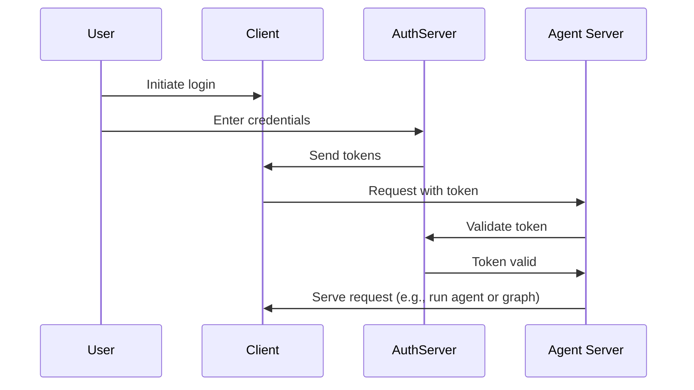

在[上一篇教程](/langsmith/resource-auth)中，你已经添加了资源授权，让用户拥有私密对话。不过，你仍然在使用硬编码令牌进行身份验证，这并不安全。现在，你将使用 [OAuth2](/langsmith/deployment-quickstart) 和真实用户账户来替换这些令牌。

你会继续使用相同的 @[`Auth`][Auth] 对象和[资源级访问控制](/langsmith/auth#single-owner-resources)，但将身份验证升级为使用 Supabase 作为身份提供商。虽然本教程使用 Supabase，但其中的概念适用于任意 OAuth2 提供商。你将学会：

1. 用真实 JWT 令牌替换测试令牌
2. 集成 OAuth2 提供商，实现安全的用户身份验证
3. 在保留现有授权逻辑的同时，处理用户会话和元数据

## 背景

OAuth2 包含三个主要角色：

1. **授权服务器**：身份提供商，例如 Supabase、Auth0、Google，负责处理用户身份验证并签发令牌
2. **应用后端**：你的 LangGraph 应用，负责校验令牌并提供受保护资源，对话数据也在此处提供
3. **客户端应用**：用户与你的服务交互的 Web 或移动应用

标准的 OAuth2 流程大致如下：



## 前置条件

开始本教程前，请确保你已经具备：

* 能够无报错运行[第二篇教程中的机器人](/langsmith/resource-auth)
* 一个可用作身份验证服务器的 [Supabase 项目](https://supabase.com/dashboard)

## 1. 安装依赖

安装所需依赖。从你的 `custom-auth` 目录开始，并确保已经安装 `langgraph-cli`：

<CodeGroup>
```bash pip
cd custom-auth
pip install -U "langgraph-cli[inmem]"
```

```bash uv
cd custom-auth
uv add "langgraph-cli[inmem]"
```
</CodeGroup>

<a id="setup-auth-provider"></a>
## 2. 设置身份验证提供商

接下来，获取身份验证服务器的 URL，以及用于身份验证的私钥。
由于这里使用 Supabase，你可以在 Supabase 仪表板中完成这些步骤：

1. 在左侧边栏点击 t️⚙ Project Settings"，然后点击 "API"
2. 复制项目 URL，并将其加入 `.env` 文件
  ```shell
  echo "SUPABASE_URL=your-project-url" >> .env
  ```
3. 复制 service role secret key，并将其加入 `.env` 文件：
  ```shell
  echo "SUPABASE_SERVICE_KEY=your-service-role-key" >> .env
  ```
4. 复制你的 "anon public" key，并记下来。稍后配置客户端代码时会用到它。
  ```bash
  SUPABASE_URL=your-project-url
  SUPABASE_SERVICE_KEY=your-service-role-key
  ```

## 3. 实现令牌校验

在前两篇教程中，你已经使用 @[`Auth`][Auth] 对象来[校验硬编码令牌](/langsmith/set-up-custom-auth)，并[添加资源归属信息](/langsmith/resource-auth)。

现在，你将升级身份验证流程，改为校验来自 Supabase 的真实 JWT 令牌。主要改动都会落在带有 @[`@auth.authenticate`][Auth.authenticate] 装饰器的函数中：

* 不再针对硬编码令牌列表做校验，而是向 Supabase 发起 HTTP 请求来验证令牌。
* 从已验证的令牌中提取真实用户信息，例如 ID 和邮箱。
* 现有的资源授权逻辑保持不变。

更新 `src/security/auth.py`，实现如下：

```python {highlight={8-9,20-30}} title="src/security/auth.py"
import os
import httpx
from langgraph_sdk import Auth

auth = Auth()

# This is loaded from the `.env` file you created above
SUPABASE_URL = os.environ["SUPABASE_URL"]
SUPABASE_SERVICE_KEY = os.environ["SUPABASE_SERVICE_KEY"]


@auth.authenticate
async def get_current_user(authorization: str | None):
    """Validate JWT tokens and extract user information."""
    assert authorization
    scheme, token = authorization.split()
    assert scheme.lower() == "bearer"

    try:
        # Verify token with auth provider
        async with httpx.AsyncClient() as client:
            response = await client.get(
                f"{SUPABASE_URL}/auth/v1/user",
                headers={
                    "Authorization": authorization,
                    "apiKey": SUPABASE_SERVICE_KEY,
                },
            )
            assert response.status_code == 200
            user = response.json()
            return {
                "identity": user["id"],  # Unique user identifier
                "email": user["email"],
                "is_authenticated": True,
            }
    except Exception as e:
        raise Auth.exceptions.HTTPException(status_code=401, detail=str(e))

# ... the rest is the same as before

# Keep our resource authorization from the previous tutorial
@auth.on
async def add_owner(ctx, value):
    """Make resources private to their creator using resource metadata."""
    filters = {"owner": ctx.user.identity}
    metadata = value.setdefault("metadata", {})
    metadata.update(filters)
    return filters
```

最重要的变化是，我们现在会借助真实身份验证服务器来校验令牌。身份验证处理器持有 Supabase 项目的私钥，因此可以用它来校验用户令牌并提取用户信息。

## 4. 测试身份验证流程

下面来测试新的身份验证流程。你可以在文件或 notebook 中运行以下代码。你需要提供：

* 一个有效邮箱地址
* 一个 Supabase 项目 URL，见[上文](#setup-auth-provider)
* 一个 Supabase anon **public key**，也见[上文](#setup-auth-provider)

```python
import os
import httpx
from getpass import getpass
from langgraph_sdk import get_client


# Get email from command line
email = getpass("Enter your email: ")
base_email = email.split("@")
password = "secure-password"  # CHANGEME
email1 = f"{base_email[0]}+1@{base_email[1]}"
email2 = f"{base_email[0]}+2@{base_email[1]}"

SUPABASE_URL = os.environ.get("SUPABASE_URL")
if not SUPABASE_URL:
    SUPABASE_URL = getpass("Enter your Supabase project URL: ")

# This is your PUBLIC anon key (which is safe to use client-side)
# Do NOT mistake this for the secret service role key
SUPABASE_ANON_KEY = os.environ.get("SUPABASE_ANON_KEY")
if not SUPABASE_ANON_KEY:
    SUPABASE_ANON_KEY = getpass("Enter your public Supabase anon  key: ")


async def sign_up(email: str, password: str):
    """Create a new user account."""
    async with httpx.AsyncClient() as client:
        response = await client.post(
            f"{SUPABASE_URL}/auth/v1/signup",
            json={"email": email, "password": password},
            headers={"apiKey": SUPABASE_ANON_KEY},
        )
        assert response.status_code == 200
        return response.json()

# Create two test users
print(f"Creating test users: {email1} and {email2}")
await sign_up(email1, password)
await sign_up(email2, password)
```

⚠️ 继续之前：检查你的邮箱，并点击两封确认邮件中的链接。只有在确认邮箱之后，Supabase 才会接受 `/login` 请求。

接着测试用户是否只能看到自己的数据。继续之前，请确认服务器已经在运行，运行 `langgraph dev` 即可。下面这段代码需要你在[设置身份验证提供商](#setup-auth-provider)时从 Supabase 仪表板复制的 "anon public" key。

```python
async def login(email: str, password: str):
    """Get an access token for an existing user."""
    async with httpx.AsyncClient() as client:
        response = await client.post(
            f"{SUPABASE_URL}/auth/v1/token?grant_type=password",
            json={
                "email": email,
                "password": password
            },
            headers={
                "apikey": SUPABASE_ANON_KEY,
                "Content-Type": "application/json"
            },
        )
        assert response.status_code == 200
        return response.json()["access_token"]

# Log in as user 1
user1_token = await login(email1, password)
user1_client = get_client(
    url="http://localhost:2024", headers={"Authorization": f"Bearer {user1_token}"}
)

# Create a thread as user 1
thread = await user1_client.threads.create()
print(f"✅ User 1 created thread: {thread['thread_id']}")

# Try to access without a token
unauthenticated_client = get_client(url="http://localhost:2024")
try:
    await unauthenticated_client.threads.create()
    print("❌ Unauthenticated access should fail!")
except Exception as e:
    print("✅ Unauthenticated access blocked:", e)

# Try to access user 1's thread as user 2
user2_token = await login(email2, password)
user2_client = get_client(
    url="http://localhost:2024", headers={"Authorization": f"Bearer {user2_token}"}
)

try:
    await user2_client.threads.get(thread["thread_id"])
    print("❌ User 2 shouldn't see User 1's thread!")
except Exception as e:
    print("✅ User 2 blocked from User 1's thread:", e)
```

输出应该类似于：

```shell
✅ User 1 created thread: d6af3754-95df-4176-aa10-dbd8dca40f1a
✅ Unauthenticated access blocked: Client error '403 Forbidden' for url 'http://localhost:2024/threads'
✅ User 2 blocked from User 1's thread: Client error '404 Not Found' for url 'http://localhost:2024/threads/d6af3754-95df-4176-aa10-dbd8dca40f1a'
```

此时，身份验证与授权已经协同工作：

1. 用户必须先登录才能访问机器人
2. 每个用户只能看到自己的线程

所有用户都由 Supabase 身份验证提供商管理，因此你不需要再额外实现用户管理逻辑。

## 下一步

你已经成功为 LangGraph 应用构建了可用于生产环境的身份验证系统。回顾一下你完成了什么：

1. 设置了身份验证提供商，这里是 Supabase
2. 通过邮箱和密码添加了真实用户账户
3. 将 JWT 令牌校验集成到了 Agent Server
4. 实现了合适的授权逻辑，确保用户只能访问自己的数据
5. 搭好了基础，可以继续应对下一类身份验证挑战

现在你已经拥有生产级身份验证能力，接下来可以考虑：

1. 使用自己偏好的框架构建 Web UI，示例可参考 [Custom Auth](https://github.com/langchain-ai/custom-auth) 模板
2. 继续阅读[身份验证概念指南](/langsmith/auth)，了解认证与授权的其他方面。
3. 阅读 @[reference docs][Auth]，进一步自定义处理器和整体配置。
