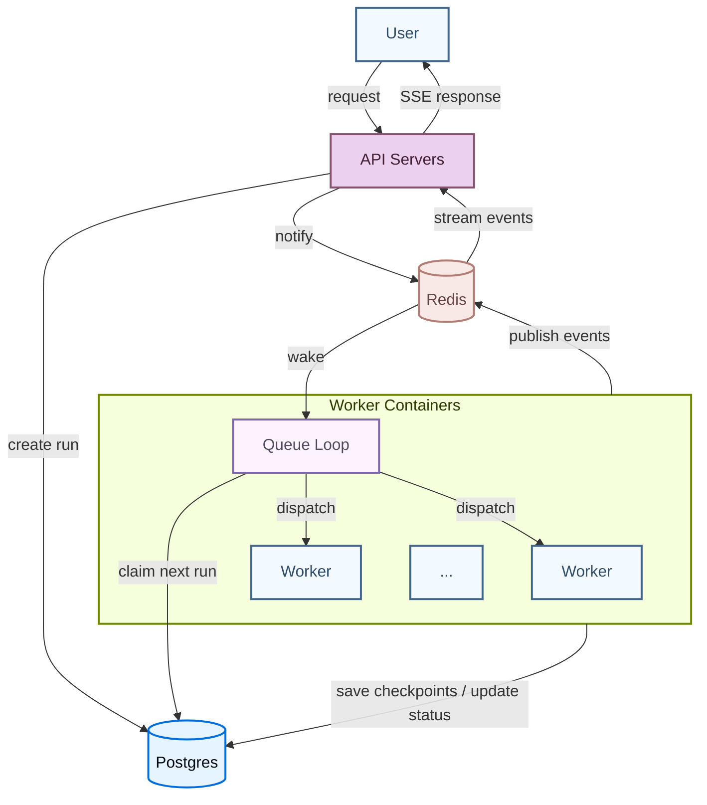

LangSmith Deployment 的 **Agent Server** 提供了一组 API，用于创建和管理基于 agent 的应用。它建立在 [assistants](/langsmith/assistants) 这一概念之上，也就是为特定任务配置好的 agents，同时内置了[persistence](/oss/langgraph/persistence#memory-store)和[task queue](#task-queue)。这套通用 API 支持非常广泛的 agentic application 使用场景，从后台处理到实时交互都可以覆盖。

使用 Agent Server 创建和管理：

<CardGroup cols={4}>
  <Card title="Assistants" icon="robot" href="/langsmith/assistants" />
  <Card title="Threads" icon="messages" href="/langsmith/use-threads" />
  <Card title="Runs" icon="player-play" href="/langsmith/runs" />
  <Card title="Cron jobs" icon="clock" href="/langsmith/cron-jobs" />
</CardGroup>

<Tip>
**API reference**  
关于 API endpoints 和数据模型的详细信息，请参阅 [Agent Server API reference](/langsmith/server-api-ref)。
</Tip>

## 应用结构

要部署一个 Agent Server application，你需要指定要部署的 graph，以及任何相关配置项，例如 dependencies 和 environment variables。

阅读[application structure](/langsmith/application-structure)指南，了解如何组织 LangGraph application 以便部署。

<Note>
[LangSmith cloud](/langsmith/cloud) 会为你管理数据库。如果你要部署在[自己的基础设施](/langsmith/self-hosted)上，则需要自行完成这部分设置。
</Note>

## Deployment 的组成部分

部署 Agent Server 时，你实际部署的是一个或多个 [graphs](#graphs)、一个用于[persistence](/oss/langgraph/persistence)的数据库，以及一个 [task queue](#task-queue)。

### Graphs

当你通过 Agent Server 部署一个 graph 时，实际上部署的是一个 [Assistant](/langsmith/assistants) 的“蓝图”。

一个 graph 最常见的用途是实现一个 [agent](/oss/langgraph/workflows-agents)，但不一定非得如此。例如，graph 也可以实现一个只支持来回对话、不会影响应用控制流的简单 chatbot。实际上，随着应用越来越复杂，graph 往往会实现更复杂的流程，并且可能让[多个 agents](/oss/langchain/multi-agent)协同工作。

Graphs 不一定要用 LangGraph 编写。你也可以使用 LangGraph Functional API，部署由其他 frameworks 构建的 agents，例如 Strands 或 Google ADK。详情请参阅 [Deploy other frameworks](/langsmith/deploy-other-frameworks)。

#### Graph 的加载与编译

graph 如何以及何时被编译，取决于你在 [application structure](/langsmith/application-structure) 中如何注册它：

1. **Compiled graph**（推荐）：导出一个已经编译好的 `CompiledGraph` 实例。服务端会在 container 启动时加载一次，并在每次 run 中复用，不会有逐请求编译开销。
2. **Factory function**：导出一个 agent factory function，服务端每次需要 graph 时都会调用它。只有在你需要按 run 做 graph 定制时才应使用，例如基于 assistant config 选择不同 models 或 tools。请保持 factory functions 足够轻量，因为它们会在每次调用时运行。

<Tip>
除非你确实需要按 run 自定义，否则请使用 compiled graph。Factory functions 会在每次调用时增加开销，而 compiled graphs 不会。
</Tip>

无论哪种情况，服务端都会在运行时自动注入该 deployment 配置好的 checkpointer 和 memory store。**不要在 graph code 中自行配置它们**，因为服务端还需要管理这些组件来支持其他操作。

### Persistence

Agent Server 会持久化三类数据，默认都由 [PostgreSQL](https://www.postgresql.org/) 支撑：

- **Core resource data**：assistants、threads、runs 和 cron jobs。始终存储在 PostgreSQL 中。
- **Checkpoints（短期记忆）**：graph 执行状态在每一步写出的快照。它们让 runs 具备持久性，即使 worker 被中断，run 也能从最近一个 checkpoint 恢复，而不必从头开始。Durability mode 控制 checkpoint 的写入频率，`async`（默认）会在每一步之后写入，`exit` 则只存储最终状态。LangSmith 默认将其存储在 PostgreSQL 中，但你也可以切换到 [MongoDB](https://www.mongodb.com/) 或自定义实现。详情请参阅 [Configure checkpointer backend](/langsmith/configure-checkpointer)。
- **Store（长期记忆）**：跨 threads 持久存在的记忆，让 agents 能在不同会话之间保留信息。默认存储在 PostgreSQL 中，也可以替换为自定义实现。详情请参阅 [Add custom store](/langsmith/custom-store)。

### Task queue

当客户端创建一个 run 时，API server 会将其放入队列，queue worker 再把它取出并执行。Workers 还可以收到取消正在运行任务的信号，并发布输出事件，由已打开的 `/stream` 连接实时转发给客户端。

[Redis](https://redis.io/) 负责 API servers 与 queue workers 之间的信号、取消以及流式 pub/sub。它只存储临时数据，不会在 Redis 中持久化任何用户数据或 run 数据。真正的 run 数据始终从 PostgreSQL 读取并写回 PostgreSQL。

关于如何设置和管理这些组件的更多信息，请查阅[hosting options](/langsmith/platform-setup)指南。

## 运行时架构

### Deployment 模式

Agent Server 支持三种运行时配置：

- **Single host**：API server 直接管理 task queue，不使用独立的 queue workers。这是 self-hosted deployments 的默认模式，适合开发和低流量场景。
- **Split API and queue**：专门的 queue workers 在独立于 API server 的主机上处理 run 执行。对于 self-hosted deployments，可通过在配置中设置 `queue.enabled: true` 来启用。两层可以独立扩缩容，API servers 按请求量扩展，queue workers 按待处理 run 数扩展。
- **Distributed runtime**：API 和 queue 进程依然分开运行，但不再由单一 queue 进程同时负责 graph 的编排与执行，而是改为一个进程负责编排、另一个进程负责执行。适用于高并发、大规模部署。

下面介绍的 container 架构和 run 生命周期，适用于 single host 以及 split API and queue 两种配置。

### Container 架构

一个典型 deployment 包含两类长时间运行的 containers，它们都基于同一个 Docker image 构建而成（基础镜像之上安装你的项目代码）：

- **API servers** 负责处理客户端请求，例如创建 runs、读取 thread state、流式返回结果，但自身不会执行 agent code。
- **Queue workers** 是执行引擎。它们监听持久化 task queue，执行 graph code，并写入 checkpoints。

Containers 是**无状态**但持久运行的。为了确保没有 run 被遗弃，任何时候都至少要有 1 个 queue worker 监听 task queue。这些 containers 在自身生命周期内可以服务很多个 runs。

API servers 和 queue workers 是两个独立的 container 池，并且会[独立扩缩容](/langsmith/data-plane#autoscaling)。

### Run 执行生命周期

当你调用一个 run 时，请求会经过多个组件：

1. 客户端向某个 API server 发送请求，后者会在持久化 task queue 中创建一个待处理 run。
2. 某个 queue worker 取出该 run，为其获取 lease，加载相应 graph，并开始执行。队列会确保任意给定 thread 在同一时间最多只有 1 个 run 在执行。
3. graph 执行过程中，worker 会把 checkpoints 写入 persistence layer（写入频率取决于 [durability mode](/oss/langgraph/persistence#durability-modes)），并通过配置好的 pubsub provider 广播流式事件。
4. 如果客户端打开了 `/stream` 连接，API server 会订阅 pubsub channel，并通过 server-sent events 实时把事件转发给客户端。
5. 当执行完成后，worker 会更新 run 状态，并释放其 slot，供下一个 run 使用。

每个 worker 最多可并发处理 [`N_JOBS_PER_WORKER`](/langsmith/env-var-cloud) 个 runs（默认值：10），因此单个 worker container 就可以并行服务多个 runs。关于调优建议，请参阅 [为扩展性配置 Agent Server](/langsmith/agent-server-scale)。

## 继续阅读

- [Application Structure](/langsmith/application-structure) 指南说明了如何组织你的 application 以便部署。
- [API Reference](https://docs.langchain.com/langsmith/server-api-ref) 提供了 API endpoints 和数据模型的详细信息。
