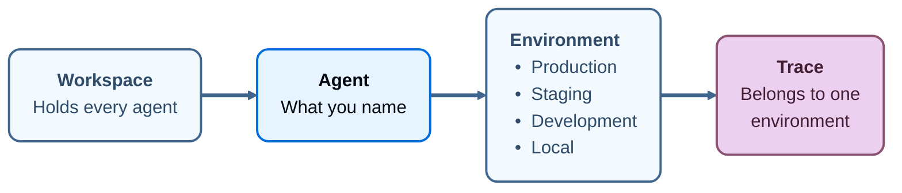

import AgentBetaNote from '/snippets/langsmith/agent-beta-note.mdx';

_agent_ 是一个利用 tools、skills 和 subagents 端到端完成任务的 AI 系统。在 LangSmith 中，agent 也是 workspace 组织的基本单元。只需命名一次，LangSmith 就会把该 agent 所做的一切记录在这个名称下，并划分到固定的四个 [environments](/langsmith/agent-environments) 中：Production、Staging、Development 和 Local。一条 trace、一个 alert、一个 evaluator 和一个 prebuilt dashboard 都分别属于某一个 agent 的某一个 environment。[dataset](/langsmith/evaluation-concepts#datasets) 和自定义 dashboard 是例外。dataset 附加到一个或多个 agents 上，而不附加到任何 environment；自定义 dashboard 附加到某个 agent，而不是某个 environment。

每条 trace 都携带其 agent 以及该 agent 的一个 environment，因此在 trace 到达时就会记录下是什么产生了它、它运行在哪里。随后 LangSmith 可以基于这一上下文采取行动：alert 只监视 production 而对 local runs 保持安静，每个 environment 都有自己的 prebuilt dashboard，[Insights](/langsmith/insights) 报告则覆盖你运行它所在 environment 的流量。

<AgentBetaNote />

每条 trace 都映射到产生它的 agent 以及它运行所在的 environment。

## Environments

_environment_ 记录 agent 产生某条 trace 时运行在何处。名称是固定的：Production、Staging、Development 和 Local。

更多信息请参阅 [Agent environments](/langsmith/agent-environments)。

## Identifiers 和 display names

每个 agent 都有两个名称，它们承担不同的工作：

- **Identifier**：在 agent 创建时设置，之后不可编辑。它是你提供的还是 LangSmith 生成的，取决于[该 agent 是如何被创建的](/langsmith/create-an-agent)。LangSmith 用它来定位 traces，因此即使 display name 改变，它也保持稳定。
- **Display name**：显示在 UI 中出现该 agent 的所有地方。对于[在 UI 中构建](/langsmith/build-an-agent)的 agent，可以在其 Build 配置的 **Name** 字段中重命名。重命名不会移动已有的 traces，也不会改变新 traces 的落点。

identifier 也是浏览器地址栏中携带的内容，因此你可以从地址栏读取它，或者从该 agent Overview 的 **ID** 字段复制它。

## 下一步

<CardGroup cols={2}>

<Card
  title="Environments"
  cta="Learn more"
  href="/langsmith/agent-environments"
  icon="stack"
>
agent 的 traces 划分成的四个 environment，以及如何在它们之间切换。
</Card>

<Card
  title="Navigate agents"
  cta="Learn more"
  href="/langsmith/navigate-agents"
  icon="compass"
>
agent 切换器、agent 列表和 agent Overview。
</Card>

<Card
  title="Log traces to an agent"
  cta="Learn more"
  href="/langsmith/log-traces-to-agent"
  icon="target"
>
agent addressing 如何把 traces 发送到某个 agent 和某个 environment，以及为什么它不能与 project addressing 组合。
</Card>

<Card
  title="Create an agent"
  cta="Learn more"
  href="/langsmith/create-an-agent"
  icon="plus"
>
创建 agent 的四种方式、每种方式对 agent 的决定，以及 identifier 必须遵循的规则。
</Card>

</CardGroup>
