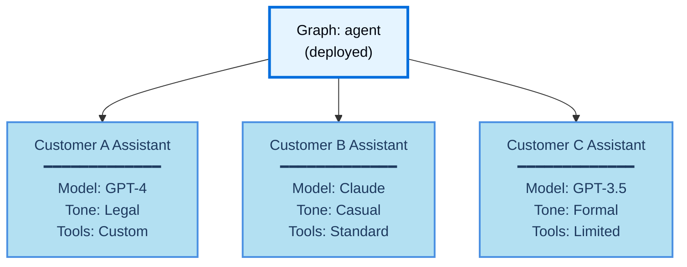
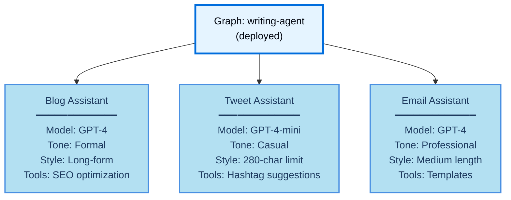

_Assistants_ 是 [Agent Server](/langsmith/agent-server) 中的一个概念，它允许你把配置，例如 prompt、LLM 选择、tool，和 graph 的核心逻辑分离管理。这样你就可以在运行时，基于同一套 graph 架构创建多个具有不同配置、不同表现的专用版本。通过配置差异，而不是 graph 结构变更，每个 assistant 都能针对不同的 [use case](#use-cases) 做优化。

例如，假设你构建了一个通用写作 agent，它基于一套通用的 graph 架构。虽然整体结构保持不变，但不同写作风格，例如 blog post 和 tweet，需要不同配置来优化表现。为了支持这些差异，你可以创建多个 assistant，例如一个用于博客，另一个用于推文，它们共享同一个底层 graph，但在 model 选择和 system prompt 上有所不同。


Agent Server API 提供了多个用于创建和管理 assistant 及其版本的 endpoint。详见 [API reference](/langsmith/server-api-ref)。

<Info>
Assistants 是 [LangSmith Deployment](/langsmith/deployment) 的概念。在开源 LangGraph library 中不可用。
</Info>

## Default assistants

当你使用 LangSmith Deployment 部署一个 graph 时，[Agent Server](/langsmith/agent-server) 会自动为该 graph 的默认配置创建一个 **default assistant**。随后，你还可以为同一个 graph 创建额外的 assistant，每个 assistant 都有自己的配置。

如果你的 deployment 在 [`langgraph.json`](/langsmith/application-structure#configuration-file) 中定义了多个 graph，那么每个 graph 都会拥有自己的 default assistant：

```json
{
    "graphs": {
        "graph_id_1": "path_to_graph_id_1",  // default assistant created for graph_id_1
        "graph_id_2": "path_to_graph_id_2"   // default assistant created for graph_id_2
    }
}
```

Assistants 具有以下核心特性：

- **[Managed via API and UI](/langsmith/configuration-cloud)**：你可以通过 Agent Server / LangGraph SDK 或 [LangSmith UI](https://smith.langchain.com) 创建、列出、更新、版本化以及获取 assistant。
- **One graph, multiple assistants**：一个已部署的 graph 可以支持多个 assistant，每个 assistant 都可以有不同配置，例如 prompt、model、tool。
- **[Versioned](#versioning) configurations**：每个 assistant 都通过版本机制维护自己的配置历史。编辑 assistant 会创建新版本，并且你可以将任意版本 promote 为当前版本，或回滚到历史版本。
- **[Configuration](#configuration) updates without graph changes**：你可以通过 assistant configuration 更新 prompt、model 选择和其他设置，而无需修改或重新部署 graph 代码，从而实现更快迭代。

<Note>
调用 assistant 时，你可以在 [`langgraph.json`](/langsmith/application-structure#configuration-file) 中指定以下任意一种：

- **graph ID**，也就是 `langgraph.json` 中的 key，例如 `"agent"`：表示使用该 graph 的 default assistant。
- **assistant ID**，UUID：表示使用某个特定的 assistant configuration。

这种灵活性让你既可以快速用默认设置测试，也可以精确控制所使用的配置版本。
</Note>

## Configuration

Assistants 建立在 LangGraph 开源概念 [configuration](/oss/langgraph/graph-api#runtime-context) 之上。

虽然 configuration 在开源 LangGraph library 中就已存在，但 assistant 只在 [LangSmith Deployment](/langsmith/deployment) 中提供，因为它与已部署的 graph 是紧耦合的。部署完成后，[Agent Server](/langsmith/agent-server) 会基于 graph 的默认配置，自动为每个 graph 创建一个 default assistant。

在实际使用中，assistant 本质上只是一个带有特定 configuration 的 graph _instance_。因此，多个 assistant 可以引用同一个 graph，但各自包含不同配置，例如 prompt、model、tool。LangSmith Deployment API 提供了多个 endpoint 来创建和管理 assistant。更多细节请参阅 [API reference](/langsmith/server-api-ref) 和 [this how-to](/langsmith/configuration-cloud)。

### Use cases

当你需要使用相同 graph 架构，但又要根据不同配置部署出多个变体时，assistant 会非常合适。常见 use case 包括：

- **User-level personalization**
  - 为每个用户定制 model selection、system prompt 或 tool availability。
  - 存储用户偏好，并在每次交互中自动应用。
  - 允许用户在不同 AI personality 或专业能力等级之间切换。

- **Customer or organization-specific configurations**
  - 为不同客户或组织维护独立配置。
  - 在不部署独立基础设施的前提下，为每个客户定制行为。
  - 将配置变更隔离到特定客户。



- **Environment-specific configurations**
  - 为 development、staging 和 production 使用不同 model 或设置。
  - 在推广到 production 之前，先在 staging 中测试配置变更。
  - 在非生产环境中通过更小 model 降低成本。

- **A/B testing and experimentation**
  - 对比不同 prompt、model 或参数配置。
  - 逐步把配置变更发布给部分用户。
  - 衡量不同配置变体之间的性能差异。

- **Specialized task variants**
  - 为通用 agent 创建特定领域版本。
  - 针对不同语言、区域或行业优化配置。
  - 在保持 graph 逻辑一致的前提下，改变执行细节。



## How assistants work with deployments

当你通过 LangSmith Deployment 部署 graph 时，[Agent Server](/langsmith/agent-server) 会自动为该 graph 的默认配置创建一个 **default assistant**。之后，你可以为同一个 graph 再创建更多 assistant，每个 assistant 都拥有自己的配置。

如果你的 deployment 在 [`langgraph.json`](/langsmith/application-structure#configuration-file) 中定义了多个 graph，那么每个 graph 都会拥有自己的 default assistant：

```json
{
    "graphs": {
        "graph_id_1": "path_to_graph_id_1",  // default assistant created for graph_id_1
        "graph_id_2": "path_to_graph_id_2"   // default assistant created for graph_id_2
    }
}
```

也就是说，default assistant 可以有多个，每个 deployment 中定义的 graph 都对应一个。

Assistants 的核心特性如下：

- **[Managed via API and UI](/langsmith/configuration-cloud)**：你可以通过 Agent Server / LangGraph SDK 或 [LangSmith UI](https://smith.langchain.com) 创建、列出、更新、版本化以及获取 assistant。
- **One graph, multiple assistants**：一个已部署的 graph 可以支持多个 assistant，每个 assistant 都可以有不同配置，例如 prompt、model、tool。
- **[Versioned](#versioning) configurations**：每个 assistant 都通过版本机制维护自己的配置历史。编辑 assistant 会创建新版本，并且你可以将任意版本 promote 为当前版本，或回滚到历史版本。
- **[Configuration](#configuration) updates without graph changes**：你可以通过 assistant configuration 更新 prompt、model 选择和其他设置，而无需修改或重新部署 graph 代码，从而实现更快迭代。

<Note>
调用 assistant 时，你可以在 [`langgraph.json`](/langsmith/application-structure#configuration-file) 中指定：
- **graph ID**，例如 `"agent"`：表示使用该 graph 的 default assistant
- **assistant ID**，UUID：表示使用某个特定 assistant configuration

这种灵活性让你既可以快速用默认设置测试，也可以精确控制所使用的配置版本。
</Note>

### Configuration

Assistants 建立在 LangGraph 开源概念 [configuration](/oss/langgraph/graph-api#runtime-context) 之上。

虽然 configuration 在开源 LangGraph library 中就已存在，但 assistant 只在 [LangSmith Deployment](/langsmith/deployment) 中提供，因为它与已部署的 graph 是紧耦合的。部署完成后，[Agent Server](/langsmith/agent-server) 会基于 graph 的默认配置，自动为每个 graph 创建一个 default assistant。

在实际使用中，assistant 本质上只是一个带有特定 configuration 的 graph _instance_。因此，多个 assistant 可以引用同一个 graph，但各自包含不同配置，例如 prompt、model、tool。LangSmith Deployment API 提供了多个 endpoint 来创建和管理 assistant。更多细节请参阅 [API reference](/langsmith/server-api-ref) 和 [this how-to](/langsmith/configuration-cloud)。

### Versioning

Assistants 支持 versioning，用于随着时间推移跟踪变更。一旦你创建了 assistant，后续编辑就会自动生成新版本。

- 每次更新都会创建 assistant 的一个新版本。
- 你可以把任意版本 promote 为当前 active version。
- 回滚到旧版本，只需把该版本重新设为 active。
- 所有版本都会保留，便于参考和回滚。

<Warning>
更新 assistant 时，你必须提供完整的 configuration payload。更新 endpoint 会从头创建新版本，而不会与之前版本做 merge。请确保你传入了所有希望保留的 configuration 字段。
</Warning>

如需了解如何管理 assistant version，请参阅 [Manage assistants guide](/langsmith/configuration-cloud#create-a-new-version-for-your-assistant)。
