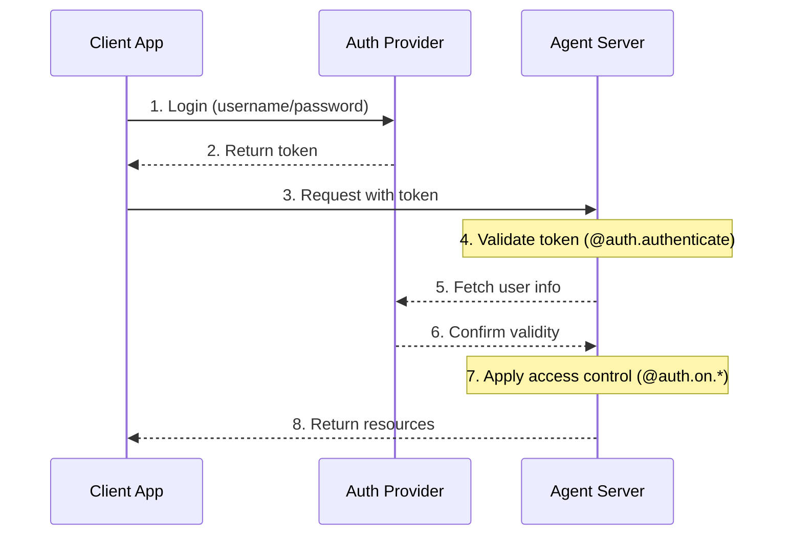
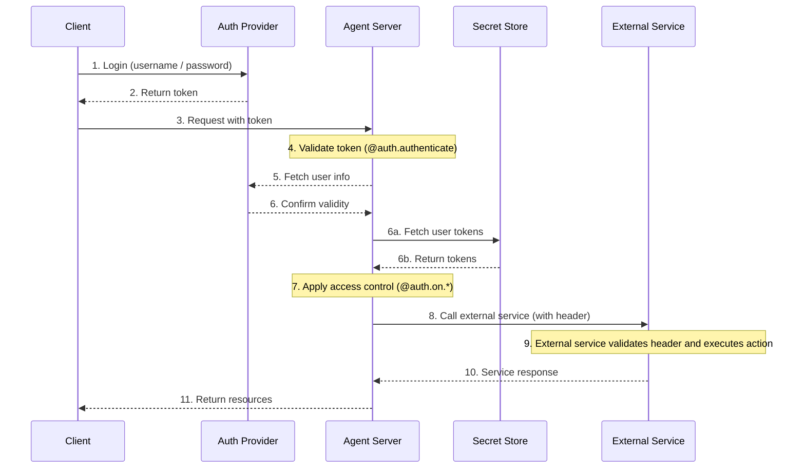

LangSmith 提供了一个灵活的身份验证与授权系统，可与大多数身份验证方案集成。

## 核心概念

### 身份验证与授权

这两个术语虽然经常被混用，但代表的是不同的安全概念：

* [**身份验证**](#authentication)（“AuthN”）用于验证“你是谁”。它会作为中间件运行在每个请求上。
* [**授权**](#authorization)（“AuthZ”）用于决定“你可以做什么”。它会基于资源逐项校验用户权限和角色。

在 LangSmith 中，身份验证由你的 @[`@auth.authenticate`][Auth.authenticate] 处理器负责，授权由你的 @[`@auth.on`][Auth.on] 处理器负责。

## 默认安全模型

LangSmith 提供了不同的默认安全策略：

### LangSmith

* 默认使用 LangSmith API 密钥
* 要求在 `x-api-key` 请求头中提供有效 API 密钥
* 可以通过你的 auth 处理器进行自定义

<Note>
**自定义身份验证**
LangSmith 所有套餐都**支持**自定义身份验证。
</Note>

### 自托管

* 默认不启用身份验证
* 你可以完全自由地实现自己的安全模型
* 身份验证和授权的所有细节都由你掌控


## 系统架构

典型的身份验证设置通常包含三个主要组件：

1. **身份验证提供商**（Identity Provider, IdP）
   * 用于管理用户身份和凭证的专用服务
   * 负责用户注册、登录、重置密码等
   * 在身份验证成功后签发令牌，例如 JWT、会话令牌等
   * 示例：Auth0、Supabase Auth、Okta，或你自己的身份验证服务器
2. **Agent Server**（资源服务器）
   * 你的 agent 或 LangGraph 应用，其中包含业务逻辑和受保护资源
   * 使用身份验证提供商来校验令牌
   * 根据用户身份和权限实施访问控制
   * 不会直接存储用户凭证
3. **客户端应用**（前端）
   * Web 应用、移动应用或 API 客户端
   * 收集时效敏感的用户凭证，并发送给身份验证提供商
   * 从身份验证提供商接收令牌
   * 在向 Agent Server 发起请求时携带这些令牌

这些组件通常按以下方式交互：



LangGraph 中的 @[`@auth.authenticate`][Auth.authenticate] 处理器负责第 4 到 6 步，而你的 @[`@auth.on`][Auth.on] 处理器负责实现第 7 步。

## 身份验证

LangGraph 中的身份验证会作为中间件运行在每一个请求上。你的 @[`@auth.authenticate`][Auth.authenticate] 处理器会接收请求信息，并且应该：

1. 校验凭证
2. 如果有效，返回包含用户身份与用户信息的 @[user info][MinimalUserDict]
3. 如果无效，抛出 @[HTTP exception][HTTPException] 或 AssertionError

```python
from langgraph_sdk import Auth

auth = Auth()

@auth.authenticate
async def authenticate(headers: dict) -> Auth.types.MinimalUserDict:
    # Validate credentials (e.g., API key, JWT token)
    api_key = headers.get(b"x-api-key")
    if not api_key or not is_valid_key(api_key):
        raise Auth.exceptions.HTTPException(
            status_code=401,
            detail="Invalid API key"
        )

    # Return user info - only identity and is_authenticated are required
    # Add any additional fields you need for authorization
    return {
        "identity": "user-123",        # Required: unique user identifier
        "is_authenticated": True,      # Optional: assumed True by default
        "permissions": ["read", "write"], # Optional: for permission-based auth
        # You can add more custom fields if you want to implement other auth patterns
        "role": "admin",
        "org_id": "org-456"

    }
```

返回的用户信息可在以下位置使用：

* 你的授权处理器中，可通过 @[`ctx.user`][AuthContext] 访问
* 你的应用中，可通过 `config["configuration"]["langgraph_auth_user"]` 访问

<Accordion title="支持的参数">
  @[`@auth.authenticate`][Auth.authenticate] 处理器可以按名称接受以下任意参数：

  * request (Request): 原始 ASGI request 对象
  * path (str): 请求路径，例如 `"/threads/abcd-1234-abcd-1234/runs/abcd-1234-abcd-1234/stream"`
  * method (str): HTTP 方法，例如 `"GET"`
  * path_params (dict[str, str]): URL 路径参数，例如 `{"thread_id": "abcd-1234-abcd-1234", "run_id": "abcd-1234-abcd-1234"}`
  * query_params (dict[str, str]): URL 查询参数，例如 `{"stream": "true"}`
  * headers (dict[bytes, bytes]): 请求头
  * authorization (str | None): Authorization 请求头的值，例如 `"Bearer <token>"`

  在很多教程中，为了简洁我们只展示 `"authorization"` 参数，但你可以按需接受更多信息，
  来实现自己的自定义身份验证方案。
</Accordion>

### Agent 身份验证

自定义身份验证允许委托访问。你在 `@auth.authenticate` 中返回的值会被加入运行上下文，让 agent 可以获得用户作用域的凭证，从而代表用户访问资源。



身份验证完成后，平台会创建一个特殊配置对象，并通过 configurable context 将它传给你的图和所有节点。
这个对象包含当前用户的信息，包括你从 @[`@auth.authenticate`][Auth.authenticate] 处理器中返回的所有自定义字段。

要让 agent 能够代表用户执行操作，请使用[自定义身份验证中间件](/langsmith/custom-auth)。这样 agent 就能代表用户与 MCP server、外部数据库，甚至其他 agent 交互。

更多信息请参阅[使用自定义身份验证](/langsmith/custom-auth#enable-agent-authentication)指南。

### 带 MCP 的 Agent 身份验证

有关如何让 agent 向 MCP server 进行身份验证，请参阅 [MCP 概念指南](/oss/langchain/mcp)。

## 授权

在身份验证完成后，LangGraph 会调用你的 @[`@auth.on`][Auth] 处理器，来控制对特定资源，例如 threads、assistants、crons 的访问。这些处理器可以：

1. 通过直接修改 `value["metadata"]` 字典，为资源创建时保存的元数据添加信息。各个 action 对应的 `value` 类型列表见[支持的操作表](#supported-actions)。
2. 在搜索、列表或读取操作中，通过返回一个[过滤字典](#filter-operations)，根据元数据筛选资源。
3. 如果拒绝访问，则抛出 HTTP 异常。

如果你只想实现简单的用户作用域访问控制，可以对所有资源和操作使用一个 @[`@auth.on`][Auth] 处理器。如果你想根据资源和操作做不同控制，也可以使用[资源专用处理器](#resource-specific-handlers)。完整支持的资源列表见[支持的资源](#supported-resources)。

```python
@auth.on
async def add_owner(
    ctx: Auth.types.AuthContext,
    value: dict  # The payload being sent to this access method
) -> dict:  # Returns a filter dict that restricts access to resources
    """Authorize all access to threads, runs, crons, and assistants.

    This handler does two things:
        - Adds a value to resource metadata (to persist with the resource so it can be filtered later)
        - Returns a filter (to restrict access to existing resources)

    Args:
        ctx: Authentication context containing user info, permissions, the path, and
        value: The request payload sent to the endpoint. For creation
              operations, this contains the resource parameters. For read
              operations, this contains the resource being accessed.

    Returns:
        A filter dictionary that LangGraph uses to restrict access to resources.
        See [Filter Operations](#filter-operations) for supported operators.
    """
    # Create filter to restrict access to just this user's resources
    filters = {"owner": ctx.user.identity}

    # Get or create the metadata dictionary in the payload
    # This is where we store persistent info about the resource
    metadata = value.setdefault("metadata", {})

    # Add owner to metadata - if this is a create or update operation,
    # this information will be saved with the resource
    # So we can filter by it later in read operations
    metadata.update(filters)

    # Return filters to restrict access
    # These filters are applied to ALL operations (create, read, update, search, etc.)
    # to ensure users can only access their own resources
    return filters
```

<a id="resource-specific-handlers"></a>
### 资源专用处理器

你可以通过把资源名和操作名链接在 @[`@auth.on`][Auth] 装饰器后面，为特定资源和操作注册处理器。
当请求到来时，会调用与该资源和操作最匹配、最具体的处理器。下面示例演示了如何为特定资源和操作注册处理器。对于以下配置：

1. 已验证用户可以创建 thread、读取 thread，并在 thread 上创建 run
2. 只有拥有 `"assistants:create"` 权限的用户才允许创建新的 assistant
3. 其他所有端点，例如 delete assistant、crons、store，都对所有用户禁用

<Tip>
**支持的处理器**
完整的受支持资源和操作列表，请参阅下文的[支持的资源](#supported-resources)。
</Tip>

```python
# Generic / global handler catches calls that aren't handled by more specific handlers
@auth.on
async def reject_unhandled_requests(ctx: Auth.types.AuthContext, value: Any) -> False:
    print(f"Request to {ctx.path} by {ctx.user.identity}")
    raise Auth.exceptions.HTTPException(
        status_code=403,
        detail="Forbidden"
    )

# Matches the "thread" resource and all actions - create, read, update, delete, search
# Since this is **more specific** than the generic @auth.on handler, it will take precedence
# over the generic handler for all actions on the "threads" resource
@auth.on.threads
async def on_thread(
    ctx: Auth.types.AuthContext,
    value: Auth.types.threads.create.value
):
    # Setting metadata on the thread being created
    # will ensure that the resource contains an "owner" field
    # Then any time a user tries to access this thread or runs within the thread,
    # we can filter by owner
    metadata = value.setdefault("metadata", {})
    metadata["owner"] = ctx.user.identity
    return {"owner": ctx.user.identity}


# Thread creation. This will match only on thread create actions
# Since this is **more specific** than both the generic @auth.on handler and the @auth.on.threads handler,
# it will take precedence for any "create" actions on the "threads" resources
@auth.on.threads.create
async def on_thread_create(
    ctx: Auth.types.AuthContext,
    value: Auth.types.threads.create.value
):
    # Reject if the user does not have write access
    if "write" not in ctx.permissions:
        raise Auth.exceptions.HTTPException(
            status_code=403,
            detail="User lacks the required permissions."
        )
    # Setting metadata on the thread being created
    # will ensure that the resource contains an "owner" field
    # Then any time a user tries to access this thread or runs within the thread,
    # we can filter by owner
    metadata = value.setdefault("metadata", {})
    metadata["owner"] = ctx.user.identity
    return {"owner": ctx.user.identity}

# Reading a thread. Since this is also more specific than the generic @auth.on handler, and the @auth.on.threads handler,
# it will take precedence for any "read" actions on the "threads" resource
@auth.on.threads.read
async def on_thread_read(
    ctx: Auth.types.AuthContext,
    value: Auth.types.threads.read.value
):
    # Since we are reading (and not creating) a thread,
    # we don't need to set metadata. We just need to
    # return a filter to ensure users can only see their own threads
    return {"owner": ctx.user.identity}

# Run creation, streaming, updates, etc.
# This takes precedenceover the generic @auth.on handler and the @auth.on.threads handler
@auth.on.threads.create_run
async def on_run_create(
    ctx: Auth.types.AuthContext,
    value: Auth.types.threads.create_run.value
):
    metadata = value.setdefault("metadata", {})
    metadata["owner"] = ctx.user.identity
    # Inherit thread's access control
    return {"owner": ctx.user.identity}

# Assistant creation
@auth.on.assistants.create
async def on_assistant_create(
    ctx: Auth.types.AuthContext,
    value: Auth.types.assistants.create.value
):
    if "assistants:create" not in ctx.permissions:
        raise Auth.exceptions.HTTPException(
            status_code=403,
            detail="User lacks the required permissions."
        )
```

请注意，以上示例中混合使用了全局处理器和资源专用处理器。由于每个请求都会由最具体的处理器处理，因此创建 `thread` 的请求会命中 `on_thread_create`，而**不会**命中 `reject_unhandled_requests`。但如果是 `update` thread 的请求，由于我们没有为该资源和操作组合提供更具体的处理器，它就会由全局处理器来处理。

<a id="filter-operations"></a>
### 过滤操作

授权处理器可以返回 `None`、布尔值或过滤字典。

* `None` 和 `True` 表示“授权访问所有底层资源”
* `False` 表示“拒绝访问所有底层资源”，并抛出 403 异常
* 元数据过滤字典会将访问限制到特定资源

过滤字典是一个字典，键应与资源元数据的键一致。它支持三个操作符：

* 默认值是精确匹配，也就是下面的 `$eq` 简写。例如，`{"owner": user_id}` 只会包含元数据中带有 `{"owner": user_id}` 的资源
* `$eq`：精确匹配，例如 `{"owner": {"$eq": user_id}}`，这与上面的简写 `{"owner": user_id}` 等价
* `$contains`：列表成员匹配，例如 `{"allowed_users": {"$contains": user_id}}`，或列表包含匹配，例如 `{"allowed_users": {"$contains": [user_id_1, user_id_2]}}`。这里的值必须是列表中的元素，或该列表元素的一个子集。存储在资源中的元数据必须是列表或容器类型

包含多个键的字典会按逻辑 `AND` 处理。例如，`{"owner": org_id, "allowed_users": {"$contains": user_id}}` 只会匹配元数据中 `"owner"` 为 `org_id` 且 `"allowed_users"` 列表包含 `user_id` 的资源。
更多信息请参阅参考文档 @[`Auth`](Auth)。

## 常见访问模式

下面是一些典型的授权模式：

### 单所有者资源

这种常见模式会将所有 threads、assistants、crons 和 runs 限制在单个用户作用域内。它适用于常见的单用户场景，例如普通聊天机器人应用。

```python
@auth.on
async def owner_only(ctx: Auth.types.AuthContext, value: dict):
    metadata = value.setdefault("metadata", {})
    metadata["owner"] = ctx.user.identity
    return {"owner": ctx.user.identity}
```

### 基于权限的访问

这种模式允许你基于**权限**来控制访问。如果你希望某些角色对资源拥有更宽或更窄的访问范围，这会很有用。

```python
# In your auth handler:
@auth.authenticate
async def authenticate(headers: dict) -> Auth.types.MinimalUserDict:
    ...
    return {
        "identity": "user-123",
        "is_authenticated": True,
        "permissions": ["threads:write", "threads:read"]  # Define permissions in auth
    }

def _default(ctx: Auth.types.AuthContext, value: dict):
    metadata = value.setdefault("metadata", {})
    metadata["owner"] = ctx.user.identity
    return {"owner": ctx.user.identity}

@auth.on.threads.create
async def create_thread(ctx: Auth.types.AuthContext, value: dict):
    if "threads:write" not in ctx.permissions:
        raise Auth.exceptions.HTTPException(
            status_code=403,
            detail="Unauthorized"
        )
    return _default(ctx, value)


@auth.on.threads.read
async def rbac_create(ctx: Auth.types.AuthContext, value: dict):
    if "threads:read" not in ctx.permissions and "threads:write" not in ctx.permissions:
        raise Auth.exceptions.HTTPException(
            status_code=403,
            detail="Unauthorized"
        )
    return _default(ctx, value)
```

## 支持的资源

LangGraph 提供三层授权处理器，按从宽泛到具体排序如下：

1. **全局处理器**（`@auth.on`）：匹配所有资源和操作
2. **资源处理器**，例如 `@auth.on.threads`、`@auth.on.assistants`、`@auth.on.crons`：匹配特定资源的所有操作
3. **操作处理器**，例如 `@auth.on.threads.create`、`@auth.on.threads.read`：匹配特定资源上的特定操作

系统会使用最具体的匹配处理器。例如，在线程创建时，`@auth.on.threads.create` 的优先级高于 `@auth.on.threads`。
如果已经注册了更具体的处理器，则较通用的处理器不会再被调用来处理该资源和操作。

<Tip>
"类型安全"
每个处理器都可以为其 `value` 参数使用类型提示，路径为 `Auth.types.on.<resource>.<action>.value`。例如：

```python
@auth.on.threads.create
async def on_thread_create(
ctx: Auth.types.AuthContext,
value: Auth.types.on.threads.create.value  # Specific type for thread creation
):
...

@auth.on.threads
async def on_threads(
ctx: Auth.types.AuthContext,
value: Auth.types.on.threads.value  # Union type of all thread actions
):
...

@auth.on
async def on_all(
ctx: Auth.types.AuthContext,
value: dict  # Union type of all possible actions
):
...
```

更具体的处理器会提供更好的类型提示，因为它们处理的 action 类型更少。
</Tip>

<a id="supported-actions"></a>
#### 支持的操作与类型

以下是所有受支持的操作处理器：

| Resource | Handler | Description | Value Type |
|----------|---------|-------------|------------|
| **Threads** | `@auth.on.threads.create` | Thread creation | @[`ThreadsCreate`] |
| | `@auth.on.threads.read` | Thread retrieval | @[`ThreadsRead`] |
| | `@auth.on.threads.update` | Thread updates | @[`ThreadsUpdate`] |
| | `@auth.on.threads.delete` | Thread deletion | @[`ThreadsDelete`] |
| | `@auth.on.threads.search` | Listing threads | @[`ThreadsSearch`] |
| | `@auth.on.threads.create_run` | Creating or updating a run | @[`RunsCreate`] |
| **Assistants** | `@auth.on.assistants.create` | Assistant creation | @[`AssistantsCreate`] |
| | `@auth.on.assistants.read` | Assistant retrieval | @[`AssistantsRead`] |
| | `@auth.on.assistants.update` | Assistant updates | @[`AssistantsUpdate`] |
| | `@auth.on.assistants.delete` | Assistant deletion | @[`AssistantsDelete`] |
| | `@auth.on.assistants.search` | Listing assistants | @[`AssistantsSearch`] |
| **Crons** | `@auth.on.crons.create` | Cron job creation | @[`CronsCreate`] |
| | `@auth.on.crons.read` | Cron job retrieval | @[`CronsRead`] |
| | `@auth.on.crons.update` | Cron job updates | @[`CronsUpdate`] |
| | `@auth.on.crons.delete` | Cron job deletion | @[`CronsDelete`] |
| | `@auth.on.crons.search` | Listing cron jobs | @[`CronsSearch`] |
| **Store** | `@auth.on.store` | All store operations | `Auth.types.on.store.value` |
| | `@auth.on.store.put` | Store an item | `Auth.types.on.store.put.value` |
| | `@auth.on.store.get` | Retrieve an item | `Auth.types.on.store.get.value` |
| | `@auth.on.store.search` | Search items | `Auth.types.on.store.search.value` |
| | `@auth.on.store.delete` | Delete an item | `Auth.types.on.store.delete.value` |
| | `@auth.on.store.list_namespaces` | List namespaces | `Auth.types.on.store.list_namespaces.value` |

Store 授权与 threads 和 assistants 不同。处理器必须重写 `value` 中可变的 `namespace` 字段，以便按用户作用域隔离数据，而不是返回元数据过滤器。完整演练请参阅[按用户隔离 store](/langsmith/store-auth)。

<Note>
"关于 Runs"

Runs 在访问控制上会受其父 thread 的作用域限制。这意味着权限通常继承自 thread，这也符合对话型数据模型的特点。除创建之外，所有 run 操作，例如读取和列出，都会由 thread 的处理器控制。
之所以提供单独的 `create_run` 处理器，是因为创建新 run 时会有更多参数可供处理器使用。
</Note>

## 下一步

关于实现细节：

* 查看[设置身份验证](/langsmith/set-up-custom-auth)入门教程
* 参阅如何实现[自定义 auth 处理器](/langsmith/custom-auth)的操作指南
