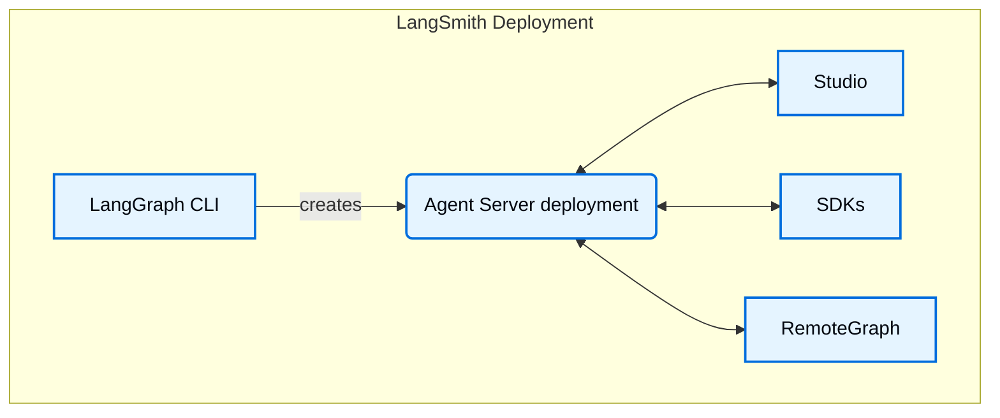

[LangSmith Deployment](/langsmith/deployment) 安装包含若干关键组件。这些工具和服务共同构成了一套完整方案，用于构建、部署和管理 graphs（包括 agentic applications），无论是在 [Cloud](/langsmith/cloud) 还是你自己的 [self-hosted](/langsmith/self-hosted) 基础设施中：

- [Agent Server](/langsmith/agent-server)：为部署 graphs 和 agents 定义了一套带有明确约定的 API 与运行时。它负责执行、状态管理和持久化，因此你可以专注于业务逻辑而不是服务器基础设施。
- [LangGraph CLI](/langsmith/cli)：命令行接口，用于在本地构建、打包并与 graphs 交互，同时为部署做准备。
- [Studio](/langsmith/studio)：用于可视化、交互和调试的专用 IDE。它连接本地 Agent Server，用于开发和测试 graph。
- [Python/JS SDK](/langsmith/reference)：Python/JS SDK 提供了一种编程方式，让你的应用能够与已部署的 graphs 和 agents 交互。
- [RemoteGraph](/langsmith/use-remote-graph)：允许你像与本地运行的 graph 一样，与部署后的 graph 交互。
- [Control Plane](/langsmith/control-plane)：用于创建、更新和管理 Agent Server deployments 的 UI 与 APIs。
- [Data plane](/langsmith/data-plane)：执行 graphs 的运行时层，包括 Agent Servers、其依赖服务（PostgreSQL、Redis 等），以及负责从 control plane 协调状态的 listener。
