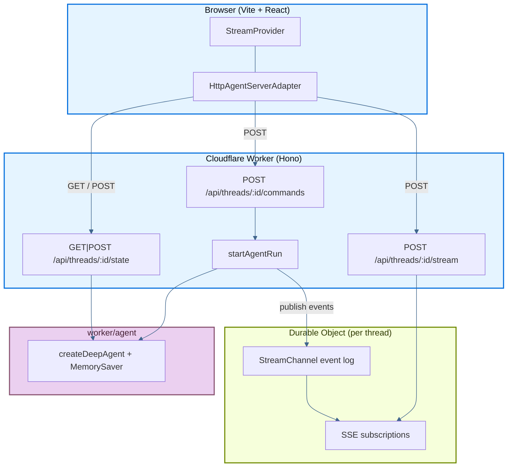

本页介绍了一个示例应用：它将 LangChain **deep agent** 部署在 [Cloudflare Workers](https://developers.cloudflare.com/workers/) 上，包括流式聊天 UI、subagents 和 thread 历史，全部由以 Worker routes（HTTP + SSE）形式实现的 [Agent Streaming Protocol](https://github.com/langchain-ai/agent-protocol/tree/main/streaming) 驱动。React SPA 通过 [Workers Assets](https://developers.cloudflare.com/workers/static-assets/) 由同一个 Worker 提供服务。无需单独的后端进程，一个 Worker 同时负责 SPA 和 protocol API。

源码：deployment cookbook 中的 [`js-cloudflare`](https://github.com/langchain-ai/deployment-cookbook/tree/main/js-cloudflare)。

## 部署到 Cloudflare

<Steps>

<Step title="Install and build">

```bash
cd js-cloudflare
cp .env.example .dev.vars   # set OPENAI_API_KEY for local dev
pnpm install
pnpm build
```

</Step>

<Step title="Configure secrets">

```bash
npx wrangler login
npx wrangler secret put OPENAI_API_KEY
```

</Step>

<Step title="Deploy">

```bash
pnpm run deploy
```

</Step>

</Steps>

Wrangler 会在一次部署中同时上传 Vite 构建产物（SPA）和 Worker 脚本。`nodejs_compat` 与 `nodejs_compat_populate_process_env` 已启用，因此 LangChain 可以从环境中读取 `OPENAI_API_KEY`。

`wrangler.jsonc` 将 `ThreadSession` [Durable Object](https://developers.cloudflare.com/durable-objects/) 注册为 `new_sqlite_classes`，这是 Workers **Free** 套餐所要求的。

## 必需的 API endpoints

该应用通过 `/api/threads/...` 暴露 Agent Streaming Protocol。routes 在 `worker/index.ts` 中使用 [Hono](https://hono.dev) 实现。

### Minimum（流式聊天）

| Method | Path | Purpose |
| --- | --- | --- |
| `POST` | `/api/threads/:threadId/commands` | 接收 protocol commands（`run.start` 等），并启动 agent runs |
| `POST` | `/api/threads/:threadId/stream` | 某个 run 的 protocol events SSE 流 |
| `GET` / `POST` | `/api/threads/:threadId/state` | 读取并初始化 checkpointed thread state |

### Optional（侧边栏）

| Method | Path | Purpose |
| --- | --- | --- |
| `GET` | `/api/threads` | 列出 checkpointer 已知的 threads |
| `DELETE` | `/api/threads/:threadId` | 删除某个 thread 的 session 和 checkpoints |
| `POST` | `/api/threads/:threadId/history` | 分页获取 checkpoint history |

### 请求流



1. 初始化 thread state（`GET`/`POST /state`）。
2. 提交时，SDK 会把 `run.start` 发到 `/commands`，并收到一个 `run_id`。
3. Worker 启动 graph run，并把每个 protocol event 分发到该 thread 的 **Durable Object**。
4. SDK 订阅 `/stream`（SSE）。DO 会先回放已缓冲事件，并在 Worker isolate 重启后继续附着，提供实时帧。
5. Subagent（`task`）runs 会发出具备命名空间的 events，并显示为 `stream.subagents`。

## Cloudflare 后端设计

| Concern | Implementation |
| --- | --- |
| Frontend | Vite + React SPA（`src/`） |
| API layer | `worker/index.ts` 中的 Hono routes |
| Runtime | Workers V8 + `nodejs_compat` |
| SSE replay | 每个 thread 一个 **Durable Object**（`ThreadSession`） |
| Agent runs | Worker isolate；protocol events 通过 POST 发送到 DO |
| Static assets | Workers Assets（`wrangler.jsonc` → `assets`） |
| Secrets | `wrangler secret` / `.dev.vars` |
| Local dev | `vite`（Cloudflare Vite plugin 会运行 Worker runtime） |

Cloudflare 上最关键的设计选择，是 **Worker**（agent + checkpointer）和 **Durable Object**（SSE event log）之间的分工。因为 Worker isolates 是短暂的，所以 replay buffers 要存放在 Durable Objects 中，而不是进程内存里。

## 生产持久化

默认情况下，agent 使用的是内存型 `MemorySaver` checkpointer（`worker/agent/index.ts`）。这在本地开发和 demo 中没有问题，但在 Cloudflare 上（多 isolates、冷启动）对话状态**无法**跨部署或跨 isolates 持久保存。

在生产环境中：

1. 请替换为[持久化 checkpointer](/oss/langgraph/checkpointers#checkpointer-libraries)（例如通过 Hyperdrive 使用 Postgres，或使用自定义的 DO-backed store）。
2. 保留按 thread 划分的 Durable Objects 以支持 SSE replay（或者把 event log 持久化到 DO storage / KV，以支持长时间断线重连）。

更多信息请参阅[checkpointer libraries](/oss/langgraph/checkpointers#checkpointer-libraries)和[添加 memory / persistence](/oss/langgraph/add-memory)。

## 本地开发

```bash
cp .env.example .dev.vars   # set OPENAI_API_KEY
pnpm install
pnpm dev
```

打开 [http://localhost:5173](http://localhost:5173)。Cloudflare Vite plugin 会在开发模式下于 Workers runtime 中运行你的 Worker，因此 `/api/*` routes 的行为与生产环境一致。

```bash
pnpm build    # production build (client + worker)
pnpm preview  # preview the production build locally
pnpm typecheck
```

## 项目结构

- `src/components/` — 聊天 UI（`ChatApp`、`Chat`、`MessageThread`、`Subagents`、`ThreadHistory` 等）。
- `src/lib/chat/threads-client.ts` — 浏览器侧 thread 初始化与侧边栏辅助逻辑。
- `worker/agent/` — deep agent（`createDeepAgent`），包含 `researcher` 和 `math-whiz` subagents，以及 mock tools。
- `worker/server/` — protocol helpers：`runs.ts`（在 Worker 上启动 runs）、`threads.ts`（基于 checkpointer 的 state）、`serialize.ts`、`registry.ts`。
- `worker/durable-objects/thread-session.ts` — 每个 thread 的 SSE event log（`StreamChannel` + `matchesSubscription`）。
- `worker/index.ts` — Hono app：protocol routes + Worker 导出。
- `wrangler.jsonc` — Worker 配置：`nodejs_compat`、Durable Object bindings、SPA asset routing（`run_worker_first: ["/api/*"]`）。

## See also

- [Frameworks and platforms overview](/langsmith/deploy-frameworks-and-platforms)
- [Agent Streaming Protocol](https://github.com/langchain-ai/agent-protocol/tree/main/streaming)
- [Cloudflare Workers](https://developers.cloudflare.com/workers/)
- [Durable Objects](https://developers.cloudflare.com/durable-objects/)
