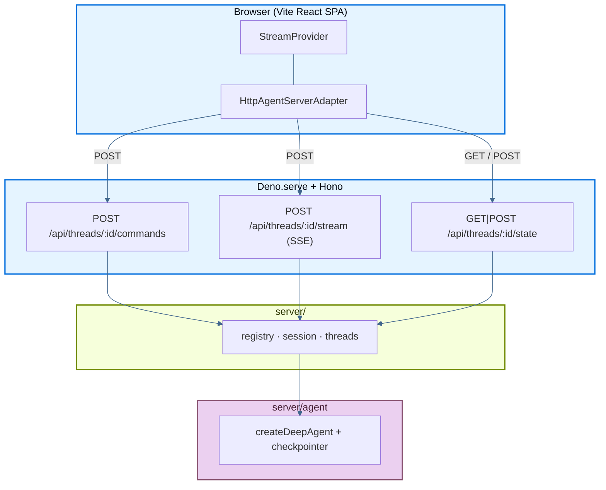

本页介绍了一个示例应用：它将 LangChain **deep agent** 部署在 [Deno Deploy](https://deno.com/deploy) 上，包括流式聊天 UI、subagents 和 thread 历史，全部由运行在 Hono server 上的 HTTP + SSE route handlers 形式实现的 [Agent Streaming Protocol](https://github.com/langchain-ai/agent-protocol/tree/main/streaming) 驱动。React 前端是一个 Vite SPA（从 Next.js 示例移植而来）；Deno 通过单个 `main.ts` entrypoint 同时提供构建后的静态资源和 API。

它是 Next.js 示例移植到 Deno + Hono 的版本，展示了如何在 Deno Deploy 上运行同一套 agent stack，而不是部署到 Vercel。

源码：deployment cookbook 中的 [`js-deno`](https://github.com/langchain-ai/deployment-cookbook/tree/main/js-deno)。

## 部署到 Deno Deploy

<Steps>

<Step title="Create a Deno Deploy project">

Fork 或 clone [`langchain-ai/deployment-cookbook`](https://github.com/langchain-ai/deployment-cookbook)。然后在 [Deno Deploy dashboard](https://dash.deno.com/) 中创建一个与该仓库关联的新项目。

</Step>

<Step title="Configure build settings">

- 将 **Root Directory** 设为 `js-deno`。
- 将 **build command** 设为 `deno task build:client`（它会把 Vite SPA 构建到 `dist/`）。
- 将 **entrypoint** 设为 `main.ts`。
- 在项目环境变量中添加 `OPENAI_API_KEY`。

</Step>

<Step title="Deploy">

直接在 dashboard 中部署。Deno 的构建环境会执行 build command，因此 `dist/` 会在云端生成，无需提交到仓库。

</Step>

</Steps>

或者，你也可以使用内置的 `deno deploy` CLI（Deno 2.x）。[`deno.json`](https://github.com/langchain-ai/deployment-cookbook/blob/main/js-deno/deno.json) 中的 `deploy` 配置块会设置 `org` / `app`。请将其改成你自己的值（或传入 `--org` / `--app` 参数，它们会覆盖配置）。

```bash
cd js-deno

# First time only: create the app
deno deploy create --org <your-org> --app <your-app> --source local --region us --entrypoint main.ts

# Set your OpenAI key
deno deploy env add OPENAI_API_KEY <your-key> --org <your-org> --app <your-app>

# Build the client, deploy to production, and clean up dist/
deno task deploy
```

`deno task deploy` 会运行 `deno task build:client && deno deploy --prod`，然后执行 `rm -rf dist`。之所以需要先在本地构建，是因为 `deno deploy --source local` 会上传你的工作树（排除 `.gitignore` 中的内容），但**不会**执行任何 build commands。只有绑定 GitHub 的 app 才会在云端运行这些命令。

<Warning>
CLI `--source local` 这种方式有两个特有坑点：

- **`dist/` 不能被 gitignore。** 上传器会遵守 `.gitignore`，所以新鲜构建出的 `dist/` 在上传窗口中必须是可见的，否则所有非 `/api` routes 都会返回 **404**。仓库根目录的 `.gitignore` 默认忽略所有 `dist`，因此 `js-deno/.gitignore` 会通过 `!dist/` 和 `!dist/**` 重新包含它。`deno task deploy` 会在上传完成后删除 `dist/`，因此虽然它不被忽略，也不会长期留在 `git status` 中。
- **不要使用 `deploy.include` 列表。** 目前 Deno Deploy 存在一个 bug，一旦加上 `include`，构建会把 entrypoint 解析成 `src/main.ts` 并失败。请直接依赖默认的 `.gitignore` 上传行为。
</Warning>

如果需要，你也可以通过添加 [`.env.example`](https://github.com/langchain-ai/deployment-cookbook/blob/main/js-deno/.env.example) 中的变量来启用 LangSmith tracing。

## 必需的 API endpoints

该应用通过 `/api/threads/...` 暴露 Agent Streaming Protocol。Route handlers 位于 `server/routes.ts`，并与 `js-next/app/api/threads/` 中的 Next.js handlers 保持一致。

### Minimum（流式聊天）

| Method | Path | Purpose |
| --- | --- | --- |
| `POST` | `/api/threads/:threadId/commands` | 接收 protocol commands（`run.start` 等），并启动 agent runs |
| `POST` | `/api/threads/:threadId/stream` | 某个 run 的 protocol events SSE 流 |
| `GET` / `POST` | `/api/threads/:threadId/state` | 读取并初始化 checkpointed thread state |

### Optional（侧边栏）

| Method | Path | Purpose |
| --- | --- | --- |
| `GET` | `/api/threads` | 列出 checkpointer 已知的 threads |
| `DELETE` | `/api/threads/:threadId` | 删除某个 thread 的 session 和 checkpoints |
| `POST` | `/api/threads/:threadId/history` | 分页 checkpoint history（Agent Protocol） |

### 请求流



## Deno 后端的工作方式

该示例运行在**单个 Deno 进程**中：

- **`main.ts`**：`Deno.serve` + Hono app。挂载 `/api` routes，并从 `dist/` 提供 Vite 构建后的 SPA。
- **`server/routes.ts`**：Agent Streaming Protocol 的 Hono route 定义。
- **`server/session.ts`**：`LocalThreadSession`，负责把 protocol events 缓存到 LangGraph 的 `StreamChannel` 中，借助 `matchesSubscription` 做过滤，并通过 SSE `ReadableStream` 向外分发匹配帧。
- **`server/threads.ts`**：基于 checkpointer 的 `getState` / `updateState` / `getHistory` helpers，输出为 LangGraph SDK wire format。
- **`server/registry.ts`**：进程级单例，持有 agent，以及按 thread id 管理的 session。
- **`server/agent/`**：与 Next.js 示例相同的 `createDeepAgent` orchestrator（`researcher` + `math-whiz` subagents，带 mock tools）。

Deno Deploy 会在每个 isolate 中运行各自的内存型 `MemorySaver` checkpointer。若要在生产中实现跨 isolate 的持久化，请换成[持久化 checkpointer](/oss/langgraph/checkpointers#checkpointer-libraries)（如 Postgres、Redis 等）。Route handlers 与 `server/threads.ts` helpers 无需改动。

## 生产持久化

默认情况下，agent 使用的是内存型 `MemorySaver` checkpointer（`server/agent/index.ts`）和进程级 session map（`server/registry.ts`）。这在本地开发和单 isolate 部署中没有问题，但在 Deno Deploy 上（多 isolates、冷启动）对话状态**无法**跨实例持久保存。

请将 `server/agent/index.ts` 中的 `MemorySaver` 替换为持久化 checkpointer，例如 `@langchain/langgraph-checkpoint-postgres` 或 `@langchain/langgraph-checkpoint-redis`。你还需要一个共享的 session / replay store，确保 SSE 重连可以跨 isolates 生效。

## 本地开发

你需要 [Deno](https://deno.com/) 2.x 和 [pnpm](https://pnpm.io/) 来运行客户端。

```bash
cp .env.example .env   # set OPENAI_API_KEY
export $(grep -v '^#' .env | xargs)   # load env for Deno

# Terminal 1 — API + static (after first client build)
deno task build:client   # first time only
deno task dev

# Terminal 2 — Vite dev server with HMR (proxies /api to :8000)
cd client && pnpm install && pnpm dev
```

打开 [http://localhost:5173](http://localhost:5173) 进行带热更新的开发。Vite dev server 会把 `/api` 代理到运行在 8000 端口上的 Deno server。

如果你想在本地以更接近生产环境的方式运行（单服务、无 HMR）：

```bash
deno task build:client
deno task start
```

然后打开 [http://localhost:8000](http://localhost:8000)。

## 项目结构

- `main.ts`：Deno Deploy entrypoint（`Deno.serve` + Hono）。
- `server/agent/`：deep agent（`createDeepAgent`），包含 subagents 和 mock tools。
- `server/`：protocol server 逻辑：`session.ts`、`threads.ts`、`serialize.ts`、`registry.ts`、`routes.ts`。
- `client/`：Vite + React SPA（与 Next.js 示例相同的 UI）。
- `dist/`：由 Deno 提供服务的 Vite 构建输出（通过 `deno task build:client` 生成）。

## See also

- [Frameworks and platforms overview](/langsmith/deploy-frameworks-and-platforms)
- [Deploy with Next.js](/langsmith/deploy-nextjs)
- [Agent Streaming Protocol](https://github.com/langchain-ai/agent-protocol/tree/main/streaming)
