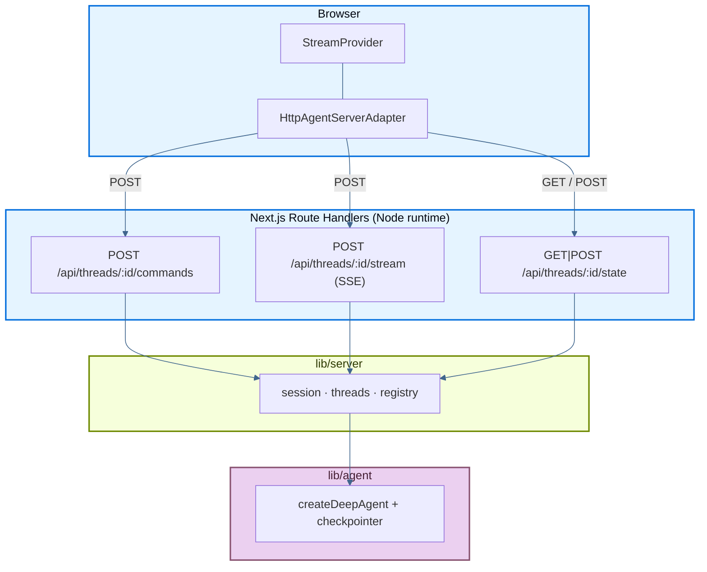

本页介绍了一个示例应用：它将 LangChain **deep agent** 完全部署在 [Next.js App](https://nextjs.org/) Router 项目中，包括流式聊天 UI、subagents 和 thread 历史，全部由作为 Next.js Route Handlers（HTTP + SSE）实现的 [Agent Streaming Protocol](https://github.com/langchain-ai/agent-protocol/tree/main/streaming) 驱动。无需单独的后端进程。

源码：deployment cookbook 中的 [`js-next`](https://github.com/langchain-ai/deployment-cookbook/tree/main/js-next)。

## 部署到 Vercel

<Steps>

<Step title="Import the repository">

点击下方 **Deploy with Vercel**，或者手动导入 [`langchain-ai/deployment-cookbook`](https://github.com/langchain-ai/deployment-cookbook)。

<a href="https://vercel.com/new/clone?repository-url=https%3A%2F%2Fgithub.com%2Flangchain-ai%2Fdeployment-cookbook&root-directory=js-next&env=OPENAI_API_KEY&envDescription=OpenAI%20API%20key%20for%20the%20agent%20and%20its%20subagents" target="_blank" rel="noopener noreferrer">
  
</a>

</Step>

<Step title="Configure the project">

将 **Root Directory** 设为 `js-next`，并在项目设置中添加 `OPENAI_API_KEY`。

</Step>

<Step title="Deploy">

部署项目。Route handlers 已经设置了 `runtime = "nodejs"`，而 SSE route 还额外设置了 `dynamic = "force-dynamic"`，这是 Vercel 支持流式输出所必需的。

</Step>

</Steps>

如果需要，你也可以通过添加 [`.env.example`](https://github.com/langchain-ai/deployment-cookbook/blob/main/js-next/.env.example) 中的变量来启用 LangSmith tracing。

## 必需的 API endpoints

该应用通过 `/api/threads/...` 暴露 Agent Streaming Protocol。Route handlers 位于 `app/api/threads/` 中。

### Minimum（流式聊天）

下面三个 endpoints 就足够支持使用 `@langchain/react` 的 `HttpAgentServerAdapter` 运行单线程流式聊天：

| Method | Path | Purpose |
| --- | --- | --- |
| `POST` | `/api/threads/:threadId/commands` | 接收 protocol commands（`run.start` 等），并启动 agent runs |
| `POST` | `/api/threads/:threadId/stream` | 某个 run 的 protocol events SSE 流 |
| `GET` / `POST` | `/api/threads/:threadId/state` | 读取并初始化 checkpointed thread state |

客户端会先通过 `GET /state` 初始化 thread，如果收到 404，再使用 `POST /state`，这样在第一条消息发出前，hydration 就不会因为 404 而失败。

### Optional（thread 侧边栏）

这个示例还实现了 thread 历史侧边栏所需的 endpoints。如果你的 UI 不需要多 thread 管理，可以省略它们：

| Method | Path | Purpose |
| --- | --- | --- |
| `GET` | `/api/threads` | 列出 checkpointer 已知的 threads |
| `DELETE` | `/api/threads/:threadId` | 删除某个 thread 的 session 和 checkpoints |
| `POST` | `/api/threads/:threadId/history` | 分页 checkpoint history（Agent Protocol） |

### 请求流



1. 初始化 thread state（`GET` / `POST /state`）。
2. 提交消息时，SDK 会将 `run.start` 发到 `/commands`，并获得一个 `run_id`。
3. SDK 会订阅 `/stream`（SSE），以获得回放和实时 protocol events。
4. Subagent（`task`）runs 会发出具命名空间的 events，并显示为 `stream.subagents`。

## 生产持久化

默认情况下，agent 使用的是内存型 `MemorySaver` checkpointer（`lib/agent/index.ts`）以及进程级 session map（`lib/server/registry.ts`）。这在本地开发和单实例服务中没有问题，但在 Vercel 上（serverless、多副本）对话状态**无法**跨冷启动或跨实例持久保存。

在生产环境中，请替换为[持久化 checkpointer](/oss/langgraph/checkpointers#checkpointer-libraries)：

| Package | Backend |
| --- | --- |
| [`@langchain/langgraph-checkpoint-redis`](https://www.npmjs.com/package/@langchain/langgraph-checkpoint-redis) | Redis（`RedisSaver`） |
| [`@langchain/langgraph-checkpoint-postgres`](https://www.npmjs.com/package/@langchain/langgraph-checkpoint-postgres) | Postgres（`PostgresSaver`） |
| [`@langchain/langgraph-checkpoint-sqlite`](https://www.npmjs.com/package/@langchain/langgraph-checkpoint-sqlite) | SQLite（`SqliteSaver`） |

把 `lib/agent/index.ts` 中的 `MemorySaver` 替换掉，并把新的 checkpointer 传给 `createDeepAgent`。Route handlers 和 `lib/server/threads.ts` helpers 无需修改。

### 在 Vercel 上使用 Redis

在 Vercel 上，一个常见选择是通过 [Marketplace](https://vercel.com/docs/redis) 接入 Redis（例如 [Upstash Redis](https://vercel.com/marketplace/upstash)）。把该集成安装到你的 Vercel 项目后，凭证会自动注入为环境变量。

然后接入 `@langchain/langgraph-checkpoint-redis`：

```ts
import { RedisSaver } from "@langchain/langgraph-checkpoint-redis";

const checkpointer = await RedisSaver.fromUrl(process.env.REDIS_URL!);
```

请使用 Redis provider 提供的连接字符串（Upstash 同时提供 REST 和 Redis 协议 URL；checkpointer 需要的是 Redis URL）。

你还会希望在 `lib/server/registry.ts` 中引入共享 session / replay store，这样 SSE 重连才能在不同 serverless invocation 之间正常工作。对 durable thread history 来说，checkpointer 的替换是最核心的一步；session store 则是另一个独立问题。

更多信息请参阅[checkpointer libraries](/oss/langgraph/checkpointers#checkpointer-libraries)和[添加 memory / persistence](/oss/langgraph/add-memory)。

## 本地开发

```bash
cp .env.example .env.local   # set OPENAI_API_KEY
pnpm install
pnpm dev
```

打开 [http://localhost:3000](http://localhost:3000)。

```bash
pnpm build   # production build
pnpm start   # serve the production build
pnpm lint    # eslint
```

## 项目结构

- `lib/agent/`：deep agent（`createDeepAgent`），包含 `researcher` 和 `math-whiz` subagents 以及 mock tools。标记为 `server-only`。
- `lib/server/`：protocol server 逻辑：`session.ts`（SSE runs）、`threads.ts`（基于 checkpointer 的 state）、`serialize.ts`、`registry.ts`。
- `app/api/threads/`：上述 protocol endpoints 对应的 Route Handlers。
- `lib/chat/threads-client.ts`：浏览器侧 thread 初始化和侧边栏辅助逻辑。
- `components/`：聊天 UI（`ChatApp`、`Chat`、`MessageList`、`Subagents`、`ThreadHistory` 等）。

## See also

- [Frameworks and platforms overview](/langsmith/deploy-frameworks-and-platforms)
- [Agent Streaming Protocol](https://github.com/langchain-ai/agent-protocol/tree/main/streaming)
- [`react-custom-backend`](https://github.com/langchain-ai/streaming-cookbook) — 自定义 protocol server 的原始 Vite + Hono 参考实现
- [Next.js Route Handlers](https://nextjs.org/docs/app/building-your-application/routing/route-handlers)
