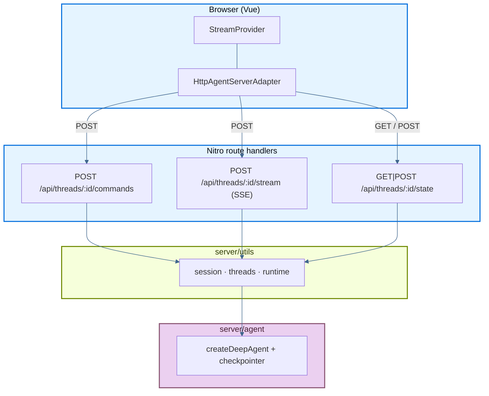

本页介绍了一个示例应用：它将 LangChain **deep agent** 部署在 [Nuxt 4](https://nuxt.com) 项目中，包括流式聊天 UI、subagent 详情视图、thread 历史以及 reasoning-token streaming，全部由作为 Nitro route handlers（HTTP + SSE）实现的 [Agent Streaming Protocol](https://github.com/langchain-ai/agent-protocol/tree/main/streaming) 驱动。无需单独的后端进程。

源码：deployment cookbook 中的 [`js-nuxt`](https://github.com/langchain-ai/deployment-cookbook/tree/main/js-nuxt)。

## 部署

<Tabs>

<Tab title="Vercel">

<Steps>

<Step title="Import the repository">

点击下方 **Deploy with Vercel**，或者手动导入 [`langchain-ai/deployment-cookbook`](https://github.com/langchain-ai/deployment-cookbook)。

<a href="https://vercel.com/new/clone?repository-url=https%3A%2F%2Fgithub.com%2Flangchain-ai%2Fdeployment-cookbook&root-directory=js-nuxt&env=OPENAI_API_KEY&envDescription=OpenAI%20API%20key%20for%20the%20agent%20and%20its%20subagents" target="_blank" rel="noopener noreferrer">
  
</a>

</Step>

<Step title="Configure the project">

将 **Root Directory** 设为 `js-nuxt`，并在项目设置中添加 `OPENAI_API_KEY`。

</Step>

<Step title="Deploy">

部署该项目。Nuxt 会自动检测到 Vercel，并为 Agent Streaming Protocol API 构建 Nitro server routes。

</Step>

</Steps>

</Tab>

<Tab title="Netlify">

<Steps>

<Step title="Import the repository">

点击下方 **Deploy to Netlify**，或者手动导入 [`langchain-ai/deployment-cookbook`](https://github.com/langchain-ai/deployment-cookbook)。

<a href="https://app.netlify.com/start/deploy?repository=https://github.com/langchain-ai/deployment-cookbook&base=js-nuxt" target="_blank" rel="noopener noreferrer">
  
</a>

</Step>

<Step title="Configure the project">

将 **Base directory** 设为 `js-nuxt`。Netlify 会在这个子目录中执行 Nuxt 构建。

</Step>

<Step title="Set environment variables">

在第一次构建完成前，在 Netlify deploy settings 中添加 `OPENAI_API_KEY`。

</Step>

</Steps>

</Tab>

<Tab title="Node">

<Steps>

<Step title="Build for production">

```bash
cd js-nuxt
cp .env.example .env   # set OPENAI_API_KEY for local dev
pnpm install
pnpm build
```

</Step>

<Step title="Set environment variables">

在宿主机上导出 `OPENAI_API_KEY`。Nitro 会在运行时从环境中读取它。

如果需要，你也可以通过添加 [`.env.example`](https://github.com/langchain-ai/deployment-cookbook/blob/main/js-nuxt/.env.example) 中的变量来启用 LangSmith tracing。

</Step>

<Step title="Start the Nitro server">

```bash
node .output/server/index.mjs
```

请在任何能够保持 Node.js 进程持续运行的 process manager 或 container orchestrator 后面运行它。

</Step>

</Steps>

</Tab>

</Tabs>

<Tip>
`@langchain/vue` 会从流中自动识别 subagents，并为每个 subagent 渲染一个可点击 chip。选中某个 chip 后，会打开一个绑定到该 subagent 命名空间 `messages` 与 `tools` channels 的局部聊天视图，底层通过 `useMessages` 实现。Reasoning summaries 则会流式写入一个可折叠的 “Thinking” 区块，并在流式输出期间自动展开。
</Tip>

## 必需的 API endpoints

该应用通过 `/api/threads/...` 暴露 Agent Streaming Protocol。Nitro route handlers 位于 `server/api/threads/` 中。

### Minimum（流式聊天）

以下三个 endpoints 就足够支持使用 `@langchain/vue` 的 `HttpAgentServerAdapter` 运行单线程流式聊天：

| Method | Path | Purpose |
| --- | --- | --- |
| `POST` | `/api/threads/:threadId/commands` | 接收 protocol commands（`run.start` 等），并启动 agent runs |
| `POST` | `/api/threads/:threadId/stream` | 某个 run 的 protocol events SSE 流 |
| `GET` / `POST` | `/api/threads/:threadId/state` | 读取并初始化 checkpointed thread state |

客户端会先通过 `GET /state` 初始化 thread，如果收到 404，再使用 `POST /state`，这样在第一条消息发出前，hydration 就不会因为 404 而失败。

### Optional（thread 侧边栏）

这个示例还实现了 thread-history 侧边栏所需的 endpoints。如果你的 UI 不需要多 thread 管理，可以省略它们：

| Method | Path | Purpose |
| --- | --- | --- |
| `GET` | `/api/threads` | 列出 checkpointer 已知的 threads |
| `DELETE` | `/api/threads/:threadId` | 删除某个 thread 的 session 和 checkpoints |
| `POST` | `/api/threads/:threadId/history` | 分页 checkpoint history（Agent Protocol） |

### 请求流



1. 初始化 thread state（`GET`/`POST /state`）。
2. 提交消息时，SDK 会将 `run.start` 发到 `/commands`，并获得一个 `run_id`。
3. SDK 订阅 `/stream`（SSE）以获取回放和实时 protocol events。
4. Subagent（`task`）runs 会发出具命名空间的 events，并显示为 `stream.subagents`。

## Nitro 后端设计

| Concern | Implementation |
| --- | --- |
| Frontend | `app/` 中的 Vue components（通过 `<ClientOnly>` 包装以支持 SSE） |
| API layer | `server/api/threads/` 中的 Nitro route handlers |
| Runtime | Node.js（Nitro preset 取决于部署目标） |
| SSE replay | 进程级 `LocalThreadSession`（`server/utils/session.ts`） |
| Agent runs | 运行于同一个 Nitro 进程中；events 被缓存在 LangGraph `StreamChannel` 中 |
| Thread storage | 内存型 `MemorySaver` checkpointer（`server/agent/index.ts`） |
| Secrets | 本地通过 `.env`，生产环境通过宿主环境变量 |

Agent 的 checkpointer 是 thread 的唯一事实来源。这里没有客户端缓存：侧边栏始终从服务端拉取，而一旦服务端重启，所有 threads 都会被清空。

## 生产持久化

默认情况下，agent 使用的是内存型 `MemorySaver` checkpointer（`server/agent/index.ts`）和进程级 session map（`server/utils/runtime.ts`）。这在本地开发和单实例服务中没有问题，但在 serverless 或多实例宿主环境中，对话状态**无法**跨冷启动或跨副本持久保存。

在生产环境中，请替换为[持久化 checkpointer](/oss/langgraph/checkpointers#checkpointer-libraries)：

| Package | Backend |
| --- | --- |
| [`@langchain/langgraph-checkpoint-redis`](https://www.npmjs.com/package/@langchain/langgraph-checkpoint-redis) | Redis（`RedisSaver`） |
| [`@langchain/langgraph-checkpoint-postgres`](https://www.npmjs.com/package/@langchain/langgraph-checkpoint-postgres) | Postgres（`PostgresSaver`） |
| [`@langchain/langgraph-checkpoint-sqlite`](https://www.npmjs.com/package/@langchain/langgraph-checkpoint-sqlite) | SQLite（`SqliteSaver`） |

把 `server/agent/index.ts` 中的 `MemorySaver` 替换掉，并把新的 checkpointer 传给 `createDeepAgent`。Nitro route handlers 和 `server/utils/threads.ts` helpers 无需修改。

你还会希望在 `server/utils/runtime.ts` 中引入共享 session / replay store，这样 SSE 重连才能在不同 serverless invocation 之间正常工作。

更多信息请参阅[checkpointer libraries](/oss/langgraph/checkpointers#checkpointer-libraries)和[添加 memory / persistence](/oss/langgraph/add-memory)。

## 本地开发

```bash
cp .env.example .env   # set OPENAI_API_KEY
pnpm install
pnpm dev
```

打开 [http://localhost:3000](http://localhost:3000)。发送一条会委托给 subagents 的 prompt，然后观察它们的工作以独立卡片的形式流式展示出来。

```bash
pnpm build      # production build
pnpm preview    # preview the production build
pnpm typecheck  # vue-tsc over the project
```

## 项目结构

<AccordionGroup>

<Accordion title="Project structure">

- `server/agent/` — deep agent（`createDeepAgent`），包含 `researcher` 和 `math-whiz` subagents、mock tools，以及 `stripReasoningReplay` middleware。
- `server/utils/` — protocol server 逻辑：`session.ts`（SSE runs）、`threads.ts`（基于 checkpointer 的 state）、`serialize.ts`、`runtime.ts`。
- `server/api/threads/` — 上述 protocol endpoints 对应的 Nitro route handlers。
- `app/components/` — Vue 聊天 UI（`ChatApp`、`Chat`、`ThreadHistory`、`SubagentList`、`MessageReasoning` 等），使用 `@langchain/vue`。
- `app/utils/threads.ts` — 服务端驱动的 thread helpers 与 LangGraph SDK bootstrap。

</Accordion>

<Accordion title="Backend details">

- `server/agent/index.ts` — coordinator 通过 Responses API 使用 reasoning model；而会用到 tools 的 subagents 则使用 chat-completions（避免 reasoning items 通过 checkpointer 被重放）。
- `server/agent/middleware.ts` — 根据 `content` + `tool_calls` 重建先前的 assistant messages，确保旧的 reasoning ids 永远不会被重放给 Responses API。
- `server/utils/session.ts` — `LocalThreadSession` 会缓存 protocol events，并通过 `matchesSubscription` 将匹配帧通过 SSE 分发出去。
- `server/api/threads/index.get.ts` — `GET /api/threads`，对应基于 checkpointer 的 thread 列表。
- `server/api/threads/[threadId]/…` — `commands`、`stream`、`state`（GET/POST）、`history` 和 `DELETE` 的 handlers。

</Accordion>

<Accordion title="Frontend details">

- `app/components/ChatThread.vue` — 构建 `HttpAgentServerAdapter`，并调用 `provideStream({ transport, threadId })`。
- `app/components/Chat.vue` — 带 composer 的消息视图，以及按 subagent 作用域显示的详情视图（包含 breadcrumb）。
- `app/components/SubagentList.vue` / `SubagentDetail.vue` — 内联 subagent 卡片与 scoped subagent chat（通过绑定到 namespace 的 `useMessages` 实现）。
- `app/components/MessageReasoning.vue` — reasoning summaries 的可折叠 “Thinking” 区块。

</Accordion>

</AccordionGroup>

## See also

- [Frameworks and platforms overview](/langsmith/deploy-frameworks-and-platforms)
- [Agent Streaming Protocol](https://github.com/langchain-ai/agent-protocol/tree/main/streaming)
- [`react-custom-backend`](https://github.com/langchain-ai/streaming-cookbook) — 自定义 protocol server 的原始 Vite + Hono 参考实现
- [`@langchain/vue`](https://www.npmjs.com/package/@langchain/vue) — `useStream`、`provideStream` 以及 selector composables
- [Frontend overview](/oss/langchain/frontend/overview)
