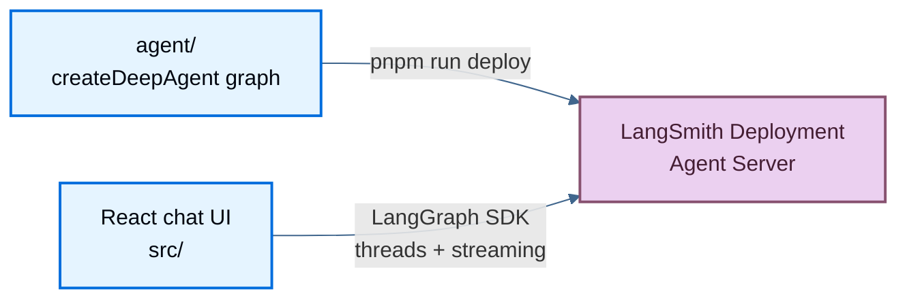

这个示例会带你从本地 checkout 一路走到已部署的 LangChain deep agent 和可用的聊天 UI。后端运行在 [LangSmith Deployment](/langsmith/deployment) 上，前端则是一个从中流式读取的 Vite + React 应用。

当你希望在本地运行 agent、将其部署到 LangSmith，并让 UI 指向已部署的 Agent Server 时，可以使用本指南。

源码：deployment cookbook 中的 [`js-langsmith`](https://github.com/langchain-ai/deployment-cookbook/tree/main/js-langsmith)。

## 你将部署什么

**LangSmith Deployment** 会在 LangSmith 托管的 Agent Server 上运行 LangGraph graph。在这个示例中：

- `agent/` 包含 deep agent graph、subagents、middleware 和 tools。
- `langgraph.json` 告诉 LangGraph CLI 应该服务和部署哪个 graph。
- `src/` 包含 React 聊天 UI。
- UI 通过 LangGraph SDK 和 `@langchain/react` 与 Agent Server API 交互。

部署后的 agent 是一个 coordinator，包含两个 subagents：

- `researcher` 使用本地 `search_web` tool。
- `math-whiz` 使用本地 `calculator` tool。

### 各部分如何协作



在本地开发期间，`pnpm run dev` 会同时启动 LangGraph dev server 和 Vite 应用。在生产环境中，LangSmith 托管 agent，而静态托管平台负责提供 Vite 构建后的 UI。

### 前置条件

- 一个具有 deployment 权限的 [LangSmith API key](/langsmith/create-account-api-key)。
- 一个供 agent model 使用的 OpenAI API key。
- `pnpm`。

## 本地运行

<Steps>

<Step title="Install dependencies">

```bash
cd js-langsmith
pnpm install
```

</Step>

<Step title="Create your environment file">

```bash
cp .env.example .env
```

打开 `.env` 并设置：

```bash
OPENAI_API_KEY=<your OpenAI API key>
```

在本地开发时，让 `LANGSMITH_API_KEY` 和 `VITE_AGENT_API_URL` 保持为空即可。只有在部署或让 UI 连接远程 LangSmith deployment 进行测试时，你才需要 `LANGSMITH_API_KEY`。

</Step>

<Step title="Start the agent and UI">

```bash
pnpm run dev
```

这会同时启动两个进程：

- LangGraph dev server，地址为 [http://localhost:2024](http://localhost:2024)。
- Vite dev server，地址为 [http://localhost:5173](http://localhost:5173)。

</Step>

<Step title="Open the chat">

打开 [http://localhost:5173](http://localhost:5173)。可以试一个会同时用到两个 subagents 的 prompt：

```text
Research LangGraph streaming, and separately calculate 42 * 17.
```

当 `VITE_AGENT_API_URL` 为空时，Vite 应用会使用本地代理 `/api/langgraph`，把请求转发给 LangGraph dev server，从而避免 CORS 问题。

</Step>

</Steps>

## 将 agent 部署到 LangSmith

<Steps>

<Step title="Confirm your environment">

你的 `.env` 必须包含：

```bash
OPENAI_API_KEY=<your OpenAI API key>
LANGSMITH_API_KEY=<your LangSmith API key>
```

你也可以按需设置 deployment 名称：

```bash
LANGSMITH_DEPLOYMENT_NAME=deployment-cookbook-agent
```

如果未设置 `LANGSMITH_DEPLOYMENT_NAME`，deployment 名称会默认使用目录名。

</Step>

<Step title="Deploy the agent to LangSmith">

```bash
pnpm run deploy
```

这会执行 `langgraphjs deploy`。CLI 会根据 `langgraph.json` 部署 `agent/index.ts` 中的 `agent` graph。

</Step>

<Step title="Copy the deployment API URL">

部署完成后，在 LangSmith 中打开对应 deployment 并复制它的 **API URL**。它通常形如：

```text
https://your-app.us.langgraph.app/
```

只使用根 URL，不要附加任何 API path 后缀。

</Step>

<Step title="Test the UI against the remote deployment">

在 `.env` 中设置 `VITE_AGENT_API_URL`：

```bash
VITE_AGENT_API_URL=https://your-app.us.langgraph.app
```

然后运行 UI：

```bash
pnpm run dev
```

当浏览器客户端与远程 deployment 通信时，会复用 `LANGSMITH_API_KEY`。

<Warning>
这个 demo 会把 `LANGSMITH_API_KEY` 暴露给浏览器 bundle，以便 UI 能直接调用 LangSmith deployment。这样做便于本地测试，但不适合生产环境。真实应用应通过你自己的后端做请求代理，并将 key 保持在服务端。
</Warning>

</Step>

</Steps>

## 部署前端

agent 和 UI 是分开部署的。`pnpm run deploy` 成功后，你可以把 Vite 构建产物（`dist/`）部署到任意静态托管平台，并让它指向你的 LangSmith deployment URL。

<Tabs>

<Tab title="Vercel">

<Steps>

<Step title="Import the repository">

点击下方 **Deploy with Vercel**，或者手动导入 [`langchain-ai/deployment-cookbook`](https://github.com/langchain-ai/deployment-cookbook)。

<a href="https://vercel.com/new/clone?repository-url=https%3A%2F%2Fgithub.com%2Flangchain-ai%2Fdeployment-cookbook&root-directory=js-langsmith&env=VITE_AGENT_API_URL,LANGSMITH_API_KEY&envDescription=LangSmith%20deployment%20URL%20and%20API%20key" target="_blank" rel="noopener noreferrer">
  
</a>

</Step>

<Step title="Configure the project">

1. 将 **Root Directory** 设为 `js-langsmith`。
2. 使用默认的 Vite 构建配置，构建输出目录为 `dist/`。
3. 设置以下环境变量：
   - `VITE_AGENT_API_URL`：LangSmith deployment 的根 URL。
   - `LANGSMITH_API_KEY`：demo 客户端使用的 LangSmith API key。

</Step>

</Steps>

</Tab>

<Tab title="Netlify">

<Steps>

<Step title="Import the repository">

点击下方 **Deploy to Netlify**，或者手动导入 [`langchain-ai/deployment-cookbook`](https://github.com/langchain-ai/deployment-cookbook)。

<a href="https://app.netlify.com/start/deploy?repository=https://github.com/langchain-ai/deployment-cookbook&base=js-langsmith" target="_blank" rel="noopener noreferrer">
  
</a>

</Step>

<Step title="Configure the project">

将 **Base directory** 设为 `js-langsmith`。使用默认构建命令（`pnpm build` 或 `npm run build`），发布目录设为 `dist/`。

</Step>

<Step title="Set environment variables">

在部署前于 Netlify 中添加以下变量：

- `VITE_AGENT_API_URL`：LangSmith deployment 的根 URL。
- `LANGSMITH_API_KEY`：demo 客户端使用的 LangSmith API key。

</Step>

</Steps>

</Tab>

<Tab title="Cloudflare Pages">

<Steps>

<Step title="Connect the repository">

在 [Cloudflare dashboard](https://dash.cloudflare.com/) 中，从 [`langchain-ai/deployment-cookbook`](https://github.com/langchain-ai/deployment-cookbook) 创建一个 **Workers & Pages** 项目。

</Step>

<Step title="Configure the build">

- **Root directory**：`js-langsmith`
- **Build command**：`pnpm install && pnpm build`
- **Build output directory**：`dist`

</Step>

<Step title="Set environment variables">

在 Pages 项目设置中添加以下变量：

- `VITE_AGENT_API_URL`：LangSmith deployment 的根 URL。
- `LANGSMITH_API_KEY`：demo 客户端使用的 LangSmith API key。

</Step>

</Steps>

</Tab>

</Tabs>

## 故障排查

- `pnpm run dev` 已启动，但 UI 无法连接：本地开发时让 `VITE_AGENT_API_URL` 保持为空，然后重启 `pnpm run dev`。
- agent 在本地无法响应：确认 `.env` 中已设置 `OPENAI_API_KEY`。
- `pnpm run deploy` 因认证错误失败：确认 `LANGSMITH_API_KEY` 具有 deployment 权限。
- 远程 UI 无法连接：确认 `VITE_AGENT_API_URL` 是 deployment 根 URL，且没有路径后缀。
- 本地开发重启后 threads 消失：本地 `langgraph dev` 使用的是内存版 `MemorySaver`；生产环境中的 LangSmith Deployment 提供持久化存储。
- 你修改了 `agent/` 下的文件，但生产环境没有变化：再次运行 `pnpm run deploy`。

## 了解项目结构

<AccordionGroup>

<Accordion title="Agent files">

LangSmith 后端位于 `agent/`：

```text
agent/
├── index.ts       # createDeepAgent graph
├── middleware.ts  # response middleware
└── tools.ts       # custom code tools
```

`agent/index.ts` 导出了 LangGraph 在本地提供服务、并由 LangSmith 部署的 graph。本地 `MemorySaver` checkpointer 只会在 `langgraph dev` 中使用。进入生产环境后，LangSmith Deployment 会把它替换为基于 Postgres 的持久化存储，而无需修改代码。

</Accordion>

<Accordion title="LangGraph config">

`langgraph.json` 会将 CLI 指向该 graph：

```json
{
  "graphs": {
    "agent": "./agent/index.ts:agent"
  },
  "env": ".env"
}
```

graph id 是 `agent`。前端在流式调用时会把它用作 assistant id。

</Accordion>

<Accordion title="Chat UI">

`src/` 中的 React 应用提供流式聊天、thread 历史、subagent 渲染以及 tool-call 渲染。

前端使用了：

- `client.threads.search()` 来驱动 thread 侧边栏。
- `client.threads.create()` 和 `client.threads.delete()` 管理会话。
- `StreamProvider`，并将 `assistantId` 设为 `"agent"`，用于流式聊天。

底层 thread 与 streaming APIs 请参阅 [Agent Server API reference](/langsmith/server-api-ref)。

</Accordion>

<Accordion title="Local commands">

同时运行两个本地进程：

```bash
pnpm run dev
```

分别运行：

```bash
pnpm run dev:agent
pnpm run dev:web
```

构建并预览前端：

```bash
pnpm build
pnpm preview
```

</Accordion>

<Accordion title="CI/CD">

当 `js-langsmith/agent/` 下的文件或共享配置文件发生变化时，agent 会通过 GitHub Actions 自动部署：

- Workflow: [`.github/workflows/deploy-langsmith-agent.yml`](https://github.com/langchain-ai/deployment-cookbook/blob/main/.github/workflows/deploy-langsmith-agent.yml)
- Action: `langgraphjs deploy` 到 LangSmith。
- 必需 secret：`LANGSMITH_API_KEY`。
- 可选变量：`LANGSMITH_DEPLOYMENT_NAME`。

前端则通过你的静态托管平台 Git integration 来部署，例如 Vercel、Netlify 或 Cloudflare Pages。

</Accordion>

</AccordionGroup>

{/* Not yet supported. */}
{/* ## LangSmith Deployment vs. Managed Deep Agent

This example is a **LangSmith Deployment**. You define the graph in code, deploy it to the LangGraph Agent Server, and stream from the standard Agent Server API.

The sibling [`js-langsmith-managed`](https://github.com/langchain-ai/deployment-cookbook/tree/main/js-langsmith-managed) example deploys the same agent as a **Managed Deep Agent**. In that version, LangChain hosts the agent runtime and you deploy declarative files like `agent.json`, `AGENTS.md`, and `subagents/`.

Use this example when you want full control over graph code, middleware, custom code tools, checkpointing behavior, or the standard Agent Server API. Use `js-langsmith-managed` when you want the least infrastructure and your tools can come from MCP servers. */}

## See also

- [Frameworks and platforms overview](/langsmith/deploy-frameworks-and-platforms)
- [LangSmith Deployment overview](/langsmith/deployment)
- [LangGraph CLI](/langsmith/cli)
- [Deep Agents going to production](/oss/deepagents/going-to-production)
