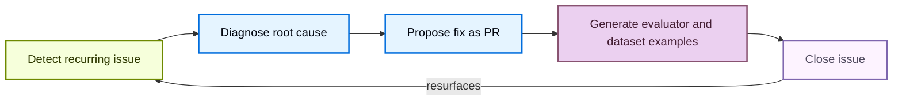

LangSmith Engine 帮助你无需手动翻查 trace 就能交付更可靠的 agent。它是 LangSmith 面向 agent engineering 的 Agent：基于你的生产 trace 工作，它会发现反复出现的问题、诊断其根因，并在开发生命周期的各个阶段推动修复落地。产品概览请参阅 [Engine](/langsmith/engine-overview)。

每个问题都会经历一个闭环，在这个闭环中 Engine 会：

1. 在你的 trace 中检测到重复出现的问题。
2. 对照你的 trace 和已连接的源代码诊断根因。
3. 以 pull request 形式提出修复方案。
4. 生成 evaluator 和 ground truth [dataset examples](/langsmith/manage-datasets) 以捕获回归。
5. 如果问题在关闭后再次出现，则自动重新打开它。



本页介绍如何设置 Engine、走完修复与评估闭环、控制成本，以及路由通知。

## Set up Engine

设置 Engine 分为两步：先由 [Organization Admin](/langsmith/rbac#organization-admin) 为 [workspace](/langsmith/administration-overview#workspaces) 启用 Engine，然后任意用户都可以为各自的 tracing project 配置 Engine。

### Enable Engine for your organization

<Note>你必须是 [**Organization Admin**](/langsmith/rbac#organization-admin) 才能启用 Engine。要查看管理员，请打开 **Settings**，在 **Access and Security** 下选择 **Members**，然后查找具有 **Organization Admin** 角色的成员。</Note>

<Steps>
  <Step title="Open Engine enablement">
    在 [LangSmith console](https://smith.langchain.com) 中，点击左下角的 **Settings**，然后在 **Engine** 下选择 **Engine enablement**。
  </Step>
  <Step title="Toggle Enable Engine">
    打开 **Enable Engine** 开关，并确认 AI features 使用条款。对话框会逐字显示以下产品内提示：

    > LangSmith AI features, powered by LangChain-managed inference, bring intelligence to your observability workflow. With LangSmith AI enabled, your team can surface issues faster, run smarter evaluations, and build more reliable LLM applications. By enabling this feature, your organization's trace data will be processed using LangChain-managed LLM keys. Subject to our Terms of Service.
  </Step>
</Steps>

一旦 Engine 启用，你组织中的任何团队成员都可以为自己的 tracing project 设置它。

<Tip>
  如果你想关闭 Engine，请将同一设置切回 off。这会停止 Engine 的所有自动运行，并终止未来在你账户中的计费。
</Tip>

### Understand LCU costs

Engine 按 **LangChain Compute Units (LCUs)** 收费。LCU 是一种标准化工作量单位，综合了计算、存储、内存和 LLM 开销。LCU 消耗量随被分析的 trace 数量、Engine 为诊断和修复问题而发起的 LLM 调用的数量与复杂度，以及任何已连接仓库的大小而变化。每个 LCU 的价格是 **1.50 美元**。如需估算你预期的 LCU 用量，请参阅 [LangSmith Usage Calculator](https://www.langchain.com/pricing#pricing-calc)。

Engine 分两个阶段运行：

| Phase | Trigger | Typical LCU usage |
|---|---|---|
| **Initialization** | 首次在某个 project 上启用 Engine | 30–40 LCUs |
| **Recurring scans** | 每 6 小时自动运行一次 | 10–15 LCUs |

在初始化阶段，Engine 会审计历史 trace，按严重性聚类并排序问题优先级，并对你的 prompt 或代码提出修复建议，如果已连接代码仓库。后续的定期扫描无论是否发现新问题，都会按 6 小时计划运行，并展示此前未检测到的新问题。

### Set spend limits and monitor usage

Organization Admin 可以在两个层级设置支出上限：

- **Org-wide limit**：打开 **Settings**，在 **Engine** 下选择 **Engine enablement**，然后在 **Monthly LCU spend limit** 中输入数值。
- **Per-project limit**：打开 tracing project 中的 **Engine** 标签页，点击 **Engine Settings** <Icon icon="settings"/> 图标，然后在 **Monthly LCU spend limit** 中设置限制。

你可以用 LCU 或 USD 输入上限，1 LCU = $1.50。当达到限制后，LangSmith 会暂停新的 Engine 运行，直到你提高限制，或下一个月度计费周期开始。

如果留空，则表示允许无限制使用 Engine。若要完全停止 Engine，请使用 **Settings > Engine enablement** 中的 **Enable Engine** 开关。

如需监控用量，你可以在 **Settings** 中的 **Engine enablement** 页面查看整个组织的月度 LCU 支出，或在每个 tracing project 的 [**Engine Settings**](#configure-engine) 面板中查看项目级支出。

### Set up Engine for a tracing project

<Steps>
  <Step title="Open the Engine tab">
    在 [LangSmith console](https://smith.langchain.com) 中，进入 UI 侧边栏的 **Tracing**，选择一个项目，然后点击项目导航中的 **Engine** 标签页。
  </Step>
  <Step title="Connect a code repository (optional)">
    虽然是可选项，但推荐连接一个代码仓库。Engine 会读取你的源代码，定位失败 trace 背后的代码路径，让修复建议扎根于实际实现，并可直接从 issue 创建 pull request。在 **Connect your agent's code repository** 下的 **GitHub Repository** 字段中选择一个仓库。这里只会显示 GitHub app 有权限访问的仓库。点击 **Manage app access →** 可更新权限。如果要为 Engine 提供额外的项目上下文，请在 **Context Hub repository** 字段中选择一个仓库。你可以在 [**Engine Settings**](#configure-engine) 面板中随时更新任一仓库。
  </Step>
  <Step title="Select preference categories (optional)">
    在 **What matters most to you?** 下，选择你希望优先审查的类别，例如 **Tool Call Failures** 或 **Latency**。点击 **+ Add something specific** 可描述自定义关注点。你也可以随时从 [**Engine Settings**](#configure-engine) 面板更新 **Preferences**。
  </Step>
  <Step title="Focus on specific traces (optional)">
    在 **Focus on specific traces** 下，按 run 名称或 metadata 把 Engine 的关注范围收窄到一部分 run。留空则会分析所有 trace。你可以在 [**Engine Settings**](#configure-engine) 面板中随时更新该范围。更多信息请参阅 [Focus on specific traces](#focus-on-specific-traces)。
  </Step>
  <Step title="Start analyzing">
    点击 **Start Analyzing**。对话框可能会基于你项目的用量显示月度成本估算区间。Engine 最多可能需要 20 分钟来分析项目的 trace 并开始提出建议。在等待期间，你可以在 settings 面板中 [set up notifications](#get-notified-about-new-issues)，让系统在发现不同优先级问题时通过 Slack 或 webhook 提醒你。
  </Step>
  <Step title="Review the agent overview document">
    在开始展示问题之前，Engine 会先生成一份 agent overview 文档，根据 trace 描述你的项目目的、架构和关键指标。请审阅并编辑该文档，然后点击 **Accept & Continue** 继续。如果 overview 不准确，请先编辑，因为 Engine 会把它作为后续全部分析的上下文，因此准确性会直接影响问题检测质量。你可以随时从 [**Engine Settings**](#configure-engine) 面板更新它。
  </Step>
</Steps>

<Frame caption="Setup dialog">
  
  
</Frame>

### Focus on specific traces

把 Engine 聚焦到重要的 trace 上，可以让分析更精确，并减少 LCU 的浪费。当一个 project 混合了多个 agent 或工作负载，而你只想让 Engine 分析其中一部分时，就可以使用 trace 范围控制（即 **Focus on specific traces** 控件）。例如，如果某个 project 同时运行一个生产 chatbot 和一个夜间批处理任务，可以将范围设为 `Run Name is chatbot`，让 Engine 忽略批处理 run。默认情况下，Engine 会分析 project 的所有 trace。

你可以在以下两个位置中的任一处设置范围，使用的是同一个控件：

- **Engine setup**：在 **Find and fix your agent's issues** 面板中，**Focus on specific traces** 下。
- **Engine Settings**：在 [**Engine Settings**](#configure-engine) 面板的 **Focus on specific traces** 部分。此处的编辑会自动保存。

可使用与 tracing project 的 **Tracing** 标签页相同的[filter editor](/langsmith/filter-traces-in-application#create-and-apply-filters) 来添加范围条件。每种类型最多可添加一个条件，**最多两条**：

- **Run Name**：选择一个 run 或 agent 名称。值字段会根据你项目近期 trace 中的 run 名称自动补全。
- **Metadata**：选择一个 metadata key，再选择一个值。两者都会根据你项目近期 run 上的 metadata 自动补全。

要添加条件，请从字段选择器中选择类型，填写值，然后点击 **Add**。每个条件会以 chip 形式展示，例如 `Run Name is chatbot` 或 `env is prod`。点击 chip 上的 **×** 可移除该条件。

范围决定了 Engine 会分析哪些 trace 来检测问题、构建 agent overview 文档。初始 setup 时设定的范围会应用于 Engine 的首次扫描。之后再在 [**Engine Settings**](#configure-engine) 面板中修改范围，不会立即重新运行 Engine；它会在下一次扫描时生效，扫描每 6 小时运行一次。

## Browse and filter issues

设置完成后，**Engine** 标签页会在左侧面板显示自动检测到的问题列表。每条记录都包含标题、简短描述、相关 trace 数量，以及该问题最近一次出现的时间。

在列表顶部，你可以点击：

- **Filter issues** 图标，按 **Priority**、**Status** 和 **Tags** 筛选。
- **Sort issues** 图标，按 **Severity**、**Last Updated** 和 **Created** 排序。
- **Engine Settings** <Icon icon="settings"/> 图标，以 [configure Engine](#configure-engine)。

点击任意问题，可在右侧面板中查看详情。

如果设置完成后没有出现任何问题，说明 Engine 没有在已分析的 trace 中发现重复模式。可以等积累更多 trace 后再回来查看。

## Review an issue

点击列表中的任意问题以打开详情面板。顶部的 diagnosis 会描述该问题及其影响。

**Linked Traces** 部分列出了支撑该 diagnosis 的 trace。点击任意 trace 可以打开其详情面板。更多信息请参阅 [Manage a trace](/langsmith/manage-trace)。点击该部分右上角的 [**Add offline examples**](#add-offline-examples)，可根据生产 trace 输入生成自定义 ground truth [dataset examples](/langsmith/manage-datasets)，用于离线评估。

**Proposed Fix** 部分描述了该问题，并给出修复建议。如果已连接仓库，建议中还可能包含具体代码或 prompt 修改。

**Suggested Evaluator** 部分提供了可直接部署的 evaluator，用于在未来 trace 中捕获该问题。如果你在关闭问题后，该 evaluator 再次触发，则该问题会被自动重新打开，表示问题仍然存在。

**Offline Examples** 部分会基于触发该问题的生产 trace 输入，建议可用于离线评估的数据集 example。

## Take action on an issue

### Change priority

从优先级下拉菜单中选择 **Low**、**Medium** 或 **High**，即可更新问题优先级。你还可以选择性提供原因，Engine 会将其作为反馈，以便逐步提升分析质量。

### Create an evaluator

1. 点击 **Create Evaluator**，为该问题部署建议的 evaluator。
2. 配置名称、run filter 和采样率。如有需要，可直接在内置编辑器中修改代码。
3. 启用 **Apply to past runs**，在部署前查看历史 trace 中有多少会被该 evaluator 标记出来。

更多信息请参阅 [Evaluators](/langsmith/evaluators)。

### Add offline examples

1. 点击 **Linked traces** 列表底部的 **Add offline examples**，打开 **Add as offline example** 对话框。
2. 审查每条 trace。对话框会展示输入、agent 产生的错误输出，以及建议的期望输出，它会作为自定义 ground truth example。
3. 点击 **Add to Dataset** 可直接添加，或点击 **Edit in annotation queue** 先审查。
4. 在 annotation queue 中，每个 example 都会展示 run 输入，以及 Engine 根据 trace 分析提出的参考输出，它们会被结构化为命名的 [assertions](/langsmith/assertions)。每条 assertion 都是对正确答案应包含或不应包含内容的简短陈述。你可以按需编辑 assertion，用 **+ Add assertion** 添加新的 assertion，然后点击 **Add to Dataset & Continue** 逐条处理 example。

更多信息请参阅 [Manage datasets](/langsmith/manage-datasets)、[Use annotation queues](/langsmith/annotation-queues) 和 [Use assertions](/langsmith/assertions)。

### Copy the issue prompt

点击 **Copy Fix Context** 复制图标，把包含问题详情的 prompt 保存到剪贴板。之后你可以将它交给 LLM 或 coding assistant，帮助解决该问题。

### Open a pull request

点击 **Open PR**，在已连接仓库中创建一个包含建议修复的 GitHub pull request。创建成功后，该按钮会变为 **View PR**。Engine 可以对任意已连接仓库提出代码修改建议，包括基于 [Deep Agents](/oss/deepagents/overview)、[LangChain](/oss/langchain/overview) 和 [LangGraph](/oss/langgraph/overview) 构建的 agent。

### Resolve or ignore an issue

点击 **Resolve** 将问题标记为已修复，或点击 **Ignore** 将其视为误报或不值得修复。你可以选择性地为任一操作提供原因。

### Reopen an issue

如需重新打开之前关闭的问题，请打开该问题的详情视图并点击 **Reopen**。

## List issues via the CLI

你可以通过 [LangSmith CLI](/langsmith/cli) 以编程方式列出问题。

```bash
# List issues for a project
langsmith project issues list --project <project-name>
```

## Get notified about new issues

当 Engine 打开新问题、把新的 trace 关联到已有问题，或运行失败时，它可以向你发送通知。你可以把这些通知投递到 **Slack channel**、**HTTP webhook endpoint**，或两者同时使用。每个目标都可以单独设置 event type 和最低优先级，因此你可以把高优先级问题路由到 paging webhook，同时把所有问题发往 Slack。

可在 [**Engine Settings**](#configure-engine) 面板中管理通知目标：打开 tracing project 的 **Engine** 标签页，点击 **Engine Settings** <Icon icon="settings"/> 图标，然后在 **Notifications** 下点击 **+ Add destination**。

### Notify a Slack channel

<Steps>
  <Step title="Connect a Slack workspace">
    连接 Slack workspace 是组织级操作，只需执行一次，而不是每个 project 都要做。连接或断开 workspace 需要 `organization:manage` 权限。在 [LangSmith console](https://smith.langchain.com) 中，打开 **Settings**，进入组织的 **General** 设置，然后在 **Slack** 下点击 **Connect Slack**。在 Slack 中授权 LangSmith app。一个 organization 可以连接多个 Slack workspace。
  </Step>
  <Step title="Add a Slack destination">
    在 tracing project 的 **Engine** 标签页中，点击 **Engine Settings** <Icon icon="settings"/> 图标，然后点击 **Add destination**。将 **Deliver to** 字段设为 **Slack**，再在 **Channel** 下选择 workspace 和 channel。
  </Step>
  <Step title="Choose events and priority">
    在 **Notify when** 下，选择哪些 [event types](/langsmith/engine-webhooks#event-types) 会向 channel 发送消息。在 **Minimum priority** 下，选择触发通知的最低 [severity](/langsmith/engine-webhooks#severity-filtering)。点击 **Add destination** 保存。
  </Step>
</Steps>

LangSmith 会自动加入你选择的公开 channel。如果要发往私有 channel，请先在 Slack 中把 LangSmith app 邀请进去。

每条 Slack 消息都会包含问题标题、描述、严重性、返回 LangSmith 的 **View issue** 链接，以及，针对 issue event，还会包含该问题随时间重复出现的图表。如果某个 workspace 的连接失效（例如 app 被从 Slack 中移除），那么该 workspace 下的目标会停止投递，直到你在组织的 **General** 设置中重新连接它。

### Send to a webhook

如果你想把 Engine event 转发到自己的 incident-management、paging 或 chat 工具，请添加一个目标，并将 **Deliver to** 设为 **Webhook**。输入 URL，并可选填写自定义 header。Webhook 投递会带有签名，因此你可以校验其真实性。关于完整 event payload 参考、signing secret 校验和投递语义，请参阅 [Engine webhook events](/langsmith/engine-webhooks)。

## Configure Engine

<Note>
Engine **只使用 LangChain-managed inference**。不支持 Bring Your Own Key (BYOK)，你不能为 Engine 提供自己的 provider API key。
</Note>

在 tracing project 中，点击 **Engine** 标签页上的 **Engine Settings** <Icon icon="settings"/> 图标，打开 **Edit Engine Settings** 面板。你可以在这里配置：

- **Agent overview**：编辑 agent overview 文档，以便随着应用演进，持续保持 Engine 对项目理解的准确性。
- **Preferences**：Engine 应关注、优先或忽略的领域。Engine 会将其视为权威，并在下一次扫描时把它们折入 agent overview 文档。你可以选择 **Cost & Tokens**、**Latency** 或 **Tool Call Failures** 等类别 chip，或点击 **+ Add something specific** 描述自定义关注点。变更会在下一次扫描时生效。
- **Engine spend**：查看该项目的当月至今 Engine LCU 支出。点击 **Set limit** 可设置月度支出上限。达到月度上限后，新的 run 会暂停。
- **Focus on specific traces**：按 run 名称或 metadata 把 Engine 的关注范围收窄到一部分 run。编辑会自动保存，并在下一次扫描时生效。详见 [Focus on specific traces](#focus-on-specific-traces)。
- **Notifications**：点击 **Add destination** 添加 Slack channel 或 webhook 目标，在 Engine 检测到新问题时接收通知。你可以按目标设置最低优先级，以控制哪些问题会触发通知。详见 [Get notified about new issues](#get-notified-about-new-issues)。
- **Code repository**：连接或更新 GitHub 仓库，让 agent 在诊断问题时可以引用源代码。可选设置 **Subfolder** 和 **Branch**（默认为仓库的默认分支）。
- **Context repository**：连接一个 Context Hub 仓库，让 Engine 可以对 instructions、docs 和已关联的 skills 提出修复建议。
- **Pause**：Engine 默认每 6 小时扫描一次 trace。点击 **Pause** 可在不删除已有问题的情况下停止扫描，点击 **Resume** 可恢复扫描。
- **Delete all issues**：此操作无法撤销。所有问题和设置都会被永久删除。

## See also

- [Engine](/langsmith/engine-overview)：产品概览，以及 Engine 在开发生命周期中的定位。
- [Engine webhook events](/langsmith/engine-webhooks)：event payload 参考、signing secret 校验和投递语义。
- [Engine on self-hosted](/langsmith/engine-self-hosted)：自托管架构与数据处理方式。
- [Manage datasets](/langsmith/manage-datasets)、[Use annotation queues](/langsmith/annotation-queues) 和 [Use assertions](/langsmith/assertions)：处理 Engine 生成的离线 example。
- [LangSmith CLI](/langsmith/cli)：以编程方式列出和管理问题。
