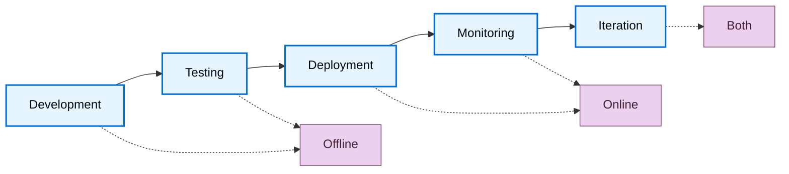

LLM 的输出是非确定性的，因此响应质量往往难以直接判断。Evaluations（evals）就是一种把“什么算好”拆解清楚并加以衡量的方法。LangSmith Evaluation 为整个应用生命周期中的质量衡量提供了一套框架，从部署前测试一直覆盖到生产环境监控。

## 应该评估什么

在构建 evaluations 之前，先明确对你的应用来说什么最重要。把系统拆分为关键组件，例如 LLM 调用、retrieval 步骤、tool 调用、输出格式化等，然后为每一部分定义质量标准。

**从人工整理的例子开始。** 为每个关键组件先创建 5–10 个“好结果应该长什么样”的 examples。这些例子会成为你的 ground truth，并帮助你选择合适的评估方法。例如：
- **RAG 系统**：好的 retrievals（相关文档）和好的 answers（准确、完整）的例子。
- **Agent**：正确 tool 选择、参数格式正确，或 agent 所走 trajectory 正确的例子。
- **Chatbot**：有帮助、符合品牌语气、并能回应用户意图的例子。

当你通过 examples 明确定义了“好”的样子之后，就可以开始衡量系统有多频繁地产生类似质量的输出。

## 离线评估与在线评估

LangSmith 支持两类评估，它们分别服务于开发流程中的不同目的：

### 离线评估

<Icon icon="flask" iconType="solid" /> 离线评估适用于**部署前测试**：
- **Benchmarking**：比较多个版本，找出表现最佳者。
- **Regression testing**：确保新版本不会降低质量。
- **Unit testing**：验证单个组件的正确性。
- **Backtesting**：用历史数据测试新版本。

离线评估的目标是 [_examples_](#examples) 和 [_datasets_](#datasets)：也就是那些带有参考输出、用来定义“什么叫好”的精心整理的测试用例。

### 在线评估

<Icon icon="radar" iconType="solid" /> 在线评估适用于**生产环境监控**：
- **Real-time monitoring**：在真实流量上持续跟踪质量。
- **Anomaly detection**：标记异常模式或边缘场景。
- **Production feedback**：发现值得加入离线数据集的问题样本。

在线评估的目标是来自[tracing](/langsmith/observability-quickstart) 的 [_runs_](#runs) 和 [_threads_](#threads)：也就是没有 reference outputs 的真实生产 traces。

这种目标差异决定了你能评估什么：离线评估可以把结果与期望答案进行 correctness 对照，而在线评估更适合关注质量模式、安全性，以及真实世界行为。

## 评估生命周期

随着你不断开发并[部署应用](/langsmith/deployment)，评估策略也会从部署前测试逐渐扩展到生产环境监控。在开发和测试阶段，离线评估用来基于精心整理的数据集验证功能；部署之后，在线评估则用来监控真实流量上的生产行为。随着应用逐渐成熟，这两类评估会形成一个持续迭代的反馈闭环，从而不断提升质量。

### 1. 在开发阶段使用离线评估

在进入生产环境之前，先用离线评估验证功能、benchmark 不同方案，并建立信心。

可以按照 [quickstart](/langsmith/evaluation-quickstart) 先跑通第一次离线评估。

### 2. 初次部署后接入在线评估

部署完成后，用在线评估来监控生产质量、发现意料之外的问题，并收集真实世界数据。

学习如何[配置在线评估](/langsmith/online-evaluations-llm-as-judge)，用于生产监控。

### 3. 持续改进

把两类评估结合起来，形成一个持续迭代的反馈循环。在线评估会暴露问题，这些问题可以转化为离线测试用例；离线评估再验证修复是否有效；在线评估则进一步确认生产环境中的改进是否成立。

## 核心评估目标

Evaluations 的运行目标，会根据它是 offline 还是 online 而不同。

### 离线评估的目标

离线评估运行在 datasets 和 examples 之上。由于存在 reference outputs，因此可以直接比较预期结果与实际结果。

#### Datasets

Dataset 是一组用于评估应用的 _examples 集合_。每个 example 就是一组测试输入和参考输出。

#### Examples

每个 example 包含：

- **Inputs**：传入应用的输入变量字典。
- **Reference outputs**（可选）：参考输出字典。它们不会传给应用本身，只会供 evaluators 使用。
- **Metadata**（可选）：额外信息字典，可用于在 dataset 上创建筛选视图。

进一步了解[如何管理 datasets](/langsmith/manage-datasets)。

#### Experiment

_Experiment_ 表示：在某个 dataset 上，对某个特定应用版本运行评估后得到的结果集合。每个 experiment 都会记录该 dataset 中每个 example 的输出、evaluator 分数，以及执行 traces。

通常，同一个 dataset 上会运行多个 experiments，用于测试不同的应用配置，例如不同 prompts 或不同 LLM。LangSmith 会展示与该 dataset 关联的所有 experiments，并支持[多 experiment 并排比较](/langsmith/compare-experiment-results)。

学习[如何分析 experiment 结果](/langsmith/analyze-an-experiment)。

### 在线评估的目标

在线评估运行在生产流量中的 runs 和 threads 之上。由于没有 reference outputs，evaluators 更关注于实时发现问题、异常与质量退化。

#### Runs

_Run_ 是一次来自[已部署应用](/langsmith/deployment)的执行 trace。每个 run 包含：
- **Inputs**：应用实际收到的用户输入。
- **Outputs**：应用实际返回的输出。
- **Intermediate steps**：所有 child runs，例如 tool calls、LLM calls 等。
- **Metadata**：标签、用户反馈、延迟指标等。

与 datasets 中的 example 不同，run 没有 reference outputs。因此在线 evaluators 无法知道“正确答案”应该是什么，只能依赖质量启发式、安全检查，以及 reference-free 的评估方式来判断质量。

关于 runs 和 traces 的更多信息，请参阅[Observability concepts 中的 runs 部分](/langsmith/observability-concepts#runs)。

#### Threads

_Threads_ 是一组相关 runs 的集合，通常代表多轮对话。在线 evaluators 也可以直接运行在 thread 层面，从而评估整段对话，而不只是某一个单独 turn。这样你就可以衡量跨轮一致性、话题维持，以及整段交互中的用户满意度等会话级属性。

## Evaluators

_Evaluators_ 是 workspace 级别的资源，用于对应用表现打分。它们为 offline 和 online evaluation 都提供统一的“测量层”，只是会根据可用数据自动调整输入。由于 evaluator 的作用域是 workspace，因此你可以把同一个 evaluator 复用到多个 tracing projects 和 datasets 上，而无需每次重新创建。

运行 evaluators 的方式包括：

- 使用 [Evaluators](/langsmith/evaluators) 页面，把它们挂到 tracing projects 或 datasets 上
- 使用 [Playground](/langsmith/prompt-engineering-concepts#playground)
- 使用 LangSmith SDK（[Python](https://docs.smith.langchain.com/reference/python/reference) 和 [TypeScript](https://docs.smith.langchain.com/reference/js)）
- 使用 [Rules](/langsmith/rules)，自动在 tracing projects 或 datasets 上运行

### 将 evaluator 附加到 tracing project 或 dataset

同一个 evaluator 可以附加到多个 tracing projects 和 datasets 上。像采样率、过滤器和[支出上限](/langsmith/evaluator-spend)这样的配置，是针对每个已附加的 project 或 dataset 单独设置的，而不是针对 evaluator 本身统一设置。你可以在 evaluator 的 **Projects & Datasets** 标签页下查看它当前附加到哪些 projects 和 datasets。

### Evaluator 输入

Evaluator 的输入会随着评估类型不同而变化：

**Offline evaluators** 会接收：
- [Example](#examples)：来自[dataset](#datasets)的 example，包含 inputs、reference outputs 和 metadata。
- [Run](/langsmith/observability-concepts#runs)：应用在该 example.inputs 上执行后得到的实际 outputs 与中间步骤。

**Online evaluators** 会接收：
- [Run](/langsmith/observability-concepts#runs)：生产 trace，包含 inputs、outputs 与中间步骤（没有 reference outputs）。

### Evaluator 输出

Evaluators 会返回 **feedback**，也就是评估分数。Feedback 可以是一个字典，或一个字典列表。每个字典通常包含：

- `key`：指标名称。
- `score` | `value`：指标值（数值型指标使用 `score`，分类型指标使用 `value`）。
- `comment`（可选）：对分数的额外解释或推理说明。

### 评估技术

LangSmith 支持多种评估方式：

- [Human](#human)
- [Code](#code)
- [LLM-as-judge](#llm-as-judge)
- [Pairwise](#pairwise)

#### Human

_Human evaluation_ 指的是人工审查应用输出与执行 traces。它[往往是开始做评估时非常有效的起点](https://hamel.dev/blog/posts/evals/#looking-at-your-traces)。LangSmith 提供了查看应用输出和 traces（包括所有中间步骤）的工具。

**Annotation queues**

[Annotation queues](/langsmith/annotation-queues) 可以帮助你更高效地收集结构化人工反馈。它们与[行内标注](/langsmith/annotate-traces-inline)互补，提供更有组织的工作流、预定义 rubric、团队协作能力，以及进度跟踪。

LangSmith 支持两种队列类型：

- **Single-run queues**：一次审查一个 run，并根据自定义 rubric 打分。适合做问题分拣，或把生产 traces 转成 datasets。Single-run queues 还支持 [assertions](/langsmith/assertions)，也就是自由形式的验收标准，后续可由 offline evaluator 对未来 runs 进行评分。
- **Pairwise queues**：并排比较两个 runs，判断哪一个更好。适合在不同 experiments 之间快速做 A/B 对比。

关键特性包括：为同一 run 配置多个 reviewer、通过 reservation 机制避免冲突，以及把标注好的 runs 直接导出到 datasets，供后续评估使用。

#### Code

_Code evaluators_ 是确定性的、基于规则的函数。它们很适合做诸如：检查 chatbot 响应结构是否为空、验证生成代码能否编译，或者判断分类结果是否完全匹配等。

#### LLM-as-judge

_LLM-as-judge evaluators_ 使用 LLM 来为应用输出打分。评分规则和标准通常被编码在 grader prompt 中。这类 evaluators 可以分为：

- **Reference-free**：不依赖参考答案，例如检查输出是否包含冒犯内容，或是否符合某些具体标准。
- **Reference-based**：将输出与参考答案进行比较，例如检查相对于 reference 的事实准确性。

LLM-as-judge evaluators 通常需要仔细审查评分结果，并持续调优 prompt。Few-shot evaluators，也就是在 grader prompt 中加入输入、输出和期望评分示例的做法，往往能显著提升效果。

了解[如何定义一个 LLM-as-a-judge evaluator](/langsmith/llm-as-judge)。

#### Pairwise

_Pairwise evaluators_ 会比较两个应用版本的输出，比较方式可以是启发式规则（例如哪个响应更长）、LLM（使用 pairwise prompt），或人工 reviewer。

Pairwise evaluation 特别适合这样一种场景：直接给单个输出打分很难，但判断两个输出哪一个更好却很容易。例如在摘要任务中，选择两个摘要里哪个信息量更大，往往比给某个摘要打一个绝对分数要容易。

学习[如何运行 pairwise evaluations](/langsmith/evaluate-pairwise)。

### Reference-free 与 reference-based evaluators

理解一个 evaluator 是否需要 reference outputs，对于判断它可以在哪些场景使用非常关键。

**Reference-free evaluators** 不依赖期望输出，也能评估质量。它们同时适用于 offline 和 online evaluation：
- **Safety checks**：例如 toxicity 检测、PII 检测、内容策略违规检测
- **Format validation**：例如 JSON 结构、必填字段、schema 合规性
- **Quality heuristics**：例如响应长度、延迟、特定关键词
- **Reference-free LLM-as-judge**：例如 clarity、coherence、helpfulness、tone

**Reference-based evaluators** 需要 reference outputs，因此只适用于 offline evaluation：
- **Correctness**：与参考答案的语义相似性
- **Factual accuracy**：相对于 ground truth 的事实核对
- **Exact match**：带标准标签的分类任务
- **Reference-based LLM-as-judge**：把输出质量与 reference 进行比较

在设计评估策略时，reference-free evaluators 更适合作为离线测试与在线监控都能复用的一致性检查，而 reference-based evaluators 则更适合在开发阶段执行更精确的 correctness 验证。

## 评估类型

LangSmith 支持多种评估方式，适用于开发与部署的不同阶段。理解何时使用哪一种，有助于构建完整的评估策略。

Offline 与 online 评估承担不同职责：
- **Offline evaluation types**：在部署前，基于带 reference outputs 的精心整理数据集进行测试
- **Online evaluation types**：在部署后，基于真实流量监控生产行为，不依赖 reference outputs

进一步了解[评估类型及其适用时机](/langsmith/evaluation-types)。

## 最佳实践

### 构建 datasets

构建数据集有多种策略：

**人工整理 examples**

这是推荐的起点。先创建 10–20 个高质量 examples，覆盖常见场景和边缘情况。这些例子就是你对“好结果”的明确定义。

**历史 traces**

进入生产环境后，可以把真实 traces 转化为 examples。对于高流量应用：
- **User feedback**：把收到负面反馈的 runs 加入测试集。
- **Heuristics**：用规则找出有代表性的 runs，例如延迟长、错误多的情况。
- **LLM feedback**：使用 LLM 去识别值得关注的对话。

**Synthetic data**

基于已有 examples 生成更多样本。最好的做法通常是：先从若干高质量人工编写 examples 开始，再把它们作为模板扩展。

### Dataset 组织方式

**Splits**

Splits 是 dataset 的命名子集，用于把 examples 划分为不同分组。常见模式包括：

- **ML 风格 splits**：把 examples 划分成 training、validation 和 test sets，用于避免过拟合，即模型在训练数据上表现很好，但在未见过的数据上表现很差。
- **按类别分组**：当 dataset 横跨多个任务类型时，分别评估不同输入类别。
- **分阶段 rollout**：把探索性 examples 单独隔离，等准备好后再并入主评估集合。

Splits 与 metadata 不同：splits 用于做高层的评估分组，而 metadata 更适合存放标签、来源等单个 example 层面的信息。

在机器学习中，最佳实践通常是每个 example 只属于一个 split。LangSmith 则允许一个 example 同时属于多个 splits，这在一个样本适用于多个评估类别时非常有用。

学习如何[创建和管理 dataset splits](/langsmith/manage-datasets-in-application#create-and-manage-dataset-splits)。

**Versions**

当 examples 发生变化时，LangSmith 会自动创建 dataset [versions](/langsmith/manage-datasets#version-a-dataset)。你可以通过[给版本打标签](/langsmith/manage-datasets#tag-a-version)来标记重要里程碑。在 CI pipeline 中指定某个版本，可以确保 dataset 更新不会悄悄破坏既有工作流。

### 收集人工反馈

在人类主观质量维度上，人工反馈往往仍然是最有价值的评估方式。

**Annotation queues**

[Annotation queues](/langsmith/annotation-queues) 支持结构化收集人工反馈。你可以把特定 runs 标记出来供人工审查，在统一界面中收集 annotations，再把这些已标注 runs 转移到 datasets 中，供未来评估使用。

Annotation queues 与[行内标注](/langsmith/annotate-traces-inline)互补，额外提供了更多能力，例如对 runs 分组、定义评审标准，以及配置 reviewer 权限。

### Evaluations 与 testing 的区别

Testing 和 evaluation 相似，但并不完全相同。

**Evaluation 是按照某种指标去衡量表现。** 这些指标可以是模糊的、主观的，而且通常更适合用于相对比较，也就是拿两个系统彼此对照。

**Testing 是在断言系统是否正确。** 一个系统只有通过了全部 tests，才能被部署。

很多 evaluation metrics 其实也可以转化为 tests。例如，regression tests 可以断言：新版本在关键指标上必须优于 baseline。对于那些运行成本较高的系统，把 tests 和 evaluations 一起执行，往往更高效。

Evaluations 也完全可以使用标准测试工具来编写，例如 [pytest](/langsmith/pytest) 或 [Vitest/Jest](/langsmith/vitest-jest)。

## 快速参考：Offline vs online evaluation

下表总结了 offline 与 online evaluations 的关键区别：

| | **Offline Evaluation** | **Online Evaluation** |
|---|---|---|
| **Runs on** | Dataset（Examples） | Tracing Project（Runs/Threads） |
| **Data access** | Inputs、Outputs、Reference Outputs | Inputs、Outputs only |
| **When to use** | 部署前、开发阶段 | 生产环境、部署之后 |
| **Primary use cases** | Benchmarking、unit testing、regression testing、backtesting | Real-time monitoring、production feedback、anomaly detection |
| **Evaluation timing** | 面向精心整理测试集的批处理 | 基于真实流量的实时或近实时处理 |
| **Setup location** | Evaluation tab（SDK、UI、Playground） | [Observability tab](/langsmith/online-evaluations-llm-as-judge)（自动规则） |
| **Data requirements** | 需要整理 dataset | 不需要 dataset，直接评估 live traces |
