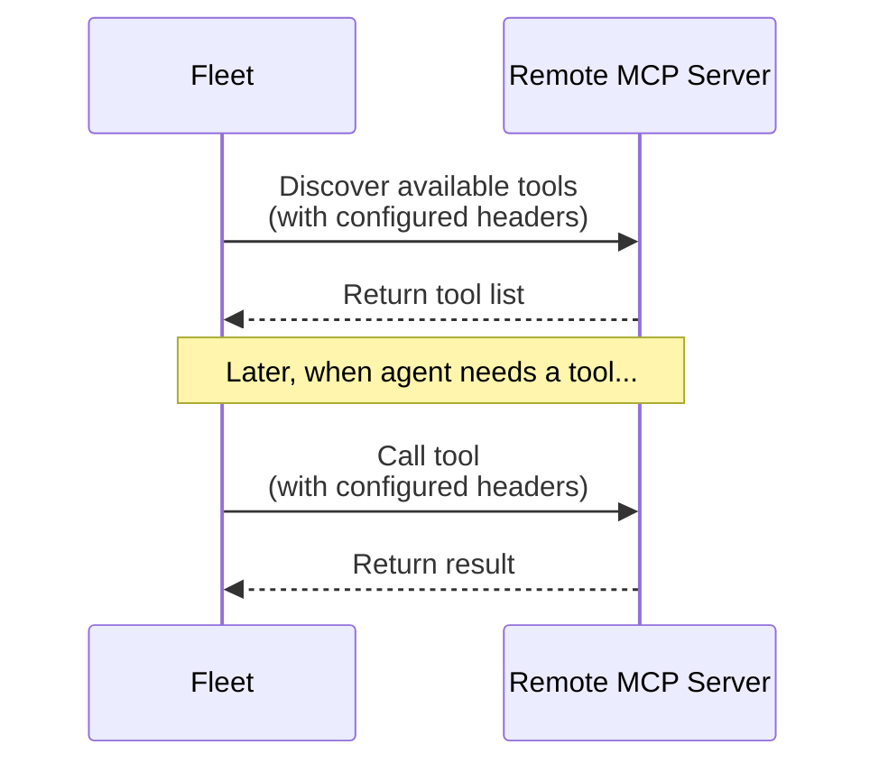

你可以将 LangSmith Fleet 连接到远程 MCP servers，从而为 agents 扩展更多工具和集成能力。本页介绍如何添加自定义 MCP servers，并提供一些常见远程 servers 的配置说明。

[MCP（Model Context Protocol）server](https://modelcontextprotocol.io/docs/getting-started/intro) 会暴露 agent 在运行时可调用的工具。

远程 MCP server：

- 运行在 LangSmith 之外，通常通过 HTTPS 提供服务。
- 自行负责认证和授权。
- 充当你的 agent 与外部系统之间的桥梁。

LangSmith Fleet 本身并不会执行这些工具，它只会把请求转发给 MCP server，并把结果返回给 agent。

### 工作原理

- Fleet 通过标准 MCP 协议从远程 MCP servers 发现工具。
- 你在 workspace 中配置的 headers，会在抓取工具或调用工具时自动附带。Headers 是随每个 HTTP 请求发送到 MCP server 的键值对，通常用于认证（例如 API key 或 bearer token），也可以用来传递配置信息、内容类型或自定义 metadata。
- 远程 server 暴露出来的工具，会与 Fleet 内置工具一起供 agent 使用。

**Runtime**：Fleet 会自动连接到你的 MCP server 并使用其中的工具。

## 添加远程 MCP server

你可以直接从 agent 配置页或 workspace settings 中添加 MCP servers。

<Note>
添加 MCP servers 需要 **MCP Server Create** 权限。Workspace 管理员可以在 workspace settings 中把该权限授予用户。
</Note>

### 添加到某个特定 agent

如果你想把远程 MCP server 添加到某个特定 agent：

<Steps>
  <Step title="Open the agent editor">
    在 [Fleet](https://smith.langchain.com/agents) inbox 中打开你的 agent。然后在 agent 名称旁点击 <Icon icon="pencil"/> **Edit Agent** 图标。
  </Step>
  <Step title="Add the MCP server">
    在 **Toolbox** 区域中点击 **MCP**。输入 server 名称和 URL，然后配置认证方式（参见[认证类型](#authentication-types)）。
  </Step>
  <Step title="Save your agent">
    点击 **Save changes**。Fleet 会从你的 MCP server 中发现可用工具，并让该 agent 可以使用它们。
  </Step>
</Steps>

### 添加到 workspace 中所有 agents

如果你想把远程 MCP server 添加到 workspace 中所有 agents：

<Tabs>
  <Tab title="From Fleet > Integrations">

    <Steps>
      <Step title="Navigate to Fleet > Integrations">
        在 LangSmith UI 中，进入 [**Fleet** > **Integrations**](https://smith.langchain.com/agents/tools) 标签页。
      </Step>

      <Step title="Add the server">
        1. 点击左侧边栏底部的 **+ Custom MCP**。
        1. 为这个 MCP server 填写 **Name**。
        1. 填写 MCP **URL**（例如 `https://api.example.com/mcp`）。
        1. 选择 **Authentication** 类型。更多信息请参阅[认证类型](#authentication-types)。
      </Step>

      <Step title="Save the server">
        点击 **Save server**。Fleet 会自动发现该 MCP server 暴露的工具，并让它们在你的 agents 中可用。配置好的 headers 会同时应用在工具发现请求和工具执行请求中。
      </Step>
    </Steps>
  </Tab>
  <Tab title="From workspace settings">
    <Steps>
      <Step title="Navigate to MCP server settings">
        在 LangSmith UI 中，进入 [Settings > MCP servers](https://smith.langchain.com/settings/workspaces/mcp-servers) 标签页。
      </Step>
      <Step title="Add the server">
        点击 **Add server**，输入 server 名称和 URL，然后配置认证方式（参见[认证类型](#authentication-types)）。
      </Step>
      <Step title="Save the server">
        点击 **Save server**。Fleet 会自动发现该 MCP server 暴露的工具，并让它们在你的 agents 中可用。配置好的 headers 会同时应用在工具发现请求和工具执行请求中。
      </Step>
    </Steps>
  </Tab>
</Tabs>

### 认证类型

请根据 server 的要求选择认证类型：

- **Headers**：添加每次请求都会发送的键值对。最常见的模式是使用 Authorization bearer token：
    - **Key**：`Authorization`
    - **Value**：`Bearer API_KEY`

    <Info>
    如果你的 MCP server 还需要其他认证或配置参数，也可以添加多个 headers。每个 header 键值对都会随发送给 server 的每一次请求一起带上。
    </Info>

- **OAuth 2.1 (Auto)**：适用于通过动态 client registration 支持 OAuth 的 servers。你会被提示使用该服务对应的账号登录。
- **OAuth 2.1 (Manual)**：适用于支持 OAuth、但需要你事先指定 client ID/secret 的 servers。此流程中使用的 OAuth providers 必须启用 **PKCE**。

## 更新 MCP server URL

<Warning>
修改自定义 MCP server 的 URL 会导致所有使用该 server 工具的 agents 失效。
</Warning>

Fleet 是按 MCP server URL 来保存工具引用的。如果你更新了某个自定义 MCP server 的 URL，现有 agents 在尝试调用这些工具时会失败，因为保存下来的 URL 已经不再匹配。

如果要更新 MCP server URL：

1. 在 workspace settings 中更新你的 MCP server URL。
2. 对于每个正在使用该 server 工具的 agent：
   - 从 agent 配置中移除受影响的工具。
   - 再重新添加这些工具（它们现在会引用新的 URL）。
3. 测试 agent，确认工具已恢复正常工作。

## 支持的 servers

如果要查看所有可用 MCP servers 及其配置细节，请前往 [Fleet > Integrations 标签页](https://smith.langchain.com/agents/tools)。
