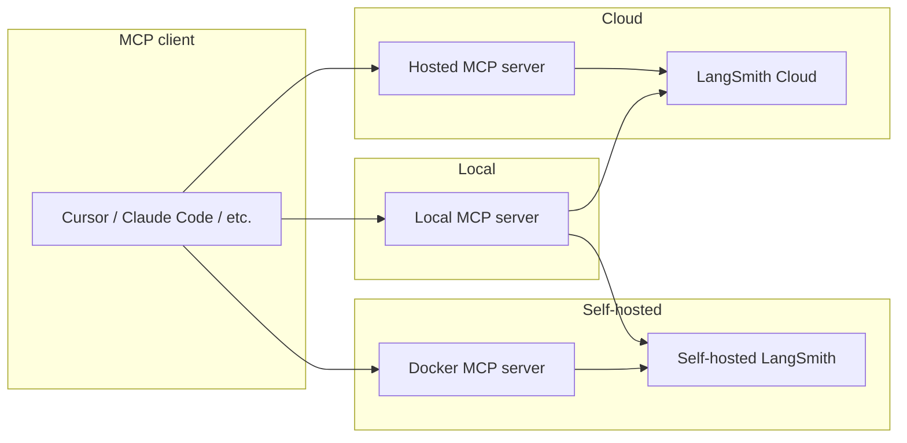

import SaasRegionUrls from '/snippets/langsmith/saas-region-urls.mdx';

<Warning>
**已弃用，请改用 [LangSmith Remote MCP](/langsmith/langsmith-remote-mcp)。**

LangSmith 现在已经在 LangSmith Cloud 以及 [self-hosted LangSmith](/langsmith/self-hosted) v0.15 或更高版本上托管了一个基于 OAuth 认证的远程 MCP server。Cloud endpoint：

<SaasRegionUrls prefix="api.smith" suffix="/mcp" />

BYOC endpoint：`https://<data_plane_url>/api/mcp`，其中 `<data_plane_url>` 是你的 [BYOC](/langsmith/byoc) data plane URL。

自托管 endpoint：`https://<your-langsmith-host>/api/mcp`。

它提供与本页所述独立 server 相同的工具面，但认证方式是 OAuth 2.1 + 动态客户端注册，不需要 API key、不需要单独部署，也不需要配置请求头。

本页所述的独立 server 仍然是以下场景的受支持方案：自托管部署版本早于 v0.15，或者用户更希望自行运行 server。
</Warning>

LangSmith MCP Server 是一个与 [LangSmith](https://smith.langchain.com) 集成的 [Model Context Protocol](https://modelcontextprotocol.io/introduction)（MCP）server。它允许兼容 MCP 的客户端（例如 AI 编码助手）读取 [会话历史](/langsmith/observability-concepts#threads)、[prompts](/langsmith/manage-prompts-programmatically)、[runs 与 traces](/langsmith/observability-concepts#runs)、[datasets](/langsmith/evaluation-concepts#datasets)、[experiments](/langsmith/evaluation-concepts#experiment) 和账单用量信息。

## 示例用例

- **Conversation history**: “获取我在项目 `my-chatbot` 中 thread `thread-123` 的会话历史”
- **Prompt management**: “获取所有公开 prompts” 或 “拉取 `legal-case-summarizer` prompt 的模板”
- **Traces and runs**: “获取项目 `alpha` 最近 10 个 root runs” 或 “按 UUID 获取某条 trace 的所有 runs”
- **Datasets**: “列出所有 chat 类型数据集” 或 “读取数据集 `customer-support-qa` 中的 examples”
- **Experiments**: “列出数据集 `my-eval-set` 的 experiments，并带上延迟和成本指标”
- **Billing**: “获取 2025 年 9 月的账单使用情况”

<Tip>
**在代码或 Fleet 中使用该 server**

- 如果你想在 Python 应用中连接并使用远程 MCP server（包括本 server），请参见 [MCP (Model Context Protocol)](/oss/langchain/mcp)。
- 如果你想在 Fleet 中连接并使用该 server，请参见 [Remote MCP servers](/langsmith/fleet/remote-mcp-servers)。
</Tip>

## 快速开始（托管版）

LangSmith MCP Server 提供了通过 [LangSmith Remote MCP](/langsmith/langsmith-remote-mcp) 访问的托管版本，因此你无需自己运行 server。

- **URL:** `https://api.smith.langchain.com/mcp`
- **认证方式:** 交互式 MCP 客户端使用 OAuth 2.1。程序化 API key 访问请参见 [LangSmith Remote MCP 认证](/langsmith/langsmith-remote-mcp#authentication)。

**示例（Cursor `mcp.json`）：**

```json
{
  "mcpServers": {
    "langsmith": {
      "url": "https://api.smith.langchain.com/mcp"
    }
  }
}
```

MCP 客户端在首次连接时会打开一个浏览器窗口以完成 OAuth 流程。

## 可用工具

### Conversation and threads

| Tool | Description |
|------|-------------|
| `get_thread_history` | 获取会话线程的消息历史。使用基于字符数的分页：传入 `page_number`（从 1 开始），再用返回的 `total_pages` 获取更多页面。可选参数：`max_chars_per_page`、`preview_chars`。 |

### Prompt management

| Tool | Description |
|------|-------------|
| `list_prompts` | 列出 prompts，可按可见性（public/private）和数量限制过滤。 |
| `get_prompt_by_name` | 按精确名称获取单个 prompt（详情和模板）。 |
| `push_prompt` | 仅文档用途：说明如何创建并推送 prompt 到 LangSmith。 |

### Traces and runs

| Tool | Description |
|------|-------------|
| `fetch_runs` | 从一个或多个项目中获取 runs（traces、tools、chains 等）。支持过滤条件（`run_type`、`error`、`is_root`）、FQL（`filter`、`trace_filter`、`tree_filter`）以及排序。当设置了 `trace_id` 时，结果使用基于字符数的分页；否则单次最多返回 `limit` 条。始终请传入 `limit` 和 `page_number`。 |
| `list_projects` | 列出项目，可按名称、dataset 和详情级别过滤。 |

### Datasets and examples

| Tool | Description |
|------|-------------|
| `list_datasets` | 列出数据集，可按 ID、类型、名称或元数据过滤。 |
| `list_examples` | 按数据集 ID/名称或 example ID 列出 examples；支持 filter、metadata、splits，以及可选的 `as_of` 版本。 |
| `read_dataset` | 按 ID 或名称读取单个数据集。 |
| `read_example` | 按 ID 读取单个 example，并支持可选的 `as_of` 版本。 |
| `create_dataset` | 仅文档用途：说明如何创建数据集。 |
| `update_examples` | 仅文档用途：说明如何更新数据集中的 examples。 |

### Experiments and evaluations

| Tool | Description |
|------|-------------|
| `list_experiments` | 列出某个数据集对应的 experiment（reference）项目。需要提供 `reference_dataset_id` 或 `reference_dataset_name`。返回指标包含延迟、成本和反馈。 |
| `run_experiment` | 仅文档用途：说明如何运行 experiments 和 evaluations。 |

### Billing

| Tool | Description |
|------|-------------|
| `get_billing_usage` | 获取某个时间范围内的组织账单使用情况（例如 trace 数量）。可选按工作区过滤。 |

### 分页（基于字符数）

对于会返回大体积 payload 的工具，系统使用**字符预算分页**，以确保响应不会超过大小限制：

- **适用工具：** `get_thread_history` 和 `fetch_runs`（设置 `trace_id` 时）。
- **参数：** 每次请求都要传入 `page_number`（从 1 开始）。可选参数：`max_chars_per_page`（默认 25000，最大 30000）、`preview_chars`（用 `"... (+N chars)"` 截断超长字符串）。
- **响应：** 包含 `page_number`、`total_pages` 和当前页 payload。继续请求更多页时，依次传入 `page_number = 2`、`3`，直到 `total_pages`。
- **优点：** 页面是按字符数而不是条目数构建的；不依赖 cursor，也没有服务端状态，只需传页码。

## 安装（本地运行）

如果你更希望在本地运行 server（或者使用 self-hosted LangSmith endpoint），请安装它并配置你的 MCP 客户端。

### 前置条件

1. 安装 [uv](https://github.com/astral-sh/uv)（Python 包安装器）：
   ```bash
   curl -LsSf https://astral.sh/uv/install.sh | sh
   ```

2. 安装包：
   ```bash
   uv run pip install --upgrade langsmith-mcp-server
   ```

### MCP 客户端配置

将 server 添加到你的 MCP 客户端配置中。`command` 的值请使用 `which uvx` 的实际路径。

**PyPI / uvx:**

```json
{
  "mcpServers": {
    "LangSmith API MCP Server": {
      "command": "/path/to/uvx",
      "args": ["langsmith-mcp-server"],
      "env": {
        "LANGSMITH_API_KEY": "your_langsmith_api_key",
        "LANGSMITH_WORKSPACE_ID": "your_workspace_id",
        "LANGSMITH_ENDPOINT": "https://api.smith.langchain.com"
      }
    }
  }
}
```

**从源码运行**（先 clone [langsmith-mcp-server](https://github.com/langchain-ai/langsmith-mcp-server)）：

```json
{
  "mcpServers": {
    "LangSmith API MCP Server": {
      "command": "/path/to/uv",
      "args": [
        "--directory",
        "/path/to/langsmith-mcp-server",
        "run",
        "langsmith_mcp_server/server.py"
      ],
      "env": {
        "LANGSMITH_API_KEY": "your_langsmith_api_key",
        "LANGSMITH_WORKSPACE_ID": "your_workspace_id",
        "LANGSMITH_ENDPOINT": "https://api.smith.langchain.com"
      }
    }
  }
}
```

请将 `/path/to/uv`、`/path/to/uvx` 和 `/path/to/langsmith-mcp-server` 替换为你的实际路径。

## Docker 部署（HTTP-streamable）

你可以用 Docker 将该 server 作为一个 HTTP 服务运行，这样客户端就能通过 HTTP-streamable 协议连接。

1. 构建并运行：
   ```bash
   docker build -t langsmith-mcp-server .
   docker run -p 8000:8000 langsmith-mcp-server
   ```
   Dockerfile 和上下文请使用 [langsmith-mcp-server](https://github.com/langchain-ai/langsmith-mcp-server) 仓库中的内容。

2. 将 MCP 客户端连接到 `http://localhost:8000/mcp`，并带上 `LANGSMITH-API-KEY` 请求头（可选再加 `LANGSMITH-WORKSPACE-ID`、`LANGSMITH-ENDPOINT`）。

3. 健康检查（无需认证）：
   ```bash
   curl http://localhost:8000/health
   ```

完整 Docker 与 HTTP-streamable 说明请参见 [LangSmith MCP Server 仓库](https://github.com/langchain-ai/langsmith-mcp-server)。

## 部署概览

使用**托管版** MCP server 连接 [LangSmith Cloud](/langsmith/cloud)（`smith.langchain.com`、`eu.smith.langchain.com`、`apac.smith.langchain.com` 或 `aws.smith.langchain.com`）。如果你想连接 Cloud 或 [self-hosted LangSmith](/langsmith/self-hosted)，可以在本地[运行 server](#installation-run-locally)并设置 `LANGSMITH_ENDPOINT`。对于自托管部署，你也可以在 VPC 内部通过 [Docker image](#docker-deployment-http-streamable) 运行 server。



## 环境变量

| Variable | Required | Description |
|----------|----------|-------------|
| `LANGSMITH_API_KEY` | Yes | Your [LangSmith API key](/langsmith/create-account-api-key) for authentication. |
| `LANGSMITH_WORKSPACE_ID` | No | Workspace ID when your API key has access to multiple workspaces. |
| `LANGSMITH_ENDPOINT` | No | API endpoint URL (for [self-hosted](/langsmith/self-hosted) or custom regions). Default: `https://api.smith.langchain.com`. |

对于**托管版** server，请使用同名请求头：`LANGSMITH-API-KEY`、`LANGSMITH-WORKSPACE-ID`、`LANGSMITH-ENDPOINT`。

## TypeScript 实现

社区维护了一个官方 Python server 的 TypeScript/Node.js 移植版本。运行方式：`LANGSMITH_API_KEY=your-key npx langsmith-mcp-server`。

源码与包地址：[GitHub](https://github.com/amitrechavia/langsmith-mcp-server-js) · [npm](https://www.npmjs.com/package/langsmith-mcp-server)。维护者为 [amitrechavia](https://github.com/amitrechavia)。
