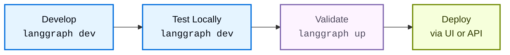

本指南介绍如何在本地开发和测试 [Agent Server](/langsmith/agent-server) 应用。[LangGraph CLI](/langsmith/cli) 为本地开发提供了两个命令，它们分别针对工作流中的不同阶段进行了优化：

- [`langgraph dev`](#langgraph-dev)：轻量级开发服务器，适合快速迭代。
- [`langgraph up`](#langgraph-up)：类生产环境测试，用于验证。

| Feature | `langgraph dev` | `langgraph up` |
|---------|----------------|----------------|
| **Docker required** | No | Yes |
| **Installation** | `pip install langgraph-cli[inmem]` | `pip install langgraph-cli` |
| **Primary use case** | Rapid development & testing | Production-like validation |
| **State persistence** | In-memory & pickled to local directory | PostgreSQL |
| **Hot reloading** | Yes (default) | Optional (`--watch` flag) |
| **Default port** | `2024` | `8123` |
| **Resource usage** | Lightweight | Heavier (build and run separate docker containers for the server, PostgreSQL, and Redis) |
| **IDE Debugging** | Built-in [DAP](https://microsoft.github.io/debug-adapter-protocol/) support | Regular container debugging |
| **Custom auth** | Yes | Yes (with license key) |

<Tip>
完整参考说明请参见 [LangGraph CLI reference](/langsmith/cli) 页面。
</Tip>

## 开发流程

下面是构建应用时的典型工作流：



| Stage | Tool | Purpose |
|-------|------|---------|
| **Develop & Test Locally** | [`langgraph dev`](/langsmith/cli#dev) | 在热重载环境中编写并迭代你的图 |
| **Validate** | [`langgraph up`](/langsmith/cli#up) | 以完整栈测试类生产行为 |
| **Deploy** | [`langgraph deploy`](/langsmith/cli#deploy) | 更有信心地部署到生产环境 |

### 推荐工作流

1. **日常开发**：使用 `langgraph dev` 进行快速迭代。
1. **周期性验证**：对较大改动使用 `langgraph up` 进行测试。
1. **部署前检查**：运行 `langgraph up --recreate` 执行一次全新构建。
1. **部署**：通过 [LangSmith UI](/langsmith/deployment-quickstart) 或 [Control Plane API](/langsmith/api-ref-control-plane) 推送到生产环境。

## `langgraph dev`

[`langgraph dev`](/langsmith/cli#dev) 命令会直接在你的本地环境中运行一个轻量级服务器，专为开发期的速度和便利性设计。其关键特性包括：

- **无需 Docker**：直接运行在你的本地环境中。
- **热重载**：代码变更时自动重载。
- **启动速度快**：几秒内即可就绪。
- **内建 [Debug Adapter Protocol](https://microsoft.github.io/debug-adapter-protocol/) 支持**：可以将 IDE 调试器附加到该服务器，实现逐行断点调试。
- **本地存储**：状态保存在本地目录中。

<Note>
`dev` 服务器使用与生产环境相同的集成测试套件进行验证，以确保它在最小资源占用下仍尽可能保持与生产环境一致的行为。
</Note>

<Accordion title="快速开始使用 langgraph dev">

开始前，请确保你具备以下条件：
- 一个 [LangSmith](https://smith.langchain.com/settings) 的 API key（可免费注册）。
- Python 用户安装 [uv](https://docs.astral.sh/uv/getting-started/installation/)，TypeScript 用户可使用 [npx](https://docs.npmjs.com/cli/commands/npx)。

<Steps>
<Step title="创建一个 LangGraph 应用">

从 [`new-langgraph-project-python` template](https://github.com/langchain-ai/new-langgraph-project) 或 [`new-langgraph-project-js` template](https://github.com/langchain-ai/new-langgraphjs-project) 创建一个新应用。这些模板演示了一个单节点应用，你可以在此基础上扩展自己的逻辑。

<Tabs>
    <Tab title="Python server">
    ```shell
    uvx --from langgraph-cli@latest langgraph new path/to/your/app --template new-langgraph-project-python
    ```
    </Tab>
    <Tab title="Node server">
    ```shell
    npx @langchain/langgraph-cli new path/to/your/app --template new-langgraph-project-js
    ```
    </Tab>
</Tabs>

<Tip>
**更多模板**<br></br>
如果你在不指定 template 的情况下运行 [`langgraph new`](/langsmith/cli)，系统会弹出一个交互式菜单，让你从可用模板列表中选择。
</Tip>

</Step>
<Step title="安装依赖">

<Tabs>
    <Tab title="Python server">
    ```shell
    cd path/to/your/app
    uv sync --dev -U
    ```
    </Tab>
    <Tab title="Node server">
    ```shell
    cd path/to/your/app
    yarn install
    ```
    </Tab>
</Tabs>

</Step>
<Step title="启动 Agent Server">

<Tabs>
    <Tab title="Python server">
    ```shell
    uv run langgraph dev
    ```
    </Tab>
    <Tab title="Node server">
    ```shell
    npx @langchain/langgraph-cli dev
    ```
    </Tab>
</Tabs>

示例输出：

```
>    Ready!
>
>    - API: [http://localhost:2024](http://localhost:2024/)
>
>    - Docs: http://localhost:2024/docs
>
>    - Studio Web UI: https://smith.langchain.com/studio/?baseUrl=http://127.0.0.1:2024
```

</Step>
<Step title="测试 API">

<Tabs>
    <Tab title="Python SDK (async)">
    1. 安装 LangGraph Python SDK：
      ```shell
      pip install langgraph-sdk
      ```
    2. 向 assistant 发送一条消息（无线程 run）：
      ```python
      from langgraph_sdk import get_client
      import asyncio

      client = get_client(url="http://localhost:2024")

      async def main():
          async for chunk in client.runs.stream(
              None,  # Threadless run
              "agent", # Name of assistant. Defined in langgraph.json.
              input={
              "messages": [{
                  "role": "human",
                  "content": "What is LangGraph?",
                  }],
              },
          ):
              print(f"Receiving new event of type: {chunk.event}...")
              print(chunk.data)
              print("\n\n")

      asyncio.run(main())
      ```
    </Tab>
    <Tab title="Python SDK (sync)">
    1. 安装 LangGraph Python SDK：
      ```shell
      pip install langgraph-sdk
      ```
    2. 向 assistant 发送一条消息（无线程 run）：
      ```python
      from langgraph_sdk import get_sync_client

      client = get_sync_client(url="http://localhost:2024")

      for chunk in client.runs.stream(
          None,  # Threadless run
          "agent", # Name of assistant. Defined in langgraph.json.
          input={
              "messages": [{
                  "role": "human",
                  "content": "What is LangGraph?",
              }],
          },
          stream_mode="messages-tuple",
      ):
          print(f"Receiving new event of type: {chunk.event}...")
          print(chunk.data)
          print("\n\n")
      ```
    </Tab>
    <Tab title="Javascript SDK">
    1. 安装 LangGraph JS SDK：
      ```shell
      npm install @langchain/langgraph-sdk
      ```
    2. 向 assistant 发送一条消息（无线程 run）：
      ```js
      const { Client } = await import("@langchain/langgraph-sdk");

      // only set the apiUrl if you changed the default port when calling langgraph dev
      const client = new Client({ apiUrl: "http://localhost:2024"});

      const streamResponse = client.runs.stream(
          null, // Threadless run
          "agent", // Assistant ID
          {
              input: {
                  "messages": [
                      { "role": "user", "content": "What is LangGraph?"}
                  ]
              },
              streamMode: "messages-tuple",
          }
      );

      for await (const chunk of streamResponse) {
          console.log(`Receiving new event of type: ${chunk.event}...`);
          console.log(JSON.stringify(chunk.data));
          console.log("\n\n");
      }
      ```
    </Tab>
    <Tab title="Rest API">
    ```bash
    curl -s --request POST \
        --url "http://localhost:2024/runs/stream" \
        --header 'Content-Type: application/json' \
        --data "{
            \"assistant_id\": \"agent\",
            \"input\": {
                \"messages\": [
                    {
                        \"role\": \"human\",
                        \"content\": \"What is LangGraph?\"
                    }
                ]
            },
            \"stream_mode\": \"messages-tuple\"
        }"
    ```
    </Tab>
</Tabs>

</Step>
</Steps>

</Accordion>

### 使用场景

将 `langgraph dev` 作为主要开发工具，适用于：

- **日常功能开发**：修改代码后服务器会自动重载，无需重新构建容器即可立刻测试，非常适合快速迭代。
- **快速原型与实验**：几秒内启动一个服务器来验证想法，无需额外 Docker 配置。
- **没有 Docker 的环境**：例如 CI/CD pipeline 或轻量级虚拟机中：
    ```bash
    langgraph dev --no-browser
    ```

- **调试器附加**：使用 `--debug-port` 将 IDE 调试器附加到开发中的服务器，进行单步调试。

## `langgraph up`

[`langgraph up`](/langsmith/cli#up) 命令会编排一整套基于 Docker 的完整栈，以模拟生产基础设施，帮助你在进入生产环境前提前发现部署问题。其关键特性包括：

- **验证构建与依赖**：测试你的构建流程和依赖配置。
- **隔离网络环境**：更真实地模拟容器网络。
- **生产验证**：验证部署就绪情况。

<Accordion title="快速开始使用 langgraph up">

```bash
# Ensure Docker is running
docker ps

# Start production-like stack
langgraph up
```

你的服务器会启动在 `http://localhost:8123`，并带有完整的持久化存储。

</Accordion>

### 使用场景

将 `langgraph up` 用于验证和类生产测试：

- **部署前验证**：在上线前，你可以执行一次全新构建，确保依赖声明都正确：

    ```bash
    langgraph up --recreate
    ```
    这样可以捕获容器中的依赖解析问题，以及其他构建流程问题。

- **重大功能验证**：在实现重要改动后，周期性使用完整生产栈进行测试，确保在容器化环境中一切正常。
- **Docker 问题排查**：当你在排查仅在生产环境中出现的容器问题、网络问题或环境变量配置问题时。

## 部署前检查清单

在部署应用前，请使用 `langgraph up` 验证以下事项：

- 所有[依赖](/langsmith/setup-app-requirements-txt)都能在容器中正确安装。
- 应用能够无错误启动。
- 图可以成功执行。
- 所有[环境变量](/langsmith/env-var-cloud)都按预期工作。
- [Authentication/authorization](/langsmith/cli#adding-custom-authentication) 按预期工作。

## 依赖配置

`langgraph dev` 与 `langgraph up` 都会从应用的[配置文件](/langsmith/application-structure#configuration-file)中读取你的[依赖](/langsmith/application-structure#dependencies)，但它们运行在不同环境中：

- **`langgraph dev`** 直接在本地 Python 或 Node.js 环境中运行代码，不使用 Docker。
- **`langgraph up`** 会构建一个 Docker 容器，并在隔离容器内运行代码。

正确配置依赖，能够确保这两个命令都能正常工作，并且本地测试结果与最终部署结果尽可能一致。

### `langgraph.json` 文件

`dependencies` 字段告诉 [CLI](/langsmith/cli) **去哪里** 找你的应用代码。它可以指向：
- **一个带包配置的目录**（包含 `pyproject.toml`、`setup.py`、`requirements.txt` 或 `package.json`）
- **一个特定子目录**：`"dependencies": ["./my_agent"]`
- **一个特定包**：Python 用 `"dependencies": ["my-package==1.0.0"]`，JavaScript 用 `"dependencies": ["my-package@1.0.0"]`

<Tabs>
<Tab title="Python">
```json
{
  "dependencies": ["."],
  "graphs": {
    "my_agent": "./my_agent/agent.py:graph"
  },
  "env": "./.env"
}
```
</Tab>
<Tab title="JavaScript">
```json
{
  "dependencies": ["."],
  "graphs": {
    "my_agent": "./my_agent/agent.js:graph"
  },
  "env": "./.env"
}
```
</Tab>
</Tabs>

### 包依赖文件

这些文件定义应用**需要哪些**依赖包：

<Tabs>
<Tab title="Python">
**pyproject.toml 示例：**
```toml
[project]
name = "my-agent"
version = "0.1.0"
dependencies = [
    "langchain-openai",
    "langchain-anthropic",
    "langgraph",
]
```

**requirements.txt 示例：**
```
langchain-openai
langchain-anthropic
langgraph
```
</Tab>
<Tab title="JavaScript">
**package.json 示例：**
```json
{
  "name": "my-agent",
  "version": "1.0.0",
  "dependencies": {
    "@langchain/openai": "^0.3.0",
    "@langchain/anthropic": "^0.3.0",
    "@langchain/langgraph": "^0.2.0"
  }
}
```
</Tab>
</Tabs>

### 依赖解析流程

当你运行 [`langgraph up`](/langsmith/cli#up) 时，CLI 会按以下步骤安装应用依赖：

1. [`langgraph.json`](/langsmith/application-structure#configuration-file) 告诉 CLI **去哪里** 查找应用代码。`dependencies: ["."]` 表示当前目录。
1. **查找包配置**：CLI 会在该目录中寻找包配置文件（[`pyproject.toml`](/langsmith/setup-pyproject)、[`requirements.txt`](/langsmith/setup-app-requirements-txt) 或 [`package.json`](/langsmith/setup-javascript)）。
1. **读取依赖列表**：CLI 从配置文件中读出依赖项。
1. **安装依赖**：CLI 使用对应语言的包管理器来安装这些依赖（Python 使用 `uv` 或 `pip`，JavaScript 使用 `npm`）。

这种双文件方式把职责分离开来：`langgraph.json` 管理应用结构与位置，包配置文件负责语言层面的依赖定义。

关于安装器的更多信息，请参见 [CLI configuration file](/langsmith/cli#configuration-file)。

### 故障排查

如果你遇到依赖安装问题，可以尝试切换为 `pip`：

```json
{
  "dependencies": ["."],
  "pip_installer": "pip"
}
```

然后重新构建：
```bash
langgraph up --recreate
```

## 调试本地 Docker 环境

即使 `langgraph up` 在本地机器上失败，生产部署也仍然可能成功。这是因为生产环境使用的是托管基础设施，而 `langgraph up` 是在你自己的电脑上本地运行完整栈。

下面列出的是一些只影响本地环境、但不会影响生产环境的常见问题。

### Docker 配置问题

`langgraph up` 在本地依赖 Docker：

```bash
# Check if Docker is running
docker ps
```

[Cloud deployments](/langsmith/cloud) 不依赖你的本地 Docker。

**解决方案**：安装 Docker，或者在本地测试时改用 `langgraph dev`。

### 端口冲突

`langgraph up` 会使用 `8123`、`5432` 和 `6379` 端口，这些端口可能已经被占用：

```bash
# Check for conflicts
lsof -i :8123  # API server
lsof -i :5432  # PostgreSQL
lsof -i :6379  # Redis
```

**解决方案**：停止冲突服务，或者使用 [`--port`](/langsmith/cli#dev) 参数。

### 资源限制

`langgraph up` 需要更多内存和磁盘资源，用于运行：

- PostgreSQL 容器
- Redis 容器
- API server 容器

**解决方案**：释放更多资源，或改用 `langgraph dev`。

### 网络配置

VPN 连接、防火墙规则或企业代理设置都可能影响本地 Docker 网络。

**解决方案**：使用 `langgraph dev` 做验证，或暂时关闭 VPN / 防火墙，以排查是否是本地网络环境引起的问题。

## 下一步

现在你已经在本地运行了一个 LangGraph 应用，接下来可以开始部署：

**为 LangSmith 选择一种托管方式：**
- [**Cloud**](/langsmith/cloud)：配置最快、完全托管（推荐）。
- [**Self-hosted**](/langsmith/self-hosted)：在你自己的基础设施中完全掌控。

更多信息请参见 [Platform setup comparison](/langsmith/platform-setup)。

**然后部署你的应用：**
- [Deploy to Cloud quickstart](/langsmith/deployment-quickstart)：快速上手指南。
- [Full Cloud setup guide](/langsmith/deploy-to-cloud)：完整部署文档。

**探索更多功能：**
- **[Studio](/langsmith/studio)**：通过 Studio UI 可视化、交互并调试你的应用。你也可以尝试 [Studio quickstart](/langsmith/quick-start-studio)。
- **API References**: [LangSmith Deployment API](https://langchain-ai.github.io/langgraph/cloud/reference/api/api_ref/), [Python SDK](/langsmith/langgraph-python-sdk), [JS/TS SDK](/langsmith/langgraph-js-ts-sdk)

## 相关资源

- [CLI Reference](/langsmith/cli)：所有 CLI 命令的详细文档
- [Application Structure](/langsmith/application-structure)：如何组织 LangGraph 应用
- [Troubleshooting](/langsmith/troubleshooting-studio)：常见问题与解决方案
- [Setting up with pyproject.toml](/langsmith/setup-pyproject)：配置 Python 依赖
- [Setting up with requirements.txt](/langsmith/setup-app-requirements-txt)：另一种依赖配置方式
