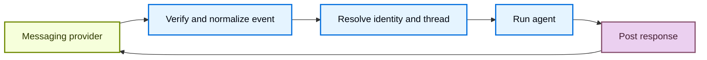

import ManagedDeepAgentsPublicBetaNote from '/snippets/langsmith/managed-deep-agents-public-beta-note.mdx';

Channel 让 managed deep agent 在外部消息服务中可用。来自该服务的消息可以启动 agent runs，agent 的最终响应也通过同一个服务返回。

<ManagedDeepAgentsPublicBetaNote />

## 项目结构

Channel 声明位于项目级的 `channels/` 目录中：

:::python
```text
my-agent/
  agent.py
  channels/
    slack.py
```
:::

:::js
```text
my-agent/
  agent.ts
  channels/
    slack.ts
```
:::

## 理解 channels

一个 channel 组合了外部消息集成的三个部分：

- **入站事件**：验证并归一化 provider 事件，然后启动 agent run。
- **出站消息**：将 agent 的响应发送回发起请求的会话。
- **预置**：创建并配置将服务连接到 deployed agent 的 provider 资源。

在 Managed Deep Agents 中，channel 将 deployed agent 连接到消息 provider。

托管运行时处理 channel 生命周期：



Provider adapter 决定接受哪些事件、provider 会话如何映射到 Managed Deep Agents threads，以及响应如何投递。Channel 声明暴露该 provider 支持的配置。

## 在项目中声明 channels

把每个 channel 放在 `channels/` 下的单独模块中。

:::python
从每个文件导出一个模块级的 `channel`。
:::

:::js
从每个文件导出一个具名的 `channel`。
:::

文件名会成为配置的 channel 名称，并在 deployment 中标识该 channel。

:::python
不要将声明命名为 `channels/channel.py`。
:::

:::js
不要将声明命名为 `channels/channel.ts`。
:::

Channel 名称在项目内必须唯一。

声明由 provider factory 创建。

:::python
例如，`channels.slack()` 创建一个 Slack channel。
:::

:::js
例如，`channels.slack()` 创建一个 Slack channel。
:::

各 provider 的声明、app 配置和部署步骤请参见其 provider 指南。

## 区分 channels 与 connectors

Channel 接收启动 agent runs 的消息并投递响应。[MCP connector](/langsmith/managed-deep-agents-mcp-connectors) 为 agent 提供来自远程 MCP 服务器的 tools。项目可以只用其一，也可以两者都用。

## 支持的 channels

<CardGroup cols={2}>
  <Card title="Slack" icon="brand-slack" href="/langsmith/managed-deep-agents-channels-slack">
    从 Slack mention、私信（DM）和 thread 回复启动 runs。
  </Card>
  <Card title="HTTP" icon="webhook" href="/langsmith/managed-deep-agents-channels-http">
    从任何能发送 JSON webhook 的服务启动 runs。
  </Card>
</CardGroup>

## 另请参阅

- [Identity](/langsmith/managed-deep-agents-identity)：对调用方进行认证，并将 channel runs 限定到解析出的用户。
- [Schedules](/langsmith/managed-deep-agents-schedules)：通过配置的 channel 投递定时结果。
- [Deploy an agent](/langsmith/managed-deep-agents-deploy)：部署项目更改并配置 secrets。
- [CLI reference](/langsmith/managed-deep-agents-cli)：查看 channel 项目文件约定。
