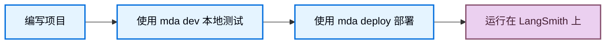

import ManagedDeepAgentsPrivateBetaNote from '/snippets/langsmith/managed-deep-agents-private-beta-note.mdx';
import ManagedDeepAgentsRuntimeOwnership from '/snippets/langsmith/managed-deep-agents-runtime-ownership.mdx';

Managed Deep Agents 会把本地 [project directory](/langsmith/managed-deep-agents-cli#project-file-reference) 转换为托管的 LangGraph deployment。了解 `mda` CLI 会编译什么、一次 deploy 会创建什么，以及哪些部分由运行时负责，有助于你理解行为、secrets 和 state。

<Note>
<ManagedDeepAgentsPrivateBetaNote />
</Note>

## 编译

`mda dev` 和 `mda deploy` 会把你的项目编译成一个可运行的 LangGraph app，输出到 `.mda/build` 目录。Agent 入口文件及其导入的模块会原样复制，不会被改写，因此 import 行为与普通 Python 或 TypeScript 项目保持一致。编译过程会排除 secrets 以及 `.env`、`node_modules` 等生成文件。完整的忽略路径列表请参见 [CLI reference](/langsmith/managed-deep-agents-cli#project-file-reference)。

## Deploy 生命周期

你先在本地编写和测试项目，然后通过一条命令把它部署到 LangSmith。

`mda dev` 会在 LangSmith Studio 中运行编译后的 app，方便你测试。`mda deploy` 会校验项目、把 deploy 负责的 context 同步到 Context Hub、上传构建产物、触发托管构建，并在 deployment 可用后对任何 cron schedules 进行 reconcile。关于 secrets 路由、deploy flags 和运维提示，请参见 [Deploy an agent](/langsmith/managed-deep-agents-deploy)。完整步骤与 flags 请参见 [CLI reference](/langsmith/managed-deep-agents-cli#deploy-projects)。

当你部署 Managed Deep Agent 时，LangSmith 会创建或更新托管的 LangGraph deployment，为托管 context 创建一个 Context Hub agent repo，并对 `schedules/` 下声明的托管 cron schedules 执行 reconcile。你可以在 LangSmith 中打开 deployment 页面查看 build 状态与 revisions，也可以在 traces 中查看运行期间产生的用户输入、最终响应、模型调用、工具调用、sandbox 活动、文件和运行时状态。

## 托管运行时负责什么

<ManagedDeepAgentsRuntimeOwnership />

## Context Hub

每个 deployment 都对应一个 [Context Hub](/langsmith/use-the-context-hub) repo，用于存储 deploy 负责的 context 和运行时创建的 memory：

- **`/instructions.md`**：托管 system prompt，在 deploy 时从你的项目同步。
- **`/skills/**`**：deploy 负责的 skills，在 deploy 时从你的项目同步。
- **`/memories/AGENTS.md`**：持久化 agent memory，由 agent 在运行时写入。

你应在项目中编辑 instructions 和 skills，然后重新 deploy。Memory 由运行时负责，deploy 会保留它，而不是覆盖它。

## Threads 与 memory

托管运行时负责 checkpointer 和 store，因此每个 thread 的 state 都会自动跨 run 持久化，无需额外配置。持久化 memory 存储在 [Context Hub](#context-hub) 中，agent 可以跨 thread 读取和写入。

Scheduled runs 会显式选择 thread 行为。Ephemeral thread 会在 run 结束后被清理，而 persistent thread 会复用稳定的 thread ID，从而持续累积 state。关于两种 thread 模式及使用场景，请参见 [Schedules](/langsmith/managed-deep-agents-schedules)。

## Sandboxes

[Sandbox](/langsmith/sandboxes) 为 agent 提供隔离环境，用于执行代码和操作文件系统。你可以在 `sandbox/index.ts` 或 `sandbox/__init__.py` 中导出 `sandbox` 来配置它，并使用 `sandbox/setup.sh` 在首次创建时完成初始化。每个 thread 都拥有自己的 sandbox。配置选项与示例请参见 [Configure a sandbox](/langsmith/managed-deep-agents-deploy#configure-a-sandbox)。

## 另请参见

- [Overview](/langsmith/managed-deep-agents-overview)：了解何时使用 Managed Deep Agents 以及 beta 限制。
- [Deploy an agent](/langsmith/managed-deep-agents-deploy)：完整 deploy 工作流、secrets 和故障排查。
- [CLI reference](/langsmith/managed-deep-agents-cli)：查看全部 `mda` 命令、flags 与项目文件规则。
