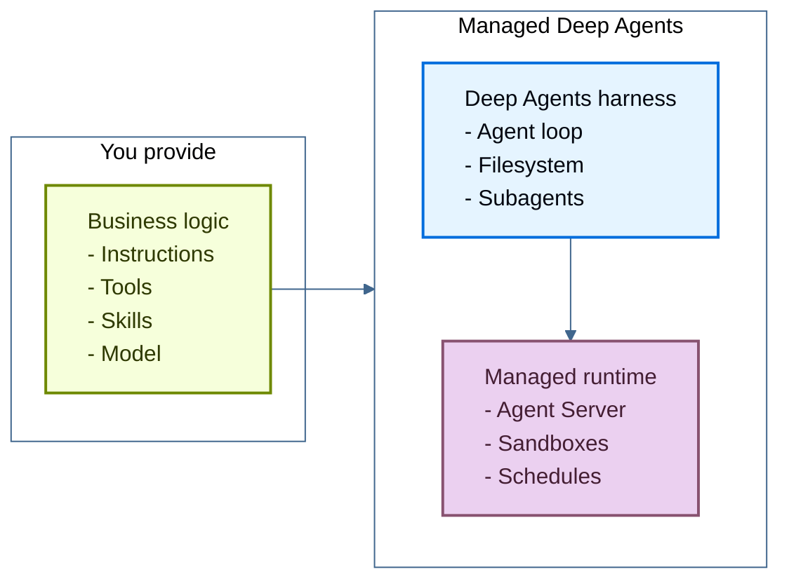

Managed Deep Agents (MDA) 是构建和部署生产级 agent 最简单的方式。你专注于 agent 做什么，MDA 负责运行它。无需运行服务器，也无需拼接基础设施。

你编写 agent 的智能部分：它的 instructions、可以调用的 tools、遵循的 skills，并选择驱动它的模型。MDA 提供底层的一切：

- **Deep Agents harness**：负责规划、调用 tools、管理文件系统以及委派给 subagents 的 agent loop。参见 [Deep Agents](/oss/deepagents/overview)。
- **托管运行时**：[LangSmith Deployment 的 Agent Server](/langsmith/agent-server-overview) 托管并运行 agent，并在重启后保持会话继续运行。



## 示例 agent

一个 managed deep agent 由一个项目文件夹组成，其中包含定义其行为的业务逻辑：

:::python
<Tabs>
  <Tab title="Model & configuration">
```python agent.py
from managed_deepagents import define_deep_agent

from middleware.audit import log_tool_calls
from tools.search import internet_search

agent = define_deep_agent(
    name="research-assistant",
    model="openai:gpt-5.5",
    tools=[internet_search],
    middleware=[log_tool_calls],
)
```
  </Tab>
  <Tab title="Instructions">
```markdown instructions.md
# Assistant

You are a helpful assistant.
```
  </Tab>
  <Tab title="Skills">
```markdown skills/research/SKILL.md
---
name: research
description: Gather and synthesize context before answering complex questions.
---

# Research

Use this skill when a task needs more than a direct answer.

1. Identify what information is missing.
2. Search LangChain docs when the question is about LangChain, LangGraph, or LangSmith.
3. Summarize findings before responding to the user.
```
  </Tab>
  <Tab title="Tools">
```python tools/search.py
from langchain.tools import tool


@tool(parse_docstring=True)
def internet_search(query: str) -> str:
    """Search the internet for relevant sources.

    Args:
        query: The search query.
    """
    return f"Results for: {query}"
```
  </Tab>
  <Tab title="Middleware">
```python middleware/audit.py
from collections.abc import Awaitable, Callable

from langchain.agents.middleware import wrap_tool_call
from langchain.messages import ToolMessage
from langchain.tools.tool_node import ToolCallRequest
from langgraph.types import Command


@wrap_tool_call
async def log_tool_calls(
    request: ToolCallRequest,
    handler: Callable[[ToolCallRequest], Awaitable[ToolMessage | Command]],
) -> ToolMessage | Command:
    print(f"Calling tool: {request.tool_call['name']}")
    result = await handler(request)
    print(f"Finished tool: {request.tool_call['name']}")
    return result
```
  </Tab>
  <Tab title="MCP Connectors">
```python connectors/mcp.py
from managed_deepagents import connectors

connector = connectors.mcp(
    mcp_servers={
        "langchainDocs": {
            "transport": "http",
            "url": "https://docs.langchain.com/mcp",
            "include_tools": ["search_docs_by_lang_chain"],
        },
    },
)
```
  </Tab>
</Tabs>
:::

当你用 `mda` CLI 上传这个文件夹时，它会自动在托管的 LangSmith 基础设施上运行。
你提供业务逻辑，Managed Deep Agents 提供 agent harness 和生产基础设施。

要开始使用，请参阅 [Managed Deep Agents quickstart](/langsmith/managed-deep-agents-quickstart)。

## 核心能力

agent 的每个部分都映射到一个文件或目录。根据 agent 的需要添加相应部分：

:::python
| 能力 | 路径 | 说明 |
| --- | --- | --- |
| [模型与配置](/langsmith/managed-deep-agents-agent-definition) | `agent.py` | 模型和核心选项。必填。 |
| [Instructions](/langsmith/managed-deep-agents-instructions) | `instructions.md` | 定义 agent 行为方式的 system prompt。 |
| [Skills](/langsmith/managed-deep-agents-skills) | `skills/` | agent 在相关时加载的、特定任务的 playbooks。 |
| [Tools](/langsmith/managed-deep-agents-tools) | `tools/` | agent 调用以运行你的应用逻辑或访问外部服务的函数。 |
| [MCP connectors](/langsmith/managed-deep-agents-mcp-connectors) | `connectors/` | 为 agent 提供工具的远程 MCP 服务器。 |
| [Middleware](/langsmith/managed-deep-agents-middleware) | `middleware/` | 围绕模型和工具调用的自定义逻辑。 |
| [Sandbox](/langsmith/managed-deep-agents-sandboxes) | `sandbox/` | 用于运行 agent 编写代码的隔离文件系统和 shell。 |
| [Memory](/langsmith/managed-deep-agents-memory) | `memory.py` | 跨 threads 持久化的偏好和知识。 |
| [Identity](/langsmith/managed-deep-agents-identity) | `identity.py` | 多用户部署中每个调用者的私有 threads、memory 和凭据。 |
| [Channels](/langsmith/managed-deep-agents-channels) | `channels/` | 连接到消息服务（例如 Slack）的连接，用于启动 runs 并接收响应。 |
| [Schedules](/langsmith/managed-deep-agents-schedules) | `schedules/` | 按周期运行 agent 的托管 cron 调度。 |
| [Evals](/langsmith/managed-deep-agents-evals) | `evals/` | 用于测试 agent 的 Harbor 风格任务。 |
:::

:::js
| 能力 | 路径 | 说明 |
| --- | --- | --- |
| [模型与配置](/langsmith/managed-deep-agents-agent-definition) | `agent.ts` | 模型和核心选项。必填。 |
| [Instructions](/langsmith/managed-deep-agents-instructions) | `instructions.md` | 定义 agent 行为方式的 system prompt。 |
| [Skills](/langsmith/managed-deep-agents-skills) | `skills/` | agent 在相关时加载的、特定任务的 playbooks。 |
| [Tools](/langsmith/managed-deep-agents-tools) | `tools/` | agent 调用以运行你的应用逻辑或访问外部服务的函数。 |
| [MCP connectors](/langsmith/managed-deep-agents-mcp-connectors) | `connectors/` | 为 agent 提供工具的远程 MCP 服务器。 |
| [Middleware](/langsmith/managed-deep-agents-middleware) | `middleware/` | 围绕模型和工具调用的自定义逻辑。 |
| [Sandbox](/langsmith/managed-deep-agents-sandboxes) | `sandbox/` | 用于运行 agent 编写代码的隔离文件系统和 shell。 |
| [Memory](/langsmith/managed-deep-agents-memory) | `memory.ts` | 跨 threads 持久化的偏好和知识。 |
| [Identity](/langsmith/managed-deep-agents-identity) | `identity.ts` | 多用户部署中每个调用者的私有 threads、memory 和凭据。 |
| [Channels](/langsmith/managed-deep-agents-channels) | `channels/` | 连接到消息服务（例如 Slack）的连接，用于启动 runs 并接收响应。 |
| [Schedules](/langsmith/managed-deep-agents-schedules) | `schedules/` | 按周期运行 agent 的托管 cron 调度。 |
| [Evals](/langsmith/managed-deep-agents-evals) | `evals/` | 用于测试 agent 的 Harbor 风格任务。 |
:::

完整布局请参见 [Project structure](/langsmith/managed-deep-agents-project-structure)。

## 下一步

<CardGroup cols={2}>
  <Card title="Quickstart" icon="rocket" href="/langsmith/managed-deep-agents-quickstart">
    使用 `mda` CLI 创建并部署你的第一个 Managed Deep Agent。
  </Card>
  <Card title="Tutorial" icon="book" href="/langsmith/managed-deep-agents-tutorial">
    添加自定义搜索工具、持久 memory 和每日调度。
  </Card>
</CardGroup>
