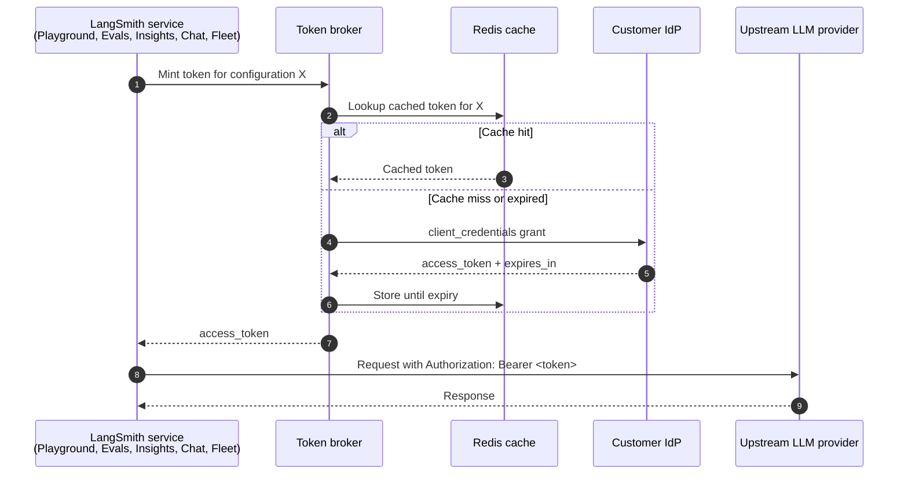

模型配置定义了 LangSmith 在调用 AI 提供方时所使用的模型和参数。整个[工作区](/langsmith/administration-overview#workspaces)共享同一个配置库，因此你创建的任意配置都可以在以下功能中无须重复地复用：

- [**Playground**](/langsmith/prompt-engineering-concepts)
- [**Evaluators**](/langsmith/evaluation)
- [**Fleet**](/langsmith/fleet/index)
- [**Chat**](/langsmith/chat)
- [**Insights**](/langsmith/insights)

[工作区管理员](/langsmith/rbac#workspace-admin)可以创建、编辑和删除配置，并控制每个功能可用的 provider 和 model。非管理员成员可以查看配置，但不能修改。

配置中还可以携带 [OAuth client credentials](#oauth-client-credentials)，这样 LangSmith 就能在请求时向你的 IdP 申请短期 bearer token，而不必使用静态 API key。

## 功能访问

**Feature Access** 表用于分别控制各个 LangSmith 功能中 provider 和 model 的可用性。

| **功能** | **模型选择体验** |
| --- | --- |
| Playground | 完整的模型控制，可查看并调整所有参数。没有内置模型，完全依赖工作区配置。 |
| Evaluators | 完整的模型控制，可查看并调整所有参数。没有内置模型，完全依赖工作区配置。 |
| Fleet | 默认从一组精选列表中选择，你也可以添加自定义工作区配置。 |
| Chat | 默认从一组精选列表中选择，你也可以添加自定义工作区配置。 |
| Insights（Thinking） | 用于深度分析的模型。默认从带有 provider 推荐的精选列表中选择，你也可以添加自定义工作区配置。 |
| Insights（Summarization） | 用于轻量摘要的模型。默认从带有 provider 推荐的精选列表中选择，你也可以添加自定义工作区配置。 |

所有功能都支持自定义工作区配置，因此即使某个功能默认显示的是精选列表，你仍然可以使用任意 provider 或 model。

<Note>
**Insights** 使用两行独立配置，一行用于分析，一行用于摘要。如果你在任意一行里选择了不兼容的 provider 或不推荐的 model，UI 会显示警告。
</Note>

### 配置功能访问

在 [UI](https://smith.langchain.com) 中配置功能访问：

1. 前往 **Settings** > **Model configurations**。
1. 在 **Feature Access** 表中找到你要配置的功能。
1. 点击 **Enabled Providers**，为该功能开启或关闭 provider。
1. 点击 **Available Models**，选择用户可用的 model。
1. 使用 **Default Model** 下拉框，设置用户打开该功能时默认预选的模型。

## 配置项

**Configurations** 表是工作区中一组共享的命名模型配置库。你在 LangSmith 中创建的配置，包括从 [Playground](/langsmith/managing-model-configurations) 创建的配置，都会显示在这里，并可以在所有功能中复用。

### 创建配置

1. 前往 **Settings** > **Model configurations**。
1. 在 **Configurations** 下点击 **+ Create**。
1. 选择 **Provider** 和 **Model**。
1. 输入 **API Key Name**，也就是工作区中存放该 provider API key 的 secret 名称。
1. 按需调整参数。参数分组如下：
    - **Standard sampling settings**：temperature、top P、top K、presence penalty、frequency penalty、max output tokens
    - **Reasoning**：reasoning effort、service tier
    - **Provider config**：provider API、base URL
    - **Options**：stop sequences、seed、JSON mode、extra headers、requests per second、extra parameters

    可用参数取决于 provider，请参考对应 provider 的文档。
1. 点击 **Save**。

### 编辑配置

1. 在 **Configurations** 表中，点击目标配置旁边的溢出菜单 <Icon icon="dots-vertical" iconType="regular" />。
1. 选择 **Edit**。
1. 更新配置后点击 **Save**。

### 删除配置

1. 在 **Configurations** 表中，点击目标配置旁边的溢出菜单 <Icon icon="dots-vertical" iconType="regular" />。
1. 选择 <Icon icon="trash" iconType="regular" /> **Delete**，然后确认。

## OAuth client credentials

<Note>
OAuth client credentials 适用于 LangSmith [Cloud](/langsmith/cloud) 和运行版本不低于 `0.16.0-rc.6` 的 [Self-hosted](/langsmith/self-hosted) 部署。
</Note>

当某个模型配置位于 OAuth2 gateway 后面时，你可以直接把 OAuth `client_credentials` 保存在配置上，而不必分发静态 API key。LangSmith 会在请求时使用这些凭证换取短期 bearer token，并把它附加到发往上游 LLM 的请求中，格式为 `Authorization: Bearer <token>`，并在 token 过期前自动刷新。这是一种以单个配置为单位的自助替代方案，替代把整个工作区路由到 [LLM auth proxy](/langsmith/llm-auth-proxy-self-hosted)；对同一个配置而言，两者互斥。

只要方案支持自定义模型配置，就可以使用 OAuth client credentials。**Use Custom OAuth** 开关适用于 bearer-token 类型的 provider，例如 OpenAI、Anthropic、OpenAI-compatible endpoint 等；它不支持 Bedrock、Google Vertex AI 或 Google GenAI，因为这些 provider 使用各自原生的云身份认证。该开关在 **LangServe (Deprecated)** 预设下也会隐藏。

### 为模型配置启用 OAuth

配置 OAuth 需要[工作区管理员](/langsmith/rbac#workspace-admin)角色，或者拥有 `workspaces:manage-model-configs` 权限的[自定义角色](/langsmith/rbac#custom-roles)。没有该权限的成员会看到 OAuth 字段被禁用，并显示打码的 secret 提示。在 [LangSmith UI](https://smith.langchain.com) 中：

1. 前往 **Settings** > **Model configurations**，点击 **+ Create**，或者通过现有行的溢出菜单 <Icon icon="dots-vertical" iconType="regular" /> > **Edit** 打开配置。
1. 选择兼容的 provider，并像平常一样配置模型参数。
1. 打开 **Use Custom OAuth**。
1. 填写 OAuth 字段：
    - **Token URL**：IdP 的 token endpoint，例如 `https://login.example.com/oauth/token`。
    - **Client ID**：OAuth client 标识符。
    - **Client Secret**：OAuth client secret。静态加密保存。
    - **Token Endpoint Auth Method**：`client_secret_basic` 或 `client_secret_post`。
    - **Extra parameters**：作为 key/value 行发送到 token 请求体中的额外参数。可用于 `scope`、`audience`、`resource` 或 IdP 要求的其他参数。若要发送多个 scope，请每个值单独占一行；重复 key 会被作为多值参数发送。
    - **Extra headers**：与 token 请求一起发送的额外请求头。像 `Authorization` 这样的保留请求头会在保存时被拒绝。
1. 点击 **Save**。

### 编辑语义

OAuth 字段遵循一套保护已存储 secret 的编辑行为：

- **Secret round-trip**：服务端返回的 secret 始终是 `********`。输入框会显示为空，并附带 *"Secret is set. Type to replace."* 提示。如果提交时没有重新输入，已存储 secret 会保持不变。
- **关闭开关但保留凭证**：关闭 **Use Custom OAuth** 会停用 OAuth 流程，但不会删除已保存的字段。重新打开后会继续使用同一套凭证。
- **清空某个字段**：编辑配置并把对应字段留空，即表示显式清除。
- **通过 Save as preset 克隆**：当你把某个一次性配置保存为新的 preset 时，除 secret 以外的 OAuth 字段会复制到新行中。由于 secret 不会被暴露读取，因此它不能一同复制，克隆项中的 OAuth 会被强制关闭，直到你重新输入 secret。

### 请求流如何工作

当请求命中启用了 OAuth 的配置时，LangSmith 会通过内部 broker 申请 bearer、缓存结果，并在缓存 token 过期之前，把 bearer 盖到所有发往上游 LLM 的请求上。

OAuth 与 [LLM auth proxy](/langsmith/llm-auth-proxy-self-hosted) 的路由是以**单个配置**为单位，而不是按组织级别决定。每次请求都会根据配置的 OAuth 状态，解析为走 OAuth 还是走 LLM auth proxy。单个多模型任务，例如 [Insights](/langsmith/insights) 中分别指定 Thinking 和 Summarization 模型时，也可以混合使用两种路径，因为每个模型都是独立解析的。

### 降级行为

如果 broker 无法成功申请 token，例如 IdP 不可达、凭证无效、或在请求准备与执行之间配置被删除，则请求会回退到该 provider 的静态工作区 API key。如果工作区未设置该 key，则上游 provider 很可能会返回 401。

token 轮换只有在缓存的 bearer 过期之后才会生效。请根据 IdP 配置的 access token TTL 来安排轮换。

### 覆盖范围

凡是使用模型配置的地方，都会遵循 OAuth-enabled 配置：

- [**Playground**](/langsmith/prompt-engineering-concepts)：聊天运行与实验运行。
- [**Evaluators**](/langsmith/evaluation)：LLM-as-judge 配置、Reuse、Preview Test，以及 Evaluator Details Test，只要所有 prompt 都解析到启用了 OAuth 的配置，就都会跳过工作区 secret 提示。
- [**Insights**](/langsmith/insights)：Thinking 和 Summarization 配置分别独立解析。
- [**Chat**](/langsmith/chat)
- [**Fleet**](/langsmith/fleet/index)

当某个配置启用了 OAuth 时，LangSmith 不会再为该配置提示工作区 secret，因为凭证会由 broker 在请求时提供。

### 安全与审计

- **静态加密**：client secret 使用 Fernet 加密，采用与[工作区 secrets](/langsmith/administration-overview#workspaces)相同的密钥派生方式。
- **Bearer 缓存**：access token 会缓存到过期为止，并且绝不会写入日志。

### FAQ

<Accordion title="一组 OAuth 凭证可以跨工作区共享吗？">
不可以。OAuth 凭证保存在模型配置上，而模型配置属于工作区范围。即使它们都指向同一个 IdP client，每个工作区也都需要单独录入自己的凭证。
</Accordion>

<Accordion title="为什么启用了 OAuth 的配置突然开始使用静态工作区 key？">
如果 broker 无法申请 bearer，例如 IdP 不可达、凭证无效，或在请求准备与执行之间配置被删除，请求就会回退到该 provider 的静态工作区 API key。请重新打开模型配置，确认 Token URL 可访问、Client ID 与 secret 仍然有效，并且 Token Endpoint Auth Method 与 IdP 的要求一致。
</Accordion>

<Accordion title="如何轮换 client secret？">
编辑模型配置，并在 **Client Secret** 字段中重新输入 secret。保存后旧 secret 会被覆盖。Redis 中缓存的 bearer 会持续有效直到 TTL 过期，此后 broker 会使用新 secret 重新申请 bearer。
</Accordion>

<Accordion title="OAuth 和 LLM auth proxy 可以一起使用吗？">
可以。路由是按单个配置决定的。启用了 OAuth 的配置走 OAuth；未启用的配置在组织级开启 proxy 时会走 LLM auth proxy。单个多模型任务也可以混合这两种路径。
</Accordion>
