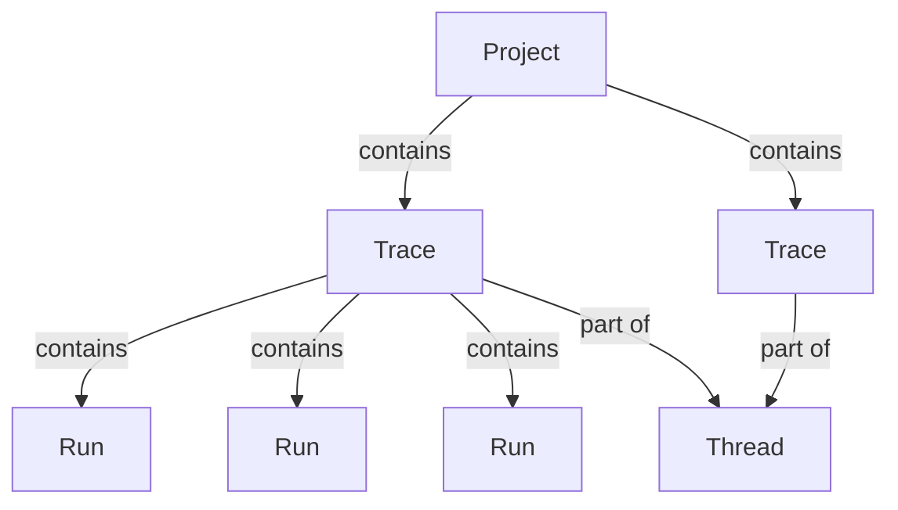

import MaxRunsPerTrace from '/snippets/langsmith/max-runs-per-trace.mdx';

LangSmith Observability 让你可以记录、检查并分析 LLM 应用执行过程中的每一步。本页解释 LangSmith 中的数据结构，以及如何发送 traces。

## LangSmith 如何组织数据

LangSmith 会在一个[_project_](#projects)中组织多条[_traces_](#traces)。每条 trace 记录应用在一次操作中经历的步骤序列，而这些步骤又由若干独立的[_runs_](#runs)构成。对于多轮会话，你还可以把多条 traces 串联成一个[_thread_](#threads)。

### Projects

_Project_ 是一个容器，用于存放与某个应用或服务相关的全部 traces。

[将 traces 记录到某个 project](/langsmith/log-traces-to-project)。

### Traces

_Trace_ 是一次操作对应的 runs 集合。例如，如果一次用户请求触发了一个 chain，而该 chain 又调用了 LLM 和输出解析器，那么这些 runs 都属于同一条 trace。Runs 会通过唯一的 trace ID 绑定到某个 trace 上。如果你熟悉 [OpenTelemetry](https://opentelemetry.io/)，可以把 LangSmith trace 理解为一组 spans。

<Note><MaxRunsPerTrace /></Note>

### Runs

_Run_ 是一个 span，表示 LLM 应用中的一个工作单元，例如一次 LLM 调用、一次 prompt 格式化步骤、一次 retrieval 调用，或任何其他离散操作。如果你熟悉 [OpenTelemetry](https://opentelemetry.io/)，可以把 run 理解为一个 span。

### Threads

_Thread_ 是一系列 traces，它们共同表示一次完整会话。多轮会话中的每一轮各自对应一条 trace，但这些 traces 会通过共享标识符串起来。要把 traces 归组到 threads 中，请传入一个特殊 metadata key（`session_id` 或 `thread_id`），并给它一个唯一值。

[了解如何配置 threads](/langsmith/threads)。

<Callout type="info" icon="feather">
使用 **[Chat](/langsmith/chat)** 来分析 traces、runs 和 threads。Chat 可以帮助你理解 agent 表现、调试问题，并从会话 threads 中提取洞察，而不必手动翻查数据。
</Callout>

## Trace 增强信息

### Feedback

_Feedback_ 允许你基于特定标准为某条 run 打分。每条 feedback 由一个 tag 和一个 score 组成，并通过唯一 run ID 绑定到对应 run 上。Feedback 可以是连续型，也可以是离散型（categorical）；tags 则可以在同一个组织内的不同 runs 之间复用。

关于 feedback 的存储方式，请参阅[Feedback 数据格式指南](/langsmith/feedback-data-format)。

### Tags

_Tags_ 是你可以附加到 runs 上的字符串，用来在 LangSmith UI 中进行分类、筛选和分组。

[了解如何给 traces 附加 tags](/langsmith/add-metadata-tags)。

### Metadata

_Metadata_ 是一组可以附加到 runs 上的键值对。例如应用版本、运行环境，或任何其他上下文信息。类似于 tags，你也可以用 metadata 来筛选和分组 runs。

[了解如何给 traces 添加 metadata](/langsmith/add-metadata-tags)。

## 发送 traces

向 LangSmith 发送 trace 数据有两种方式。

### Integrations

LangSmith _integrations_ 为流行的 LLM 提供商和 agent 框架提供自动 tracing（相当于通用可观测性领域中的自动埋点）。当你使用 LangChain、LangGraph、OpenAI、Anthropic 或 CrewAI 这类受支持框架时，integration 会自动捕获 inputs、outputs 和 metadata，而无需手动修改代码。

[浏览所有 integrations](/langsmith/integrations)。

### Manual instrumentation

_Manual instrumentation_ 允许你为任意代码添加 tracing，而不依赖具体框架。当你没有使用受支持的 integration，或者需要更细粒度地控制哪些内容会被追踪时，就可以使用它。LangSmith 提供三种机制：

- `@traceable` / `traceable`：用于追踪任意函数的装饰器
- `trace` 上下文管理器（Python）：包装特定代码块
- `RunTree` API：更底层、更显式的 trace 构建方式

[了解如何添加 manual instrumentation](/langsmith/annotate-code)。

## 数据保留

LangSmith（SaaS）会自数据摄取起保留 trace 数据 400 天。之后，traces 会被永久删除，仅保留有限 metadata 用于使用统计。关于 retention tiers 和定价的细节，请参阅[Usage and billing: Data retention](/langsmith/usage-and-billing#data-retention)。

<Note>
如果希望在保留期之外继续保存数据，请把它加入某个[dataset](/langsmith/manage-datasets)。即便源 trace 已被删除，datasets 也会无限期保留。
</Note>

如果你想在过期日期之前就删除 traces，请参阅[管理 trace](/langsmith/manage-trace#delete-a-trace)。
