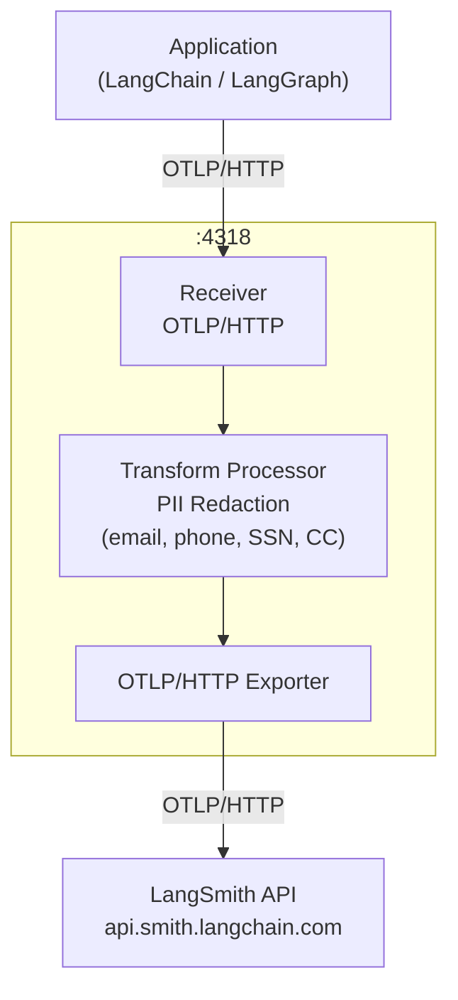

[LangChain](/langsmith/trace-with-langchain) 和 [LangGraph](/langsmith/trace-with-langgraph) 应用支持基于 [OpenTelemetry 的 tracing](/langsmith/trace-with-opentelemetry)。你可以不把 traces 直接发往 LangSmith，而是先把它们路由到你自己控制的 OpenTelemetry collector，在那里应用脱敏规则，移除敏感字段，然后再把清洗后的 traces 转发到 LangSmith。

Traces 会通过 OTLP/HTTP 从应用流向 collector。collector 上会运行一个 transform processor，在把清洗后的 spans 转发到 LangSmith API 之前，对敏感的 span attributes，例如 prompt 输入和模型 completion，执行脱敏。



## 前置条件

下面两种方式都需要以下环境变量。把 `OTEL_EXPORTER_OTLP_ENDPOINT` 设置为你的 collector 地址：

```bash
LANGSMITH_OTEL_ENABLED="true"
LANGSMITH_TRACING="true"
LANGSMITH_OTEL_ONLY="true"
LANGSMITH_PROJECT="my-project"
OTEL_EXPORTER_OTLP_ENDPOINT="http://<my-otel-collector-endpoint>:4318"
```

关于 `LANGSMITH_PROJECT` 的更多内容，请参阅[将 traces 记录到特定 project](/langsmith/log-traces-to-project)。

## 配置 collector

这两种方式都要求你在应用与 LangSmith 之间运行一个 OpenTelemetry collector，作为中间层。下面这份配置会在 `4318` 端口上启用一个 OTLP receiver，配置一个 transform processor，用来对 `gen_ai.prompt` 和 `gen_ai.completion` 这两个 span attributes 做脱敏，并用 exporter 把清洗后的 traces 转发给 LangSmith API：

```yaml
receivers:
  otlp:
    protocols:
      http:
        endpoint: 0.0.0.0:4318


processors:
  transform/redact:
    error_mode: ignore
    trace_statements:
      - context: span
        statements:
          - replace_pattern(attributes["gen_ai.completion"], "[\\s\\S]*", "[REDACTED]")
          - replace_pattern(attributes["gen_ai.prompt"], "[\\s\\S]*", "[REDACTED]")

exporters:
  otlphttp/langsmith:
    traces_endpoint: "https://api.smith.langchain.com/otel/v1/traces"
    headers:
      x-api-key: "${env:LANGSMITH_API_KEY}"
      Langsmith-Project: "${env:LANGSMITH_PROJECT}"


service:
  pipelines:
    traces:
      receivers: [otlp]
      processors: [transform/redact]
      exporters: [otlphttp/langsmith]
```

## 使用 LangChain 或 LangGraph tracing

如果你的应用已经在使用 [LangChain](/langsmith/trace-with-langchain) 或 [LangGraph](/langsmith/trace-with-langgraph)，请使用这种方式。tracing 集成会基于环境变量自动处理 span 创建，因此不需要额外编写 instrumentation 代码：

```python
from langchain.agents import create_agent
from langchain.tools import tool
from langchain_openai import ChatOpenAI


@tool
def tell_joke(topic: str) -> str:
   llm = ChatOpenAI()
   response = llm.invoke(f"Tell me a short, funny joke about {topic}.")
   return response.content


agent = create_agent(
   model=ChatOpenAI(),
   tools=[tell_joke],
   system_prompt="When the user asks for jokes, use the tell_joke tool for each topic.",
)


topics = ["programming", "python", "kubernetes", "machine learning"]


result = agent.invoke(
   {"messages": [{"role": "user", "content": f"Tell me jokes about these topics: {', '.join(topics)}"}]}
)


print(result["messages"][-1].content)
```

## 直接使用 OpenTelemetry SDK tracing

如果你需要对 tracer provider 和 exporter 做编程式控制，请使用这种方式。例如，想在运行时为每个请求设置 project 名称，或配置自定义请求头。你需要在代码中显式配置 provider，而不是只依赖环境变量：

```python
import os

from langchain.prompts import ChatPromptTemplate
from langchain_openai import ChatOpenAI
from opentelemetry import trace
from opentelemetry.exporter.otlp.proto.http.trace_exporter import OTLPSpanExporter
from opentelemetry.sdk.trace import TracerProvider
from opentelemetry.sdk.trace.export import BatchSpanProcessor


project_name = os.environ["LANGSMITH_PROJECT"]
otlp_endpoint = os.environ["OTEL_EXPORTER_OTLP_ENDPOINT"]


provider = TracerProvider()
provider.add_span_processor(
   BatchSpanProcessor(
       OTLPSpanExporter(
           endpoint=otlp_endpoint+"/v1/traces",
           headers={"Langsmith-Project": project_name},
       )
   )
)
trace.set_tracer_provider(provider)


chain = ChatPromptTemplate.from_template("Tell me a joke about {topic}") | ChatOpenAI()


for topic in ["programming", "python", "databases", "kubernetes", "machine learning"]:
   print(f"Asking about {topic}...")
   result = chain.invoke({"topic": topic})
   print(f"  {result.content[:100]}\n")


provider.force_flush()
provider.shutdown()
```

<Note>
如果你更希望在不经过 collector 的前提下对敏感数据脱敏，请参阅[阻止在 traces 中记录敏感数据](/langsmith/mask-inputs-outputs)。
</Note>
