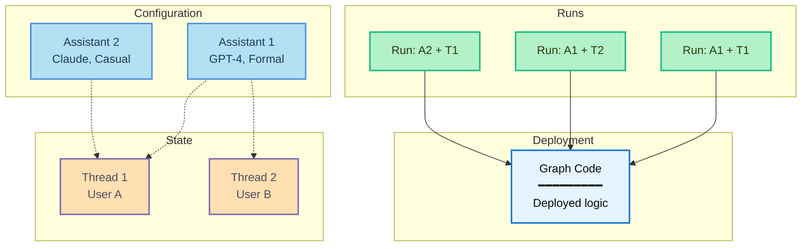

_run_ 是对某个 [assistant](/langsmith/assistants) 的一次调用。执行 run 时，需要指定使用哪个 assistant，可以通过 graph ID 使用默认 assistant，也可以通过 assistant ID 使用某个特定配置。

这张图展示了 **run** 如何通过将 assistant 与 thread 组合起来执行 graph：

- **Graph**（浅蓝色）：包含 agent 逻辑的已部署代码
- **Assistants**（蓝色）：配置选项（模型、prompts、tools）
- **Threads**（橙色）：用于保存会话历史的状态容器
- **Runs**（绿色）：将 assistant + thread 配对后的具体执行

**示例组合：**
- **Run: A1 + T1**：将 Assistant 1 的配置应用到 User A 的会话中
- **Run: A1 + T2**：同一个 assistant 服务于 User B（不同会话）
- **Run: A2 + T1**：将不同 assistant 应用到 User A 的会话中（配置切换）

执行 run 时：

- 每个 run 都可以有自己的输入、配置覆盖项和 metadata。
- Runs 可以是无状态的（没有 thread），也可以是有状态的（运行在某个 [thread](/langsmith/use-threads) 上，以保留会话状态）。
- 多个 runs 可以共用同一个 assistant 配置。
- Assistant 的配置会影响底层 graph 的执行方式。

Agent Server API 提供了多个用于创建和管理 runs 的 endpoints。更多细节请参阅 [API reference](/langsmith/server-api-ref)。

## 本节内容

<CardGroup cols={2}>
  <Card title="启动后台 runs" icon="player-play" href="/langsmith/background-run">
    异步运行 agent，并轮询结果。
  </Card>
  <Card title="在同一个 thread 上运行多个 agents" icon="messages" href="/langsmith/same-thread">
    在共享 thread 上使用多个 assistants，以组合不同 agent 能力。
  </Card>
  <Card title="无状态 runs" icon="player-skip-forward" href="/langsmith/stateless-runs">
    在不需要保留会话历史时，无需持久化状态即可执行 runs。
  </Card>
  <Card title="取消 run" icon="player-stop" href="/langsmith/cancel-run">
    通过 API 取消单个 run 或多个 runs。
  </Card>
</CardGroup>
