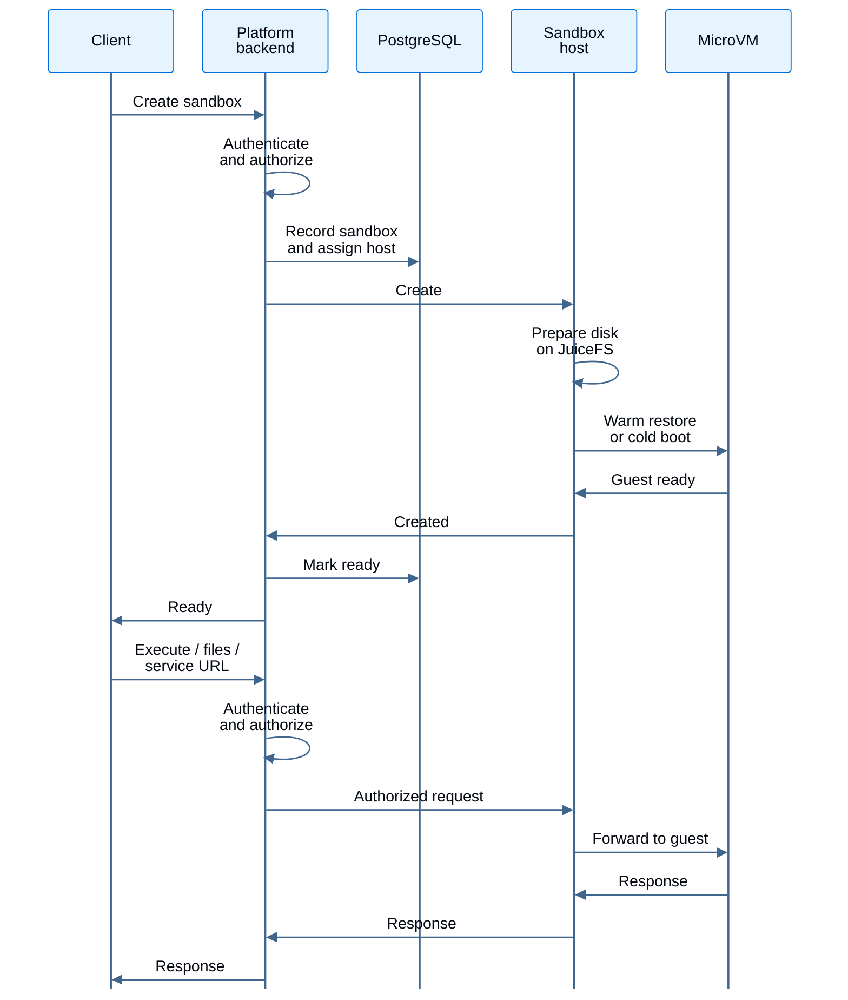
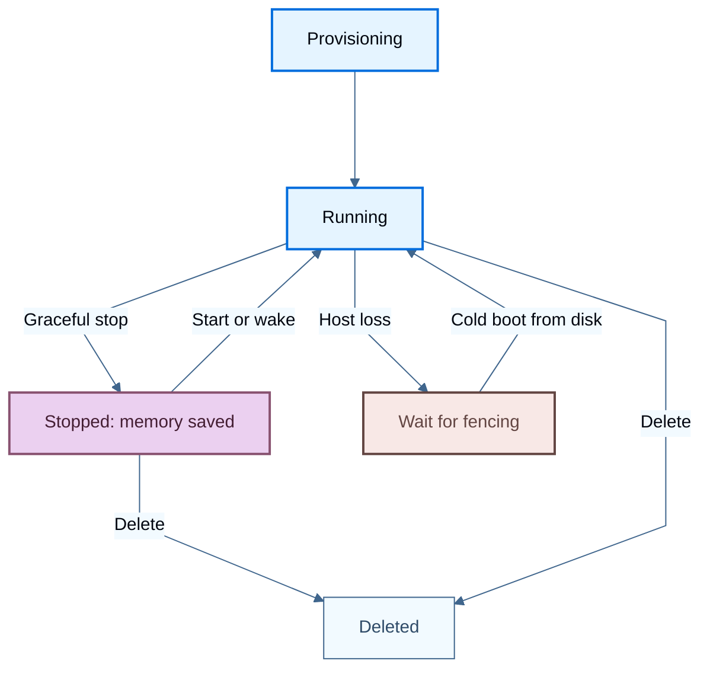

import { SandboxDiagram } from '/snippets/sandbox-diagram.jsx';

[LangSmith Sandboxes](/langsmith/sandboxes) 在一组专用的 Kubernetes 节点上以隔离的 microVM 运行代码。本指南说明各组件运行在哪里、请求如何到达 sandbox，以及哪些状态能在 host 重启后保留。

受支持的平台、前置条件和安装说明，请参阅[启用 Sandboxes](/langsmith/enable-self-hosted-sandboxes)。以下架构描述的是 `sandbox-host` 运行时。存储挂载和配置选项可能因 Helm release 而异。

<CardGroup cols={2}>
  <Card title="扩缩容与容量" icon="arrows-maximize" href="/langsmith/self-host-sandbox-scaling">
    确定 host pool 大小、配置自动扩缩容，并规划 memory 与缓存容量。
  </Card>
  <Card title="升级与运维" icon="server" href="/langsmith/self-host-sandbox-operations">
    了解 host drain、故障恢复和生产环境监控。
  </Card>
</CardGroup>

## 了解部署模型

Sandbox 是一个 Firecracker microVM，而不是 Kubernetes pod。每个 `sandbox-host` pod 管理多个 microVM，每个 microVM 都有自己的 guest kernel。Kubernetes 负责调度 host；LangSmith 将 sandbox 放置到 host 上。

host Deployment 使用必需的 pod anti-affinity，确保每个节点上最多一个 host pod。它的 node selector 和 tolerations 指向一个专用、支持 KVM 的 node pool。添加 sandbox 不会创建新的 pod。

<Frame caption="Platform backend 管理 sandbox 放置和流量。host 运行 microVM；共享存储让持久化状态独立于节点。">
  <SandboxDiagram name="architecture" />
</Frame>

### 了解组件故障的影响

每个组件的故障影响范围不同。在规划恢复时，要区分暂时不可用与其存储数据丢失。

| 组件 | 运行位置与持有内容 | 不可用或丢失时 |
| --- | --- | --- |
| `platform-backend` | 现有 LangSmith node pool。认证并授权请求、选择 host 并代理流量。不持有持久化的 sandbox 状态。 | API 不可用 服务不可用期间，Sandbox API 和被代理的流量失败。重启它不会删除 sandbox 磁盘。 |
| PostgreSQL | 现有 LangSmith 数据库。持有 sandbox 记录、host registry 和放置信息。 | API 不可用 需要 sandbox 记录或放置信息的操作会被阻塞。  持久化数据面临风险 丢失数据库内容需要恢复这些记录，而不仅仅是重启 host。 |
| `sandbox-host` | 专用 sandbox node pool，每个节点一个 pod。持有运行中的 microVM 及其内存。 | 单台 host 受影响 突然丢失会停止该 host 的 sandbox 并丢失运行中的内存。持久化磁盘仍保留在共享存储上。 |
| JuiceFS client | 每个 host pod 内部由 host 持有的挂载。将 VM 连接到共享存储并管理本地缓存。 | 单台 host 受影响 挂载失败会将 host 隔离（fence）并停止其 VM。恢复需要可用的共享存储。 |
| Kubernetes API | Kubernetes control plane。持有 host Lease 和 host Deployment。 | 影响整个 pool 无法续约 Lease 的 host 最终会自我隔离（fence）。长时间的集群级故障可能使整个 pool 停止。 |
| JuiceFS Redis | 专用 metadata 存储。持有文件树、文件大小以及到数据块的映射。 | 影响整个 pool 故障会导致跨 host 的文件系统操作停滞或失败。  持久化数据面临风险 丢失 metadata 需要从备份恢复。仅靠对象存储无法重建文件系统。 |
| 对象存储 | 共享 bucket 或容器。持有磁盘镜像、已保存内存和快照的数据块。 | 影响整个 pool 故障会阻塞未命中缓存的读取和上传。新 host 可能无法通过 readiness 检查。  持久化数据面临风险 删除的数据块需要从备份恢复受影响的磁盘和快照。 |
| 节点本地缓存 | 每个 sandbox 节点。持有 JuiceFS 数据块的可丢弃副本。 | 仅需重建缓存 持久化的数据仍保留在共享存储上。host 会重新拉取缓存副本，缓存预热期间 I/O 会变慢。 |

关于 fencing、恢复行为和存储保护，请参阅[了解故障影响](/langsmith/self-host-sandbox-operations#understand-failure-impact)。

一个被选出的 host 观测 pool 健康状况并运行 [host autoscaler](/langsmith/self-host-sandbox-scaling#understand-the-two-scaling-layers)。其他 host 继续为 sandbox 提供服务，不持有 leadership。

### 检查单个 sandbox 节点

host pod 运行 sandbox daemon 和 Firecracker 进程。在带 host 持有 JuiceFS 挂载的部署中，它还运行 JuiceFS client。daemon 通过 `vsock` 连接到每个 guest 内部的 agent。

<Frame caption="一个 Kubernetes pod 包含多个 microVM。host 需要 KVM 访问权限；guest 内存和节点本地缓存消耗节点的资源。">
  <SandboxDiagram name="node" />
</Frame>

host 使用 host networking，监听 `19190` 端口。platform backend 连接到 host 的节点地址；客户端使用 LangSmith API 或 [service URLs](/langsmith/sandbox-service-urls)，而不是直接访问 host listener。请将 host listener 保留在私有网络上。

host pods 需要特权访问来进行虚拟化、网络和挂载。使用专用节点并限制对节点的管理访问。guest 隔离并不会使 host pod 成为无特权的工作负载。

## 跟踪一次请求

创建 sandbox 在到达 host 之前会先经过 platform backend。后续的命令、文件和服务请求遵循相同的授权边界。

放置会考虑已占用的 CPU，并在负载接近最少负载候选时优先选择 sandbox 之前的 host。回到该 host 可以复用缓存数据。这是一种偏好，而不是 sandbox 停留在同一节点上的保证。

<Note>
利用率目标控制的是扩缩容，而不是准入。繁忙的 pool 仍可以将工作放到现有 host 上。在没有就绪 host 的情况下，创建会以 `NoSandboxHostsAvailable` 失败，而不是在容量队列中等待。参见[应对突发流量](/langsmith/self-host-sandbox-scaling#plan-for-bursts)。
</Note>

## 跟踪持久化状态

JuiceFS 将文件系统的 metadata 与内容分离：

- **Redis metadata**：目录条目、文件大小以及从文件到数据块的映射。
- **对象存储**：磁盘镜像、已保存内存镜像和快照的数据块。
- **本地缓存**：各节点上的数据块副本。节点替换会丢失该缓存，而不是共享文件系统。

<Warning>
JuiceFS Redis 是持久化存储，而不是 LangSmith 的缓存 Redis。没有 metadata，仅靠对象存储无法重建文件系统。请保护这两个存储，为 metadata Redis 使用 `noeviction`，并测试恢复流程。参见[保护 sandbox 存储](/langsmith/self-host-sandbox-operations#protect-sandbox-storage)。
</Warning>

### 区分挂起与崩溃

持久化 sandbox 可以在另一台兼容的 host 上恢复，因为它的磁盘和成功保存的内存都在共享存储上。

- **优雅停止**：host 保存 VM 内存并停止 VM。后续的 start 或 wake 请求可以从该镜像恢复运行中的进程。
- **host 丢失**：运行中的内存会丢失。恢复需要等待 fencing 窗口，之后另一台 host 才能从持久化磁盘启动 sandbox。
- **删除**：移除 sandbox 而不是把它移动到另一台 host。单独捕获的[快照](/langsmith/sandbox-snapshots)有自己的生命周期。

恢复内存需要完整且兼容的内存镜像。这不是实时迁移，也不会保留已打开的客户端连接。突发故障后，未刷新的写入和内存中的工作可能丢失。这些持久化保证不适用于临时 sandbox 存储。

## 另请参阅

- [启用 Sandboxes](/langsmith/enable-self-hosted-sandboxes)
- [扩展自托管 Sandboxes](/langsmith/self-host-sandbox-scaling)
- [运维自托管 Sandboxes](/langsmith/self-host-sandbox-operations)
- [Sandbox 权限](/langsmith/sandbox-permissions)
