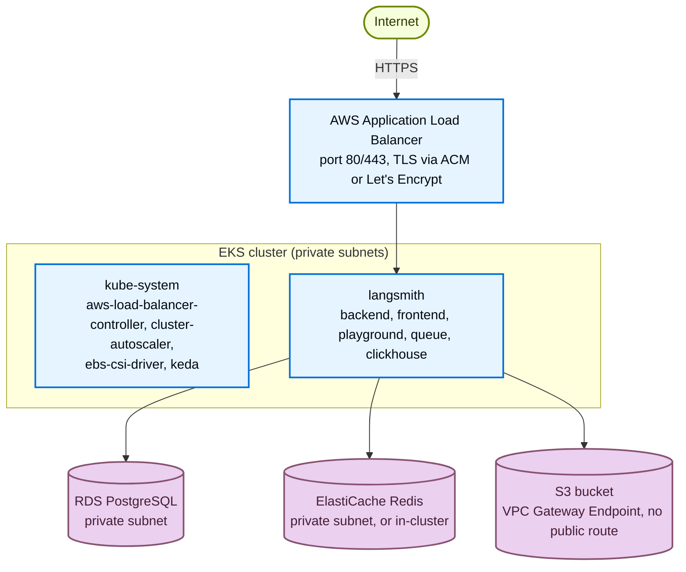
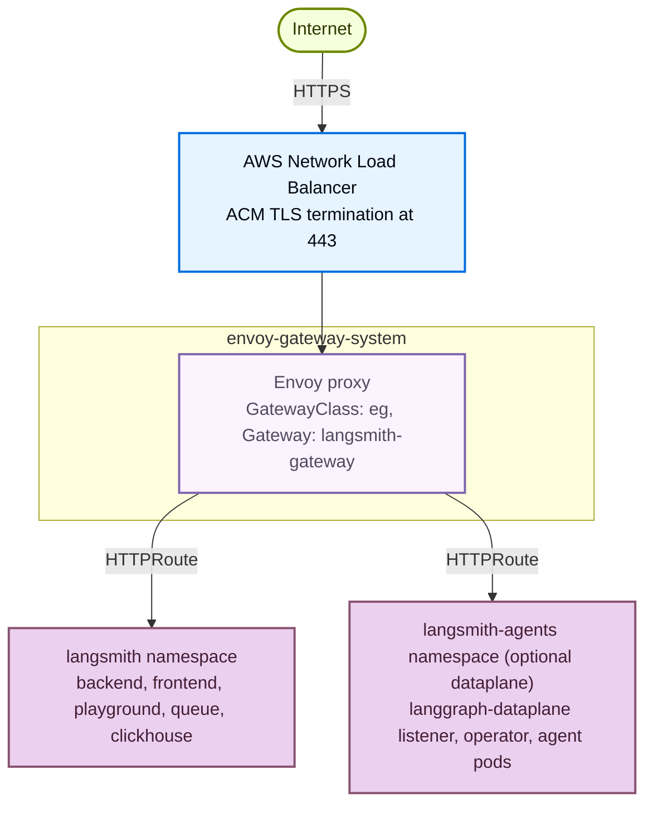

了解 [AWS Terraform modules](https://github.com/langchain-ai/terraform/tree/main/modules/aws) 会预配哪些内容，以及各部分如何协同工作，这样你就可以在运行 `make apply` 之前规划容量、加固安全并自定义 LangSmith 部署。

在规划上线或排查现有部署时，可以将本页作为参考。本页涵盖：

- 平台分层与应用核心服务。
- AWS 托管服务、IRSA 角色和集群基础设施。
- 网络拓扑、ingress 选项以及 TLS/DNS 策略。
- LangSmith Deployment add-on。
- module 依赖图与可选的安全 module。

如果已准备好安装，请从[部署流程指南](/langsmith/self-host-terraform-aws-deploy)开始。

## 平台分层

LangSmith 在 AWS 上分两个阶段部署，外加一个可选 add-on。基础设施阶段预配云基础，应用阶段安装 LangSmith Helm chart。LangSmith Deployment add-on 为可选项，它添加 host-backend、listener 和 operator 服务，用于在 UI 中管理 LangGraph 应用。


| 阶段 | 分层 | 新增内容 |
|---|---|---|
| Infrastructure | AWS infrastructure | VPC + 私网/公网子网 + 单 NAT gateway、EKS 集群 + 托管节点组 + cluster autoscaler、RDS PostgreSQL、ElastiCache Redis、S3 bucket + VPC Gateway Endpoint、ALB controller + EBS CSI driver + metrics server、k8s-bootstrap（KEDA、ESO、可选 Envoy Gateway）。可选：Network Firewall、WAF、CloudTrail、ALB access logs。 |
| Application | LangSmith application | backend、frontend、playground、queue、ace-backend、clickhouse。存储：RDS PostgreSQL（metadata）+ S3（经 VPC endpoint 的 trace blobs）。Ingress：ALB、NGINX、Envoy Gateway 或 Istio。 |
| Add-on（`enable_deployments = true`） | LangSmith Deployment | host-backend、listener、operator。每个已部署 graph：api-server、queue、redis、postgres（由 operator 管理）。需要 KEDA（随基础设施通过 k8s-bootstrap 一同安装）。 |

## 组件与存储的对应关系

| 组件 | 存储后端 | 访问方式 |
|---|---|---|
| `backend` | RDS PostgreSQL | 私网子网、安全组 |
| `backend` | S3 bucket | IRSA + VPC Gateway Endpoint |
| `clickhouse` | EBS volume（GP3，EKS PVC） | 本地 |
| `redis` | ElastiCache 或 in-cluster | 私网子网、安全组 |
| LGP operator | RDS PostgreSQL（共享） | 私网子网、安全组 |

## 应用核心服务

这些 pods 运行在每个部署中。它们都会写入日志和指标；负载较重的组件（backend、queue、ingest-queue）支持水平扩缩容。

| 服务 | 用途 | 端口 | HPA | IRSA | 依赖 |
|---|---|---|---|---|---|
| `langsmith-frontend` | React UI | 3000 | 1 到 10 | 否 | `backend`、`platform-backend` |
| `langsmith-backend` | 主 API（traces、runs、projects、API keys、feedback） | 1984 | 3 到 10 | 是（S3） | Postgres、Redis、ClickHouse、S3 |
| `langsmith-platform-backend` | 组织与用户管理、认证、计费、设置 | 1986 | 1 到 10 | 是（S3） | Postgres、Redis、S3 |
| `langsmith-playground` | LLM prompt playground UI | 3001 | 1 到 10 | 否 | `backend` |
| `langsmith-queue` | Trace ingestion worker（Redis 到 ClickHouse + S3） | — | 3 到 10 + KEDA | 是 | Redis、ClickHouse、S3 |
| `langsmith-ingest-queue` | 专用的高吞吐量 ingestion worker | — | 3 到 10 + KEDA | 是 | Redis、S3 |
| `langsmith-ace-backend` | 异步计算（dataset runs、evaluations、后台任务） | — | 1 到 5 | 否 | Postgres、Redis |
| `langsmith-clickhouse` | 列式存储（trace spans、run metadata、eval 结果） | — | StatefulSet，单副本 | 否 | EBS GP3 PVC |

<Warning>
In-cluster ClickHouse 仅适用于 dev/POC（单 pod、无副本、无备份）。生产环境请使用 [LangChain Managed ClickHouse](/langsmith/langsmith-managed-clickhouse) 或自行管理的外部集群。
</Warning>

<Note>
[SmithDB](https://www.langchain.com/blog/introducing-smithdb?utm_source=docs) 是 LangSmith 专用的 observability 后端，self-hosted 版本 0.16.0 起可用于 Self-hosted（参见 [self-hosted support](/langsmith/smithdb-sdk-migration#about-self-hosted)）。这些 Terraform module 预配的是 ClickHouse，因此前几节中的指引适用于当前部署。
</Note>

### 一次性任务

Helm chart 在安装和升级时会运行三个 job：

| Job | 用途 |
|---|---|
| `langsmith-backend-migrations` | PostgreSQL schema 迁移 |
| `langsmith-backend-ch-migrations` | ClickHouse schema 迁移 |
| `langsmith-backend-auth-bootstrap` | 使用 `langsmith-config` 中的 `initial_org_admin_password` 创建初始组织和 admin 账号 |

## LangSmith Deployment add-on

当 `enable_deployments = true` 时，会额外安装三个服务，并注册一个 `LangGraphPlatform` CRD。用户在 LangSmith UI 中创建的每个 deployment 都会在 `langsmith` namespace 中产生一个由 operator 管理的 Kubernetes Deployment。

| 服务 | 用途 |
|---|---|
| `langsmith-host-backend` | LangGraph control plane API。管理 deployment 生命周期，提供 deployment metadata。IRSA 用于 S3 访问。 |
| `langsmith-listener` | 监听 host-backend 的 deployment 状态变化，创建和更新 `LangGraphPlatform` CRD。IRSA 用于 S3 访问。 |
| `langsmith-operator` | Kubernetes operator。调谐（reconcile）`LangGraphPlatform` CRD，为每个 agent 创建和删除 Deployment 与 Service。 |

## AWS 托管服务

当 `postgres_source = "external"` 且 `redis_source = "external"`（推荐的生产设置）时，Terraform 会预配以下 AWS 托管服务：

### RDS PostgreSQL

- 默认规格：`db.t3.large`，私网子网，端口 5432。
- 存储组织、用户、projects、API keys、设置。
- 密钥流转：SSM `/langsmith/{base_name}/postgres-password` → ESO → `langsmith-config`。

### ElastiCache Redis

- 默认规格：`cache.m6g.xlarge`，私网子网，TLS 端口 6379。
- Trace ingestion queue、pub/sub、短期缓存。
- 密钥流转：SSM `/langsmith/{base_name}/redis-auth-token` → ESO → `langsmith-config`。

### S3 bucket

- Trace payload：大型输入与输出、附件。
- 通过 `langsmith_irsa_role` 使用 IRSA（无静态密钥）。VPC Gateway Endpoint，不经公共互联网。
- 前缀：`ttl_s/`（短 TTL）和 `ttl_l/`（长 TTL）。
- 无论层级如何，S3 bucket 都是必需的。禁用 blob storage 会在大 payload 时导致集群故障。

### SSM Parameter Store

- 所有 LangSmith 机密的集中式 secret store。
- 流转：`source infra/scripts/setup-env.sh` 将机密写入 SSM。ESO `ClusterSecretStore` 读取这些机密，并投影出一个 `langsmith-config` Kubernetes Secret，Helm chart 通过 `config.existingSecretName` 挂载它。
- 前缀：`/langsmith/{name_prefix}-{environment}/`。

## 集群基础设施

两个 Terraform module 会安装 LangSmith 依赖的集群级服务。`eks` module 通过 `eks-blueprints-addons` 安装 AWS 集成 controller；`k8s-bootstrap` module 安装工作负载依赖和可选的 ingress gateway（参见 [Ingress 选项](#ingress-options)）：

| 服务 | 安装者 | Namespace | IRSA | 用途 |
|---|---|---|---|---|
| `aws-load-balancer-controller` | `eks` | `kube-system` | 是 | 根据 Kubernetes Ingress 对象预配 AWS ALB。删除 Ingress 会一并撤销 ALB，并在重建时分配新的 DNS 名称，这会破坏 DNS 记录和 OIDC redirect URI。 |
| `cluster-autoscaler` | `eks` | `kube-system` | 是 | 根据 pod 调度压力扩缩 EC2 节点组。 |
| `ebs-csi-driver` | `eks` | `kube-system` | 是 | 为 PersistentVolumeClaim 预配 EBS 卷（ClickHouse 使用）。 |
| KEDA | `k8s-bootstrap` | `keda` | 否 | Kubernetes 事件驱动自动扩缩容。根据 Redis queue 深度扩缩 `queue` 和 `ingest-queue`。LangSmith Deployment add-on 必需。 |
| cert-manager | `k8s-bootstrap` | `cert-manager` | 可选 | 自动化 TLS 证书签发，使用 Route 53 IRSA 完成 DNS-01 challenge。仅在 `tls_certificate_source = letsencrypt` 或 `create_cert_manager_irsa = true` 时安装。 |
| External Secrets Operator | `k8s-bootstrap` | `external-secrets` | 是 | 将 SSM 参数同步到 `langsmith-config` Kubernetes Secret。 |

## IRSA 角色

IRSA 取代了静态凭证。EKS 集群的 OIDC issuer 是信任锚点；`langsmith` 和 `kube-system` 中的 service account 会被标注 role ARN，pods 通过 EKS token webhook 获取临时凭证。

| 角色 | 定义位置 | 使用者 | 权限 |
|---|---|---|---|
| `langsmith_irsa_role` | `modules/eks` | `backend`、`platform-backend`、`queue`、`ingest-queue`、host-backend、listener | LangSmith bucket 上的 `s3:GetObject`、`s3:PutObject`、`s3:DeleteObject`、`s3:ListBucket` |
| `aws_iam_role.eso` | `aws/infra/main.tf` | ESO controller | `/langsmith/*` 上的 `ssm:GetParameter`、`ssm:GetParameters`、`ssm:GetParametersByPath` |

## 网络拓扑

### 默认 ALB ingress



### Envoy Gateway（可选）

按 Terraform 默认设置（`enable_envoy_gateway = true`），预配好的 ALB 保留在前端，并通过 `TargetGroupBinding` 绑定到 Envoy 服务的 8080 端口，如 [ingress 选项](#ingress-options)表格所示。下面这条独立的 Network Load Balancer 路径是一种 overlay 变体（`helm/values/examples/langsmith-values-ingress-envoy-gateway.yaml`），由 NLB 直接终止 TLS：



`langsmith` 和 `langsmith-agents` 都通过带 `allowedRoutes: All` 的 `HTTPRoute` 挂载到共享的 `langsmith-gateway`。

### 带 Network Firewall 的出站路径

当 `create_firewall = true` 时，来自私网子网的所有出站互联网流量在到达 NAT gateway 之前都会被检查：

```txt
EKS pods / RDS / ElastiCache (private subnets)
  → AWS Network Firewall (TLS SNI + HTTP Host inspection)
     ALLOWLIST: firewall_allowed_fqdns (default: beacon.langchain.com)
     DROP: all other established connections
  → NAT Gateway (public subnet)
  → Internet
```

Pod 到 pod、pod 到 RDS、pod 到 ElastiCache 的流量使用本地 VPC 路由，不会经过防火墙。

## Ingress 选项

这些 module 提供四种互斥的 ingress 选项。这一选择决定了是否支持分离式 dataplane（agent pods 位于独立 namespace）。

| 选项 | 变量 | 分离式 | 流量路径 | 适用场景 |
|---|---|---|---|---|
| ALB（AWS LBC） | _默认_ | 否 | `ALB → frontend NodePort` | 默认。单 namespace 部署、POC、通过 ACM 实现最简单的 TLS。 |
| NGINX Ingress | `enable_nginx_ingress = true` | 否 | `ALB → TGB → NGINX controller → frontend ClusterIP` | 当 NGINX 是你所在组织的标准 ingress 时。 |
| Envoy Gateway | `enable_envoy_gateway = true` | 是 | `ALB → TGB → Envoy service:8080 → HTTPRoute → services` | 跨 namespace 的 HTTPRoute 路由。新的 AWS 部署上推荐用于分离式 dataplane。 |
| Istio | `enable_istio_gateway = true` | 是 | `ALB → TGB → istio-ingressgateway:80 → VirtualService → services` | 已安装 Istio 的集群，或需要 mTLS mesh 时。 |

### 为什么 ALB 无法支持分离式 dataplane

标准 Kubernetes Ingress 以 namespace 为作用域。ALB controller 只路由到与 Ingress 资源处于同一 namespace 的服务。`langsmith-agents` 中的 agent pods 对 `langsmith` 中的 Ingress 不可见。Envoy Gateway 和 Istio 都通过 Kubernetes Gateway API 支持跨 namespace 路由。

### ALB + Envoy Gateway（串联）

当现有 ALB 已经提供 SSO（Okta 或 Cognito OIDC）、WAF 和 TLS 时，Envoy Gateway 可以插到它后面，而不是替换它：

```txt
Internet
  → ALB (unchanged: WAF, SSO, TLS, DNS)
    → Envoy Gateway NLB (internal-scheme, auto-provisioned by k8s-bootstrap)
       → HTTPRoute → langsmith namespace        (control plane)
       → HTTPRoute → langsmith-agents namespace (split dataplane)
```

与默认 ALB 路径相比，唯一的改动是将 ALB target group 重新指向 Envoy NLB。values overlay 请参见 modules 仓库中的 `helm/values/examples/langsmith-values-ingress-envoy-gateway.yaml`。

## TLS 与 DNS

`tls_certificate_source` 变量控制证书策略：

| 模式 | 行为 | 兼容的 gateway |
|---|---|---|
| `none` | 仅 HTTP，无证书 | 任意 |
| `acm` | HTTPS:443 带 HTTP→HTTPS 重定向。ACM 证书，可自动预配或自带。 | ALB、NGINX |
| `letsencrypt` | 通过 cert-manager 和 Let's Encrypt 提供 HTTPS，使用经 ALB 解决的 HTTP-01 challenge | ALB |

### 为什么选 ACM 还是 cert-manager

ACM 证书不可导出。AWS 会将其直接挂载到 ALB 上，因此当 TLS 在 ALB 处终止时，ACM 是正确选择。当 TLS 在集群内部终止（Istio Gateway、Envoy Gateway）时无法使用 ACM，因为这些 gateway 要求以 Kubernetes Secret 的形式提供证书材料。

`letsencrypt` source 是 ALB 路径的参考实现：它安装 cert-manager，并将一个 Let's Encrypt HTTP-01 `ClusterIssuer` 绑定到 ALB ingress class。对于 Istio 或 Envoy 上的集群内 TLS，请改用 `create_cert_manager_irsa = true`，它使用经 Route 53 验证的 DNS-01 `ClusterIssuer`。HTTP-01（经 ALB）与 DNS-01（经 Route 53）互斥。在生产环境中，可以将 `ClusterIssuer` 替换为任何兼容 cert-manager 的 issuer。

| Issuer | 适用场景 |
|---|---|
| Let's Encrypt _（默认）_ | 公共域名、可访问互联网、免费 |
| ACM Private CA（`aws-privateca-issuer`） | AWS 原生、适配隔离环境、私有域名、付费 |
| Venafi（`cert-manager-venafi`） | 企业 PKI、受监管环境 |
| HashiCorp Vault（`cert-manager-vault`） | 自托管 PKI |
| DigiCert、Sectigo 等 | ACME 或自定义 issuer 插件 |

Terraform module 会预配 cert-manager IRSA 角色和 Route 53 权限。不同 issuer 之间只有 `ClusterIssuer` manifest 会变化。

### 自动预配的 DNS

当设置了 `langsmith_domain` 且 `acm_certificate_arn` 为空时，Terraform 会激活 `dns` module，它会创建：

- 该域名的 Route 53 hosted zone。
- 带 DNS 验证记录的 ACM 证书。
- 将域名指向 ALB 的 Route 53 alias 记录。

**分阶段部署模式：** 先设置 `langsmith_domain` 并使用 `tls_certificate_source = "none"`。Terraform 会创建 hosted zone 和证书，且不会因等待验证而阻塞。在你的注册商处委托 NS 记录，然后在后续 apply 中切换到 `tls_certificate_source = "acm"`。Terraform 会阻塞直到证书验证完成，并将其接入 HTTPS listener。

### 自带证书

直接设置 `acm_certificate_arn` 即可跳过 `dns` module。对于集群内 gateway，请手动创建 Kubernetes TLS Secret，并在 Gateway 或 VirtualService 中引用它。

## module 依赖图

```txt
vpc ─► firewall (optional, create_firewall = true)
│
├─► eks ─► k8s-bootstrap (KEDA, ESO, Envoy Gateway [opt-in])
│            └─► cert-manager (Let's Encrypt DNS-01 via Route 53 IRSA)
│
├─► postgres    (RDS, private subnets from VPC)
├─► redis       (ElastiCache, private subnets from VPC)
├─► storage     (S3 bucket + VPC Gateway Endpoint)
├─► alb         (pre-provisioned ALB, public subnets)
│     └─► alb_access_logs (S3 bucket for access logs, opt-in)
├─► dns         (Route 53 zone + ACM cert, optional)
├─► bastion     (jump host for private EKS access, optional)
├─► cloudtrail  (audit logging, optional)
├─► waf         (WAF ACL on ALB, optional)
└─► firewall    (Network Firewall egress filter, optional)
       all ─► langsmith (root module)
```

### 可选安全 module

| module | 变量 | 默认值 | 用途 |
|---|---|---|---|
| Network Firewall | `create_firewall` | `false` | 基于 FQDN 的出站过滤。仅允许 `firewall_allowed_fqdns` 中的域名（TLS SNI + HTTP Host）。需要 `create_vpc = true`。成本约 `$0.40/hr/endpoint + $0.065/GB processed`。 |
| ALB access logs | `alb_access_logs_enabled` | `false` | 流量分析与合规 |
| CloudTrail | `create_cloudtrail` | `false` | API 调用日志。如果组织级 trail 已存在，可跳过。 |
| WAF | `create_waf` | `false` | WAFv2 Web ACL：OWASP Top 10、IP 信誉、已知恶意输入 |

## 默认资源规格

| 资源 | 默认值 | vCPU | 内存 |
|---|---|---|---|
| EKS 节点 | `m5.4xlarge` | 16 | 64 GB |
| RDS PostgreSQL | `db.t3.large` | 2 | 8 GB |
| ElastiCache Redis | `cache.m6g.xlarge` | 4 | 13.07 GB |
| RDS 存储 | 10 GB | — | — |

生产环境的容量规划建议，请参见[扩缩容指南](/langsmith/self-host-scale)和 [AWS 部署指南](/langsmith/self-host-terraform-aws-deploy#cluster-sizing-reference)。

## 已验证的行为与已知约束

这些约束在 2026 年 4 月的 gateway 组合测试运行中经过验证。

| # | 领域 | 约束或修复 |
|---|---|---|
| 1 | ACM wildcard SAN | `langchain.com` 有 `0 issue "amazon.com"` CAA 但没有 `0 issuewild "amazon.com"`。wildcard SAN 会因 `CAA_ERROR` 失败。`dns` module 只请求 apex 域名。 |
| 2 | In-cluster Redis | LangSmith Helm chart 部署 Redis 时未启用 `requirepass`。`k8s_bootstrap` module 写入 `redis://langsmith-redis:6379`。除非同时配置 Helm chart 的 Redis values，否则不要添加 auth token。 |
| 3 | `name_prefix` 长度 | 最长 15 个字符。`dz-nginx-tst`（12 个字符）这样的名称是有效的。 |
| 4 | Istio 端口 | Istio 1.23+ ingressgateway 通过 `NET_BIND_SERVICE` 监听 80 端口，而非 8080。ALB TGB 健康检查和安全组规则必须指向 80 端口。 |
| 5 | NGINX TGB 端口 | NGINX ingress-nginx controller pods 监听 80 端口。TargetGroupBinding 的 target 类型为 `ip`。 |
| 6 | Envoy Gateway 端口 | Envoy Gateway proxy 通过 Kubernetes service 暴露在 8080 端口。ALB TargetGroupBinding 的 `servicePort` 必须为 8080，target 类型为 `ip`。 |
| 7 | 销毁顺序 | 始终先运行 `terraform destroy`，让 Terraform 处理 namespace 和 Helm release 生命周期。预先删除 namespace 会导致 `helm_release` 资源超时，因为 Helm 无法在正在终止的 namespace 中干净地卸载。 |
| 8 | 卡在 terminating 状态的 namespace | KEDA 过期的 `external.metrics.k8s.io/v1beta1` API group 会导致 `NamespaceDeletionDiscoveryFailure`。修复：在重新运行 `terraform destroy` 之前先执行 `kubectl delete apiservice v1beta1.external.metrics.k8s.io`。 |

## 验证命令

```bash
# EKS cluster status
aws eks describe-cluster --name <cluster-name> --query "cluster.status"

# Node health
kubectl get nodes -o wide

# ALB status
kubectl get ingress -n langsmith

# RDS status
aws rds describe-db-instances \
  --query "DBInstances[?DBInstanceIdentifier=='<db-id>'].DBInstanceStatus"

# ElastiCache status
aws elasticache describe-replication-groups \
  --query "ReplicationGroups[?ReplicationGroupId=='<group-id>'].Status"

# S3 access from a pod (via VPC endpoint)
kubectl run s3-test --rm -it --image=amazon/aws-cli -n langsmith -- \
  aws s3 ls s3://<bucket-name>
```
