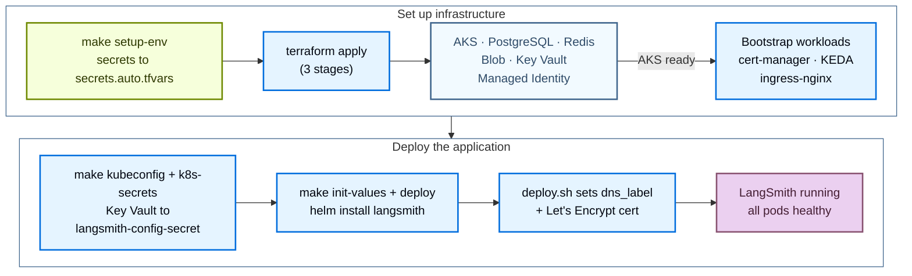

使用公开的 [Terraform modules](https://github.com/langchain-ai/terraform/tree/main/modules/azure) 将 LangSmith 部署到 Azure。以代码方式管理部署，你可以在多个订阅之间对 LangSmith 环境进行版本化、审查和复现，而不必在 Azure Portal 中逐一点击。

安装分为两个阶段：

1. **Infrastructure**：Terraform 预配 AKS、Postgres、Redis、Blob Storage、Key Vault、cert-manager、KEDA 和 ingress。
2. **Application**：Helm 在集群上安装 LangSmith chart。

完成基础安装后，通过设置开关并重新部署来启用三个可选 add-on（LangSmith Deployment、Agent Builder，以及 Insights 与 Polly）。



## 前置条件

### 所需工具

| 工具 | 版本 | 用途 |
|---|---|---|
| Azure CLI（`az`） | 2.50 | 认证、查询 Azure 资源、管理 AKS 凭证 |
| Terraform | 1.5 | 运行基础设施 module |
| `kubectl` | latest | 检查 AKS 集群 |
| Helm | 3.12 | 安装和管理 LangSmith chart |

```bash
brew install azure-cli kubectl helm
brew tap hashicorp/tap && brew install hashicorp/tap/terraform

az --version
terraform version
kubectl version --client
helm version
```

### 所需的 Azure RBAC

运行 Terraform 的身份需要在订阅上拥有以下角色：

| 角色 | 用途 |
|---|---|
| `Contributor` | 创建和管理所有 Azure 资源 |
| `User Access Administrator` | 为 Key Vault、Blob、cert-manager managed identity 创建角色分配 |

`Owner` 包含两者。仅 `Contributor` 不够，因为角色分配需要 User Access Administrator。

### 认证

```bash
az login
az account set --subscription <your-subscription-id>
az account show
```

你还需要一个 LangSmith license key（可[联系销售团队](https://www.langchain.com/contact-sales)），以及一个 `dns_label`（Azure 子域名，无需 DNS 设置）或自定义的 `langsmith_domain`。

## 快速开始

<Tip>
关于 `make` 目标、必需变量和常见约束的精简速查表，请参见 [Azure 速查参考](/langsmith/self-host-terraform-azure-quick-reference)。
</Tip>

要从零最快启动一个运行中的 LangSmith 实例：

```bash
# 1. Clone the public modules
git clone https://github.com/langchain-ai/terraform.git
cd terraform/modules/azure

# 2. Generate terraform.tfvars interactively
make quickstart

# 3. Bootstrap secrets (writes infra/secrets.auto.tfvars, chmod 600, gitignored)
make setup-env

# 4. Validate environment
make preflight

# 5. Provision infrastructure (~15 to 20 min)
make init
make apply

# 6. Get cluster credentials and push secrets into the cluster
make kubeconfig
make k8s-secrets

# 7. Deploy LangSmith via Helm (~10 min)
make init-values
make deploy
```

或一次性运行第 5 到第 7 步：

```bash
make deploy-all   # apply → kubeconfig → k8s-secrets → init-values → deploy
```

以下各节详细介绍每个阶段。

## 预配基础设施

Terraform 会预配以下 Azure 资源：

| 资源 | 类型 | 用途 |
|---|---|---|
| Resource Group | `azurerm_resource_group` | 所有资源的容器 |
| Virtual Network | `azurerm_virtual_network` | 隔离网络（10.0.0.0/17） |
| AKS Cluster | `azurerm_kubernetes_cluster` | Kubernetes，所有工作负载运行于此 |
| Ingress Controller | Helm | 外部负载均衡器 + TLS 终止（默认 nginx） |
| PostgreSQL Flexible Server | `azurerm_postgresql_flexible_server` | 组织配置、run metadata（external 层级） |
| Azure Managed Redis | `azapi_resource`（Microsoft.Cache/redisEnterprise） | Trace ingestion queue、pub/sub（external 层级） |
| Blob Storage | `azurerm_storage_account` | 原始 trace 对象，始终必需 |
| Managed Identity | `azurerm_user_assigned_identity` | 用于 pod 到 Blob 认证的 Workload Identity |
| Azure Key Vault | `azurerm_key_vault` | 存储所有 LangSmith 机密 |
| cert-manager | Helm | 自动化 TLS 证书管理 |
| KEDA | Helm | worker 的事件驱动自动扩缩容 |

### 克隆并配置

```bash
git clone https://github.com/langchain-ai/terraform.git
cd terraform/modules/azure
```

后续所有命令都在 `modules/azure/` 中运行。完整目标列表请运行 `make help`。

使用交互式向导生成 `terraform.tfvars`：

```bash
make quickstart
```

向导运行一份包含 10 个部分的问题清单，涵盖 profile、订阅、命名、网络、AKS 规格、ingress controller、DNS/TLS、后端服务、Key Vault、sizing profile 和安全 add-on。每个部分都附带说明、成本估算和权衡。重复运行是安全的；每个提示处会预选现有值。按 Enter 即可保留。

更喜欢手动编辑：

```bash
cp infra/terraform.tfvars.example infra/terraform.tfvars
vi infra/terraform.tfvars
```

最少必需的变量：

```hcl
# Identity
subscription_id = "<your-azure-subscription-id>"

# Location
location = "eastus"

# Naming + tagging
identifier  = "-prod"      # suffix on all resource names
environment = "prod"

# Deployment tier, production recommended
postgres_source   = "external"   # Azure DB for PostgreSQL
redis_source      = "external"   # Azure Managed Redis
clickhouse_source = "in-cluster" # use "external" + LangChain Managed for production

# DNS + TLS (HTTPS via Let's Encrypt on a free Azure subdomain)
dns_label              = "langsmith-prod"   # → langsmith-prod.eastus.cloudapp.azure.com
tls_certificate_source = "letsencrypt"
letsencrypt_email      = "ops@example.com"

# Sizing
sizing_profile = "production"   # minimum | dev | production | production-large
```

<Warning>
In-cluster ClickHouse 以单 pod 运行，无副本也无备份，仅限 dev/POC。生产环境请使用 [LangChain Managed ClickHouse](/langsmith/langsmith-managed-clickhouse)。
</Warning>

<Info>
无论层级如何，Blob Storage 都是必需的。Trace payload 必须存入 Azure Blob，绝不能存入 ClickHouse。
</Info>

所有变量请参见 [Azure 变量参考](/langsmith/self-host-terraform-azure-variables)。

### 引导机密

```bash
make setup-env
```

`setup-env.sh` 会写入 `infra/secrets.auto.tfvars`（被 gitignore，`chmod 600`）。Terraform 会自动拾取该文件；无需 shell 导出。

- **首次运行：** 提示输入 PostgreSQL 密码、LangSmith license key、管理员密码和管理员邮箱。在本地生成 `api_key_salt`、`jwt_secret` 和四个 Fernet 加密密钥。
- **后续运行：** 从 Azure Key Vault 读取六个生成的机密（`api_key_salt`、`jwt_secret` 和四个 Fernet key）。除非环境中已设置 `LANGSMITH_PG_PASSWORD`、`LANGSMITH_LICENSE_KEY`、`LANGSMITH_ADMIN_PASSWORD` 和 `LANGSMITH_ADMIN_EMAIL`，否则会重新提示输入 PostgreSQL 密码、license key、管理员密码和管理员邮箱。

<Warning>
切勿提交 `secrets.auto.tfvars`。它已被 gitignore。可在任何机器上运行 `make setup-env` 重新生成。
</Warning>

### Preflight

```bash
make preflight
```

校验 Azure CLI 认证、当前订阅、11 个必需的资源 provider、RBAC（Contributor + User Access Administrator）、`terraform.tfvars` 和 `secrets.auto.tfvars` 是否存在，以及 `terraform`/`kubectl`/`helm` 是否在 PATH 上。

### 执行 apply

<Note>
在干净的订阅上预配 Azure 云基础需要 15 到 20 分钟。不要中断 apply。
</Note>

```bash
make init
make apply   # ~15 to 20 min on first run
```

<Note>
全新部署时跳过 `make plan`。`kubernetes_manifest` 资源在 plan 阶段需要可用的集群 API，而此时它还不存在。`make apply` 会在三个内部阶段处理资源顺序：Azure 基础设施（含 AKS）→ Kubernetes 引导（namespace、机密、cert-manager、KEDA）→ ClusterIssuer 和其余 manifest。
</Note>

### 集群凭证与 Kubernetes Secrets

`make apply` 完成后，获取集群凭证并把机密推入集群：

```bash
make kubeconfig    # fetches AKS credentials, merges into ~/.kube/config
make k8s-secrets   # Key Vault → langsmith-config-secret in the langsmith namespace
```

`make k8s-secrets` 从 Key Vault 读取 8 个机密，并创建或更新 `langsmith-config-secret`。可安全重复运行；使用 `--dry-run=client | kubectl apply` 原地更新。

### 验证基础设施

```bash
# All nodes Ready
kubectl get nodes

# Bootstrap components, all Running
kubectl get pods -n cert-manager     # 3 pods
kubectl get pods -n keda             # 3 pods
kubectl get pods -n ingress-nginx    # 2 pods (if using nginx)

# NGINX LoadBalancer, save the EXTERNAL-IP
kubectl get svc ingress-nginx-controller -n ingress-nginx

# Workload Identity ServiceAccount, should have client-id annotation
kubectl get sa langsmith-ksa -n langsmith \
  -o jsonpath='{.metadata.annotations}'

# Terraform outputs
terraform -chdir=infra output

# Key outputs consumed by Helm scripts
terraform -chdir=infra output -raw keyvault_name
terraform -chdir=infra output -raw storage_account_name
terraform -chdir=infra output -raw storage_container_name
terraform -chdir=infra output -raw storage_account_k8s_managed_identity_client_id
```

## 部署 LangSmith

在两种受支持的部署路径中选择其一：

| 路径 | 命令 | 适用场景 |
|---|---|---|
| Helm 路径 _（默认）_ | `make init-values && make deploy` | 交互式输出、kubeconfig 刷新、preflight 检查。最适合首次部署和 Day-2 重新部署。 |
| Terraform 路径 | `make init-app && make apply-app` | Helm release + Kubernetes Secrets + Workload Identity SA 纳入 Terraform state 管理。最适合 GitOps 和 CI/CD 流水线。 |

### Helm 路径（推荐）

#### 生成 Helm values

```bash
cd terraform/modules/azure
make init-values
```

`make init-values` 读取 `terraform output` 和 `terraform.tfvars`，生成所有字段都已填充的 `helm/values/values-overrides.yaml`：

- `config.hostname`，你的 FQDN（来自 `dns_label` 或 `langsmith_domain`）。
- `config.initialOrgAdminEmail`，第一个组织 admin 账号。
- `config.existingSecretName: langsmith-config-secret`，机密引用。
- `config.blobStorage`，storage account 名称 + container + Workload Identity client ID。
- 8 个 ServiceAccount 的 Workload Identity 标注（backend、platform-backend、queue、ingest-queue、host-backend、listener、agent-builder-tool-server、agent-builder-trigger-server）。
- Ingress + TLS 区块（cert-manager 标注、TLS secret 名称）。
- Postgres 和 Redis 的外部 secret 引用（当 `postgres_source = "external"` / `redis_source = "external"` 时）。

同时会把 sizing overlay 和已启用的 add-on overlay 从 `helm/values/examples/` 复制到 `helm/values/`。

<Info>
管理员邮箱从 `terraform.tfvars` 中的 `langsmith_admin_email` 读取（在 `make setup-env` 期间设置），并自动写入 `values-overrides.yaml`。无需手动编辑。
</Info>

#### 部署

```bash
make deploy   # ~10 min
```

`make deploy` 会执行以下操作：

1. 校验 `values-overrides.yaml` 存在。
2. 通过 `az aks get-credentials` 刷新 kubeconfig。
3. 为 LoadBalancer service 添加 `service.beta.kubernetes.io/azure-dns-label-name` 标注，Azure 需要它才能把 DNS label 分配给公网 IP。
4. 当 `tls_certificate_source = "letsencrypt"` 时创建 `letsencrypt-prod` cert-manager `ClusterIssuer`（幂等）。
5. 运行 preflight 检查（工具、集群连通性、Helm 仓库）。
6. 校验 `langsmith-config-secret` 存在；缺失时自动从 Key Vault 创建。
7. 构建并记录 values 链。
8. 在继续之前自动恢复卡在 `pending-upgrade` 的 Helm release。
9. 运行 `helm upgrade --install langsmith langchain/langsmith --timeout 20m`。
10. 等待核心 deployments 完成滚动发布。
11. 为 `langsmith-ksa` ServiceAccount 标注 Workload Identity client ID。
12. 打印访问 URL 和登录凭证位置。

<Info>
为什么用 `--timeout 20m`？`langsmith-backend-auth-bootstrap` Job 作为 post-install hook 运行数据库迁移和组织初始化。首次安装时最多需要 5 分钟。如果没有足够长的 timeout，即使安装最终成功，Helm 也可能报告失败。
</Info>

<Tip>
**在第二个终端观察 pods：**

```bash
# macOS
brew install watch
watch kubectl get pods -n langsmith

# Without watch
while true; do clear; kubectl get pods -n langsmith; sleep 3; done
```
</Tip>

如果你完成的是 Helm 路径，请直接跳到[验证部署](#verify-the-deployment)。下面的 Terraform 路径是 Helm 路径的替代方案，而不是一个额外步骤。

### Terraform 路径

当你希望 Helm release、Kubernetes Secrets 和 Workload Identity ServiceAccount 纳入 Terraform state 管理时，请使用这条路径。

```bash
# Copy and configure app vars
cp app/terraform.tfvars.example app/terraform.tfvars
vi app/terraform.tfvars   # set admin_email at minimum

# Pull infra outputs into app/infra.auto.tfvars.json + terraform init
make init-app

# Deploy Helm release + K8s Secrets + WI ServiceAccount via Terraform
make apply-app
```

`app/terraform.tfvars` 中的功能开关：

```hcl
sizing                = "production"   # dev | production | production-large | none
enable_agent_deploys  = true           # LangSmith Deployment add-on
enable_agent_builder  = true           # Agent Builder add-on (requires agent_deploys)
enable_insights       = true           # Insights / ClickHouse add-on
enable_polly          = true           # Polly add-on (requires agent_deploys)
```

通过 Terraform 完成端到端部署（基础设施 + 应用）：

```bash
make deploy-all-tf   # apply → init-values → init-app → apply-app
```

### 验证部署

```bash
# All pods Running or Completed (~17 pods)
kubectl get pods -n langsmith

# Ingress host + TLS assigned
kubectl get ingress -n langsmith

# TLS certificate issued
kubectl get certificate -n langsmith   # READY: True

# Helm release status
helm list -n langsmith
```

预期的 pod 状态（约 5 分钟后全部 Running）：

```txt
langsmith-ace-backend-xxxxx              1/1   Running     0   5m
langsmith-backend-xxxxx                  1/1   Running     0   5m
langsmith-backend-auth-bootstrap-xxxxx   0/1   Completed   0   5m
langsmith-backend-ch-migrations-xxxxx    0/1   Completed   0   5m
langsmith-backend-migrations-xxxxx       0/1   Completed   0   5m
langsmith-clickhouse-0                   1/1   Running     0   5m
langsmith-frontend-xxxxx                 1/1   Running     0   5m
langsmith-ingest-queue-xxxxx             1/1   Running     0   5m
langsmith-platform-backend-xxxxx         1/1   Running     0   5m
langsmith-playground-xxxxx               1/1   Running     0   5m
langsmith-queue-xxxxx                    1/1   Running     0   5m
```

打开 `https://<HOSTNAME>`，使用 Key Vault 中的管理员邮箱和密码登录：

```bash
az keyvault secret show \
  --vault-name $(terraform -chdir=infra output -raw keyvault_name) \
  --name langsmith-admin-password \
  --query value -o tsv
```

### values 链

`make deploy` 按以下顺序应用 Helm values 文件（冲突时以最后一个文件为准）：

```txt
1. helm/values/values.yaml                              ← base values (chart defaults)
2. helm/values/values-overrides.yaml                    ← hostname, WI client-id, auth, postgres/redis
3. helm/values/langsmith-values-sizing-<profile>.yaml   ← resource requests + HPA settings
4. (add-on files when enable_* flags are set)
```

`helm/values/` 中的所有文件都被 gitignore（生成的或包含实时机密）。源模板位于 `helm/values/examples/`，由 `make init-values` 复制。

### Day-2 运维

```bash
make status         # 10-section health check
make status-quick   # skip Key Vault + K8s secret queries (faster)
make deploy         # re-deploy after any Helm value changes
make init-values    # re-generate values after Terraform changes
make kubeconfig     # refresh cluster credentials
make k8s-secrets    # re-create langsmith-config-secret from Key Vault
```

## 启用 add-on

每个 add-on 都由 `infra/terraform.tfvars` 中的一个开关控制。设置开关后，重新运行 `make init-values` 重新生成 values，然后重新运行 `make deploy`。

### LangSmith Deployment

启用 [LangSmith Deployment](/langsmith/deploy-self-hosted-full-platform)，让你可以直接从 [LangSmith UI](https://smith.langchain.com) 以 API server 的形式部署和管理 agent。这会新增三个 pods。

| Pod | 角色 | Workload Identity |
|---|---|---|
| `langsmith-host-backend` | LangSmith Deployment control plane API。管理 deployment 生命周期，状态存储在共享 PostgreSQL 中。 | 是 |
| `langsmith-listener` | 监听 host-backend，在 Kubernetes 中创建和更新 `LangGraphPlatform` CRD。 | 是 |
| `langsmith-operator` | 调谐 CRD。为每个 deployment 创建 Deployment、StatefulSet 和 Service。 | 否 |

#### 先扩容节点池

启用之前，先将 `default_node_pool_min_count` 提高到至少 5。operator 按需派生 agent deployment pods，需要节点余量：

```hcl
# infra/terraform.tfvars
default_node_pool_min_count = 5      # operator pods need headroom
enable_deployments          = true
```

<Warning>
节点容量不足时，operator 派生的 agent pods 会无限期停留在 `Pending` 状态。请先扩容节点池，再启用。
</Warning>

#### Apply、重新生成 values、部署

```bash
cd terraform/modules/azure
make apply          # scale up node pool (~5 min)
make init-values    # picks up enable_deployments = true → generates add-on overlay
make deploy         # rolls out host-backend + listener + operator
```

`make init-values` 会把 LangSmith Deployment add-on overlay（`langsmith-values-agent-deploys.yaml`）追加到 values 链。它会自动注入：

```yaml
config:
  deployment:
    enabled: true                          # REQUIRED, without this listener and operator are skipped silently
    url: "https://<your-hostname>"         # must match config.hostname (with protocol)
    tlsEnabled: true                       # set based on tls_certificate_source
```

<Warning>
**`config.deployment.url` 必须包含 `https://`。** 缺少协议会导致 operator 部署的 agent 无限期卡在 `DEPLOYING` 状态。该 URL 由 `make init-values` 自动注入。不要在 overlay 文件中手动设置；下次运行时会被覆盖。
</Warning>

<Warning>
**必须设置 `config.deployment.enabled: true`。** 只设置 `config.deployment.url` 而没有 `enabled: true`，chart 会静默跳过创建 `listener` 和 `operator`。没有报错，它们就是不会出现。
</Warning>

#### 验证

```bash
# All three pods Running
kubectl get pods -n langsmith | grep -E "host-backend|listener|operator"

# LangSmith Deployment CRDs registered
kubectl get crd | grep langchain

# List LangSmith Deployments (empty on first deploy, populated when you create a deployment)
kubectl get lgp -n langsmith
```

预期结果：`langsmith-host-backend`、`langsmith-listener` 和 `langsmith-operator` 全部 Running。pod 总数：约 20 个 Running + 3 个 Completed job。

KEDA 已随基础设施一同安装。设置 `enable_deployments = true` 后，operator 会为每个 agent deployment 的 worker queue 创建 KEDA `ScaledObject` 资源。worker pods 空闲时缩容到零，并按 Redis queue 深度扩容。

### Agent Builder

提供从 LangSmith UI 以可视化、AI 辅助的方式创建和管理 LangGraph agent。无需 `terraform apply`；运行 `make init-values && make deploy`。

**前置条件：** 已启用 LangSmith Deployment（`enable_deployments = true`）。未启用就开启 Agent Builder 会导致 preflight 报错。

| Pod | 类型 | 角色 |
|---|---|---|
| `langsmith-agent-builder-tool-server` | 静态 | MCP tool 执行服务器，为 AI 提供代码/文件编辑工具 |
| `langsmith-agent-builder-trigger-server` | 静态 | Webhook 接收器与定时触发引擎 |
| `langsmith-agent-bootstrap` | Job（Completed） | 通过 operator 注册内置的 Agent Builder agent，仅运行一次 |
| `agent-builder-<hash>` + queue + redis + `lg-<hash>-0` | 动态（由 operator 管理） | Agent Builder deployment，在 bootstrap Job 运行时由 operator 创建 |

启用：

```hcl
# infra/terraform.tfvars
enable_deployments   = true    # required prerequisite
enable_agent_builder = true
```

```bash
cd terraform/modules/azure
make init-values    # appends langsmith-values-agent-builder.yaml to values chain
make deploy         # rolling update, ~10 min for bootstrap Job to complete
```

`make init-values` 会把 Agent Builder add-on overlay（`langsmith-values-agent-builder.yaml`）追加到 values 链。该 overlay 启用 Agent Builder UI 和配套服务，设置 `backend.agentBootstrap.enabled: true`（post-install job，将 Agent Builder 注册为 LangSmith Deployment 并创建所需的 ConfigMap），并把 agent worker pod 资源设为保守值（1 到 2 CPU、512 MiB 到 1 GiB 内存），而不是 chart 默认的 4 到 8 GiB 内存。

验证：

```bash
# Static pods Running, bootstrap Job Completed
kubectl get pods -n langsmith | grep -E "tool-server|trigger-server|Bootstrap"

# Operator-managed dynamic pods (4 pods, api-server, queue, redis, postgres StatefulSet)
kubectl get pods -n langsmith | grep agent-builder

# Operator-managed LangSmith Deployment for Agent Builder
kubectl get lgp -n langsmith
```

预期结果：3 个静态 pods（tool-server、trigger-server、bootstrap Job）+ 4 个动态 pods。总计约 26 个 pods。`make deploy` 之后，LangSmith UI 导航中会出现一个 **Agent Builder** 区块。

<Warning>
**在 `agentBootstrap` 完成后重启 frontend。** `agentBootstrap` Job 会创建 `langsmith-polly-config` ConfigMap，frontend 读取它以展示 Polly UI。如果 bootstrap 完成时 frontend 已在运行，Polly 会显示 "Unable to connect to LangGraph server"。修复：

```bash
kubectl rollout restart deployment langsmith-frontend -n langsmith
```
</Warning>

<Warning>
**加密密钥从 `langsmith-config-secret` 读取。** 不要在 `values-overrides.yaml` 中内联设置 `config.agentBuilder.encryptionKey`。chart 通过 `existingSecretName` 从 `langsmith-config-secret` 读取它。内联设置会覆盖 secret 引用并造成不一致。
</Warning>

`langsmith-agent-builder-tool-server` 和 `langsmith-agent-builder-trigger-server` 都需要 Workload Identity 才能访问 Azure Blob Storage。它们的 federated credential 已预先注册在 `modules/k8s-cluster/main.tf` 中；无需额外设置。

### Insights 与 Polly

两个功能，都要求 LangSmith Deployment。它们彼此独立；可以单独启用其中任何一个。

- **Insights：** AI 驱动的 trace 分析（Clio）。发现 LangSmith traces 中的模式和异常。首次在 UI 中调用时，Clio 通过 operator 以动态 LangGraph deployment 形式部署。不新增静态 pods。
- **Polly：** AI 驱动的评估与监控 agent。以动态 LangGraph deployment 形式运行，由 operator 管理。overlay 启用 Polly（顶层 `polly.enabled: true`）；operator 管理其资源。

无需 `terraform apply`；运行 `make init-values && make deploy`。

```hcl
# infra/terraform.tfvars
enable_deployments = true    # required prerequisite
enable_insights    = true    # Insights / Clio analytics
enable_polly       = true    # Polly AI evaluation agent
```

启用其中一个：

```hcl
enable_insights = true    # Insights only
# or
enable_polly    = true    # Polly only
```

```bash
cd terraform/modules/azure
make init-values    # appends insights + polly add-on overlays to the values chain
make deploy         # rolling update, ~5 min
```

`make init-values` 根据 `terraform.tfvars` 中的 `clickhouse_source` 追加 add-on overlay：

- `clickhouse_source = "in-cluster"`：生成最小 overlay（仅顶层 `insights.enabled: true`）。Helm chart 内部管理 ClickHouse。
- `clickhouse_source = "external"`：生成完整 overlay，含 `clickhouse.external.enabled: true` 和 `langsmith-clickhouse` secret 引用。部署前请使用 ClickHouse host 和凭证创建该 secret。

<Warning>
**使用 in-cluster ClickHouse 时不要手动复制 Insights 示例文件。** 示例 `helm/values/examples/langsmith-values-insights.yaml` 设置了 `clickhouse.external.enabled: true` 和 `existingSecretName: langsmith-clickhouse`。使用 in-cluster ClickHouse 时手动复制它会导致 `CreateContainerConfigError`，因为该 secret 不存在。请始终使用 `make init-values` 生成正确的文件。
</Warning>

验证：

```bash
# ClickHouse already running from base install
# Insights and Polly deploy as dynamic pods when first invoked from the UI
kubectl get pods -n langsmith | grep -E "clickhouse|polly|clio"

# Watch for dynamic pods on first Insights use
kubectl get pods -n langsmith -w

# Confirm Insights is enabled in Helm values
helm get values langsmith -n langsmith | grep -A3 insights
# Expected: enabled: true
```

<Warning>
**加密密钥在首次启用后绝不能更改。** `insights_encryption_key` 和 `polly_encryption_key` 在首次启用后绝不能更改。更改其中任何一个都会永久损坏所有已加密数据。没有恢复途径。这些 key 存放在 Key Vault 中，从不自动轮换。
</Warning>

<Warning>
**首次启用 Polly 后重启 frontend。** 如果启用后 Polly UI 显示 "Unable to connect to LangGraph server"，说明 frontend 在 bootstrap ConfigMap 就绪之前就已启动。修复：

```bash
kubectl rollout restart deployment langsmith-frontend -n langsmith
```
</Warning>

### add-on 汇总

| 阶段 | 新增 pods | 运行总数（约） |
|---|---|---|
| 基础安装 | LangSmith 核心（backend、frontend、queue、ingest-queue、clickhouse 等） | 约 17 |
| LangSmith Deployment | `host-backend`、`listener`、`operator` | 约 20 |
| Agent Builder | `tool-server`、`trigger-server`、`bootstrap` Job + 4 个动态 Agent Builder pods | 约 26 |
| Insights 与 Polly | 无新增静态 pods（Clio + Polly 首次使用时动态出现） | 空闲时约 22 |

## Ingress controller

在 `make apply` 之前在 `terraform.tfvars` 中设置 `ingress_controller`。完整的 TLS 兼容性矩阵请参见 [Azure module 仓库](https://github.com/langchain-ai/terraform/blob/main/modules/azure/INGRESS_CONTROLLERS.md)中的 `INGRESS_CONTROLLERS.md`。

| 取值 | Terraform 安装的内容 | 最适合 |
|---|---|---|
| `nginx` _（默认）_ | 带 Azure LB 的 `ingress-nginx` Helm chart | 标准部署。设置最简单。 |
| `istio-addon` | AKS Service Mesh add-on（Azure 托管的 Istio） | Azure 托管 Istio mesh、多 dataplane、mTLS。 |
| `istio` | `istio-base` + `istiod` + `istio-ingressgateway` | 自托管 Istio。完整 mesh 和 sidecar 注入。 |
| `agic` | Azure Application Gateway v2 + AKS 托管的 `ingress_application_gateway` add-on | 企业级 Azure、原生 L7 WAF、仅 HTTP 或 dns01 + 自定义域名。 |
| `envoy-gateway` | `gateway-helm` OCI chart、Kubernetes Gateway API | 原生 Gateway API，现代的 Ingress 替代方案。 |

<Warning>
`letsencrypt`（HTTP-01）仅适用于 `nginx`、`istio`（自托管）和 `envoy-gateway`。`istio-addon` 不创建 IngressClass，因此 ACME solver 无法接收流量。使用 `agic` 时，Application Gateway 会改写 ACME challenge 路径，HTTP-01 solver 会失败。对于这两者，请使用自定义域名的 `dns01`，或仅 HTTP 的 `none`。
</Warning>

## DNS 与 TLS

`dns_label` 为你提供一个免费的 Azure 子域名 `<label>.<region>.cloudapp.azure.com`，无需域名注册或 DNS zone。`deploy.sh` 会自动标注正确的 LoadBalancer service。

**快速开始默认（HTTP，零配置）：**

```hcl
dns_label              = "langsmith-prod"
tls_certificate_source = "none"
```

**通过 Let's Encrypt 添加 HTTPS（nginx、自托管 istio 或 envoy-gateway）：**

```hcl
dns_label              = "langsmith-prod"
tls_certificate_source = "letsencrypt"
letsencrypt_email      = "you@example.com"
```

**自定义域名 + DNS-01（所有 controller，可在防火墙后使用）：**

```hcl
langsmith_domain       = "langsmith.mycompany.com"
tls_certificate_source = "dns01"
letsencrypt_email      = "you@example.com"
create_dns_zone        = true
# After deploy: add ingress_ip = "<lb-ip>" and re-run make apply (creates A record)
```

**dns01 流程：**

1. `make apply` 创建 Azure DNS zone，并输出 4 个 nameserver。
2. 在你的注册商处，为该子域名添加 NS 记录，指向这 4 个 nameserver。
3. 验证：`dig NS langsmith.mycompany.com @8.8.8.8`。
4. `make deploy` 通过 DNS-01 自动签发证书（Workload Identity 将 TXT 记录写入 Azure DNS）。
5. 获取 LB IP，在 `terraform.tfvars` 中添加 `ingress_ip = "<ip>"`，然后 `make apply`（创建 A 记录）。
6. `make status` 会准确显示每个阶段应添加哪些 NS 和 A 记录。

<Note>
**为什么用 NS 记录而不是 CNAME：** cert-manager 必须向 zone 写入 TXT 记录以证明所有权。这要求 Azure DNS 对该子域名具有权威性，NS 委派正是授予这种权威性。CNAME 只是给流量起别名，不会转移 DNS 权威；DNS-01 challenge 会失败。
</Note>

## 后续步骤

- 查阅 [Azure 变量](/langsmith/self-host-terraform-azure-variables)和[速查参考](/langsmith/self-host-terraform-azure-quick-reference)。
- 查看 [Azure 架构](/langsmith/self-host-terraform-azure-architecture)，了解 module 结构、流量路径和 Workload Identity。
- 出现问题时，请查阅 [Azure 故障排查指南](/langsmith/self-host-terraform-azure-troubleshooting)。
- 使用 [LangSmith Deployment](/langsmith/deploy-self-hosted-full-platform) 在 UI 中启用 agent 部署。
