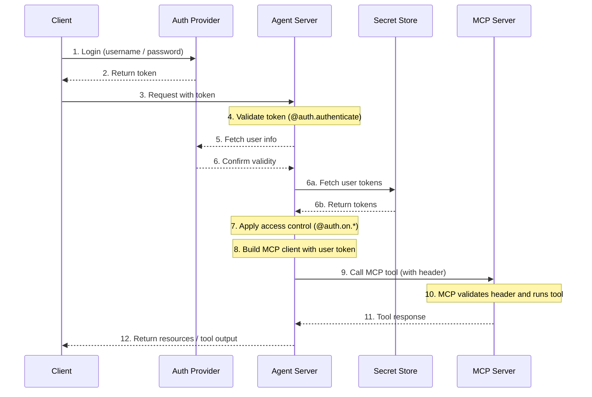

Model Context Protocol，MCP，是一种开放协议，用于以模型无关的格式描述 tools 和数据源，让 LLM 能够通过结构化 API 发现并使用它们。

[Agent Server](/langsmith/agent-server) 使用 [Streamable HTTP transport](https://spec.modelcontextprotocol.io/specification/2025-03-26/basic/transports/#streamable-http) 实现了 MCP。这使得 LangGraph **agents** 可以被暴露为 **MCP tools**，从而能够被任何支持 Streamable HTTP 的 MCP 兼容客户端使用。

MCP 端点位于 [Agent Server](/langsmith/agent-server) 的 `/mcp`。

你可以设置[自定义认证中间件](/langsmith/custom-auth)，让用户通过 MCP server 完成认证，从而在 LangSmith deployment 中访问用户作用域的 tools。

这一流程的一个示例架构如下：



## 要求

要使用 MCP，请确保安装了以下依赖：

* `langgraph-api >= 0.2.3`
* `langgraph-sdk >= 0.1.61`

安装方式如下：

<CodeGroup>
```bash pip
pip install "langgraph-api>=0.2.3" "langgraph-sdk>=0.1.61"
```

```bash uv
uv add "langgraph-api>=0.2.3" "langgraph-sdk>=0.1.61"
```
</CodeGroup>

## 使用概览

要启用 MCP：

* 升级到 `langgraph-api>=0.2.3`。如果你是在部署 LangSmith，那么只要创建一个新 revision，系统会自动为你完成这一步。
* MCP tools，也就是 agents，会自动暴露出来。
* 使用任意支持 Streamable HTTP 的 MCP 兼容客户端进行连接。

### 客户端

使用 MCP 兼容客户端连接到 Agent Server。下面的示例展示了如何在不同编程语言中完成连接。

<Tabs>
    <Tab title="JavaScript/TypeScript">
    ```bash
    npm install @modelcontextprotocol/sdk
    ```

        > **Note**
        > 请将 `serverUrl` 替换为你的 Agent Server URL，并根据需要配置认证 headers。

    ```js
    import { Client } from "@modelcontextprotocol/sdk/client/index.js";
    import { StreamableHTTPClientTransport } from "@modelcontextprotocol/sdk/client/streamableHttp.js";

    // Connects to the LangGraph MCP endpoint
    async function connectClient(url) {
        const baseUrl = new URL(url);
        const client = new Client({
            name: 'streamable-http-client',
            version: '1.0.0'
        });

        const transport = new StreamableHTTPClientTransport(baseUrl);
        await client.connect(transport);

        console.log("Connected using Streamable HTTP transport");
        console.log(JSON.stringify(await client.listTools(), null, 2));
        return client;
    }

    const serverUrl = "http://localhost:2024/mcp";

    connectClient(serverUrl)
        .then(() => {
            console.log("Client connected successfully");
        })
        .catch(error => {
            console.error("Failed to connect client:", error);
        });
    ```
    </Tab>
    <Tab title="Python">
    安装 adapter：

    ```bash
    pip install langchain-mcp-adapters
    ```

    下面是一个连接远程 MCP 端点，并将 agent 作为 tool 使用的示例：

    ```python
    # Create server parameters for stdio connection
    from mcp import ClientSession
    from mcp.client.streamable_http import streamablehttp_client
    import asyncio

    from langchain_mcp_adapters.tools import load_mcp_tools
    from langchain.agents import create_agent


    server_params = {
        "url": "https://mcp-finance-agent.xxx.us.langgraph.app/mcp",
        "headers": {
            "X-Api-Key":"lsv2_pt_your_api_key"
        }
    }

    async def main():
        async with streamablehttp_client(**server_params) as (read, write, _):
            async with ClientSession(read, write) as session:
                # Initialize the connection
                await session.initialize()

                # Load the remote graph as if it was a tool
                tools = await load_mcp_tools(session)

                # Create and run a react agent with the tools
                agent = create_agent("gpt-5.5", tools)

                # Invoke the agent with a message
                agent_response = await agent.ainvoke({"messages": "What can the finance agent do for me?"})
                print(agent_response)

    if __name__ == "__main__":
        asyncio.run(main())
    ```
    </Tab>
</Tabs>

## 将 agent 暴露为 MCP tool

部署完成后，你的 agent 会以如下配置出现在 MCP 端点中：

* **Tool name**：agent 的名称。
* **Tool description**：agent 的描述。
* **Tool input schema**：agent 的输入 schema。

### 设置名称和描述

你可以在 `langgraph.json` 中设置 agent 的名称和描述：

```json
{
    "graphs": {
        "my_agent": {
            "path": "./my_agent/agent.py:graph",
            "description": "A description of what the agent does"
        }
    },
    "env": ".env"
}
```

部署后，你还可以通过 LangGraph SDK 更新名称和描述。

### Schema

定义清晰、最小化的输入和输出 schema，可以避免向 LLM 暴露不必要的内部复杂性。

默认的 [MessagesState](/oss/langgraph/graph-api#messagesstate) 使用的是 `AnyMessage`，它支持很多消息类型，但对于直接暴露给 LLM 来说过于宽泛。

更推荐的做法是定义**自定义 agents 或 workflows**，并使用显式类型化的输入和输出结构。

例如，一个用于回答文档问题的 workflow 可以写成这样：

```python
from langgraph.graph import StateGraph, START, END
from typing_extensions import TypedDict

# Define input schema
class InputState(TypedDict):
    question: str

# Define output schema
class OutputState(TypedDict):
    answer: str

# Combine input and output
class OverallState(InputState, OutputState):
    pass

# Define the processing node
def answer_node(state: InputState):
    # Replace with actual logic and do something useful
    return {"answer": "bye", "question": state["question"]}

# Build the graph with explicit schemas
builder = StateGraph(OverallState, input_schema=InputState, output_schema=OutputState)
builder.add_node(answer_node)
builder.add_edge(START, "answer_node")
builder.add_edge("answer_node", END)
graph = builder.compile()

# Run the graph
print(graph.invoke({"question": "hi"}))
```

更多细节请参阅[低层概念指南](/oss/langgraph/graph-api#state)。

## 在 deployment 中使用用户作用域的 MCP tools

<Tip>
**前提条件**
你已经添加了自己的[自定义认证中间件](/langsmith/custom-auth)，并让它填充 `langgraph_auth_user` 对象，这样在 graph 中的每个 node 都可以通过 configurable context 访问到它。
</Tip>

要让用户作用域的 tools 能在你的 LangSmith deployment 中使用，可以从实现下面这样的代码片段开始：

```python
from langchain_mcp_adapters.client import MultiServerMCPClient

def mcp_tools_node(state, config):
    user = config["configurable"].get("langgraph_auth_user")
         , user["github_token"], user["email"], etc.

    client = MultiServerMCPClient({
        "github": {
            "transport": "streamable_http", # (1)
            "url": "https://my-github-mcp-server/mcp", # (2)
            "headers": {
                "Authorization": f"Bearer {user['github_token']}"
            }
        }
    })
    tools = await client.get_tools() # (3)

    # Your tool-calling logic here

    tool_messages = ...
    return {"messages": tool_messages}
```

1. MCP 只有在对 `streamable_http` 和 `sse` `transport` servers 发起请求时，才支持附加 headers。
2. 你的 MCP server URL。
3. 从你的 MCP server 获取可用 tools。

_也可以通过[在运行时重建 graph](/langsmith/graph-rebuild) 来实现，为新 run 使用不同配置。_

## 会话行为

当前 LangGraph 对 MCP 的实现不支持 sessions。每个 `/mcp` 请求都是无状态且彼此独立的。

## 认证

`/mcp` 端点使用与 LangGraph API 其他部分相同的认证方式。具体设置请参阅[认证指南](/langsmith/auth)。

## 禁用 MCP

若要禁用 MCP 端点，请在 `langgraph.json` 配置文件中将 `disable_mcp` 设为 `true`：

```json
{
  "$schema": "https://langgra.ph/schema.json",
  "http": {
    "disable_mcp": true
  }
}
```

这样服务器就不会暴露 `/mcp` 端点了。
