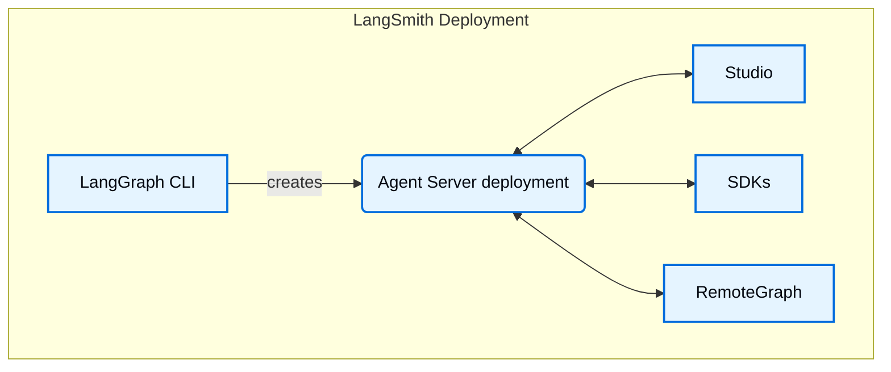

<Info>
**前置条件**
* [LangSmith](/langsmith/observability)
* [Agent Server](/langsmith/agent-server)
* [LangGraph CLI](/langsmith/cli)
</Info>

Studio 是一款专门面向 agent 的 IDE，可用于可视化、交互和调试实现了 Agent Server API 协议的 agent 系统。Studio 还与 [tracing](/langsmith/observability-concepts)、[evaluation](/langsmith/evaluation) 和 [prompt engineering](/langsmith/prompt-engineering) 集成。

## 功能

Studio 的主要功能包括：

* 可视化 graph 架构
* [运行并与 agent 交互](/langsmith/use-studio#run-application)
* [管理 assistants](/langsmith/use-studio#manage-assistants)
* [管理 threads](/langsmith/use-studio#manage-threads)
* [迭代 prompts](/langsmith/observability-studio)
* [基于数据集运行实验](/langsmith/observability-studio#run-experiments-over-a-dataset)
* 管理[长期记忆](/oss/concepts/memory)
* 通过[时间旅行](/oss/langgraph/use-time-travel)调试 agent 状态
* 一键部署到 LangSmith Cloud

Studio 适用于部署在 [LangSmith](/langsmith/deployment-quickstart) 上的 graphs，也适用于通过 [Agent Server](/langsmith/local-dev-testing) 在本地运行的 graphs。

Studio 支持两种模式：

### Graph 模式

Graph 模式提供完整功能集，适合希望尽可能查看 agent 执行细节的场景，包括经过的节点、中间状态，以及 LangSmith 集成能力（例如添加到数据集和 playground）。

### Chat 模式

Chat 模式是一个更简单的 UI，用于迭代和测试面向聊天的 agents。它适合业务用户，以及想测试 agent 整体行为的用户。Chat 模式仅支持 state 包含或扩展了 [`MessagesState`](/oss/langgraph/use-graph-api#messagesstate) 的 graph。

## 从 Studio 部署

可以直接在 Studio 中，从[本地测试 graphs](/langsmith/local-dev-testing) 一键切换到将它们部署到 LangSmith Cloud。既可以用它快速创建全新的部署进行原型验证，也可以重新部署现有部署。

## 了解更多

* 查看这份关于如何使用 Studio [快速开始](/langsmith/quick-start-studio)的指南。

## 视频指南
<iframe
  className="w-full aspect-video rounded-xl"
  src="https://www.youtube.com/embed/Mi1gSlHwZLM?si=oWCeHQ640zPHoLwn"
  title="YouTube video player"
  frameBorder="0"
  allow="accelerometer; autoplay; clipboard-write; encrypted-media; gyroscope; picture-in-picture"
  allowFullScreen
></iframe>
