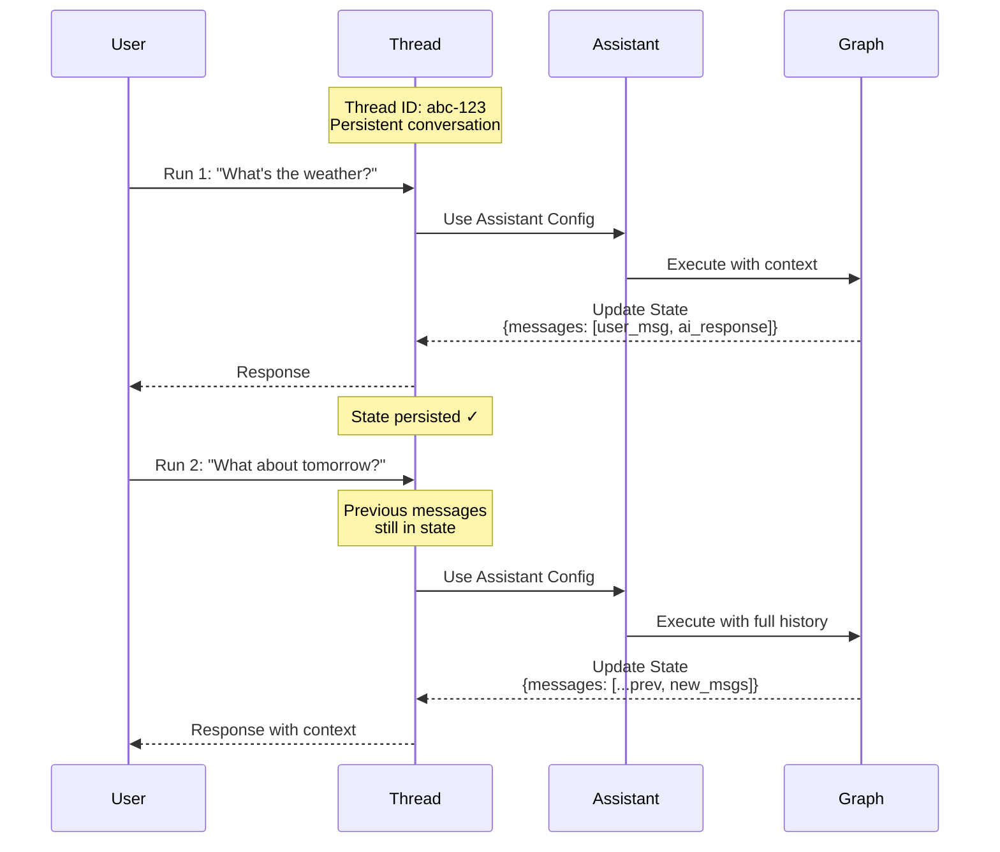

本指南将介绍如何创建、查看和检查 _threads_。Threads 与 [assistants](/langsmith/assistants) 协同工作，可为你已[部署的 graphs](/langsmith/deployment) 启用[有状态](/oss/langgraph/persistence)执行。

## 理解 threads

thread 是一个持久化的会话容器，用于在多次 run 之间维护状态。每次你在某个 thread 上执行 run 时，graph 都会基于该 thread 的当前状态处理输入，并用新信息更新该状态。

Threads 通过在 runs 之间保留对话历史和上下文，实现有状态交互。没有 thread 的话，每一次 run 都会是无状态的，无法记住之前的交互。Threads 在以下场景中特别有用：

- 多轮对话，assistant 需要记住先前讨论过的内容。
- 需要跨多个步骤维持上下文的长时间任务。
- 以用户为维度管理状态，即每个用户都有自己独立的对话历史。

下面的图示展示了一个 thread 如何在两次 run 之间保持状态。第二次 run 可以访问第一次 run 中的消息，因此 assistant 能理解 “What about tomorrow?” 这句话所指的是第一次 run 中的天气问题：



- 一个 thread 会通过唯一的 thread ID 维护一段持久对话。
- 每次 run 都会将 assistant 的配置应用到 graph 执行过程中。
- 每次 run 之后状态都会被更新，并保留给后续 runs 使用。
- 后续 runs 可以访问完整的对话历史。

<Note>
- **[Assistants](/langsmith/assistants)** 定义了 graph 的执行配置（模型、prompts、tools）。创建 run 时，你可以指定 **graph ID**（例如 `"agent"`）来使用默认 assistant，也可以指定 **assistant ID**（UUID）来使用某个特定配置。
- **Threads** 负责维护状态和对话历史。
- **Runs** 将 assistant 与 thread 结合起来，在特定配置和状态下执行你的 graph。
</Note>

<Tip>
最佳实践：当你追踪 thread（对话）中的 runs 时，确保所有 runs——包括父 run 和子 run——都设置了 `thread_id`。这是让 thread 筛选、token 统计以及 thread 级评估正常工作的必要条件。
</Tip>

## 创建 thread

如果你想让 graph 的运行具备状态持久化能力，首先必须创建一个 thread：

<Tabs>
<Tab title="SDK">

### 空 thread

创建一个新 thread，可使用以下任一方式：

<CodeGroup>
```python Python
from langgraph_sdk import get_client

# Initialize the client with your deployment URL
client = get_client(url=<DEPLOYMENT_URL>)

# Create an empty thread
# This creates a new thread with no initial state
thread = await client.threads.create()

print(thread)
```

```javascript JavaScript
import { Client } from "@langchain/langgraph-sdk";

// Initialize the client with your deployment URL
const client = new Client({ apiUrl: <DEPLOYMENT_URL> });

// Create an empty thread
// This creates a new thread with no initial state
const thread = await client.threads.create();

console.log(thread);
```

```bash cURL
curl --request POST \
    --url <DEPLOYMENT_URL>/threads \
    --header 'Content-Type: application/json' \
    --data '{}'
```
</CodeGroup>

更多信息请参见 @[Python][ThreadsClient.create] 和 @[JS][ThreadsClient.create] SDK 文档，或 [REST API](/langsmith/agent-server-api/threads/create-thread) reference。

输出：

```json
{
  "thread_id": "123e4567-e89b-12d3-a456-426614174000",
  "created_at": "2025-05-12T14:04:08.268Z",
  "updated_at": "2025-05-12T14:04:08.268Z",
  "metadata": {},
  "status": "idle",
  "values": {}
}
```

### 复制 thread

如果你在应用中已经有一个现成的 thread，并且希望复制它的状态，也可以使用 `copy` 方法。它会创建一个独立的新 thread，该 thread 在复制发生时拥有与原 thread 完全相同的历史：

<CodeGroup>
```python Python
# Copy an existing thread
# The new thread will have the same state as the original at the time of copying
copied_thread = await client.threads.copy(thread["thread_id"])
```

```javascript JavaScript
// Copy an existing thread
// The new thread will have the same state as the original at the time of copying
const copiedThread = await client.threads.copy(thread["thread_id"]);
```

```bash cURL
curl --request POST --url <DEPLOYMENT_URL>/threads/thread["thread_id"]/copy \
--header 'Content-Type: application/json'
```
</CodeGroup>

更多信息请参见 @[Python][ThreadsClient.copy] 和 @[JS][ThreadsClient.copy] SDK 文档，或 [REST API](/langsmith/agent-server-api/threads/copy-thread) reference。

### 预填充状态

你可以通过向 `create` 方法传入一组 `supersteps`，创建一个带有任意预定义状态的 thread。`supersteps` 描述了一系列状态更新，这些更新共同建立出 thread 的初始状态。这在以下场景中特别有用：

- 创建带有既有对话历史的 thread。
- 从其他系统迁移对话。
- 搭建具有特定初始状态的测试场景。
- 从上一次会话恢复对话。

有关 checkpoints 与状态管理的更多信息，请参见 [LangGraph persistence documentation](/oss/langgraph/persistence)。

<CodeGroup>
```python Python
from langgraph_sdk import get_client

# Initialize the client
client = get_client(url=<DEPLOYMENT_URL>)

# Create a thread with pre-populated conversation history
# The supersteps define a sequence of state updates that build up the initial state
thread = await client.threads.create(
  graph_id="agent",  # Specify which graph this thread is for
  supersteps=[
    {
      updates: [
        {
          values: {},
          as_node: '__input__',  # Initial input node
        },
      ],
    },
    {
      updates: [
        {
          values: {
            messages: [
              {
                type: 'human',
                content: 'hello',
              },
            ],
          },
          as_node: '__start__',  # User's first message
        },
      ],
    },
    {
      updates: [
        {
          values: {
            messages: [
              {
                content: 'Hello! How can I assist you today?',
                type: 'ai',
              },
            ],
          },
          as_node: 'call_model',  # Assistant's response
        },
      ],
    },
  ])

print(thread)
```

```javascript JavaScript
import { Client } from "@langchain/langgraph-sdk";

// Initialize the client
const client = new Client({ apiUrl: <DEPLOYMENT_URL> });

// Create a thread with pre-populated conversation history
// The supersteps define a sequence of state updates that build up the initial state
const thread = await client.threads.create({
    graphId: 'agent',  // Specify which graph this thread is for
    supersteps: [
    {
      updates: [
        {
          values: {},
          asNode: '__input__',  // Initial input node
        },
      ],
    },
    {
      updates: [
        {
          values: {
            messages: [
              {
                type: 'human',
                content: 'hello',
              },
            ],
          },
          asNode: '__start__',  // User's first message
        },
      ],
    },
    {
      updates: [
        {
          values: {
            messages: [
              {
                content: 'Hello! How can I assist you today?',
                type: 'ai',
              },
            ],
          },
          asNode: 'call_model',  // Assistant's response
        },
      ],
    },
  ],
});

console.log(thread);
```

```bash cURL
curl --request POST \
    --url <DEPLOYMENT_URL>/threads \
    --header 'Content-Type: application/json' \
    --data '{"metadata":{"graph_id":"agent"},"supersteps":[{"updates":[{"values":{},"as_node":"__input__"}]},{"updates":[{"values":{"messages":[{"type":"human","content":"hello"}]},"as_node":"__start__"}]},{"updates":[{"values":{"messages":[{"content":"Hello\u0021 How can I assist you today?","type":"ai"}]},"as_node":"call_model"}]}]}'
```
</CodeGroup>

输出：

```json
{
  "thread_id": "f15d70a1-27d4-4793-a897-de5609920b7d",
  "created_at": "2025-05-12T15:37:08.935038+00:00",
  "updated_at": "2025-05-12T15:37:08.935046+00:00",
  "metadata": {
    "graph_id": "agent"
  },
  "status": "idle",
  "config": {},
  "values": {
    "messages": [
      {
        "content": "hello",
        "additional_kwargs": {},
        "response_metadata": {},
        "type": "human",
        "name": null,
        "id": "8701f3be-959c-4b7c-852f-c2160699b4ab",
        "example": false
      },
      {
        "content": "Hello! How can I assist you today?",
        "additional_kwargs": {},
        "response_metadata": {},
        "type": "ai",
        "name": null,
        "id": "4d8ea561-7ca1-409a-99f7-6b67af3e1aa3",
        "example": false,
        "tool_calls": [],
        "invalid_tool_calls": [],
        "usage_metadata": null
      }
    ]
  }
}
```

</Tab>
<Tab title="UI">

你也可以直接在 [LangSmith UI](https://smith.langchain.com) 中创建 threads：

1. 打开你的 [deployment](/langsmith/deployment)。
2. 选择 **Threads** 标签页。
3. 点击 **+ New thread**。
4. 根据需要填写 metadata 或 thread 的初始状态。
5. 点击 **Create thread**。

新创建的 thread 会立即出现在 threads 表格中，并可直接用于 runs。

</Tab>
</Tabs>

## 列出 threads

<Tabs>
<Tab title="SDK">

要列出 threads，可使用 `search` 方法。它会列出应用中所有符合给定过滤条件的 threads：

### 按 thread 状态过滤

使用 `status` 字段可以按 thread 状态过滤。支持的值有 `idle`、`busy`、`interrupted` 和 `error`。例如，查看所有 `idle` threads：

<CodeGroup>
```python Python
# Search for idle threads
# The status filter accepts: idle, busy, interrupted, error
print(await client.threads.search(status="idle", limit=1))
```

```javascript JavaScript
// Search for idle threads
// The status filter accepts: idle, busy, interrupted, error
console.log(await client.threads.search({ status: "idle", limit: 1 }));
```

```bash cURL
curl --request POST \
--url <DEPLOYMENT_URL>/threads/search \
--header 'Content-Type: application/json' \
--data '{"status": "idle", "limit": 1}'
```
</CodeGroup>

更多信息请参见 @[Python][ThreadsClient.search] 和 @[JS][ThreadsClient.search] SDK 文档，或 [REST API](/langsmith/agent-server-api/threads/search-threads) reference。

输出：

```json
[
  {
    "thread_id": "cacf79bb-4248-4d01-aabc-938dbd60ed2c",
    "created_at": "2024-08-14T17:36:38.921660+00:00",
    "updated_at": "2024-08-14T17:36:38.921660+00:00",
    "metadata": {
      "graph_id": "agent"
    },
    "status": "idle",
    "config": {
      "configurable": {}
    }
  }
]
```

### 按 metadata 过滤

`search` 方法支持按 metadata 过滤。这对于查找与特定 graph、特定用户，或你自己附加到 thread 上的自定义 metadata 相关联的 threads 很有用。

常见的可过滤 metadata 字段包括：

| Metadata key | Description |
|---|---|
| `graph_id` | thread 所属的 graph（deployment）。 |
| `assistant_id` | 在该 thread 上创建 runs 时使用的 [assistant](/langsmith/assistants)。 |
| `langgraph_auth_user_id` | thread 所属的已认证用户（使用 [custom auth](/langsmith/custom-auth) 时会自动设置）。 |
| `cron_id` | 在该 thread 上创建 runs 的 [cron job](/langsmith/cron-jobs)。 |

你也可以按创建或更新 thread 时附加的任何自定义 metadata 进行过滤。

#### 按 graph 过滤

<CodeGroup>
```python Python
print(await client.threads.search(metadata={"graph_id": "agent"}, limit=1))
```

```javascript JavaScript
console.log(await client.threads.search({ metadata: { "graph_id": "agent" }, limit: 1 }));
```

```bash cURL
curl --request POST \
--url <DEPLOYMENT_URL>/threads/search \
--header 'Content-Type: application/json' \
--data '{"metadata": {"graph_id": "agent"}, "limit": 1}'
```
</CodeGroup>

输出：

```json
[
  {
    "thread_id": "cacf79bb-4248-4d01-aabc-938dbd60ed2c",
    "created_at": "2024-08-14T17:36:38.921660+00:00",
    "updated_at": "2024-08-14T17:36:38.921660+00:00",
    "metadata": {
      "graph_id": "agent"
    },
    "status": "idle",
    "config": {
      "configurable": {}
    }
  }
]
```

#### 按 assistant 过滤

<CodeGroup>
```python Python
print(await client.threads.search(
    metadata={"assistant_id": "fe096781-5601-53d2-b2f6-0d3403f7e9ca"},
    limit=1,
))
```

```javascript JavaScript
console.log(await client.threads.search({
  metadata: { "assistant_id": "fe096781-5601-53d2-b2f6-0d3403f7e9ca" },
  limit: 1,
}));
```

```bash cURL
curl --request POST \
--url <DEPLOYMENT_URL>/threads/search \
--header 'Content-Type: application/json' \
--data '{"metadata": {"assistant_id": "fe096781-5601-53d2-b2f6-0d3403f7e9ca"}, "limit": 1}'
```
</CodeGroup>

#### 按 cron job 过滤

<CodeGroup>
```python Python
print(await client.threads.search(
    metadata={"cron_id": "8b98a268-e49a-4228-a0d3-1a354e3a54d0"},
    limit=10,
))
```

```javascript JavaScript
console.log(await client.threads.search({
  metadata: { "cron_id": "8b98a268-e49a-4228-a0d3-1a354e3a54d0" },
  limit: 10,
}));
```

```bash cURL
curl --request POST \
--url <DEPLOYMENT_URL>/threads/search \
--header 'Content-Type: application/json' \
--data '{"metadata": {"cron_id": "8b98a268-e49a-4228-a0d3-1a354e3a54d0"}, "limit": 10}'
```
</CodeGroup>

### 排序

SDK 还支持通过 `sort_by` 和 `sort_order` 参数，按 `thread_id`、`status`、`created_at` 和 `updated_at` 来对 threads 排序。

</Tab>
<Tab title="UI">

你也可以通过 [LangSmith UI](https://smith.langchain.com) 查看并管理某个 deployment 中的 threads：

1. 打开你的 [deployment](/langsmith/deployment)。
2. 选择 **Threads** 标签页。

这样会加载出该 deployment 中所有 threads 的表格。

**按 thread 状态过滤：** 在顶部栏中选择某个状态，即可按 `idle`、`busy`、`interrupted` 或 `error` 过滤 threads。

**排序 threads：** 点击任意列表头上的箭头图标，即可按对应属性（`thread_id`、`status`、`created_at` 或 `updated_at`）排序。

</Tab>
</Tabs>

## 检查 threads

<Tabs>
<Tab title="SDK">

### 获取 thread

如果你已知某个 thread 的 `thread_id`，可以使用 @[`get`][ThreadsClient.get] 方法查看它：

<CodeGroup>
```python Python
# Retrieve a specific thread by its ID
# Returns the thread metadata including status, creation time, and metadata
print((await client.threads.get(thread["thread_id"])))
```

```javascript JavaScript
// Retrieve a specific thread by its ID
// Returns the thread metadata including status, creation time, and metadata
console.log((await client.threads.get(thread["thread_id"])));
```

```bash cURL
curl --request GET \
--url <DEPLOYMENT_URL>/threads/thread["thread_id"] \
--header 'Content-Type: application/json'
```
</CodeGroup>

输出：

```json
{
  "thread_id": "cacf79bb-4248-4d01-aabc-938dbd60ed2c",
  "created_at": "2024-08-14T17:36:38.921660+00:00",
  "updated_at": "2024-08-14T17:36:38.921660+00:00",
  "metadata": {
    "graph_id": "agent"
  },
  "status": "idle",
  "config": {
    "configurable": {}
  }
}
```

更多信息请参见 @[Python][ThreadsClient.get] 和 @[JS][ThreadsClient.get] SDK 文档，或 [REST API](/langsmith/agent-server-api/threads/get-thread) reference。

### 检查 thread 状态

要查看某个 thread 的当前状态，可以使用 @[`get_state`][ThreadsClient.get_state] 方法。它会返回当前 values、下一步要执行的 nodes 以及 checkpoint 信息：

<CodeGroup>
```python Python
# Get the current state of a thread
# Returns values, next nodes, tasks, checkpoint info, and metadata
print((await client.threads.get_state(thread["thread_id"])))
```

```javascript JavaScript
// Get the current state of a thread
// Returns values, next nodes, tasks, checkpoint info, and metadata
console.log((await client.threads.getState(thread["thread_id"])));
```

```bash cURL
curl --request GET \
--url <DEPLOYMENT_URL>/threads/thread["thread_id"]/state \
--header 'Content-Type: application/json'
```
</CodeGroup>

输出：

```json
{
  "values": {
    "messages": [
      {
        "content": "hello",
        "additional_kwargs": {},
        "response_metadata": {},
        "type": "human",
        "name": null,
        "id": "8701f3be-959c-4b7c-852f-c2160699b4ab",
        "example": false
      },
      {
        "content": "Hello! How can I assist you today?",
        "additional_kwargs": {},
        "response_metadata": {},
        "type": "ai",
        "name": null,
        "id": "4d8ea561-7ca1-409a-99f7-6b67af3e1aa3",
        "example": false,
        "tool_calls": [],
        "invalid_tool_calls": [],
        "usage_metadata": null
      }
    ]
  },
  "next": [],
  "tasks": [],
  "metadata": {
    "thread_id": "f15d70a1-27d4-4793-a897-de5609920b7d",
    "checkpoint_id": "1f02f46f-7308-616c-8000-1b158a9a6955",
    "graph_id": "agent_with_quite_a_long_name",
    "source": "update",
    "step": 1,
    "writes": {
      "call_model": {
        "messages": [
          {
            "content": "Hello! How can I assist you today?",
            "type": "ai"
          }
        ]
      }
    },
    "parents": {}
  },
  "created_at": "2025-05-12T15:37:09.008055+00:00",
  "checkpoint": {
    "checkpoint_id": "1f02f46f-733f-6b58-8001-ea90dcabb1bd",
    "thread_id": "f15d70a1-27d4-4793-a897-de5609920b7d",
    "checkpoint_ns": ""
  },
  "parent_checkpoint": {
    "checkpoint_id": "1f02f46f-7308-616c-8000-1b158a9a6955",
    "thread_id": "f15d70a1-27d4-4793-a897-de5609920b7d",
    "checkpoint_ns": ""
  },
  "checkpoint_id": "1f02f46f-733f-6b58-8001-ea90dcabb1bd",
  "parent_checkpoint_id": "1f02f46f-7308-616c-8000-1b158a9a6955"
}
```

更多信息请参见 @[Python][ThreadsClient.get_state] 和 @[JS][ThreadsClient.get_state] SDK 文档，或 [REST API](/langsmith/agent-server-api/threads/get-thread-state) reference。

如果你想查看某个 thread 在指定 checkpoint 的状态，也可以额外传入 checkpoint ID。这对于检查线程在执行历史中某个具体时刻的状态很有帮助。

首先，从该 thread 的历史记录中取出 checkpoint ID：

<CodeGroup>
```python Python
# Get the thread history to find checkpoint IDs
history = await client.threads.get_history(thread_id=thread["thread_id"])
checkpoint_id = history[0]["checkpoint_id"]  # Get the most recent checkpoint
```

```javascript JavaScript
// Get the thread history to find checkpoint IDs
const history = await client.threads.getHistory(thread["thread_id"]);
const checkpointId = history[0].checkpoint_id;  // Get the most recent checkpoint
```

```bash cURL
# Get the thread history to find checkpoint IDs
curl --request POST \
--url <DEPLOYMENT_URL>/threads/thread["thread_id"]/history \
--header 'Content-Type: application/json' \
--data '{"limit": 1}'
```
</CodeGroup>

然后使用该 checkpoint ID 获取该时刻的状态：

<CodeGroup>
```python Python
# Get thread state at a specific checkpoint
# Useful for inspecting historical state or debugging
thread_state = await client.threads.get_state(
  thread_id=thread["thread_id"],
  checkpoint_id=checkpoint_id
)
```

```javascript JavaScript
// Get thread state at a specific checkpoint
// Useful for inspecting historical state or debugging
const threadState = await client.threads.getState(thread["thread_id"], checkpointId);
```

```bash cURL
curl --request GET \
--url <DEPLOYMENT_URL>/threads/thread["thread_id"]/state/<CHECKPOINT_ID> \
--header 'Content-Type: application/json'
```
</CodeGroup>

### 检查完整 thread 历史

要查看某个 thread 的历史，可以使用 @[`get_history`][ThreadsClient.get_history] 方法。它会返回该 thread 经历过的每一个状态列表，从而让你能够追踪完整的执行路径：

<CodeGroup>
```python Python
# Get the full history of a thread
# Returns a list of all state snapshots from the thread's execution
history = await client.threads.get_history(
  thread_id=thread["thread_id"],
  limit=10  # Optional: limit the number of states returned
)

for state in history:
    print(f"Checkpoint: {state['checkpoint_id']}")
    print(f"Step: {state['metadata']['step']}")
```

```javascript JavaScript
// Get the full history of a thread
// Returns a list of all state snapshots from the thread's execution
const history = await client.threads.getHistory(
  thread["thread_id"],
  {
    limit: 10  // Optional: limit the number of states returned
  }
);

for (const state of history) {
  console.log(`Checkpoint: ${state.checkpoint_id}`);
  console.log(`Step: ${state.metadata.step}`);
}
```

```bash cURL
curl --request POST \
--url <DEPLOYMENT_URL>/threads/thread["thread_id"]/history \
--header 'Content-Type: application/json' \
--data '{"limit": 10}'
```
</CodeGroup>

这个方法在以下场景中特别有用：
- 通过查看状态如何演变来调试执行流程。
- 理解 graph 执行中的关键决策点。
- 审计对话历史和状态变化。
- 回放或分析过去的交互。

更多信息请参见 @[Python][ThreadsClient.get_history] 和 @[JS][ThreadsClient.get_history] SDK 文档，或 [REST API](/langsmith/agent-server-api/threads/get-thread-history) reference。

</Tab>
<Tab title="UI">

你也可以在 [LangSmith UI](https://smith.langchain.com) 中查看和检查 threads：

1. 打开你的 [deployment](/langsmith/deployment)。
2. 选择 **Threads** 标签页查看所有 threads。
3. 点击某个 thread，即可检查其当前状态。

如果你想查看完整的 thread 历史并进行更细致的调试，可以点击 **Open in Studio**，在 [Studio](/langsmith/studio) 中打开该 thread。Studio 提供了一个可视化界面，用于探索 thread 的执行历史、状态变化和 checkpoint 详情。

</Tab>
</Tabs>
