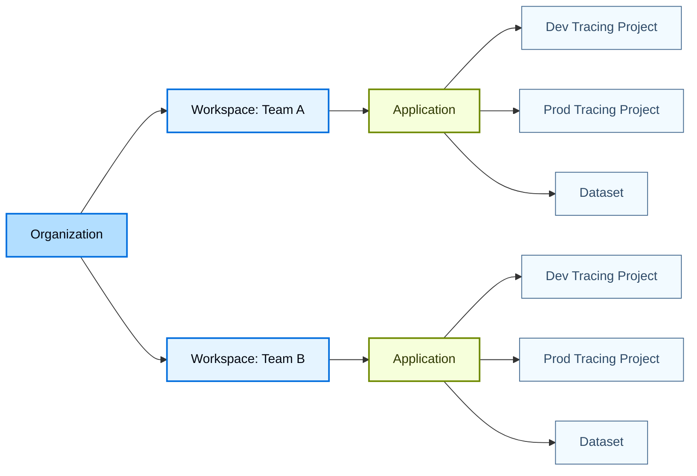
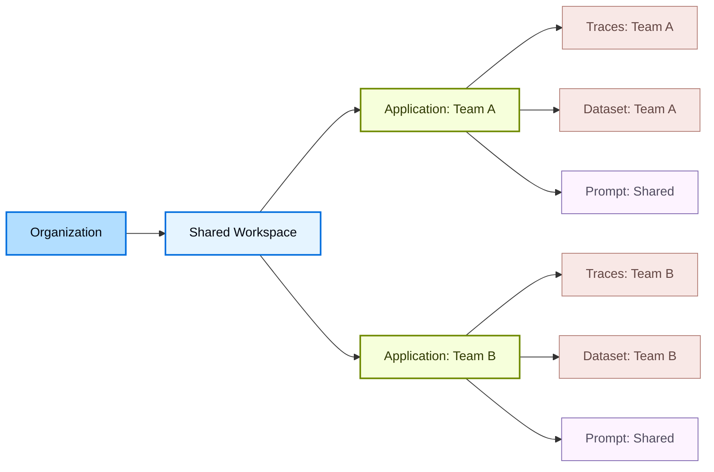
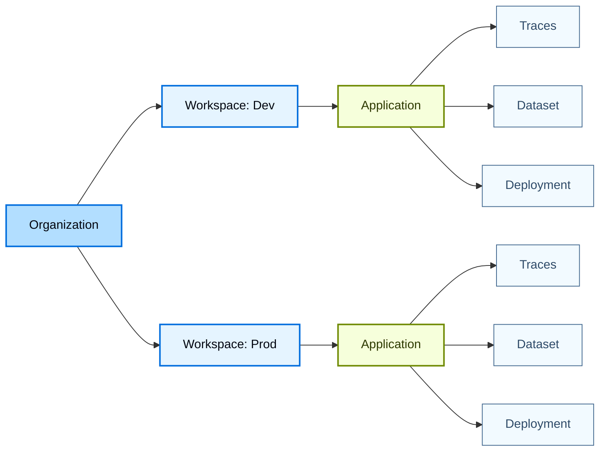

LangSmith 使用分层结构来组织你的工作：[_organizations_](/langsmith/administration-overview#organizations)、[_workspaces_](/langsmith/administration-overview#workspaces)、[_applications_](/langsmith/administration-overview#applications) 和 [_resources_](/langsmith/administration-overview#resources)。这套结构让你可以在协作与访问控制之间取得平衡，从而根据团队需求选择合适的隔离级别。

LangSmith 的权限系统建立在这套层级之上。通过[基于角色的访问控制（RBAC）](/langsmith/rbac)，用户[权限](/langsmith/organization-workspace-operations)会被限定在一个或多个工作区内，从而在工作区之间实施隔离。通过更细粒度的[基于属性的访问控制（ABAC）](/langsmith/organization-workspace-operations#access-policies)，还可以根据工作区内的标签、应用等属性进一步限制或授予访问权限，例如只允许用户访问开发资源，或只访问与某个特定应用相关的资源。

本页介绍了三种常见的工作区组织方式，它们分别适用于不同的团队隔离需求：

- [以团队为中心的工作区](#team-centric-workspaces)：每个团队一个工作区（大多数客户推荐）
- [协作型工作区](#collaborative-workspaces)：多个团队共用一个工作区
- [按项目隔离的工作区](#project-isolated-workspaces)：每个团队多个工作区（适用于严格隔离需求）

<Tip>
关于如何设置组织和工作区，请参阅 [Set up hierarchy](/langsmith/set-up-hierarchy)。
</Tip>

## 以团队为中心的工作区

<Warning>
这是默认模型，也是大多数客户的推荐选择。
</Warning>

这种模型（每个团队一个工作区）把单个组织作为最高层边界。在组织内部，使用多个工作区来隔离不同团队或业务单元。每个工作区都代表某个特定团队的逻辑边界，并决定该团队可以访问哪些数据和资源。在工作区内部，团队使用多个应用来归组支撑同一 agent 的资源。一个应用也可以包含不同的资源，例如分别用于开发和生产环境的 tracing projects。

- **优点：** 单个工作区允许团队内所有资源共享，使团队内部协作和迭代更直接。同时也简化了从开发到生产的推广流程。例如，同一个[prompt](/langsmith/prompt-engineering)可以通过版本和标签推进到生产环境，而不需要复制。
- **缺点：** 主要代价是同一团队不同环境之间的隔离有限。开发、测试和生产资源共存在同一应用中，因此团队必须依赖标签和约定来避免误影响生产。[RBAC](/langsmith/rbac)仅作用于工作区级别。[ABAC](/langsmith/organization-workspace-operations#access-policies)则可在工作区内提供更细粒度的权限控制，例如只允许用户访问开发资源。

## 协作型工作区

在这种模型中（多个团队共用一个工作区），多个团队在同一组织内共享一个工作区，并通过应用和 [ABAC](/langsmith/organization-workspace-operations#access-policies) 来分隔资源和管理访问。因此，[prompts](/langsmith/prompt-engineering) 和 [deployments](/langsmith/deployment) 等共享资源可以跨团队复用，而对[traces](/langsmith/observability-concepts#traces)和[datasets](/langsmith/evaluation-concepts#datasets)等敏感资源的访问，则仅限于拥有它们的团队。

- **优点：** prompts 和 deployments 等公共资源可以跨团队共享与复用，从而提升协作效率并减少重复工作。与以团队为中心的工作区模型不同，协作不再局限于单个团队，而是可以扩展到工作区中的所有团队。
- **缺点：** 团队之间和环境之间的隔离弱于多工作区模型，并且高度依赖 ABAC 的正确配置。如果标签或策略配置错误，敏感的[traces](/langsmith/observability-concepts#traces)或[datasets](/langsmith/evaluation-concepts#datasets)可能会暴露给其他团队；同时，跨多个团队管理权限也会增加运维复杂度。

## 按项目隔离的工作区

<Callout icon="check" iconType="solid" color="#C7D2FE">
只有在确实需要严格隔离时，才建议采用这种方式。
</Callout>

在这种模型中（每个团队多个工作区），通过为单个团队创建多个工作区来加强隔离。工作区可以按项目划分，也可以按环境划分，例如分别设置开发工作区和生产工作区。每个工作区都是完全隔离的，拥有自己的用户、数据和资源，访问权限也严格限定在该工作区内。

- **优点：** 团队、项目和环境之间的隔离性最强。只有开发工作区权限的用户无法查看或访问生产数据和任何生产资源，从而降低误操作或跨环境滥用的风险。
- **缺点：** 资源无法跨工作区共享。即使只是把 agent 从开发推进到生产，复用[prompts](/langsmith/prompt-engineering)、[datasets](/langsmith/evaluation-concepts#datasets)或[experiments](/langsmith/evaluation-concepts#experiment)也需要在工作区之间手动复制，这会带来阻力和重复劳动。为降低这部分成本，你可以使用 [LangSmith Data Migration Tool](https://github.com/langchain-ai/langsmith-data-migration-tool) 在工作区之间复制 prompts、datasets 或 experiments。
