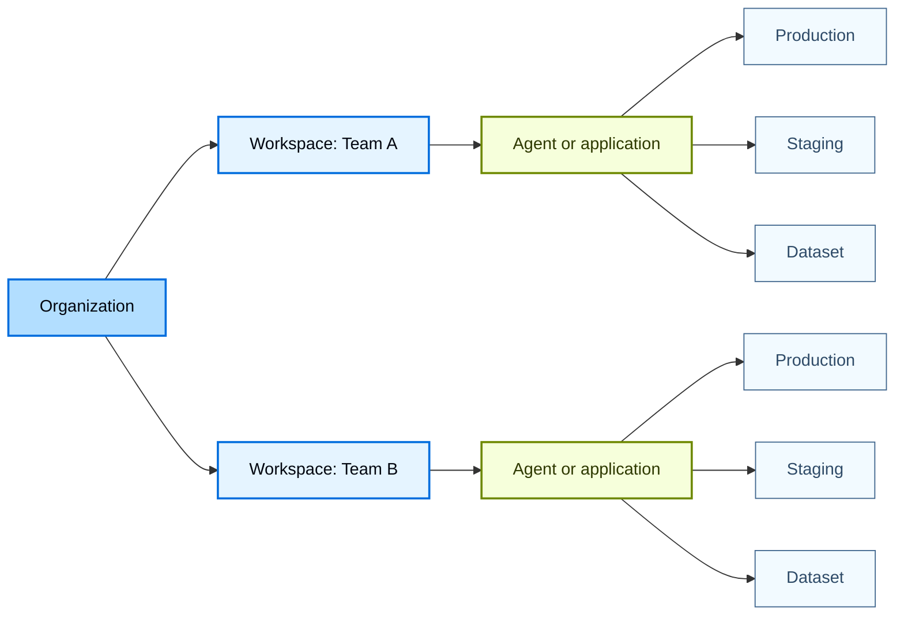
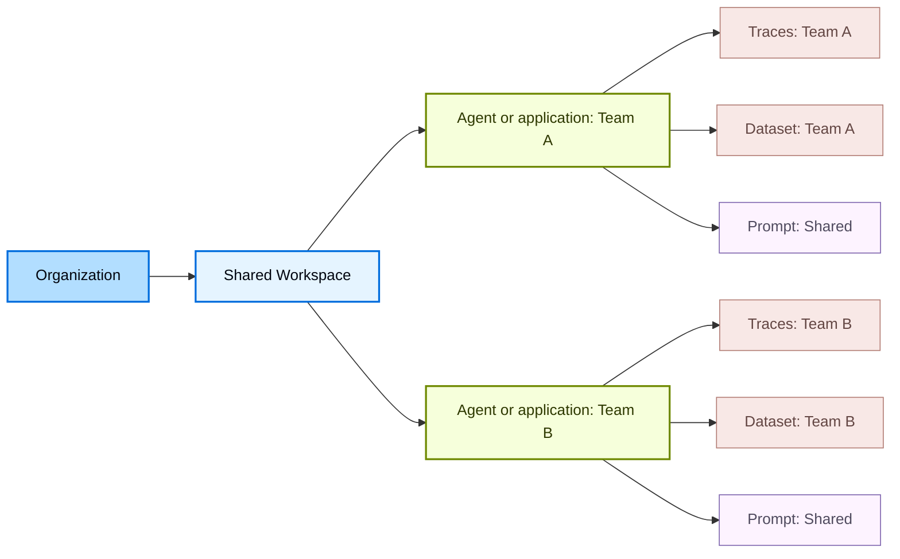

LangSmith 使用分层结构来组织你的工作：[_organizations_](/langsmith/administration-overview#organizations)、[_workspaces_](/langsmith/administration-overview#workspaces)、[_agents or applications_](/langsmith/administration-overview#agents-and-applications) 和 [_resources_](/langsmith/administration-overview#resources)。这套结构让你可以在协作与访问控制之间取得平衡，从而根据团队需求选择合适的隔离级别。

这个归组层级叫什么，取决于你的 workspace 使用哪种信息架构，左上角的控件会告诉你当前处于哪一种。Agent-based workspace 按 [agent](/langsmith/agents) 归组资源，每个 agent 的 traces 会划分到从固定的一组四个中抽取的[环境](/langsmith/agent-environments)中。Project-based workspace 则按应用归组资源，没有环境层级，因此环境用单独的 tracing projects 来近似。Agent-based organization 处于 [beta](/langsmith/release-stages) 阶段。下面的模型对两者都适用，并在有差异的地方做了标注。

LangSmith 的权限系统建立在这套层级之上。通过[基于角色的访问控制（RBAC）](/langsmith/rbac)，用户[权限](/langsmith/organization-workspace-operations)会被限定在一个或多个工作区内，从而在工作区之间实施隔离。通过更细粒度的[基于属性的访问控制（ABAC）](/langsmith/organization-workspace-operations#access-policies)，还可以根据工作区内的标签、agent 或应用等属性进一步限制或授予访问权限，例如只允许用户访问开发资源，或只访问与某个特定 agent 或应用相关的资源。

本页介绍了两种常见的工作区组织方式，它们分别适用于不同的团队隔离需求：

- [以团队为中心的工作区](#team-centric-workspaces)：每个团队一个工作区（大多数客户推荐）
- [协作型工作区](#collaborative-workspaces)：多个团队共用一个工作区

<Tip>
关于如何设置组织和工作区，请参阅 [Set up hierarchy](/langsmith/set-up-hierarchy)。
</Tip>

## 以团队为中心的工作区

<Warning>
这是默认模型，也是大多数客户的推荐选择。
</Warning>

这种模型（每个团队一个工作区）把单个组织作为最高层边界。在组织内部，使用多个工作区来隔离不同团队或业务单元。每个工作区都代表某个特定团队的逻辑边界，并决定该团队可以访问哪些数据和资源。在工作区内部，团队按 agent 或按应用（取决于 workspace）归组支撑同一应用的资源。

在下图中，production 和 staging 在 agent-based workspace 中是一个 agent 的环境，在 project-based workspace 中则是单独的 tracing projects。

```mermaid actions={false}
graph LR
    Org[Organization]

    WS1[Workspace: Team A]
    WS2[Workspace: Team B]

    AgentA[Agent or application]
    AgentB[Agent or application]

    ProdA[Production]
    StagingA[Staging]
    DatasetA[Dataset]

    ProdB[Production]
    StagingB[Staging]
    DatasetB[Dataset]

    Org --> WS1
    Org --> WS2

    WS1 --> AgentA
    WS2 --> AgentB

    AgentA --> ProdA
    AgentA --> StagingA
    AgentA --> DatasetA

    AgentB --> ProdB
    AgentB --> StagingB
    AgentB --> DatasetB

    classDef orgStyle fill:#B2DEFF,stroke:#006DDD,stroke-width:2px,color:#030710
    classDef wsStyle fill:#E5F4FF,stroke:#006DDD,stroke-width:2px,color:#030710
    classDef appStyle fill:#F6FFDB,stroke:#6E8900,stroke-width:2px,color:#2E3900
    classDef resourceStyle fill:#F2FAFF,stroke:#40668D,stroke-width:1px,color:#2F4B68

    class Org orgStyle
    class WS1,WS2 wsStyle
    class AgentA,AgentB appStyle
    class ProdA,StagingA,DatasetA,ProdB,StagingB,DatasetB resourceStyle
```

- **优点：** 单个工作区允许团队内所有资源共享，使团队内部协作和迭代更直接。同时也简化了从开发到生产的推广流程。例如，同一个[prompt](/langsmith/prompt-context-hub#prompts)可以通过版本和标签推进到生产环境，而不需要复制。
- **缺点：** 开发、测试和生产工作共存在同一个工作区中，因此仅靠作用域为工作区的[RBAC](/langsmith/rbac)无法将它们分开。在 agent-based workspace 中，环境会划分 agent 的 traces，无需维护任何约定。在 project-based workspace 中，分离依赖命名约定，例如成对的 `checkout-production` 和 `checkout-staging` projects。[ABAC](/langsmith/organization-workspace-operations#access-policies)则可在工作区内提供更细粒度的权限控制，例如只允许用户访问开发资源。

## 协作型工作区

在这种模型中（多个团队共用一个工作区），多个团队在同一组织内共享一个工作区，并使用 agent 或应用，配合 [ABAC](/langsmith/organization-workspace-operations#access-policies) 来分隔资源和管理访问。因此，[prompts](/langsmith/prompt-context-hub#prompts) 和 [deployments](/langsmith/deployment) 等共享资源可以跨团队复用，而对[traces](/langsmith/observability-concepts#traces)和[datasets](/langsmith/evaluation-concepts#datasets)等敏感资源的访问，则仅限于拥有它们的团队。

```mermaid actions={false}
graph LR
    Org[Organization]

    WS[Shared Workspace]

    AgentA[Agent or application: Team A]
    AgentB[Agent or application: Team B]

    TracesA[Traces: Team A]
    DatasetA[Dataset: Team A]
    PromptA[Prompt: Shared]

    TracesB[Traces: Team B]
    DatasetB[Dataset: Team B]
    PromptB[Prompt: Shared]

    Org --> WS

    WS --> AgentA
    WS --> AgentB

    AgentA --> TracesA
    AgentA --> DatasetA
    AgentA --> PromptA

    AgentB --> TracesB
    AgentB --> DatasetB
    AgentB --> PromptB

    classDef orgStyle fill:#B2DEFF,stroke:#006DDD,stroke-width:2px,color:#030710
    classDef wsStyle fill:#E5F4FF,stroke:#006DDD,stroke-width:2px,color:#030710
    classDef appStyle fill:#F6FFDB,stroke:#6E8900,stroke-width:2px,color:#2E3900
    classDef restrictedStyle fill:#F8E8E6,stroke:#B27D75,stroke-width:1px,color:#634643
    classDef sharedStyle fill:#FDF3FF,stroke:#7E65AE,stroke-width:1px,color:#504B5F

    class Org orgStyle
    class WS wsStyle
    class AgentA,AgentB appStyle
    class TracesA,DatasetA,TracesB,DatasetB restrictedStyle
    class PromptA,PromptB sharedStyle
```

- **优点：** prompts 和 deployments 等公共资源可以跨团队共享与复用，从而提升协作效率并减少重复工作。与以团队为中心的工作区模型不同，协作不再局限于单个团队，而是可以扩展到工作区中的所有团队。
