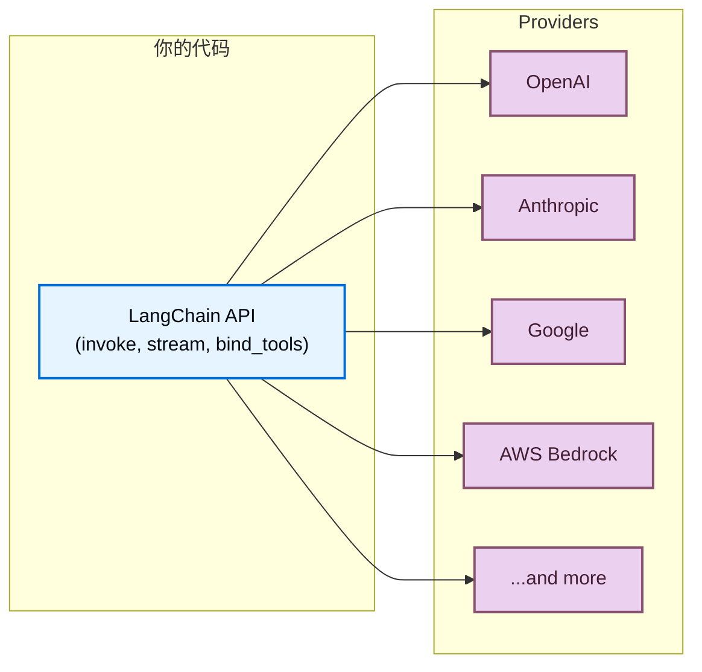

LangChain 为你提供统一的 API，用来使用任意 provider 的模型。安装 provider 包，选择模型名称，然后就可以开始构建，无论你使用的是 OpenAI、Anthropic、Google 还是其他受支持的 provider，相同的代码都可以工作。



## 一套 API，适配任意模型

无论来自哪个 provider，所有 LangChain 聊天模型都实现同一套接口。这意味着你可以：

- **切换 provider**，无需重写应用逻辑
- **横向比较模型**，使用完全相同的代码
- 在所有 provider 上使用[工具调用](/oss/langchain/tools)、[结构化输出](/oss/langchain/structured-output)和[流式传输](/oss/langchain/streaming)等**高级特性**

:::python
```python
from langchain.chat_models import init_chat_model

openai_model = init_chat_model("openai:gpt-5.5")
anthropic_model = init_chat_model("anthropic:claude-opus-4-8")
google_model = init_chat_model("google-genai:gemini-3.1-pro-preview")

for model in [openai_model, anthropic_model, google_model]:
    response = model.invoke("Explain quantum computing in one sentence.")
    print(response.text)
```
:::

:::js
```typescript
import { initChatModel } from "langchain/chat_models/universal";

const openaiModel = await initChatModel("openai:gpt-5.5");
const anthropicModel = await initChatModel("anthropic:claude-opus-4-8");
const googleModel = await initChatModel("google-genai:gemini-3.1-pro-preview");

for (const model of [openaiModel, anthropicModel, googleModel]) {
    const response = await model.invoke("Explain quantum computing in one sentence.");
    console.log(response.text);
}
```
:::

## 什么是 provider？

**Provider** 是托管 AI 模型并通过 API 暴露它们的公司或平台，例如 OpenAI、Anthropic、Google 和 AWS Bedrock。

在 LangChain 中，每个 provider 都有一个专用的**集成包**（例如 `langchain-openai`、`langchain-anthropic`），它为该 provider 的模型实现标准的 LangChain 接口。这意味着：

- 每个 provider 都有各自的**专用包**，具备清晰的版本管理和依赖管理
- 当你需要时，也能使用 **provider 专属能力**（例如 OpenAI 的 Responses API、Anthropic 的 extended thinking）
- 通过环境变量实现**自动 API key 处理**

:::python
```shell
uv add langchain-openai       # For OpenAI models
uv add langchain-anthropic    # For Anthropic models
uv add langchain-google-genai # For Google models
```
:::

:::js
```bash
npm install @langchain/openai       # For OpenAI models
npm install @langchain/anthropic    # For Anthropic models
npm install @langchain/google-genai # For Google models
```
:::

完整的 provider 包列表请参见[integrations page](/oss/integrations/providers/overview)。

## 查找模型名称

每个 provider 都支持特定的模型名称，你在初始化聊天模型时需要传入这些名称。指定模型主要有两种方式：

:::python
<CodeGroup>
    ```python Provider prefix format
    from langchain.chat_models import init_chat_model

    model = init_chat_model("openai:gpt-5.5")
    ```

    ```python Direct class instantiation
    from langchain_openai import ChatOpenAI

    model = ChatOpenAI(model="gpt-5.5")
    ```
</CodeGroup>
:::

:::js
    <CodeGroup>
    ```typescript Provider prefix format
    import { initChatModel } from "langchain/chat_models/universal";

    const model = await initChatModel("openai:gpt-5.5");
    ```

    ```typescript Direct class instantiation
    import { ChatOpenAI } from "@langchain/openai";

    const model = new ChatOpenAI({ model: "gpt-5.5" });
    ```
    </CodeGroup>
:::

当你使用 @[`init_chat_model`] 并传入 `provider:model` 格式时，LangChain 会自动解析 provider 并加载正确的集成包。如果模型名不存在歧义，你也可以省略 provider 前缀（例如 `"gpt-5.5"` 会解析为 OpenAI）。

要查找某个 provider 可用的模型名称，请参考该 provider 自己的文档。下面列出一些常用 provider：

| Provider | 模型名称查找位置 |
| :--- | :--- |
| [OpenAI](/oss/integrations/providers/openai) | [OpenAI models page](https://platform.openai.com/docs/models) |
| [Anthropic](/oss/integrations/providers/anthropic) | [Anthropic models page](https://docs.anthropic.com/en/docs/about-claude/models) |
| [Google](/oss/integrations/providers/google) | [Google AI models page](https://ai.google.dev/gemini-api/docs/models) |
| [AWS Bedrock](/oss/integrations/providers/aws) | [Bedrock supported models](https://docs.aws.amazon.com/bedrock/latest/userguide/models-supported.html) |
:::python
| [Ollama](/oss/integrations/providers/ollama) | [Ollama model library](https://ollama.com/library) |
| [Groq](/oss/integrations/providers/groq) | [Groq supported models](https://console.groq.com/docs/models) |
:::

## 立即使用新模型

由于 LangChain 的 provider 包会把模型名称直接传给 provider API，所以只要 provider 发布了新模型，你通常可以立刻使用它们，不需要等待 LangChain 更新。只要直接传入新的模型名称即可：

:::python
```python
model = init_chat_model("google_genai:gemini-mythos")
```
:::

:::js
```typescript
const model = await initChatModel("google_genai:gemini-mythos");
```
:::

只要你的 provider 包版本支持该模型所需的 API 版本，新模型名称就能立即生效。大多数情况下，模型发布都向后兼容，不需要更新包版本。

## 模型能力

不同 provider 与不同模型支持的能力并不相同。
有关聊天模型集成及其能力列表，请参见[chat models integrations page](/oss/integrations/chat)。

## Router 与 proxy

**Router**（也称 proxy 或 gateway）让你通过单个 API 和一套凭据访问多个 provider 的模型。它们可以简化计费，让你无需更换集成就能切换模型，并提供自动 fallback、负载均衡等能力。

| Provider | Integration | Description |
| :------- | :---------- | :---------- |
| [OpenRouter](https://openrouter.ai/) | [`ChatOpenRouter`](/oss/integrations/chat/openrouter) | Unified access to models from OpenAI, Anthropic, Google, Meta, and more |
:::python
| [LiteLLM](https://www.litellm.ai/) | [`ChatLiteLLM`](/oss/integrations/chat/litellm) | Unified interface for 100+ providers with routing, fallbacks, and spend tracking |
:::

当你有以下需求时，Router 会很有用：

- **使用多个 provider**，但只想维护一个 API key 和计费账户
- **动态切换模型**，而不管理多套 provider 凭据
- **使用 fallback 模型**，在主模型失败时自动重试其他模型

:::python
```python
from langchain.chat_models import init_chat_model

model = init_chat_model("openrouter:anthropic/claude-sonnet-4-6")
response = model.invoke("Hello!")
```
:::

:::js
```typescript
import { initChatModel } from "langchain/chat_models/universal";

const model = await initChatModel("openrouter:anthropic/claude-sonnet-4-6");
const response = await model.invoke("Hello!");
```
:::

## OpenAI-compatible endpoints

许多 provider 都提供与 OpenAI [Chat Completions API](https://platform.openai.com/docs/api-reference/chat) 兼容的 endpoint。你可以通过自定义 `base_url`，使用 [`ChatOpenAI`](/oss/integrations/chat/openai) 连接这些 endpoint：

:::python
```python
from langchain_openai import ChatOpenAI

model = ChatOpenAI(
    base_url="https://your-provider.com/v1",
    api_key="your-api-key",
    model="provider-model-name",
)
```
:::

:::js
```typescript
import { ChatOpenAI } from "@langchain/openai";

const model = new ChatOpenAI({
    configuration: { baseURL: "https://your-provider.com/v1" },
    apiKey: "your-api-key",
    model: "provider-model-name",
});
```
:::

<Warning>
    `ChatOpenAI` 只面向[官方 OpenAI API 规范](https://github.com/openai/openai-openapi)。第三方 provider 返回的非标准字段不会被提取或保留。如果你需要使用非标准特性，请改用专用 provider 包或 router。
</Warning>

## 下一步

<CardGroup cols={2}>
    <Card title="Models guide" icon="cpu" href="/oss/langchain/models">
        了解如何使用模型：invoke、stream、batch、tool calling 等。
    </Card>
    <Card title="Chat model integrations" icon="message" href="/oss/integrations/chat">
        浏览所有聊天模型集成及其能力。
    </Card>
    <Card title="All providers" icon="grid-dots" href="/oss/integrations/providers/overview">
        查看完整的 provider 包和集成列表。
    </Card>
    <Card title="Agents" icon="robot" href="/oss/langchain/agents">
        构建将模型作为推理引擎使用的智能体。
    </Card>
</CardGroup>
