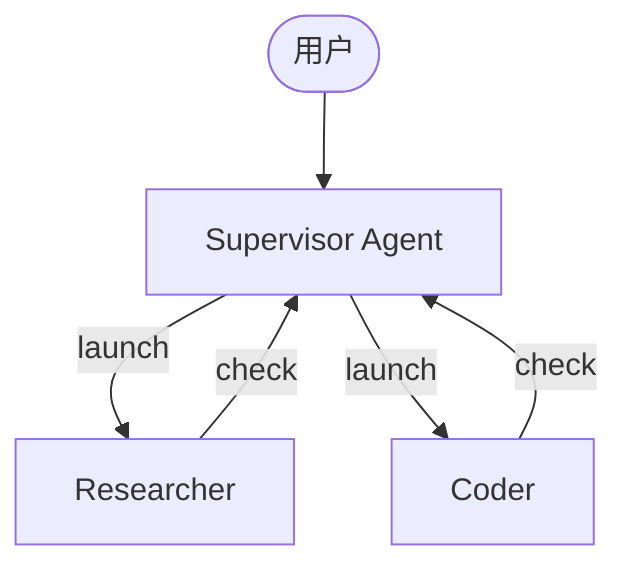
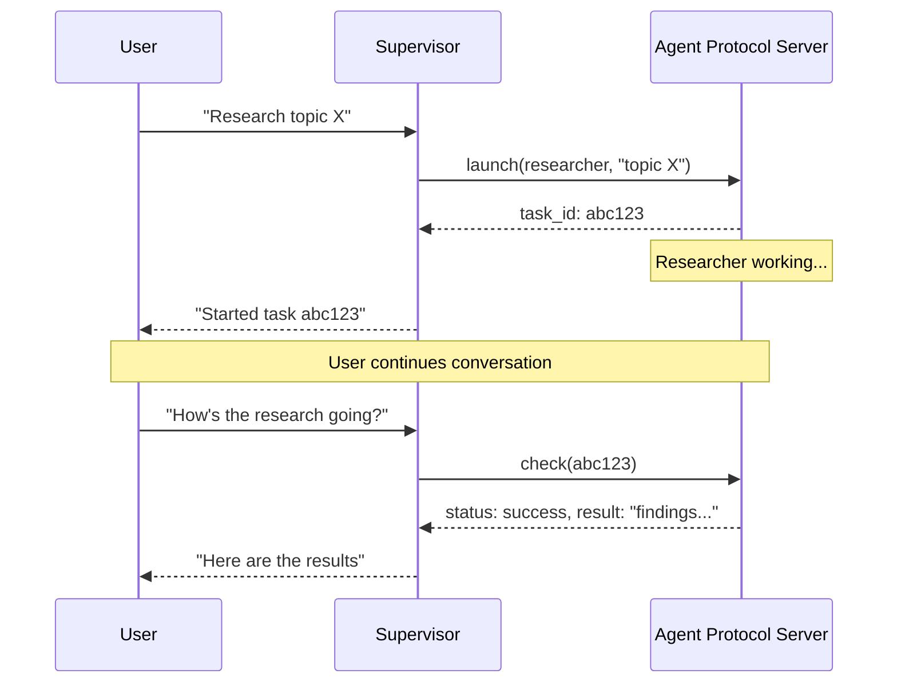

import AsyncSubagentsConfigurePy from '/snippets/code-samples/async-subagents-configure-py.mdx';
import AsyncSubagentsConfigureJs from '/snippets/code-samples/async-subagents-configure-js.mdx';
import AsyncSubagentsHttpTransportPy from '/snippets/code-samples/async-subagents-http-transport-py.mdx';
import AsyncSubagentsHybridPy from '/snippets/code-samples/async-subagents-hybrid-py.mdx';
import AsyncSubagentsHybridJs from '/snippets/code-samples/async-subagents-hybrid-js.mdx';
import AsyncSubagentsDescriptionsGoodPy from '/snippets/code-samples/async-subagents-descriptions-good-py.mdx';
import AsyncSubagentsDescriptionsBadPy from '/snippets/code-samples/async-subagents-descriptions-bad-py.mdx';
import AsyncSubagentsDescriptionsJs from '/snippets/code-samples/async-subagents-descriptions-js.mdx';
import AsyncSubagentsTroubleshootingPollingPy from '/snippets/code-samples/async-subagents-troubleshooting-polling-py.mdx';
import AsyncSubagentsTroubleshootingPollingJs from '/snippets/code-samples/async-subagents-troubleshooting-polling-js.mdx';

异步子代理允许 supervisor agent 启动会立即返回的后台任务，因此 supervisor 可以在子代理并发工作的同时继续与用户交互。supervisor 可以在任何时点检查进度、发送后续指令，或取消任务。

这建立在 [子代理](/oss/deepagents/subagents) 之上；后者是同步运行的，会阻塞 supervisor，直到完成。对于耗时较长、可并行化，或者需要在执行过程中动态调整的任务，请使用异步子代理。

<Note>
:::python
异步子代理是一个预览功能，适用于 `deepagents` 0.5.0。预览功能仍在积极开发中，API 可能发生变化。
:::

:::js
异步子代理是一个预览功能，适用于 `deepagents` 1.9.0。预览功能仍在积极开发中，API 可能发生变化。
:::
</Note>



<Note>
异步子代理可以与任何实现 [Agent Protocol](https://github.com/langchain-ai/agent-protocol) 的 server 通信。你可以使用 [LangSmith Deployment](/langsmith/deployment)，也可以自托管任何兼容 Agent Protocol 的 server。每个子代理都独立于 supervisor 运行，supervisor 通过 SDK 来启动、检查、更新和取消它们。
</Note>

## 何时使用异步子代理

| 维度 | 同步子代理 | 异步子代理 |
|------|-----------|-----------|
| **执行模型** | supervisor 会阻塞，直到子代理完成 | 立即返回 job ID；supervisor 继续执行 |
| **并发性** | 并行但阻塞 | 并行且非阻塞 |
| **任务中更新** | 不支持 | 可通过 `update_async_task` 发送后续指令 |
| **取消** | 不支持 | 可通过 `cancel_async_task` 取消运行中的任务 |
| **状态性** | 无状态 - 多次调用之间没有持久状态 | 有状态 - 在自己的线程上跨交互保持状态 |
| **适用场景** | 需要先等结果再继续的任务 | 在聊天中交互式管理的长耗时复杂任务 |

## 配置异步子代理

将异步子代理定义为 @[`AsyncSubAgent`] 规格列表，每个都指向一个 Agent Protocol server：

:::python
<AsyncSubagentsConfigurePy />

| 字段 | 类型 | 说明 |
|------|------|------|
| `name` | `str` | 必需。唯一标识符。supervisor 用它来启动任务。 |
| `description` | `str` | 必需。这个子代理的职责。supervisor 用它来决定把任务委派给谁。 |
| `graph_id` | `str` | 必需。Agent Protocol server 上的 graph ID（或 assistant ID）。对于基于 LangGraph 的部署，它必须与 `langgraph.json` 中注册的 graph 匹配。 |
| `url` | `str` | 可选。省略时使用 ASGI transport（进程内）。设置后使用 HTTP transport 连接远程 Agent Protocol server。 |
| `headers` | `dict[str, str]` | 可选。发送给远程 server 的附加 header。用于自托管 Agent Protocol server 的自定义认证。 |
:::

:::js
<AsyncSubagentsConfigureJs />

| 字段 | 类型 | 说明 |
|------|------|------|
| `name` | `string` | 必需。唯一标识符。supervisor 用它来启动任务。 |
| `description` | `string` | 必需。这个子代理的职责。supervisor 用它来决定把任务委派给谁。 |
| `graphId` | `string` | 必需。Agent Protocol server 上的 graph ID（或 assistant ID）。对于基于 LangGraph 的部署，它必须与 `langgraph.json` 中注册的 graph 匹配。 |
| `url` | `string` | 可选。省略时使用 ASGI transport（进程内）。设置后使用 HTTP transport 连接远程 Agent Protocol server。 |
| `headers` | `Record<string, string>` | 可选。发送给远程 server 的附加 header。用于自托管 Agent Protocol server 的自定义认证。 |
:::

对于基于 LangGraph 的部署，请将所有 graph 注册到同一个 `langgraph.json` 中，以支持共置部署：

```json
{
  "graphs": {
    "supervisor": "./src/supervisor.py:graph",
    "researcher": "./src/researcher.py:graph",
    "coder": "./src/coder.py:graph"
  }
}
```

## 使用异步子代理工具

当配置了异步子代理时，包含在 [Deep Agents 栈](/oss/deepagents/customization#deep-agents-stack) 中的 @[`AsyncSubAgentMiddleware`] 会为 supervisor 提供五个工具：

| 工具 | 作用 | 返回值 |
|------|------|------|
| `start_async_task` | 启动新的后台任务 | Task ID（立即返回） |
| `check_async_task` | 获取任务当前状态和结果 | 状态 + 结果（如果已完成） |
| `update_async_task` | 向运行中的任务发送新指令 | 确认信息 + 更新后的状态 |
| `cancel_async_task` | 停止运行中的任务 | 确认信息 |
| `list_async_tasks` | 列出所有已跟踪任务及其实时状态 | 任务摘要 |

supervisor 的 LLM 会像调用其他工具一样调用这些工具。middleware 会自动处理线程创建、run 管理和状态持久化。

### 了解生命周期

典型交互如下：



- **Launch** 会在 server 上创建新的线程，用任务描述作为输入启动一个 run，并返回线程 ID 作为 task ID。supervisor 会把这个 ID 报告给用户，而不会等待任务完成。
- **Check** 会获取当前 run 状态。如果 run 成功，它会读取线程状态并提取子代理的最终输出。如果仍在运行，它会把这个状态报告给用户。
- **Update** 会在同一线程上用 interrupt multitask strategy 创建一个新的 run。前一个 run 会被中断，子代理会带着完整对话历史和新的指令重新启动。task ID 保持不变。
- **Cancel** 会调用 server 上的 `runs.cancel()`，并把任务标记为 `"cancelled"`。
- **List** 会遍历所有已跟踪任务。对于非终态任务，它会并行从 server 获取实时状态。终态状态（`success`、`error`、`cancelled`）从缓存返回。

## 了解状态管理

:::python
任务元数据存储在 supervisor graph 上一个专用的 state channel（`async_tasks`）中，与消息历史分离。这一点很关键，因为 deep agents 在上下文窗口装满时会 [压缩消息历史](/oss/deepagents/context-engineering#summarization)。如果 task ID 只存在于工具消息里，压缩时就会丢失。这个专用 channel 能确保 supervisor 即使经过多轮总结，仍然可以通过 `list_async_tasks` 找回任务。

每个被跟踪的任务都会记录 task ID、agent 名称、thread ID、run ID、状态以及时间戳（`created_at`、`last_checked_at`、`last_updated_at`）。
:::

:::js
任务元数据存储在 supervisor graph 上一个专用的 state channel（`asyncTasks`）中，与消息历史分离。这一点很关键，因为 deep agents 在上下文窗口装满时会 [压缩消息历史](/oss/deepagents/context-engineering#summarization)。如果 task ID 只存在于 tool messages 中，压缩时就会丢失。这个专用 channel 能确保 supervisor 即使经过多轮总结，仍然可以通过 `list_async_tasks` 找回任务。

每个被跟踪的任务都会记录 task ID、agent 名称、thread ID、run ID、状态以及时间戳（`createdAt`、`checkedAt`、`updatedAt`）。
:::

## 选择传输方式

### ASGI transport（共置部署）

当子代理规格省略 `url` 字段时，LangGraph SDK 会使用 ASGI transport，SDK 调用会通过进程内函数调用而不是 HTTP 路由。对于基于 LangGraph 的部署，这要求两个 graph 都注册在同一个 `langgraph.json` 里。

ASGI transport 消除了网络延迟，也不需要额外的认证配置。子代理仍然会作为一个拥有自己状态的独立线程运行。这是推荐的默认方式。

### HTTP transport（远程）

添加 `url` 字段即可切换到 HTTP transport，此时 SDK 调用会通过网络发送到远程 Agent Protocol server：

:::python
<AsyncSubagentsHttpTransportPy />
:::

:::js
```typescript
{
  name: "researcher",
  description: "Research agent",
  graphId: "researcher",
  url: "https://my-research-deployment.langsmith.dev",
}
```
:::

对于 LangGraph 部署，认证由 LangGraph SDK 通过环境变量中的 `LANGSMITH_API_KEY`（或 `LANGGRAPH_API_KEY`）处理。自托管的 Agent Protocol server 可能会使用不同的认证机制。

当子代理需要独立扩展、不同的资源配置，或者由不同团队维护时，请使用 HTTP transport。

## 选择部署拓扑

### 单一部署

单一部署意味着所有 agent 都通过 ASGI transport 共置在同一台 server 上。对于基于 LangGraph 的部署，请把所有 graph 注册到一个 `langgraph.json` 中。这是推荐的起点 - 只需要管理一个 server，agent 之间也没有网络延迟。

### 分离部署

supervisor 运行在一台 server 上，子代理通过 HTTP transport 运行在另一台 server 上。当子代理需要不同的计算配置或独立扩展时使用这种方式。

### 混合部署

在混合部署中，一些子代理通过 ASGI 共置，另一些通过 HTTP 远程运行：

:::python
<AsyncSubagentsHybridPy />
:::

:::js
<AsyncSubagentsHybridJs />
:::

## 最佳实践

### 为本地开发配置合适的 worker pool

在本地使用 `langgraph dev` 运行时，增大 worker pool 以容纳并发的子代理运行。每个活跃 run 会占用一个 worker slot。一个有 3 个并发子代理任务的 supervisor 需要 4 个 slot（1 个 supervisor + 3 个子代理）。如果配置不足，launch 会进入队列。

```bash
langgraph dev --n-jobs-per-worker 10
```

### 写清楚子代理描述

supervisor 会根据描述决定启动哪个子代理。描述要具体、动作导向：

:::python
<CodeGroup>
    <AsyncSubagentsDescriptionsGoodPy />
    <AsyncSubagentsDescriptionsBadPy />
</CodeGroup>
:::

:::js
<AsyncSubagentsDescriptionsJs />
:::

### 用 thread ID 做 tracing

在基于 LangGraph 的部署中，每一次异步子代理运行都是一次标准的 LangGraph run，会完整显示在 LangSmith 中。supervisor 的 trace 会展示 `launch`、`check`、`update`、`cancel` 和 `list` 的工具调用。每个子代理 run 都会作为单独的 trace 出现，并通过 thread ID 关联。使用 thread ID（task ID）可以把 supervisor 的编排 trace 和子代理执行 trace 关联起来。

## 故障排查

### supervisor 在 launch 后立即轮询

**问题**：supervisor 在启动后立刻循环调用 `check`，把异步执行变成了阻塞执行。

**解决方案**：middleware 会注入 system prompt 规则来避免这种情况。如果仍然轮询，请在 supervisor 的 system prompt 中强化该行为：

:::python
<AsyncSubagentsTroubleshootingPollingPy />
:::

:::js
<AsyncSubagentsTroubleshootingPollingJs />
:::

### supervisor 报告了过期状态

**问题**：supervisor 参考的是对话历史中更早的任务状态，而不是重新调用 `check`。

**解决方案**：middleware prompt 会指示模型“对话历史中的任务状态总是过期的”。如果仍然出现这种情况，请增加明确指令，要求在报告状态前始终调用 `check` 或 `list`。

### task ID 查找失败

**问题**：supervisor 截断或重新格式化了 task ID，导致 `check` 或 `cancel` 失败。

**解决方案**：middleware prompt 会指示模型始终使用完整的 task ID。如果仍然截断，这通常是模型特定问题 - 请尝试不同的模型，或者在 system prompt 中加入“always show the full task_id, never truncate or abbreviate it”。

### 子代理启动后排队而不是运行

**问题**：启动子代理时卡住或启动很慢。

**解决方案**：worker pool 可能已耗尽。使用 `--n-jobs-per-worker` 增大池大小。另见 [为本地开发配置合适的 worker pool](#size-the-worker-pool-for-local-development)。

## 参考实现

[async-deep-agents](https://github.com/langchain-ai/async-deep-agents) 仓库包含可运行的 Python 和 TypeScript 示例，它们可以部署到 LangSmith Deployments。它演示了一个带有 researcher 和 coder 子代理、作为后台任务运行的 supervisor。
