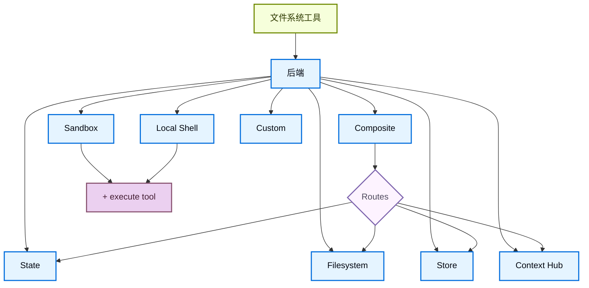

import BackendStatePy from '/snippets/code-samples/backend-state-py.mdx';
import BackendStateJs from '/snippets/code-samples/backend-state-js.mdx';
import BackendFilesystemPy from '/snippets/code-samples/backend-filesystem-py.mdx';
import BackendFilesystemJs from '/snippets/code-samples/backend-filesystem-js.mdx';
import BackendLocalShellPy from '/snippets/code-samples/backend-local-shell-py.mdx';
import BackendLocalShellJs from '/snippets/code-samples/backend-local-shell-js.mdx';
import BackendStorePy from '/snippets/code-samples/backend-store-py.mdx';
import BackendStoreJs from '/snippets/code-samples/backend-store-js.mdx';
import BackendContextHubPy from '/snippets/code-samples/backend-context-hub-py.mdx';
import BackendCompositePy from '/snippets/code-samples/backend-composite-py.mdx';
import BackendCompositeJs from '/snippets/code-samples/backend-composite-js.mdx';

:::python
Deep Agents 通过 `ls`、`read_file`、`write_file`、`edit_file`、`delete`、`glob` 和 `grep` 等工具向 agent 暴露一个文件系统表面。这些工具通过可插拔后端运行。`read_file` 工具原生支持所有后端上的图像文件（`.png`、`.jpg`、`.jpeg`、`.gif`、`.webp`），并会把它们作为多模态 content block 返回。
:::

:::js
Deep Agents 通过 `ls`、`read_file`、`write_file`、`edit_file`、`glob` 和 `grep` 等工具向 agent 暴露一个文件系统表面。这些工具通过可插拔后端运行。`read_file` 工具也原生支持所有后端上的二进制文件（图像、PDF、音频、视频），并会返回一个带有 `content` 和 `mimeType` 的 `ReadResult`。
:::

Sandboxes 和 @[`LocalShellBackend`] 也提供 `execute` 工具。
本页说明如何：

- [选择后端](#specify-a-backend)
- [将不同路径路由到不同后端](#route-to-different-backends)
- [实现自定义后端](#custom-backends)
- [在文件系统访问上设置权限](#permissions)
:::js
- [添加策略钩子](#add-policy-hooks)
- [处理二进制和多模态文件](#multimodal-and-binary-files)
:::
- [遵循后端协议](#protocol-reference)
:::js
- [将现有后端更新到 v2](#update-existing-backends-to-v2)
:::

<Tip>
当你部署到 [LangSmith Deployment](/langsmith/deployment) 时，系统会自动预置一个 store。使用 [LangSmith](/langsmith/observability) tracing 来排查文件路径、权限拒绝和跨线程存储问题。请先按照 [observability quickstart](/langsmith/observability-quickstart) 完成接入。

我们也建议你配置 [LangSmith Engine](/langsmith/engine)，它可以监控 traces、发现问题并提出修复建议。
</Tip>

<Tip>
要生成可供 agent 通过文件系统工具读取的持久化仓库 wiki，请参见 [OpenWiki](/oss/openwiki/overview)。
</Tip>

## 快速开始

下面是一些可立即用于 deep agent 的预构建文件系统后端：

| 内置后端 | 说明 |
|---|---|
| [默认](#statebackend) | `agent = create_deep_agent(model="google_genai:gemini-3.5-flash")` <br></br> 线程作用域。agent 的默认文件系统后端存储在 `langgraph` state 中。文件会在同一 thread 内跨 turn 持久化（通过你的 checkpointer），但不会在不同 thread 之间共享。 |
| [本地文件系统持久化](#filesystembackend-local-disk) | `agent = create_deep_agent(model="google_genai:gemini-3.5-flash", backend=FilesystemBackend(root_dir="/Users/nh/Desktop/"))` <br></br>这让 deep agent 可以访问你本机的文件系统。你可以指定 agent 可访问的根目录。注意，提供的 `root_dir` 必须是绝对路径。通常建议将它包在 [CompositeBackend](#compositebackend-router) 里，以便把 agent 内部数据（卸载的工具结果、对话历史）与项目文件分离。 |
| [持久化存储（LangGraph store）](#storebackend-langgraph-store) | `agent = create_deep_agent(model="google_genai:gemini-3.5-flash", backend=StoreBackend())` <br></br>这会让 agent 访问跨 thread 持久化的长期存储。这非常适合保存较长期的记忆或适用于 agent 多次执行的指令。 |
| [Context Hub](#contexthubbackend) | `agent = create_deep_agent(model="google_genai:gemini-3.5-flash", backend=ContextHubBackend("my-agent"))` <br></br>把文件持久化存储在 LangSmith Hub repo 中，无需单独预置 LangGraph store。 |
| [Sandbox](/oss/deepagents/sandboxes) | `agent = create_deep_agent(model="google_genai:gemini-3.5-flash", backend=sandbox)` <br></br>在隔离环境中执行代码。Sandboxes 提供文件系统工具以及用于运行 shell 命令的 `execute` 工具。可选择 LangSmith、AgentCore、Daytona 或其他 [sandbox 集成](/oss/integrations/sandboxes)。 |
| [Local shell](#localshellbackend-local-shell) | `agent = create_deep_agent(model="google_genai:gemini-3.5-flash", backend=LocalShellBackend(root_dir=".", env={"PATH": "/usr/bin:/bin"}))` <br></br>直接在宿主机上进行文件系统和 shell 执行。没有隔离 - 仅可用于受控的开发环境。请参见下面的 [安全注意事项](#localshellbackend-local-shell)。 |
| [Composite](#compositebackend-router) | 默认线程作用域，`/memories/` 跨 thread 持久化。Composite backend 最灵活。你可以为文件系统中的不同路由指定不同后端。下面的 Composite 路由提供了可直接粘贴的示例。 |



## 内置后端

### StateBackend

:::python
<BackendStatePy />
:::

:::js
<BackendStateJs />
:::

**工作方式：**
- 通过 @[`StateBackend`] 把文件存储在 LangGraph agent state 中，作用域为当前 thread。
- 通过 checkpoint 在同一 thread 的多次 agent turn 之间持久化。文件不会在不同 thread 之间共享。

<Warning>
设计用途是在 graph 内部使用。在 graph run 之外调用 backend 方法（例如 `state_backend.upload_files(...)`）在 graph 执行之前不会生效。
</Warning>

**最适合：**
- 让 agent 写入中间结果的临时工作区。
- 自动清理较大的工具输出，agent 可以再分块读回。

注意，这个后端在 supervisor agent 和 subagent 之间共享，subagent 写入的任何文件在该 subagent 执行完成后仍然保留在 LangGraph agent state 中。这些文件会继续对 supervisor agent 和其他 subagent 可用。

### FilesystemBackend（本地磁盘）

@[`FilesystemBackend`] 会在可配置的根目录下读写真实文件。

<Warning>
这个后端会让 agent 直接访问文件系统的读写权限。
请谨慎使用，仅在合适的环境中使用。

**适用场景：**
- 本地开发 CLI（编码助手、开发工具）
- CI/CD 流水线（见下面的安全注意事项）

**不适用场景：**
- Web server 或 HTTP API - 应改用 `StateBackend`、`StoreBackend` 或 [sandbox backend](/oss/deepagents/sandboxes)

**安全风险：**
- agent 可以读取任何可访问文件，包括 secret（API key、凭据、`.env` 文件）
- 与网络工具结合时，secret 可能通过 SSRF 攻击被外传
- 文件修改是永久性的，且不可逆

**推荐防护：**
1. 启用 [Human-in-the-Loop (HITL) middleware](/oss/deepagents/human-in-the-loop) 来审查敏感操作。
1. 从可访问的文件系统路径中排除 secret（尤其是在 CI/CD 中）。
1. 在需要文件系统交互的生产环境中使用 [sandbox backend](/oss/deepagents/sandboxes)。
1. **始终** 配合 `root_dir` 使用 `virtual_mode=True`，以启用基于路径的访问限制（会阻止 `..`、`~` 以及 `root_dir` 之外的绝对路径）。

    注意，即使设置了 `root_dir`，默认的 `virtual_mode=False` 也不提供任何安全性。
</Warning>

:::python
<BackendFilesystemPy />
:::

:::js
<BackendFilesystemJs />
:::

**工作方式：**
- 在可配置的 `root_dir` 下读写真实文件。
- 你可以选择设置 `virtual_mode=True`，在 `root_dir` 下对路径进行沙箱化和规范化。
- 使用安全的路径解析，在可能时阻止不安全的符号链接穿越，并可用 ripgrep 加速 `grep`。

**最适合：**
- 你机器上的本地项目
- CI 沙箱
- 挂载的持久卷

要让 agent 通过这些文件系统工具（来自 `openwiki/`）读取持久化的仓库 wiki，请参见 [OpenWiki](/oss/openwiki/overview)。

<Tip>
**大多数场景都建议把 `FilesystemBackend` 包在 `CompositeBackend` 里。** Deep Agents 会自动把内部数据写入 backend，包括卸载的大工具结果（位于 `/large_tool_results/`）和对话历史（位于 `/conversation_history/`）。如果只用 `FilesystemBackend`，这些内部文件也会以真实磁盘文件的形式写到 `root_dir` 下，把 agent 产物和你的项目文件混在一起。

使用 `CompositeBackend` 可以把你的项目目录路由到 `FilesystemBackend`，同时把内部路径保留在临时的 `StateBackend` 存储中：

:::python
```python
from deepagents import create_deep_agent
from deepagents.backends import CompositeBackend, StateBackend, FilesystemBackend

agent = create_deep_agent(
    backend=CompositeBackend(
        default=StateBackend(),
        routes={
            "/workspace/": FilesystemBackend(root_dir="/path/to/project", virtual_mode=True),
        },
    )
)
```
:::

:::js
```typescript
import { createDeepAgent, CompositeBackend, FilesystemBackend, StateBackend } from "deepagents";

const agent = createDeepAgent({
  backend: new CompositeBackend(
    new StateBackend(),
    {
      "/workspace/": new FilesystemBackend({ rootDir: "/path/to/project", virtualMode: true }),
    },
  ),
});
```
:::

这样一来，agent 在 `/workspace/` 下的读写会进入真实磁盘，而卸载的工具结果和其他内部数据仍保留在临时 state 中。更多路由模式请参见 [路由到不同后端](#route-to-different-backends)。
</Tip>

### LocalShellBackend（本地 shell）

<Warning>
这个后端会让 agent 直接访问文件系统的读写权限，并且还能在你的宿主机上无限制地执行 shell 命令。
请极其谨慎地使用，仅在合适的环境中使用。

**适用场景：**
- 本地开发 CLI（编码助手、开发工具）
- 你信任 agent 代码的个人开发环境
- 配置了妥善 secret 管理的 CI/CD 流水线

**不适用场景：**
- 生产环境（例如 Web server、API、多租户系统）
- 处理不受信任的用户输入或执行不受信任的代码

**安全风险：**
- agent 可以以你的用户权限执行 **任意 shell 命令**
- agent 可以读取任何可访问文件，包括 secret（API key、凭据、`.env` 文件）
- secret 可能被暴露
- 文件修改和命令执行都是 **永久性的，且不可逆**
- 命令直接在宿主机系统上运行
- 命令可能消耗无限的 CPU、内存和磁盘

**推荐防护：**
1. 启用 [Human-in-the-Loop (HITL) middleware](/oss/deepagents/human-in-the-loop) 来在执行前审查并批准操作。这是 **强烈建议** 的做法。
2. 仅在专用开发环境中运行。不要在共享或生产系统上使用。
3. 在需要 shell 执行的生产环境中使用 [sandbox backend](/oss/deepagents/sandboxes)。

**注意：** 即使 `virtual_mode=True`，在启用 shell 访问后也没有安全性，因为命令可以访问系统上的任意路径。
</Warning>

:::python
<BackendLocalShellPy />
:::

:::js
<BackendLocalShellJs />
:::

**工作方式：**
- 在 `FilesystemBackend` 基础上增加用于在宿主机上运行 shell 命令的 `execute` 工具。
- 命令使用 `subprocess.run(shell=True)` 直接在你的机器上运行，不做沙箱化。
- 支持用于环境变量的 `timeout`（默认 120 秒）、`max_output_bytes`（默认 100,000）、`env` 和 `inherit_env`。
- Shell 命令会把 `root_dir` 作为工作目录，但仍可访问系统上的任意路径。

**最适合：**
- 本地编码助手和开发工具
- 在你信任 agent 的情况下进行快速迭代

### StoreBackend（LangGraph store）

:::python
<BackendStorePy />
:::

:::js
<BackendStoreJs />
:::

<Note>
    当部署到 [LangSmith Deployment](/langsmith/deployment) 时，请省略 `store` 参数。平台会自动为你的 agent 预置 store。
</Note>

<Tip>
    `namespace` 参数控制数据隔离。对于多用户部署，务必设置 [namespace factory](/oss/deepagents/backends#namespace-factories)，按用户或租户隔离数据。
</Tip>

**工作方式：**
- @[`StoreBackend`] 会把文件存储在运行时提供的 LangGraph @[`BaseStore`] 中，从而实现跨 thread 的持久化存储。

**最适合：**
- 你已经在使用已配置好的 LangGraph store（例如 Redis、Postgres，或位于 @[`BaseStore`] 后面的云实现）。
- 你正通过 [LangSmith Deployment](/langsmith/deployment) 部署 agent（平台会自动为你的 agent 预置 store）。

#### Namespace factories

namespace factory 决定 `StoreBackend` 读写数据的位置。它接收一个 LangGraph @[`Runtime`] 并返回一个字符串元组，作为 store namespace。使用 namespace factory 可以在用户、租户或 assistant 之间隔离数据。

在构造 `StoreBackend` 时，将 namespace factory 传给 `namespace` 参数：

```python
NamespaceFactory = Callable[[Runtime], tuple[str, ...]]
```

`Runtime` 提供以下内容：
- `rt.context` - 通过 LangGraph 的 [context schema](https://langchain-ai.github.io/langgraph/concepts/runtime/) 传入的用户上下文（例如 `user_id`）
:::python
- `rt.server_info` - 在 LangGraph Server 上运行时的 server 级元数据（assistant ID、graph ID、已认证用户）
- `rt.execution_info` - 执行身份信息（thread ID、run ID、checkpoint ID）
:::
:::js
- `rt.serverInfo` - 在 LangGraph Server 上运行时的 server 级元数据（assistant ID、graph ID、已认证用户）
- `rt.executionInfo` - 执行身份信息（thread ID、run ID、checkpoint ID）
:::

:::python
<Note>
`Runtime` 参数从 `deepagents>=0.5.2` 开始可用。更早的 0.5.x 版本使用的是 `BackendContext`，见下面的 [从 `BackendContext` 迁移](#migrating-from-backendcontext)。`rt.server_info` 和 `rt.execution_info` 需要 `deepagents>=0.5.0`。
</Note>
:::

:::js
<Note>
`Runtime` 参数从 `deepagents>=1.9.1` 开始可用。更早的 1.9.x 版本使用的是 `BackendContext`，见下面的 [从 `BackendContext` 迁移](#migrating-from-backendcontext)。`rt.serverInfo` 和 `rt.executionInfo` 需要 `deepagents>=1.9.0`。
</Note>
:::

**常见 namespace 模式：**

:::python
```python
from deepagents.backends import StoreBackend

# 按用户隔离：每个用户都拥有自己的独立存储
backend = StoreBackend(
    namespace=lambda rt: (rt.server_info.user.identity,),  # [!code highlight]
)

# 按 assistant 隔离：同一个 assistant 的所有用户共享存储
backend = StoreBackend(
    namespace=lambda rt: (
        rt.server_info.assistant_id,  # [!code highlight]
    ),
)

# 按 thread 隔离：存储仅作用于单次对话
backend = StoreBackend(
    namespace=lambda rt: (
        rt.execution_info.thread_id,  # [!code highlight]
    ),
)
```
:::

:::js
```typescript
import { StoreBackend } from "deepagents";

// 按用户隔离：每个用户都拥有自己的独立存储
const backend = new StoreBackend({
  namespace: (rt) => [rt.serverInfo.user.identity],  // [!code highlight]
});

// 按 assistant 隔离：同一个 assistant 的所有用户共享存储
const backend = new StoreBackend({
  namespace: (rt) => [rt.serverInfo.assistantId],  // [!code highlight]
});

// 按 thread 隔离：存储仅作用于单次对话
const backend = new StoreBackend({
  namespace: (rt) => [rt.executionInfo.threadId],  // [!code highlight]
});
```
:::

你可以组合多个组件来创建更具体的作用域，例如使用 `(user_id, thread_id)` 做按用户、按会话隔离，或者附加 `"filesystem"` 这样的后缀，以便当同一作用域使用多个 store namespace 时进行区分。

namespace 组件只能包含字母数字字符、连字符、下划线、点号、`@`、`+`、冒号和波浪号。为防止 glob 注入，会拒绝通配符（`*`、`?`）。

:::python
<Warning>
`namespace` 参数在 v0.5.0 中会变为 **必需**。在新代码里请始终显式设置它。
</Warning>
:::
:::js
<Warning>
`namespace` 参数在 v1.9.0 中会变为 **必需**。在新代码里请始终显式设置它。
</Warning>
:::

<Note>
    如果没有提供 namespace factory，旧版默认值会使用 LangGraph config metadata 中的 `assistant_id`。这意味着同一个 [assistant](/langsmith/assistants) 的所有用户共享同一存储。对于多用户 [投入生产](/oss/deepagents/going-to-production) 场景，务必提供 namespace factory。
</Note>

### ContextHubBackend

<Note>
**开始前：** `ContextHubBackend` 需要在 LangSmith 中配置好一个 Context Hub repo。如果你不熟悉 agent repo 和 skill repo，请先阅读 [Context Hub 概念](/langsmith/context-engineering-concepts) 页面。
</Note>

`ContextHubBackend` 会把 agent 的文件系统存储在 LangSmith Context Hub repo 中。它可以使用独立 repo，或者使用一个链接到 skill repo 的 agent repo。

**Repo 结构：** 在 Context Hub 中，_agent repo_ 保存 agent 的顶层指令和配置（例如 `AGENTS.md`、`tools.json`）。它可以链接到一个或多个 _skill repo_，每个 skill repo 都是一个可复用的能力包（例如用于邮件格式化或代码审查的 `SKILL.md`）。当你传入 `ContextHubBackend("my-agent")` 时，backend 会把 agent repo 挂载到文件系统根目录；链接的 skill repo 会显示为 `/skills/` 下的子目录。

这意味着 agent 的上下文被有意分散到多个 repo 中：每个 agent 一个 repo，skill 则是独立的 repo。这种分离让 skill 可以独立版本化、共享并在多个 agent 间复用。如果这种结构看起来有些碎片化，请参见 [Linked repos](/langsmith/context-engineering-concepts#linked-repos) 了解原因。

:::python
<BackendContextHubPy />
:::

构造时传入 `owner/name` 或 `name` 形式的 repo 标识符。

<Note>
使用 `ContextHubBackend` 前请先设置 `LANGSMITH_API_KEY`。
</Note>

**工作方式：**
- 首次使用时按需拉取 Hub repo tree，然后从内存缓存中提供读取。
- 将写入和编辑持久化为 Hub commit，并在成功提交后更新缓存。
- 使用乐观 parent-commit 写入（`parent_commit`）：每次 push 都会以最新已知 commit hash 为目标。

**行为与限制：**
- 如果 repo 不存在，第一次 pull 会视为 empty；第一次成功写入可以创建 repo。
- 如果另一个 writer 先推进了 repo，你的旧 parent-commit 写入可能失败。遇到冲突时请重新 pull 并重试。
- `upload_files()` 只接受 UTF-8 文本。非 UTF-8 文件会按路径被拒绝，并返回 `invalid_path`。

**最适合：**
- 需要 LangSmith 原生、持久化的文件系统存储，但不想单独接入 LangGraph `BaseStore`。
- 能从 Hub commit history 中受益的文件变更工作流。

### CompositeBackend（路由器）

:::python
<BackendCompositePy />
:::

:::js
<BackendCompositeJs />
:::

**工作方式：**
- @[`CompositeBackend`] 会根据路径前缀把文件操作路由到不同 backend。
- 在 listings 和 search results 中保留原始路径前缀。

**最适合：**
- 当你希望给 agent 同时提供线程作用域和跨线程存储时，`CompositeBackend` 可以同时提供 `StateBackend` 和 `StoreBackend`。
- 当你有多个信息来源，希望把它们作为单一文件系统提供给 agent 时。
    - 例如，你在一个 Store 中将长期记忆存放在 `/memories/` 下，同时还有一个自定义 backend 能把文档以 `/docs/` 的形式暴露出来。

## 指定后端

:::python
- 将 backend 实例传给 `create_deep_agent(model=..., backend=...)`。文件系统 middleware 会将其用于所有工具。
- backend 必须实现 `BackendProtocol`（例如 `StateBackend()`、`FilesystemBackend(root_dir=".")`、`StoreBackend()`、`ContextHubBackend("my-agent")`）。
- 如果省略，默认值是 `StateBackend()`。
:::

:::js
- 将 backend 实例传给 `createDeepAgent({ backend: ... })`。文件系统 middleware 会将其用于所有工具。
- backend 必须实现 `AnyBackendProtocol`（`BackendProtocolV1` 或 `BackendProtocolV2`）- 例如 `new StateBackend()`、`new FilesystemBackend({ rootDir: "." })`、`new StoreBackend()`。
- 如果省略，默认值是 `new StateBackend()`。

<Note>
在 1.9.0 之前，只支持 `BackendProtocol`，现在它对应 `BackendProtocolV1`。运行时会通过 `adaptBackendProtocol()` 自动将 V1 backend 适配为 V2。保持现有 V1 backend 可继续使用无需修改代码。如需更新到 v2，请参见 [将现有后端更新到 v2](#update-existing-backends-to-v2)。
</Note>
:::

## 路由到不同后端

可把 namespace 的不同部分路由到不同后端。通常用于让 `/memories/*` 跨 thread 持久化，同时把其他内容保留为 thread 作用域。

:::python
```python
from deepagents import create_deep_agent
from deepagents.backends import CompositeBackend, StateBackend, FilesystemBackend

agent = create_deep_agent(
    model="google_genai:gemini-3.5-flash",
    backend=CompositeBackend(
        default=StateBackend(),
        routes={
            "/memories/": FilesystemBackend(root_dir="/deepagents/myagent", virtual_mode=True),
        },
    )
)
```
:::

:::js
```typescript
import { createDeepAgent, CompositeBackend, FilesystemBackend, StateBackend } from "deepagents";

const agent = createDeepAgent({
  backend: new CompositeBackend(
    new StateBackend(),
    {
      "/memories/": new FilesystemBackend({ rootDir: "/deepagents/myagent", virtualMode: true }),
    },
  ),
});
```
:::

行为：
- `/workspace/plan.md` → `StateBackend`（线程作用域）
- `/memories/agent.md` → `/deepagents/myagent` 下的 `FilesystemBackend`
- `ls`、`glob`、`grep` 会汇总结果并显示原始路径前缀

说明：
- 更长的前缀优先（例如，`"/memories/projects/"` 可以覆盖 `"/memories/"`）。
- 对于 `StoreBackend` 路由，请确保通过 `create_deep_agent(model=..., store=...)` 提供 store，或由平台预置。
- Deep Agents 会把内部数据（卸载的工具结果、对话历史）写入默认 backend。把 `StateBackend` 作为默认值可以让这些产物保持临时化，避免写入磁盘或持久化 store。完整示例请参见 [FilesystemBackend 提示](#filesystembackend-local-disk)。

## 自定义后端

实现自定义后端，可以把 Deep Agents 连接到数据库、对象存储和远程文件系统等存储系统。示例请参见 [社区构建的后端](/oss/integrations/backends)。

### 实现后端协议

:::python
继承 @[`BackendProtocol`] 并实现以下方法：

| 方法 | 签名 | 功能 |
|--------|-----------|--------------|
| `ls` | `(path: str) -> LsResult` | 列出给定路径下的文件和目录。 |
| `read` | `(file_path: str, offset: int, limit: int) -> ReadResult` | 返回文件内容，可选择分页。 |
| `write` | `(file_path: str, content: str) -> WriteResult` | 创建或覆盖文件。 |
| `edit` | `(file_path: str, old_string: str, new_string: str, replace_all: bool) -> EditResult` | 在现有文件中查找并替换。 |
| `delete` | `(file_path: str) -> DeleteResult` | 可选。删除文件，或递归删除目录。如果 backend 不支持删除，相关工具会在请求时自动从模型可见工具集中隐藏。 |
| `glob` | `(pattern: str, path: str | None) -> GlobResult` | 返回与 glob pattern 匹配的路径。 |
| `grep` | `(pattern: str, path: str | None, glob: str | None) -> GrepResult` | 在文件内容中搜索字面字符串。 |

如果还想支持 `execute` 工具（运行 shell 命令），请改为实现 @[`SandboxBackendProtocol`]，它是在 `BackendProtocol` 基础上增加了 `execute` 方法。

始终返回带有 `error` 字段的结构化结果类型。不要抛出异常。
:::

:::js
实现 @[`BackendProtocol`]（`BackendProtocolV2`）并提供以下方法：

| 方法 | 签名 | 功能 |
|--------|-----------|--------------|
| `ls` | `(path: string) => Promise<LsResult>` | 列出指定路径下的文件和目录。 |
| `read` | `(filePath: string, offset?, limit?) => Promise<ReadResult>` | 返回文件内容，可选择分页。二进制文件会返回带有 `mimeType` 的 `Uint8Array` 内容。 |
| `readRaw` | `(filePath: string) => Promise<ReadRawResult>` | 返回原始 `FileData`（供 framework 内部使用）。 |
| `write` | `(filePath: string, content: string) => Promise<WriteResult>` | 创建或覆盖文件。 |
| `edit` | `(filePath: string, oldString: string, newString: string, replaceAll?: boolean) => Promise<EditResult>` | 在现有文件中查找并替换。 |
| `glob` | `(pattern: string, path?: string) => Promise<GlobResult>` | 返回与 glob pattern 匹配的路径。 |
| `grep` | `(pattern: string, path?, glob?) => Promise<GrepResult>` | 在文件内容中搜索字面字符串。 |

如果还想支持 `execute` 工具（运行 shell 命令），请改为实现 @[`SandboxBackendProtocol`]，它是在 `BackendProtocolV2` 基础上增加了 `execute` 方法。

所有方法都必须返回带有可选 `error` 字段的结构化 Result 对象，不要在文件缺失或 pattern 无效时抛出异常。
:::

<Accordion title="示例：S3 风格后端骨架">

这个骨架把文件系统路径映射到对象 key。请用你的存储客户端的 list、read、search、upload 和 read-modify-write 操作来补全每个方法。

:::python
```python
from deepagents.backends.protocol import (
    BackendProtocol,
    EditResult,
    GlobResult,
    GrepResult,
    LsResult,
    ReadResult,
    WriteResult,
)

class S3Backend(BackendProtocol):
    def __init__(self, bucket: str, prefix: str = ""):
        self.bucket = bucket
        self.prefix = prefix.rstrip("/")

    def _key(self, path: str) -> str:
        return f"{self.prefix}{path}"

    def ls(self, path: str) -> LsResult:
        ...

    def read(self, file_path: str, offset: int = 0, limit: int = 2000) -> ReadResult:
        ...

    def grep(self, pattern: str, path: str | None = None, glob: str | None = None) -> GrepResult:
        ...

    def glob(self, pattern: str, path: str | None = None) -> GlobResult:
        ...

    def write(self, file_path: str, content: str) -> WriteResult:
        ...

    def edit(self, file_path: str, old_string: str, new_string: str, replace_all: bool = False) -> EditResult:
        ...
```
:::

:::js
```typescript
import {
  type BackendProtocolV2,
  type EditResult,
  type GlobResult,
  type GrepResult,
  type LsResult,
  type ReadRawResult,
  type ReadResult,
  type WriteResult,
} from "deepagents";

class S3Backend implements BackendProtocolV2 {
  constructor(private bucket: string, private prefix: string = "") {
    this.prefix = prefix.replace(/\/$/, "");
  }

  private key(path: string): string {
    return `${this.prefix}${path}`;
  }

  async ls(path: string): Promise<LsResult> {
    ...
  }

  async read(filePath: string, offset?: number, limit?: number): Promise<ReadResult> {
    ...
  }

  async readRaw(filePath: string): Promise<ReadRawResult> {
    ...
  }

  async grep(pattern: string, path?: string | null, glob?: string | null): Promise<GrepResult> {
    ...
  }

  async glob(pattern: string, path = "/"): Promise<GlobResult> {
    ...
  }

  async write(filePath: string, content: string): Promise<WriteResult> {
    ...
  }

  async edit(filePath: string, oldString: string, newString: string, replaceAll?: boolean): Promise<EditResult> {
    ...
  }
}
```
:::

</Accordion>

## 权限

使用 [permissions](/oss/deepagents/permissions) 以声明式方式控制 agent 可以读写哪些文件和目录。权限会作用于内置文件系统工具，并在调用 backend 之前进行评估。

:::python
```python
from deepagents import create_deep_agent, FilesystemPermission

agent = create_deep_agent(
    model="google_genai:gemini-3.5-flash",
    backend=CompositeBackend(
        default=StateBackend(),
        routes={
            "/memories/": StoreBackend(
                namespace=lambda rt: (rt.server_info.user.identity,),
            ),
            "/policies/": StoreBackend(
                namespace=lambda rt: (rt.context.org_id,),
            ),
        },
    ),
    permissions=[
        FilesystemPermission(
            operations=["write"],
            paths=["/policies/**"],
            mode="deny",
        ),
    ],
)
```
:::

完整的选项，包括规则顺序、subagent 权限和 composite backend 交互，请参见 [permissions guide](/oss/deepagents/permissions)。

## 添加策略钩子

对于超出基于路径的允许/拒绝规则之外的自定义校验逻辑（速率限制、审计日志、内容检查），可以通过继承或包装 backend 来强制执行企业规则。

阻止在选定前缀下的写入/编辑（通过子类化）：

:::python
```python
from deepagents.backends.filesystem import FilesystemBackend
from deepagents.backends.protocol import WriteResult, EditResult

class GuardedBackend(FilesystemBackend):
    def __init__(self, *, deny_prefixes: list[str], **kwargs):
        super().__init__(**kwargs)
        self.deny_prefixes = [p if p.endswith("/") else p + "/" for p in deny_prefixes]

    def write(self, file_path: str, content: str) -> WriteResult:
        if any(file_path.startswith(p) for p in self.deny_prefixes):
            return WriteResult(error=f"Writes are not allowed under {file_path}")
        return super().write(file_path, content)

    def edit(self, file_path: str, old_string: str, new_string: str, replace_all: bool = False) -> EditResult:
        if any(file_path.startswith(p) for p in self.deny_prefixes):
            return EditResult(error=f"Edits are not allowed under {file_path}")
        return super().edit(file_path, old_string, new_string, replace_all)
```
:::

:::js
```typescript
import { FilesystemBackend, type WriteResult, type EditResult } from "deepagents";

class GuardedBackend extends FilesystemBackend {
  private denyPrefixes: string[];

  constructor({ denyPrefixes, ...options }: { denyPrefixes: string[]; rootDir?: string }) {
    super(options);
    this.denyPrefixes = denyPrefixes.map(p => p.endsWith("/") ? p : p + "/");
  }

  async write(filePath: string, content: string): Promise<WriteResult> {
    if (this.denyPrefixes.some(p => filePath.startsWith(p))) {
      return { error: `Writes are not allowed under ${filePath}` };
    }
    return super.write(filePath, content);
  }

  async edit(filePath: string, oldString: string, newString: string, replaceAll = false): Promise<EditResult> {
    if (this.denyPrefixes.some(p => filePath.startsWith(p))) {
      return { error: `Edits are not allowed under ${filePath}` };
    }
    return super.edit(filePath, oldString, newString, replaceAll);
  }
}
```
:::

通用包装器（适用于任何 backend）：

:::python
```python
from deepagents.backends.protocol import (
    BackendProtocol, WriteResult, EditResult, LsResult, ReadResult, GrepResult, GlobResult,
)

class PolicyWrapper(BackendProtocol):
    def __init__(self, inner: BackendProtocol, deny_prefixes: list[str] | None = None):
        self.inner = inner
        self.deny_prefixes = [p if p.endswith("/") else p + "/" for p in (deny_prefixes or [])]

    def _deny(self, path: str) -> bool:
        return any(path.startswith(p) for p in self.deny_prefixes)

    def ls(self, path: str) -> LsResult:
        return self.inner.ls(path)

    def read(self, file_path: str, offset: int = 0, limit: int = 2000) -> ReadResult:
        return self.inner.read(file_path, offset=offset, limit=limit)
    def grep(self, pattern: str, path: str | None = None, glob: str | None = None) -> GrepResult:
        return self.inner.grep(pattern, path, glob)
    def glob(self, pattern: str, path: str | None = None) -> GlobResult:
        return self.inner.glob(pattern, path)
    def write(self, file_path: str, content: str) -> WriteResult:
        if self._deny(file_path):
            return WriteResult(error=f"Writes are not allowed under {file_path}")
        return self.inner.write(file_path, content)
    def edit(self, file_path: str, old_string: str, new_string: str, replace_all: bool = False) -> EditResult:
        if self._deny(file_path):
            return EditResult(error=f"Edits are not allowed under {file_path}")
        return self.inner.edit(file_path, old_string, new_string, replace_all)
```
:::

:::js
```typescript
import {
  type BackendProtocolV2,
  type LsResult,
  type ReadResult,
  type ReadRawResult,
  type GrepResult,
  type GlobResult,
  type WriteResult,
  type EditResult,
} from "deepagents";

class PolicyWrapper implements BackendProtocolV2 {
  private denyPrefixes: string[];

  constructor(private inner: BackendProtocolV2, denyPrefixes: string[] = []) {
    this.denyPrefixes = denyPrefixes.map(p => p.endsWith("/") ? p : p + "/");
  }

  private isDenied(path: string): boolean {
    return this.denyPrefixes.some(p => path.startsWith(p));
  }

  ls(path: string): Promise<LsResult> { return this.inner.ls(path); }
  read(filePath: string, offset?: number, limit?: number): Promise<ReadResult> { return this.inner.read(filePath, offset, limit); }
  readRaw(filePath: string): Promise<ReadRawResult> { return this.inner.readRaw(filePath); }
  grep(pattern: string, path?: string | null, glob?: string | null): Promise<GrepResult> { return this.inner.grep(pattern, path, glob); }
  glob(pattern: string, path?: string): Promise<GlobResult> { return this.inner.glob(pattern, path); }

  async write(filePath: string, content: string): Promise<WriteResult> {
    if (this.isDenied(filePath)) return { error: `Writes are not allowed under ${filePath}` };
    return this.inner.write(filePath, content);
  }

  async edit(filePath: string, oldString: string, newString: string, replaceAll = false): Promise<EditResult> {
    if (this.isDenied(filePath)) return { error: `Edits are not allowed under ${filePath}` };
    return this.inner.edit(filePath, oldString, newString, replaceAll);
  }
}
```
:::

:::js
## 二进制和多模态文件

<Note>
多模态文件支持（PDF、音频、视频）需要 `deepagents>=1.9.0`。
</Note>

V2 backend 原生支持二进制文件。当 `read()` 读取到二进制文件时（由文件扩展名对应的 MIME type 决定），它会返回一个带有 `Uint8Array` 内容和相应 `mimeType` 的 `ReadResult`。文本文件则返回 `string` 内容。

### 支持的 MIME types

| 类别 | 扩展名 | MIME types |
|------|--------|------------|
| 图像 | `.png`、`.jpg`/`.jpeg`、`.gif`、`.webp`、`.svg`、`.heic`、`.heif` | `image/png`、`image/jpeg`、`image/gif`、`image/webp`、`image/svg+xml`、`image/heic`、`image/heif` |
| 音频 | `.mp3`、`.wav`、`.aiff`、`.aac`、`.ogg`、`.flac` | `audio/mpeg`、`audio/wav`、`audio/aiff`、`audio/aac`、`audio/ogg`、`audio/flac` |
| 视频 | `.mp4`、`.webm`、`.mpeg`/`.mpg`、`.mov`、`.avi`、`.flv`、`.wmv`、`.3gpp` | `video/mp4`、`video/webm`、`video/mpeg`、`video/quicktime`、`video/x-msvideo`、`video/x-flv`、`video/x-ms-wmv`、`video/3gpp` |
| 文档 | `.pdf`、`.ppt`、`.pptx` | `application/pdf`、`application/vnd.ms-powerpoint`、`application/vnd.openxmlformats-officedocument.presentationml.presentation` |
| 文本 | `.txt`、`.html`、`.json`、`.js`、`.ts`、`.py` 等 | `text/plain`、`text/html`、`application/json` 等 |

### 读取二进制文件

```typescript
const result = await backend.read("/workspace/screenshot.png");

if (result.error) {
  console.error(result.error);
} else if (result.content instanceof Uint8Array) {
  // Binary file — content is Uint8Array, mimeType is set
  console.log(`Binary file: ${result.mimeType}`); // "image/png"
} else {
  // Text file — content is string
  console.log(`Text file: ${result.mimeType}`); // "text/plain"
}
```

### FileData 格式

`FileData` 是用于在 state 和 store backend 中保存文件内容的类型。

```typescript
type FileData =
  // Current format (v2)
  | {
      content: string | Uint8Array; // string for text, Uint8Array for binary
      mimeType: string;             // e.g. "text/plain", "image/png"
      created_at: string;           // ISO 8601 timestamp
      modified_at: string;          // ISO 8601 timestamp
    }
  // Legacy format (v1)
  | {
      content: string[];            // array of lines
      created_at: string;           // ISO 8601 timestamp
      modified_at: string;          // ISO 8601 timestamp
    };
```

backend 在从 state 或 store 读取时可能遇到任一格式。framework 会透明处理两者。新的写入默认使用 v2 格式。在滚动发布期间，如果旧读者仍需要 legacy 格式，可在 backend 构造器中传入 `fileFormat: "v1"`（例如 `new StoreBackend({ fileFormat: "v1" })`）。
:::

## 从 backend factories 迁移

<Warning>
:::python
backend factory 模式自 `deepagents` 0.5.0 起已 **弃用**。请直接传入预构造的 backend 实例，而不是 factory 函数。
:::
:::js
backend factory 模式自 `deepagents` 1.9.0 起已 **弃用**。请直接传入预构造的 backend 实例，而不是 factory 函数。
:::
</Warning>

过去，像 `StateBackend` 和 `StoreBackend` 这样的 backend 需要一个接收 runtime 对象的 factory 函数，因为它们需要 runtime context（state、store）来工作。现在 backend 会通过 LangGraph 的 `get_config()`、`get_store()` 和 `get_runtime()` helpers 在内部解析这些 context，所以你可以直接传入实例。

### 有什么变化

| 之前（已弃用） | 之后 |
|---|---|
| `backend=lambda rt: StateBackend(rt)` | `backend=StateBackend()` |
| `backend=lambda rt: StoreBackend(rt)` | `backend=StoreBackend()` |
| `backend=lambda rt: CompositeBackend(default=StateBackend(rt), ...)` | `backend=CompositeBackend(default=StateBackend(), ...)` |
| `backend: (config) => new StateBackend(config)` | `backend: new StateBackend()` |
| `backend: (config) => new StoreBackend(config)` | `backend: new StoreBackend()` |

### 已弃用 API

:::python

| 已弃用 | 替代项 |
|---|---|
| 在 `create_deep_agent` 的 `backend=` 中传入 callable | 直接传入 backend 实例 |
| `StateBackend(runtime)` 上的 `runtime` 构造参数 | `StateBackend()`（不需要参数） |
| `StoreBackend(runtime)` 上的 `runtime` 构造参数 | `StoreBackend()` 或 `StoreBackend(namespace=..., store=...)` |
| `WriteResult` 和 `EditResult` 上的 `files_update` 字段 | state 写入现在由 backend 内部处理 |
| middleware 中对 write/edit 工具的 `Command` 包装 | 工具直接返回普通字符串，不再需要 `Command(update=...)` |

:::

:::js

| 已弃用 | 替代项 |
|---|---|
| `BackendFactory` 类型 | 直接传入 backend 实例 |
| `BackendRuntime` 接口 | backend 在内部解析 context |
| `StateBackend(runtime, options?)` 构造重载 | `new StateBackend(options?)` |
| `StoreBackend(stateAndStore, options?)` 构造重载 | `new StoreBackend(options?)` |
| `WriteResult` 和 `EditResult` 上的 `filesUpdate` 字段 | state 写入现在由 backend 内部处理 |

:::

<Note>
工厂模式在运行时仍然可用，并会发出 deprecation warning。请在下一个 major version 之前把代码更新为直接使用实例。
</Note>

### 迁移示例

:::python
```python
# Before (deprecated)
from deepagents import create_deep_agent
from deepagents.backends import CompositeBackend, StateBackend, StoreBackend

agent = create_deep_agent(
    model="google_genai:gemini-3.5-flash",
    backend=lambda rt: CompositeBackend(
        default=StateBackend(rt),
        routes={"/memories/": StoreBackend(rt, namespace=lambda rt: (rt.server_info.user.identity,))},
    ),
)

# After
agent = create_deep_agent(
    model="google_genai:gemini-3.5-flash",
    backend=CompositeBackend(
        default=StateBackend(),
        routes={"/memories/": StoreBackend(namespace=lambda rt: (rt.server_info.user.identity,))},
    ),
)
```
:::

:::js
```typescript
// Before (deprecated)
import { createDeepAgent, CompositeBackend, StateBackend, StoreBackend } from "deepagents";

const agent = createDeepAgent({
  backend: (config) => new CompositeBackend(
    new StateBackend(config),
    { "/memories/": new StoreBackend(config, {
      namespace: (rt) => [rt.serverInfo.user.identity],
    }) },
  ),
});

// After
const agent = createDeepAgent({
  backend: new CompositeBackend(
    new StateBackend(),
    { "/memories/": new StoreBackend({
      namespace: (rt) => [rt.serverInfo.user.identity],
    }) },
  ),
});
```
:::

### 从 `BackendContext` 迁移

在 `deepagents>=0.5.2`（Python）和 `deepagents>=1.9.1`（TypeScript）中，namespace factory 直接接收 LangGraph @[`Runtime`]，而不是 `BackendContext` 包装器。旧的 `BackendContext` 形式仍然可以通过向后兼容的 `.runtime` 和 `.state` accessors 使用，但这些 accessors 会发出 deprecation warning，并将在 `deepagents>=0.7` 中移除。

**发生了什么变化：**

- factory 参数现在是 `Runtime`，不再是 `BackendContext`。
- 去掉 `.runtime` accessor - 例如，`ctx.runtime.context.user_id` 现在变成 `rt.server_info.user.identity`。
- `ctx.state` 没有直接替代项。namespace 信息应该是只读的，并且在一次 run 的生命周期内保持稳定，而 state 是可变的，并且会一步一步变化 - 如果从它派生 namespace，可能会让数据落到不一致的 key 下。如果你的用例确实需要读取 agent state，请 [提交 issue](https://github.com/langchain-ai/deepagents/issues)。

:::python
```python
# Before (deprecated, removed in v0.7)
StoreBackend(
    namespace=lambda ctx: (ctx.runtime.context.user_id,),  # [!code --]
)

# After
StoreBackend(
    namespace=lambda rt: (rt.server_info.user.identity,),  # [!code ++]
)
```
:::

:::js
```typescript
// Before (deprecated, removed in v0.7)
new StoreBackend({
  namespace: (ctx) => [ctx.runtime.context.userId],  // [!code --]
});

// After
new StoreBackend({
  namespace: (rt) => [rt.serverInfo.user.identity],  // [!code ++]
});
```
:::

## 协议参考

backend 必须实现 @[`BackendProtocol`]。

必需方法：
- `ls(path: str) -> LsResult`
    - 返回至少包含 `path` 的条目。可用时包含 `is_dir`、`size`、`modified_at`。按 `path` 排序以保证确定性输出。
- `read(file_path: str, offset: int = 0, limit: int = 2000) -> ReadResult`
    - 成功时返回文件数据。若文件缺失，返回 `ReadResult(error="Error: File '/x' not found")`。
- `grep(pattern: str, path: Optional[str] = None, glob: Optional[str] = None) -> GrepResult`
    - 返回结构化匹配结果。出错时返回 `GrepResult(error="...")`（不要抛出异常）。
- `glob(pattern: str, path: Optional[str] = None) -> GlobResult`
    - 返回匹配到的文件，作为 `FileInfo` 条目（如果没有则为空列表）。
- `write(file_path: str, content: str) -> WriteResult`
    - 仅创建。冲突时返回 `WriteResult(error=...)`。成功时设置 `path`，并且对于 state backend 设置 `files_update={...}`；外部 backend 应使用 `files_update=None`。
- `edit(file_path: str, old_string: str, new_string: str, replace_all: bool = False) -> EditResult`
    - 除非 `replace_all=True`，否则必须保证 `old_string` 唯一。如果找不到，返回错误。成功时包含 `occurrences`。

支持类型：
- `LsResult(error, entries)` - 成功时 `entries` 是 `list[FileInfo]`，失败时为 `None`。
- `ReadResult(error, file_data)` - 成功时 `file_data` 是 `FileData` dict，失败时为 `None`。
- `GrepResult(error, matches)` - 成功时 `matches` 是 `list[GrepMatch]`，失败时为 `None`。
- `GlobResult(error, matches)` - 成功时 `matches` 是 `list[FileInfo]`，失败时为 `None`。
- `WriteResult(error, path, files_update)`
- `EditResult(error, path, files_update, occurrences)`
- `FileInfo` 包含字段：`path`（必需），以及可选的 `is_dir`、`size`、`modified_at`。
- `GrepMatch` 包含字段：`path`、`line`、`text`。
- `FileData` 包含字段：`content`（str）、`encoding`（`"utf-8"` 或 `"base64"`）、`created_at`、`modified_at`。
:::

:::js
backend 必须实现 `BackendProtocolV2`。所有查询方法都返回带有 `{ error?: string, ...data }` 的结构化 Result 对象。

### 必需方法

- **`ls(path: string) → LsResult`**
    - 列出指定目录中的文件和目录（非递归）。目录路径末尾带 `/`，并且 `is_dir=true`。可用时包含 `is_dir`、`size`、`modified_at`。

- **`read(filePath: string, offset?: number, limit?: number) → ReadResult`**
    - 读取文件内容。对于文本文件，内容会按行 offset/limit 分页（默认 offset 0，limit 500）。对于二进制文件，会返回完整的原始 `Uint8Array` 内容并设置 `mimeType` 字段。若文件缺失，返回 `{ error: "File '/x' not found" }`。

- **`readRaw(filePath: string) → ReadRawResult`**
    - 以原始 `FileData` 形式读取文件内容。返回包括时间戳在内的完整文件数据。

- **`grep(pattern: string, path?: string | null, glob?: string | null) → GrepResult`**
    - 搜索文件内容中的字面文本模式。二进制文件（由 MIME type 决定）会被跳过。失败时返回 `{ error: "..." }`。

- **`glob(pattern: string, path?: string) → GlobResult`**
    - 以 `FileInfo` 条目形式返回与 glob pattern 匹配的文件。

- **`write(filePath: string, content: string) → WriteResult`**
    - 仅创建语义。冲突时返回 `{ error: "..." }`。成功时设置 `path`，并且对于 state backend 设置 `filesUpdate={...}`；外部 backend 应使用 `filesUpdate=null`。

- **`edit(filePath: string, oldString: string, newString: string, replaceAll?: boolean) → EditResult`**
    - 除非 `replaceAll=true`，否则必须保证 `oldString` 唯一。如果找不到，返回错误。成功时包含 `occurrences`。

### 可选方法

- **`uploadFiles(files: Array<[string, Uint8Array]>) → FileUploadResponse[]`** - 上传多个文件（用于 sandbox backend）。
- **`downloadFiles(paths: string[]) → FileDownloadResponse[]`** - 下载多个文件（用于 sandbox backend）。

### Result 类型

| 类型 | 成功字段 | 错误字段 |
|------|----------|----------|
| `ReadResult` | `content?: string \| Uint8Array`, `mimeType?: string` | `error` |
| `ReadRawResult` | `data?: FileData` | `error` |
| `LsResult` | `files?: FileInfo[]` | `error` |
| `GlobResult` | `files?: FileInfo[]` | `error` |
| `GrepResult` | `matches?: GrepMatch[]` | `error` |
| `WriteResult` | `path?: string` | `error` |
| `EditResult` | `path?: string`, `occurrences?: number` | `error` |

### 支持类型

- **`FileInfo`** - `path`（必需），以及可选的 `is_dir`、`size`、`modified_at`。
- **`GrepMatch`** - `path`、`line`（从 1 开始计数）、`text`。
- **`FileData`** - 带时间戳的文件内容。参见 [FileData 格式](#filedata-format)。

### Sandbox 扩展

`SandboxBackendProtocolV2` 在 `BackendProtocolV2` 基础上增加：

- **`execute(command: string) → ExecuteResponse`** - 在 sandbox 中运行 shell 命令。
- **`readonly id: string`** - sandbox 实例的唯一标识符。
:::

:::js
## 将现有后端更新到 V2

<Accordion title="迁移指南">

### 方法重命名

| V1 方法 | V2 方法 | 返回类型变化 |
|-----------|-----------|-------------------|
| `lsInfo(path)` | `ls(path)` | `FileInfo[]` → `LsResult` |
| `read(filePath, offset, limit)` | `read(filePath, offset, limit)` | `string` → `ReadResult` |
| `readRaw(filePath)` | `readRaw(filePath)` | `FileData` → `ReadRawResult` |
| `grepRaw(pattern, path, glob)` | `grep(pattern, path, glob)` | `GrepMatch[] \| string` → `GrepResult` |
| `globInfo(pattern, path)` | `glob(pattern, path)` | `FileInfo[]` → `GlobResult` |
| `write(...)` | `write(...)` | 不变（`WriteResult`） |
| `edit(...)` | `edit(...)` | 不变（`EditResult`） |

### 类型重命名

| V1 类型 | V2 类型 |
|---------|---------|
| `BackendProtocol` | `BackendProtocolV2` |
| `SandboxBackendProtocol` | `SandboxBackendProtocolV2` |

### 适配工具

如果你已经有 V1 backend，并且需要在仅支持 V2 的代码中使用它们，可以使用适配函数：

```typescript
import { adaptBackendProtocol, adaptSandboxProtocol } from "deepagents";

// 将 V1 backend 适配为 V2
const v2Backend = adaptBackendProtocol(v1Backend);

// 将 V1 sandbox 适配为 V2
const v2Sandbox = adaptSandboxProtocol(v1Sandbox);
```

<Note>
framework 会自动适配传给 `createDeepAgent()` 的 V1 backend。只有在直接调用 protocol 方法时才需要手动适配。
</Note>

</Accordion>
:::

## 指定后端

:::python
- 将 backend 实例传给 `create_deep_agent(model=..., backend=...)`。文件系统 middleware 会将其用于所有工具。
- backend 必须实现 `BackendProtocol`（例如 `StateBackend()`、`FilesystemBackend(root_dir=".")`、`StoreBackend()`、`ContextHubBackend("my-agent")`）。
- 如果省略，默认值是 `StateBackend()`。
:::

:::js
- 将 backend 实例传给 `createDeepAgent({ backend: ... })`。文件系统 middleware 会将其用于所有工具。
- backend 必须实现 `AnyBackendProtocol`（`BackendProtocolV1` 或 `BackendProtocolV2`）- 例如 `new StateBackend()`、`new FilesystemBackend({ rootDir: "." })`、`new StoreBackend()`。
- 如果省略，默认值是 `new StateBackend()`。

<Note>
在 1.9.0 之前，只支持 `BackendProtocol`，现在它对应 `BackendProtocolV1`。运行时会通过 `adaptBackendProtocol()` 自动将 V1 backend 适配为 V2。保持现有 V1 backend 可继续使用无需修改代码。如需更新到 v2，请参见 [将现有后端更新到 v2](#update-existing-backends-to-v2)。
</Note>
:::

## 路由到不同后端

可把 namespace 的不同部分路由到不同后端。通常用于让 `/memories/*` 跨 thread 持久化，同时把其他内容保留为 thread 作用域。

:::python
```python
from deepagents import create_deep_agent
from deepagents.backends import CompositeBackend, StateBackend, FilesystemBackend

agent = create_deep_agent(
    model="google_genai:gemini-3.5-flash",
    backend=CompositeBackend(
        default=StateBackend(),
        routes={
            "/memories/": FilesystemBackend(root_dir="/deepagents/myagent", virtual_mode=True),
        },
    )
)
```
:::

:::js
```typescript
import { createDeepAgent, CompositeBackend, FilesystemBackend, StateBackend } from "deepagents";

const agent = createDeepAgent({
  backend: new CompositeBackend(
    new StateBackend(),
    {
      "/memories/": new FilesystemBackend({ rootDir: "/deepagents/myagent", virtualMode: true }),
    },
  ),
});
```
:::

行为：
- `/workspace/plan.md` → `StateBackend`（线程作用域）
- `/memories/agent.md` → `/deepagents/myagent` 下的 `FilesystemBackend`
- `ls`、`glob`、`grep` 会汇总结果并显示原始路径前缀

说明：
- 更长的前缀优先（例如，`"/memories/projects/"` 可以覆盖 `"/memories/"`）。
- 对于 `StoreBackend` 路由，请确保通过 `create_deep_agent(model=..., store=...)` 提供 store，或由平台预置。
- Deep Agents 会把内部数据（卸载的工具结果、对话历史）写入默认 backend。把 `StateBackend` 作为默认值可以让这些产物保持临时化，避免写入磁盘或持久化 store。完整示例请参见 [FilesystemBackend 提示](#filesystembackend-local-disk)。

## 自定义后端

实现自定义后端，可以把 Deep Agents 连接到数据库、对象存储和远程文件系统等存储系统。示例请参见 [社区构建的后端](/oss/integrations/backends)。

### 实现后端协议

:::python
继承 @[`BackendProtocol`] 并实现以下方法：

| 方法 | 签名 | 功能 |
|--------|-----------|--------------|
| `ls` | `(path: str) -> LsResult` | 列出给定路径下的文件和目录。 |
| `read` | `(file_path: str, offset: int, limit: int) -> ReadResult` | 返回文件内容，可选择分页。 |
| `write` | `(file_path: str, content: str) -> WriteResult` | 创建或覆盖文件。 |
| `edit` | `(file_path: str, old_string: str, new_string: str, replace_all: bool) -> EditResult` | 在现有文件中查找并替换。 |
| `glob` | `(pattern: str, path: str | None) -> GlobResult` | 返回与 glob pattern 匹配的路径。 |
| `grep` | `(pattern: str, path: str | None, glob: str | None) -> GrepResult` | 在文件内容中搜索字面字符串。 |

如果还想支持 `execute` 工具（运行 shell 命令），请改为实现 @[`SandboxBackendProtocol`]，它是在 `BackendProtocol` 基础上增加了 `execute` 方法。

始终返回带有 `error` 字段的结构化结果类型。不要抛出异常。

## See also

- [OpenWiki](/oss/openwiki/overview)：生成可供 agent 通过文件系统工具读取的持久化仓库 Markdown
- [Memory](/oss/deepagents/memory)：基于文件系统的长期记忆
- [Sandboxes](/oss/deepagents/sandboxes)：隔离的文件系统与 shell 执行
