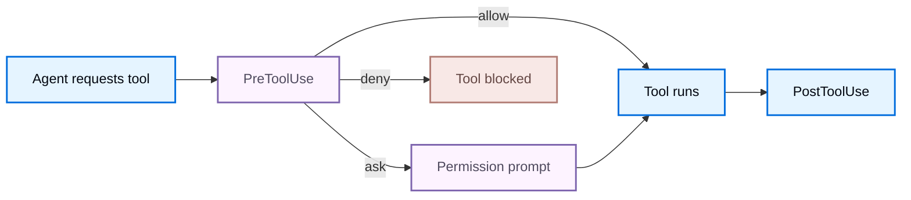

Hooks 让外部程序可以观察和控制 Deep Agents Code 的生命周期事件。

当某个事件触发时，Deep Agents Code 会找到匹配的 handler，通过 stdin 向每个 handler 发送 JSON payload，并合并它们的退出码和 stdout。使用该响应可以允许、拒绝、注入上下文或继续一个回合。以下章节涵盖配置、[Events](#events)、[Input payload](#input-payload) 和 [Handler output](#handler-output)。

Hooks 以你的用户权限运行，并执行来自你配置的任意代码。请将 hook 配置视为可执行代码，只从你信任的来源安装 hooks。

## 设置

为适用于每个项目的 hooks 创建 `~/.deepagents/hooks.json`，或为项目作用域的 hooks 创建 `{project_root}/.deepagents/hooks.json`（在你授予 [workspace 信任](#trust-project-hooks)之后）。Handler 嵌套三层：事件名称、matcher 组，然后是为该组运行的 handler。

```json title="~/.deepagents/hooks.json"
{
  "hooks": {
    "PreToolUse": [
      {
        "matcher": "Bash",
        "hooks": [
          {
            "type": "command",
            "command": "~/.deepagents/hooks/block-rm.sh",
            "timeout": 600
          }
        ]
      }
    ],
    "SessionStart": [
      {
        "matcher": "startup|resume",
        "hooks": [
          {
            "type": "command",
            "command": "~/.deepagents/hooks/load-context.sh"
          }
        ]
      }
    ]
  }
}
```

Deep Agents Code 按优先级顺序加载 hook 配置：

1. 来自 `{project_root}/.deepagents/hooks.json` 的项目 hooks，在 workspace 信任被授予之后。
2. 来自 `~/.deepagents/hooks.json` 的用户 hooks。
3. 由已启用的 plugins 贡献的 hooks。

每个匹配的 handler 并发运行，它们的结果按优先级顺序合并。优先级决定哪个答案生效，而不是哪些 handler 执行：即使更高优先级的 handler 停止了事件，较低优先级的 handler 仍然会运行，其副作用仍然会发生。

运行 `dcode config path` 可以查看独立的项目和用户 hook 位置，以及 workspace 信任存储。

Hook 配置会被快照，直到 `/reload` 或新会话。在一个回合中编辑 `hooks.json` 不会改变活动快照。启用或禁用 plugin 也会改变快照，因此请运行 `/reload` 以读取它的 hooks。

### 信任项目 hooks

项目 hooks 来自仓库，因此只有在 workspace 受信任之后才会加载：

- 当未受信任的 workspace 包含 `.deepagents/hooks.json` 时，交互式会话会提示。信任 workspace 会将该决策持久化到 `~/.deepagents/.state/hooks_trust.json` 中对应的项目根目录。
- 拒绝提示会为该会话跳过项目 hooks，并继续使用用户和 plugin hooks。
- 用 `Esc` 或 `Ctrl+D` 取消提示会中止启动。
- Headless 和 CI 运行从不提示。传入 `--trust-project-hooks` 为该次运行选择加入。

### Plugin hooks

已启用的 plugin 会贡献相同的配置形态，来源可以是 `hooks/hooks.json`、manifest 中的 `hooks` 路径，或内联的 manifest 对象。安装并启用该 plugin 即为同意开关：workspace 信任只管理项目 hooks，因此它既不授予也不扣留 plugin 的 hooks。在启用 plugin 之前请先审查它，并在 plugin 管理器中检查它声明的事件。请参见 [Plugins and marketplaces](/oss/deepagents/code/plugins#add-hooks)。

Server 拥有的事件在会话启动时固定，因此新启用的 plugin hooks 在下次启动或 `/reload` 时激活。

Plugin handler 可以通过这些变量引用它们自己的安装路径：

| 变量 | 值 |
| --- | --- |
| `${CLAUDE_PLUGIN_ROOT}`、`${PLUGIN_ROOT}` | 已安装的 plugin 目录 |
| `${CLAUDE_PLUGIN_DATA}`、`${PLUGIN_DATA}` | plugin 的可写数据目录 |
| `${CLAUDE_PROJECT_DIR}` | 项目根目录 |

在 `command` 字符串中为这些变量加上引号，因为安装路径可能包含空格：`"command": "\"${CLAUDE_PLUGIN_ROOT}/scripts/format.sh\""`。在可能的情况下优先使用可选的 `argv` 字段：Deep Agents Code 会在启动之前解析变量并跳过 shell，因此你不需要引号。

无效的 plugin hook 文档会被单独跳过，并作为配置诊断报告。其他 plugins、项目 hooks 和用户 hooks 继续工作。

### Handler 字段

Matcher 组的 `hooks` 数组中的每个条目都是一个 command handler：

<ResponseField name="type" type="string" required>
    Handler 类型。仅支持 `command`。Command handler 会运行一个子进程，该子进程在 stdin 上接收事件 JSON。
</ResponseField>

<ResponseField name="command" type="string" required>
    要运行的 shell 命令。始终必需。支持管道、重定向、glob 和环境变量展开。事件 payload 以 JSON 形式写入 stdin，永远不会被内插到参数中。当 `argv` 也被设置时，此字符串不会通过 shell 执行。
</ResponseField>

<ResponseField name="argv" type="list[string]" post={["optional"]}>
    直接执行参数列表，而不是通过 shell 解释 `command`。用于显式的可执行文件路径和参数。
</ResponseField>

<ResponseField name="timeout" type="number" post={["optional"]}>
    每个 handler 的超时时间（秒）。默认值为 600 秒，`UserPromptSubmit` 除外，它默认为 30 秒。超时是一种非阻塞失败。
</ResponseField>

<ResponseField name="statusMessage" type="string" post={["optional"]}>
    Handler 运行时在 UI 中显示的临时消息。
</ResponseField>

配置不支持的 handler 类型或 `"async": true` 会产生可见的配置错误。

### Handler 环境

Handler 从 payload 中报告为 `cwd` 的工作目录启动，并继承会话环境，但看起来像凭据的变量会被移除：任何包含 `KEY`、`TOKEN`、`SECRET`、`PASSWORD` 或 `APIKEY` 的名称都会在启动前被剥离。需要凭据的 handler 必须从文件或密钥管理器读取，而不是从继承的环境。Plugin handler 额外接收它们自己的 [plugin 路径变量](#plugin-hooks)。

### Matchers

Matcher 过滤某个 handler 组是否为给定事件运行。每个事件匹配一个字段（参见 [Events](#events)）：

- 省略、为空或 `*` 匹配该事件的所有值。
- 简单名称精确匹配（`Bash`）。
- `|` 或 `,` 分隔精确的备选项（`Edit|Write`）。
- 任何其他值都会被视为未锚定的正则表达式（`mcp__.*`）。

`UserPromptSubmit` 和 `Stop` 没有 matcher 字段。对这些事件请省略 `matcher` 或将其设为 `*`；任何其他值在配置加载时都会被拒绝。

编译错误会使该组失效，并在会话运行之前产生用户可见的配置诊断。

## 事件

Deep Agents Code 发出以下事件。Client 拥有的事件在 CLI 进程中运行。Server 拥有的事件源自 agent 执行路径并往返到客户端，因此 command handler 在你的配置所在的地方运行。

| 事件 | Owner | 退出码 2 的效果 | 匹配字段 |
| --- | --- | --- | --- |
| `SessionStart` | Client | 诊断 | `source` |
| `UserPromptSubmit` | Client | 阻止 prompt | 无 |
| `SessionEnd` | Client | 诊断 | `reason` |
| `PermissionRequest` | Client | 拒绝 | `tool_name` |
| `Notification` | Client | 诊断 | `notification_type` |
| `PreToolUse` | Server | 拒绝 | `tool_name` |
| `PostToolUse` | Server | 反馈 | `tool_name` |
| `PreCompact` | Server | 阻止压缩 | `trigger` |
| `Stop` | Server | 继续回合 | 无 |
| `SubagentStart` | Server | 诊断 | `agent_type` |
| `SubagentStop` | Server | 添加上下文 | `agent_type` |

`PreToolUse` 在权限提示之前和工具执行之前运行，这使它成为允许或拒绝工具的主要位置。`Stop` 在最终模型响应被提交之前运行。



该图只覆盖 tool-call 路径。`PermissionRequest` 是当 Deep Agents Code 即将显示权限提示时的一个单独的 client 拥有的事件。

### 在 prompt 缓存过期之前通知

`cache_expiring` 通知会在被跟踪的 prompt 缓存保留窗口结束之前发出警告。用它在你自己的回合面临 cache miss 风险之前触发提醒。

在 `hooks.json` 中，在 `Notification` 下添加一个 handler 组，并将 `matcher` 设为 `cache_expiring`。Deep Agents Code 在最后 60 秒内为每个 thread 和缓存窗口发出一次该通知。payload 包含 `notification_type`、`message` 和 `title`。

## 输入 payload

每个 handler 都会在 stdin 上收到一个 JSON 对象。所有事件共享一个公共信封，外加事件特定字段。

### 公共字段

| 字段 | 说明 |
| --- | --- |
| `session_id` | 会话标识符 |
| `transcript_path` | 可用时指向对话记录的路径 |
| `cwd` | 调用 hook 时的工作目录 |
| `hook_event_name` | 触发的事件名称 |
| `prompt_id` | 当前用户 prompt 的 UUID（可用时） |
| `permission_mode` | 权限模式（`default`、`plan`、`acceptEdits`、`auto`、`dontAsk`、`bypassPermissions`），有意义时 |
| `effort` | 形如 `{ "level": "medium" }` 的对象，level 为 `none`、`low`、`medium`、`high`、`xhigh` 或 `max`（可用时） |
| `agent_id`、`agent_type` | Subagent 身份（可用时） |

`transcript_path` 指向写入 `~/.deepagents/transcripts` 下的对话 JSONL 投影。Subagent 事件还携带 `agent_transcript_path`，指向 subagent 自己的记录。两个文件都会在匹配的 handler 运行之前刷新，因此 handler 可以读取到当前事件为止的对话。

### 事件特定字段

| 事件 | 字段 |
| --- | --- |
| `SessionStart` | `source`（`startup`、`resume`、`clear`、`compact`），可用时还有 `model` |
| `UserPromptSubmit` | `prompt` |
| `SessionEnd` | `reason`（`clear`、`resume`、`prompt_input_exit`、`other`） |
| `PermissionRequest` | `tool_name`、`tool_input`、`permission_suggestions`（当前为空） |
| `Notification` | `message`、`notification_type`，可用时还有 `title` |
| `PreToolUse` | `tool_name`、`tool_input`、`tool_use_id` |
| `PostToolUse` | `tool_name`、`tool_input`、`tool_response`、`tool_use_id`，可用时还有 `duration_ms` |
| `PreCompact` | `trigger`（`manual`、`auto`）、`custom_instructions` |
| `Stop` | `stop_hook_active`、`last_assistant_message`、`background_tasks`、`session_crons` |
| `SubagentStart` | `agent_id`、`agent_type` |
| `SubagentStop` | `stop_hook_active`、`agent_id`、`agent_type`、`agent_transcript_path`、`last_assistant_message`、`background_tasks`、`session_crons` |

`PreToolUse` payload 示例：

```json
{
  "session_id": "abc123",
  "transcript_path": "/Users/you/.deepagents/.../transcript.jsonl",
  "cwd": "/Users/you/my-project",
  "permission_mode": "default",
  "hook_event_name": "PreToolUse",
  "tool_name": "Bash",
  "tool_input": {
    "command": "rm -rf /tmp/build"
  },
  "tool_use_id": "toolu_01ABC"
}
```

### 工具名称

Hook 脚本看到的是稳定的公开工具名称和参数形态，而不是内部的 Deep Agents Code 工具名称。在 `PreToolUse`、`PostToolUse` 和 `PermissionRequest` 中匹配并读取这些名称：

| 公开工具名称 | 重要的输入字段 |
| --- | --- |
| `Bash` | `command`，可选 `timeout`（毫秒） |
| `Write` | `file_path`、`content` |
| `Edit` | `file_path`、`old_string`、`new_string`、`replace_all` |
| `Read` | `file_path`、`limit`、`offset` |
| `Glob` | `pattern`、`path` |
| `Grep` | `pattern`、`path`、`glob`、`output_mode`、`head_limit` |
| `LS` | `path` |
| `mcp__<server>__<tool>` | 工具特定的 JSON |

## Handler 输出

Command handler 通过退出码、stdout 和 stderr 传达结果。

| 退出码 | 含义 |
| --- | --- |
| `0` | 成功。当 stdout 包含 JSON 时，会被解析并应用。 |
| `2` | 该事件的阻塞或反馈路径。请参见 [Events](#events) 表格中的“退出码 2 的效果”列。stdout JSON 会被忽略，stderr 是主要的反馈通道。 |
| 其他非零 | 非阻塞错误。Deep Agents Code 会记录诊断并继续。 |

JSON 输出只在退出码为 `0` 时被处理，并且必须是 stdout 上的唯一内容。成功的非 JSON stdout 会成为 `SessionStart` 和 `UserPromptSubmit` 的额外上下文；对于其他事件则产生诊断。stdout 和 stderr 各自最多保留 100,000 字节。

### 通用输出字段

任何 handler 都可以返回这些顶层字段：

```json
{
  "continue": true,
  "stopReason": "optional user-facing reason when continue is false",
  "suppressOutput": false,
  "systemMessage": "optional message shown to the user",
  "terminalSequence": "optional restricted terminal control sequence",
  "hookSpecificOutput": {
    "hookEventName": "PreToolUse"
  }
}
```

所有匹配的 handler 都会先完成，然后才合并它们的结果。返回 `"continue": false` 会将合并后的决策标记为已停止，但不会阻止其他匹配的 handler 运行。第一个 `stopReason` 按配置顺序生效。`suppressOutput` 只抑制该 handler 的 `systemMessage`。

事件特定的控制位于 `hookSpecificOutput`（工具和权限事件）或顶层 `decision` 和 `reason`（`Stop` 事件）中。

### 使用 `PreToolUse` 控制工具执行

返回权限决策以在工具运行之前允许、拒绝或强制提示：

```json
{
  "hookSpecificOutput": {
    "hookEventName": "PreToolUse",
    "permissionDecision": "deny",
    "permissionDecisionReason": "Destructive command blocked by hook"
  }
}
```

当多个 hooks 匹配时，决策按优先级 `deny > ask > allow` 合并。deny 会在权限提示之前短路执行，并将其原因反馈给模型。ask 会强制显示权限提示。allow 会抑制普通提示，但不会覆盖单独的 deny 或 ask。任何 `additionalContext` 值都会按配置顺序传递。

你也可以用退出码 `2` 阻塞，并将原因写入 stderr。

### 使用 `PermissionRequest` 允许或拒绝

返回决策以代表用户回答权限提示：

```json
{
  "hookSpecificOutput": {
    "hookEventName": "PermissionRequest",
    "decision": {
      "behavior": "deny",
      "message": "Not allowed in this environment"
    }
  }
}
```

任何 deny 都会生效。如果没有 hook 拒绝且至少一个允许，则该操作被允许。如果没有 hook 做出决策，则显示正常的权限提示。

### 使用 `Stop` 继续回合

返回 block 决策可以让 agent 继续工作，而不是结束回合：

```json
{
  "decision": "block",
  "reason": "Tests are still failing; keep working"
}
```

block 会带着你的反馈继续 agent 回合。`Stop.hookSpecificOutput.additionalContext` 具有相同的继续效果。为避免无限循环，请检查 payload 中的 `stop_hook_active`，并在条件满足后停止阻塞。Deep Agents Code 还会强制执行最多八次连续继续的硬性上限。

### 注入上下文

`SessionStart`、`UserPromptSubmit` 和 `SubagentStart` 可以为模型添加上下文：

```json
{
  "hookSpecificOutput": {
    "hookEventName": "SessionStart",
    "additionalContext": "Current sprint: ENG-1421. Prefer the staging database."
  }
}
```

`UserPromptSubmit` 还支持 `suppressOriginalPrompt`。`PostToolUse` 和 `SubagentStop` 可以为模型附加 `additionalContext`，但不能撤销已经运行的操作。

## 不支持的输出字段

以下兼容性字段会被识别但不会被应用。Deep Agents Code 会发出诊断，并使用 Result 列中的回退继续。对于工具和权限行，这意味着普通的 [PreToolUse](#control-tool-execution-with-pretooluse) 或 [PermissionRequest](#allow-or-deny-with-permissionrequest) 决策路径，不会修改工具输入或延迟执行。

| 字段或行为 | 结果 |
| --- | --- |
| `SessionStart.initialUserMessage`、`sessionTitle`、`watchPaths`、`reloadSkills` | 解析，不应用 |
| `UserPromptSubmit.sessionTitle` | 解析，不应用 |
| `PreToolUse.updatedInput` | 修改被忽略；`allow` 或 `ask` 使用普通的 [PreToolUse](#control-tool-execution-with-pretooluse) 决策 |
| `PreToolUse.defer` | 使用普通的 [PreToolUse](#control-tool-execution-with-pretooluse) 决策；从不被视为 allow |
| `PostToolUse.updatedToolOutput`、`updatedMCPToolOutput` | 解析，不应用 |
| `PermissionRequest.updatedInput` | 修改被忽略；`allow` 使用普通的 [PermissionRequest](#allow-or-deny-with-permissionrequest) 决策 |
| `PermissionRequest.updatedPermissions` | 解析，不应用（没有 permission-rule 存储） |
| `SubagentStop` block | [仅上下文](#inject-context)；已完成的 subagent 无法恢复 |

## 示例

<Accordion title="阻止破坏性的 Bash 命令（PreToolUse）">
```bash title="~/.deepagents/hooks/block-rm.sh"
#!/usr/bin/env bash
command=$(jq -r '.tool_input.command // ""')

if printf '%s' "$command" | grep -Eq 'rm[[:space:]]+.*-[a-zA-Z]*[rf]'; then
  cat <<'JSON'
{
  "hookSpecificOutput": {
    "hookEventName": "PreToolUse",
    "permissionDecision": "deny",
    "permissionDecisionReason": "Recursive or forced rm is blocked by policy"
  }
}
JSON
fi
```

```json title="~/.deepagents/hooks.json"
{
  "hooks": {
    "PreToolUse": [
      {
        "matcher": "Bash",
        "hooks": [
          { "type": "command", "command": "~/.deepagents/hooks/block-rm.sh" }
        ]
      }
    ]
  }
}
```
</Accordion>

<Accordion title="在会话开始时加载项目上下文（SessionStart）">
```bash title="~/.deepagents/hooks/load-context.sh"
#!/usr/bin/env bash
context=$(git -C "$(jq -r '.cwd')" log --oneline -5 2>/dev/null)

jq -n --arg ctx "$context" '{
  hookSpecificOutput: {
    hookEventName: "SessionStart",
    additionalContext: ("Recent commits:\n" + $ctx)
  }
}'
```

```json title="~/.deepagents/hooks.json"
{
  "hooks": {
    "SessionStart": [
      {
        "matcher": "startup|resume",
        "hooks": [
          { "type": "command", "command": "~/.deepagents/hooks/load-context.sh" }
        ]
      }
    ]
  }
}
```
</Accordion>

<Accordion title="macOS 上回合结束时的桌面通知（Stop）">
```json title="~/.deepagents/hooks.json"
{
  "hooks": {
    "Stop": [
      {
        "hooks": [
          {
            "type": "command",
            "command": "osascript -e 'display notification \"Agent finished\" with title \"Deep Agents Code\"'"
          }
        ]
      }
    ]
  }
}
```
</Accordion>

<Accordion title="读取 payload 的 Python handler">
```python title="~/.deepagents/hooks/handler.py"
import json
import sys


def handle(payload: dict[str, object]) -> None:
    event = payload["hook_event_name"]
    if event == "PreToolUse":
        tool_name = payload["tool_name"]
        print(f"About to run {tool_name}", file=sys.stderr)


if __name__ == "__main__":
    handle(json.load(sys.stdin))
```

```json title="~/.deepagents/hooks.json"
{
  "hooks": {
    "PreToolUse": [
      {
        "matcher": "*",
        "hooks": [
          {
            "type": "command",
            "command": "python3 ~/.deepagents/hooks/handler.py"
          }
        ]
      }
    ]
  }
}
```
</Accordion>

## 排查 hooks

Hook 活动在会话中可见，而不仅是在日志中：

- 运行中的 handler 会显示它的 `statusMessage`，未设置时显示 `Running <event> hook`。并发的 handler 共享一个状态槽，因此在完成之前显示的是最近的一个。
- Handler 的 `systemMessage` 会显示为信息性通知。
- 配置错误、非零退出、超时和不支持的输出字段会显示为 `Hook warning` 或 `Hook error` 通知，每次调用一次。
- 来自 hook 的权限回答会被归因到该 hook，例如 `PermissionRequest hook denied Bash`。
- 设置 `DEEPAGENTS_CODE_DEBUG=1` 可以捕获每个诊断，包括从不显示为通知的 debug 级别条目。

## 旧版配置

较旧的列表形态的 `hooks.json` 文件已弃用但仍受支持。Deep Agents Code 会自动迁移等价的事件；没有安全映射的事件会被跳过并附带诊断。

## 安全

Hooks 遵循与 Git hooks 或 shell alias 相同的信任模型：任何可以写入 `hooks.json` 的进程都可以用你的权限运行任意命令。

- Payload 数据以 JSON 形式流向 stdin，永远不会被内插到命令参数中。
- 看起来像凭据的环境变量会从 handler 环境中剥离。
- Hook 配置保持固定，直到 `/reload` 或新会话。
- 在可能的情况下，优先使用你控制的显式 shell 可执行文件，而不是 shell 包装器。
- 只从你信任的来源安装 hooks。

<Warning>
    Hook 以你的用户权限运行。请将 hook 配置视为可执行代码。
</Warning>

## See also

- [Configuration](/oss/deepagents/code/configuration)
- [Plugins and marketplaces](/oss/deepagents/code/plugins)
- [Data locations](/oss/deepagents/code/configuration#data-locations)
- [CLI reference](/oss/deepagents/code/cli-reference)
