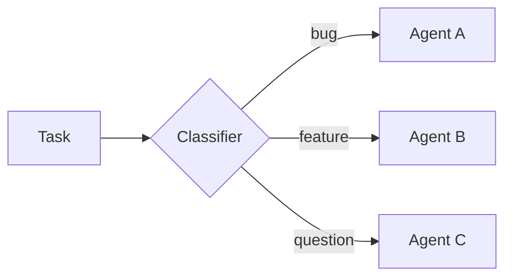
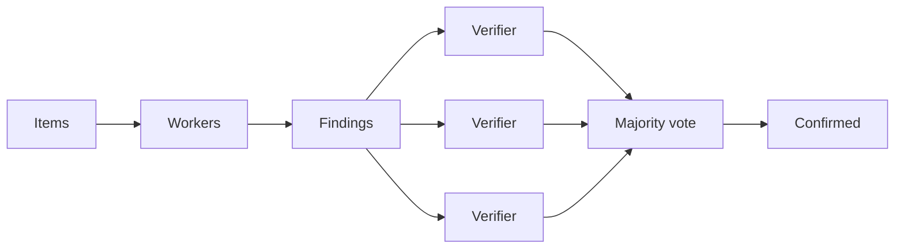
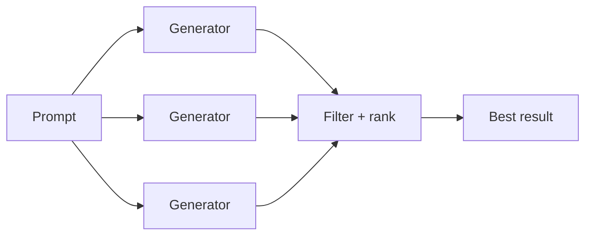
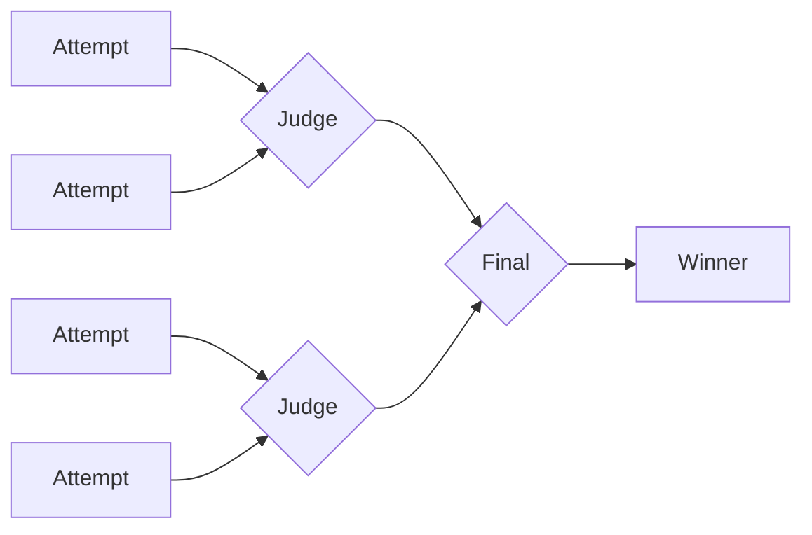
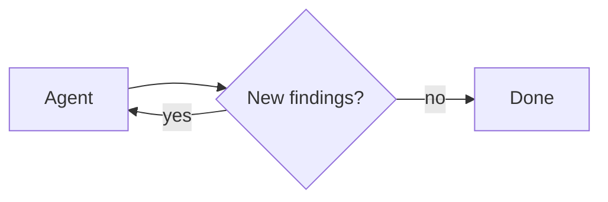

动态 subagent 允许 agent 通过 interpreter 代码调度 [subagents](/oss/deepagents/subagents)。与其让模型一次只决定一个 subagent 调用，不如让 agent 使用 JavaScript 的循环、分支和并行批次，把工作分发给已配置的 subagent，并综合最终结果。

当工作跨越许多独立单元、需要多个视角，或者适合递归分析时，就用这个模式。关于 interpreter 的通用设置，请参见 [Interpreters](/oss/deepagents/interpreters)。

<Warning>
    Dynamic subagent 使用 interpreter runtime，而它目前处于 [**beta**](/oss/versioning) 阶段。API 和生命周期行为在不同版本之间可能会变化。
</Warning>

:::python
<Note>
    Interpreters 需要 `langchain-quickjs>=0.1.0` 和 Python `>=3.11`。
</Note>
:::

## 快速开始

动态 subagent 需要两样东西：可供调度工作的 subagent，以及一个 code interpreter，也就是一个安全、轻量的 runtime，模型会在其中编写并执行编排代码。Deep Agents 提供了一个基于 QuickJS 的可选 code interpreter。先安装 QuickJS middleware package，再把 interpreter middleware 通过 `create_deep_agent` 的 `middleware` 参数传入。

:::python
<CodeGroup>
```bash pip
pip install -U "deepagents[quickjs]"
```

```bash uv
uv add "deepagents[quickjs]"
```
</CodeGroup>

```python
from deepagents import create_deep_agent
from langchain_quickjs import CodeInterpreterMiddleware

agent = create_deep_agent(
    model="openai:gpt-5.5",
    middleware=[CodeInterpreterMiddleware()],
)
```
:::

:::js
<CodeGroup>
```bash npm
npm install deepagents @langchain/quickjs
```

```bash pnpm
pnpm add deepagents @langchain/quickjs
```

```bash yarn
yarn add deepagents @langchain/quickjs
```
</CodeGroup>

```typescript
import { createDeepAgent } from "deepagents";
import { createCodeInterpreterMiddleware } from "@langchain/quickjs";

const agent = createDeepAgent({
  model: "openai:gpt-5.5",
  middleware: [createCodeInterpreterMiddleware()],
});
```
:::

Deep Agents 内置了一个通用 subagent，所以基础的 fan-out 不需要额外配置。对于专门任务，可以配置自定义 subagent，并为它们设置各自的 name、description 和 system prompt；agent 就是通过这些 name 和 description 来判断该调用哪个角色。配置方法见 [Subagents](/oss/deepagents/subagents)。

要触发 dynamic subagent，可以在提示词里加入单词 "workflow"：

:::python
```python
result = await agent.ainvoke({
    "messages": [{"role": "user", "content": "Run a workflow that reviews every file in src/routes/ and summarizes the top risks."}]
})
```
:::

:::js
```typescript
const result = await agent.invoke({
  messages: [{ role: "user", content: "Run a workflow that reviews every file in src/routes/ and summarizes the top risks." }],
});
```
:::

<Tip>
    **单词 "workflow" 是一个很有用的触发器。** interpreter 的 system prompt 会把 "workflow" 视为一个信号：通过 interpreter 组织工作，用代码里的 `task()` 调度 subagent，而不是让模型一次一个工具调用地硬推任务。把请求表述成一个 "workflow"，就是你主动打开动态编排的一种方式。如果只需要一次直接委派，就把请求写得更直接。
</Tip>

### 在 coding agent 中使用

尝试 dynamic subagent 最快的方式是使用 `dcode`，也就是基于 Deep Agent 的 LangChain 终端 coding agent。它默认启用了 code interpreter，所以 dynamic subagent 开箱即用，不需要额外接线。

安装 `dcode`：

```bash
curl -LsSf https://langch.in/dcode | bash
```

运行它：

```bash
dcode
```

要触发 dynamic subagent，可以直接要求一个 "workflow"。agent 不会自己闷头做完，也不会只靠原生 `task` tool 手工管理 fan-out，而是会写一段编排脚本，在 code interpreter 里调用内置的 `task()` global。比如："Run a workflow to review every file in src/ for SQL injection."

当 subagent 被创建时，`dcode` 会在 dynamic subagent 面板里实时显示它们，并按 dispatch 阶段分组。

<Frame>
  
</Frame>

`dcode` 是试用这个功能最快的方式，但你也可以通过 [ACP](/oss/deepagents/acp) 在你喜欢的 coding agent 里使用 dynamic subagent（例如 Zed）。

## 工作原理

当 agent 同时具备 [subagents](/oss/deepagents/subagents) 和 interpreter middleware 时，interpreter 会暴露一个内置的 `task()` global，让代码可以调度 subagent。一个覆盖多个独立单元的任务（比如检查目录里的每个文件、分拣一批工单）会变成一个把工作 fan out 的循环，因此执行方式是确定性的，而不是一次只让模型选一个 tool call。

Subagent 编排也支持 recursive language model（RLM）工作流，也就是 [Recursive Language Models paper](https://arxiv.org/abs/2512.24601) 里描述的方法：把工作集保存在 interpreter 变量中，选择切片，用 `task()` 调用 subagent，再把结果综合起来。

`task()` 接受以下输入：

- `description`：传给 subagent 的提示词
- `subagentType`：要运行哪个已配置的 subagent
- `responseSchema`（可选）：结构化输出

`task()` 会运行完整的 agent 循环，并解析为 subagent 的结果：

```javascript
const review = await task({
  description: "Review src/auth/login.ts for auth issues. Cite line numbers.",
  subagentType: "reviewer",
  responseSchema: {
    type: "object",
    properties: {
      issues: { type: "array", items: { type: "object", properties: {
        file: { type: "string" }, line: { type: "number" },
        severity: { type: "string" }, description: { type: "string" },
      }}},
    },
  },
});

// 有了 responseSchema，结果已经是带类型的值，因此不需要 JSON.parse。
const critical = review.issues.filter((issue) => issue.severity === "high");
```

当你传入 `responseSchema` 时，解析后的值已经是有类型的 JavaScript 对象；只有在 subagent 有意返回 JSON 字符串时，才需要调用 `JSON.parse`。

## 模式

agent 会根据任务形状选择策略；这些策略来自它如何编写 interpreter 代码，而不是来自配置，而你提供的 subagent 决定了它能做什么。每种模式都遵循同一个模型：把工作保存在 JS 变量里，用 `task()` 调度 subagent，再在代码中合并结果。下面的图展示了常见形状，每种都配有可运行示例。

### 分类后执行

条目会先被分类，然后每个条目都会根据分类交给专门的 subagent 处理。这样你就能处理混合输入，而不同条目可以使用不同的专长。



**适用场景：** 处理支持工单、错误日志、用户反馈，或任何需要根据类型分别处理的一批条目。

<Accordion title="Example: classify and act">

**你需要配置的内容**

:::python
```python
agent = create_deep_agent(
    model="openai:gpt-5.5",
    subagents=[
        {
            "name": "bug-fixer",
            "description": "Investigates bug reports and provides reproduction steps",
            "system_prompt": "You are a bug triage specialist. Investigate each bug report and provide clear reproduction steps.",
        },
        {
            "name": "feature-analyst",
            "description": "Evaluates feature requests for feasibility and effort",
            "system_prompt": "You are a product analyst. Evaluate each feature request for technical feasibility, estimated effort, and potential impact.",
        },
        {
            "name": "support-agent",
            "description": "Answers user questions based on documentation",
            "system_prompt": "You are a support specialist. Answer user questions clearly based on the available documentation.",
        },
    ],
    middleware=[CodeInterpreterMiddleware()],
)

result = await agent.ainvoke({
    "messages": [{"role": "user", "content": "Go through these 30 support tickets. Categorize each one, then for bugs give me reproduction steps, and for feature requests give me a feasibility assessment."}]
})
```
:::

:::js
```typescript
const agent = createDeepAgent({
  model: "openai:gpt-5.5",
  subagents: [
    {
      name: "bug-fixer",
      description: "Investigates bug reports and provides reproduction steps",
      systemPrompt: "You are a bug triage specialist. Investigate each bug report and provide clear reproduction steps.",
    },
    {
      name: "feature-analyst",
      description: "Evaluates feature requests for feasibility and effort",
      systemPrompt: "You are a product analyst. Evaluate each feature request for technical feasibility, estimated effort, and potential impact.",
    },
    {
      name: "support-agent",
      description: "Answers user questions based on documentation",
      systemPrompt: "You are a support specialist. Answer user questions clearly based on the available documentation.",
    },
  ],
  middleware: [createCodeInterpreterMiddleware()],
});

const result = await agent.invoke({
  messages: [{ role: "user", content: "Go through these 30 support tickets. Categorize each one, then for bugs give me reproduction steps, and for feature requests give me a feasibility assessment." }],
});
```
:::

**agent 会写出的内容**

```javascript
// The agent has already classified each ticket; this routes every item to
// the right specialist and collects the handled results.
const SPECIALIST = { bug: "bug-fixer", feature: "feature-analyst", question: "support-agent" };

const handled = await Promise.all(
  tickets.map((ticket) =>
    task({
      description: `Handle this ${ticket.category}:\n${ticket.text}`,
      subagentType: SPECIALIST[ticket.category],
    }),
  ),
);
// ... group handled results by category into a single triage report
handled;
```
</Accordion>

### 分发并综合

agent 会把同一类工作并行分发到多个条目上，然后把结果合并起来。


**适用场景：** 对整个目录做 code review、分析一批文档、处理日志文件、对多个服务运行同一检查。

<Accordion title="Example: fan-out and synthesize">

**你需要配置的内容**

:::python
```python
from deepagents import create_deep_agent
from langchain_quickjs import CodeInterpreterMiddleware

agent = create_deep_agent(
    model="openai:gpt-5.5",
    subagents=[{
        "name": "reviewer",
        "description": "Reviews code for security issues, citing lines and severity",
        "system_prompt": "You are a security-focused code reviewer. Read the file carefully and report any authentication or authorization issues with line numbers and severity.",
    }],
    middleware=[CodeInterpreterMiddleware()],
)

result = await agent.ainvoke({
    "messages": [{"role": "user", "content": "Review all the route handlers in src/routes/ for authentication issues. Summarize the top risks."}]
})
```
:::

:::js
```typescript
import { createDeepAgent } from "deepagents";
import { createCodeInterpreterMiddleware } from "@langchain/quickjs";

const agent = createDeepAgent({
  model: "openai:gpt-5.5",
  subagents: [{
    name: "reviewer",
    description: "Reviews code for security issues, citing lines and severity",
    systemPrompt: "You are a security-focused code reviewer. Read the file carefully and report any authentication or authorization issues with line numbers and severity.",
  }],
  middleware: [createCodeInterpreterMiddleware()],
});

const result = await agent.invoke({
  messages: [{ role: "user", content: "Review all the route handlers in src/routes/ for authentication issues. Summarize the top risks." }],
});
```
:::

**agent 会写出的内容**

```javascript
// One reviewer per file, dispatched in parallel, then findings merged.
const files = (await tools.glob({ pattern: "src/routes/**/*.ts" }))
  .split("\n")
  .filter(Boolean);

const reviews = await Promise.all(
  files.map((file) =>
    task({
      description: `Review ${file} for authentication issues. Cite line numbers.`,
      subagentType: "reviewer",
      responseSchema: issuesSchema, // -> { issues: [{ file, line, severity }] }
    }),
  ),
);

const issues = reviews.flatMap((r) => r.issues);
// ... sort by severity, drop duplicates, summarize the top risks
issues;
```
</Accordion>

### 对抗式验证

这是一个两阶段模式。第一阶段产出 findings，第二阶段把每个 finding 交给独立 verifier，只有经过一致确认的 findings 才会保留。当你更看重准确性而不是速度时，这能减少误报。



**适用场景：** 对误报代价很高的安全审计、合规检查，以及任何需要高置信度 findings 的 review。

<Accordion title="Example: adversarial verification">

**你需要配置的内容**

:::python
```python
agent = create_deep_agent(
    model="openai:gpt-5.5",
    subagents=[
        {
            "name": "reviewer",
            "description": "Finds potential security vulnerabilities in code",
            "system_prompt": "You are a security auditor. Find potential vulnerabilities and report each with file, line, and description.",
        },
        {
            "name": "verifier",
            "description": "Independently verifies whether a reported vulnerability is real",
            "system_prompt": "You are a security verification specialist. Given a reported vulnerability, independently verify whether it is exploitable. Be skeptical. Only confirm real issues.",
        },
    ],
    middleware=[CodeInterpreterMiddleware()],
)

result = await agent.ainvoke({
    "messages": [{"role": "user", "content": "Do a thorough security audit of the payments module. I only want confirmed vulnerabilities, not maybes."}]
})
```
:::

:::js
```typescript
const agent = createDeepAgent({
  model: "openai:gpt-5.5",
  subagents: [
    {
      name: "reviewer",
      description: "Finds potential security vulnerabilities in code",
      systemPrompt: "You are a security auditor. Find potential vulnerabilities and report each with file, line, and description.",
    },
    {
      name: "verifier",
      description: "Independently verifies whether a reported vulnerability is real",
      systemPrompt: "You are a security verification specialist. Given a reported vulnerability, independently verify whether it is exploitable. Be skeptical. Only confirm real issues.",
    },
  ],
  middleware: [createCodeInterpreterMiddleware()],
});

const result = await agent.invoke({
  messages: [{ role: "user", content: "Do a thorough security audit of the payments module. I only want confirmed vulnerabilities, not maybes." }],
});
```
:::

**agent 会写出的内容**

```javascript
// Pass 1: audit. Pass 2: verify each finding independently; keep only confirmed.
const { findings } = await task({
  description: "Audit the payments module for vulnerabilities.",
  subagentType: "auditor",
  responseSchema: findingsSchema, // -> { findings: [{ id, file, line, description }] }
});

const verdicts = await Promise.all(
  findings.map((f) =>
    task({
      description: `Verify ${f.file}:${f.line} (${f.description}). Confirm or refute.`,
      subagentType: "verifier",
      responseSchema: verdictSchema, // -> { confirmed: boolean }
    }),
  ),
);

const confirmed = findings.filter((_, i) => verdicts[i]?.confirmed);
// ... report only the confirmed vulnerabilities
confirmed;
```
</Accordion>

### 生成并筛选

多个 subagent 会针对同一个问题生成相互独立的方案。agent 再在代码中比较、打分和筛选结果，只保留最好的那个。



**适用场景：** 架构提案、重构策略、内容变体，以及任何在最终决定前先探索多个选项会带来更好结果的任务。

<Accordion title="Example: generate and filter">

**你需要配置的内容**

:::python
```python
agent = create_deep_agent(
    model="openai:gpt-5.5",
    subagents=[{
        "name": "architect",
        "description": "Proposes a database schema design with tradeoff analysis",
        "system_prompt": "You are a database architect. Propose a schema design for the given requirements. Include tradeoffs, migration considerations, and a clear rationale.",
    }],
    middleware=[CodeInterpreterMiddleware()],
)

result = await agent.ainvoke({
    "messages": [{"role": "user", "content": "Generate three different approaches to restructure the database schema for the orders system, then pick the best one."}]
})
```
:::

:::js
```typescript
const agent = createDeepAgent({
  model: "openai:gpt-5.5",
  subagents: [{
    name: "architect",
    description: "Proposes a database schema design with tradeoff analysis",
    systemPrompt: "You are a database architect. Propose a schema design for the given requirements. Include tradeoffs, migration considerations, and a clear rationale.",
  }],
  middleware: [createCodeInterpreterMiddleware()],
});

const result = await agent.invoke({
  messages: [{ role: "user", content: "Generate three different approaches to restructure the database schema for the orders system, then pick the best one." }],
});
```
:::

**agent 会写出的内容**

```javascript
// Generate independent proposals in parallel, then score and keep the best.
const proposals = await Promise.all(
  [1, 2, 3].map((n) =>
    task({
      description: `Approach ${n}: redesign the orders schema, with tradeoffs.`,
      subagentType: "architect",
      responseSchema: designSchema, // -> { design, tradeoffs }
    }),
  ),
);

// ... score each proposal against the requirements
const best = proposals.sort((a, b) => score(b) - score(a))[0];
best;
```
</Accordion>

### 锦标赛

不同变体会由 judge subagent 进行一对一比较，胜者会在淘汰轮次中继续晋级。



**适用场景：** 在主观标准下做优化、选择风格、在竞争实现之间做取舍。

<Accordion title="Example: tournament">

**你需要配置的内容**

:::python
```python
agent = create_deep_agent(
    model="openai:gpt-5.5",
    subagents=[
        {
            "name": "writer",
            "description": "Rewrites a function with a focus on readability and clarity",
            "system_prompt": "You are an expert programmer focused on clean code. Rewrite the given function to maximize readability. Explain your choices.",
        },
        {
            "name": "judge",
            "description": "Compares two code implementations and picks the more readable one",
            "system_prompt": "You are a code quality judge. Compare two implementations and pick the more readable one. Justify your choice with specific criteria.",
        },
    ],
    middleware=[CodeInterpreterMiddleware()],
)

result = await agent.ainvoke({
    "messages": [{"role": "user", "content": "Rewrite the processOrder function in src/checkout.ts five different ways and find the most readable version."}]
})
```
:::

:::js
```typescript
const agent = createDeepAgent({
  model: "openai:gpt-5.5",
  subagents: [
    {
      name: "writer",
      description: "Rewrites a function with a focus on readability and clarity",
      systemPrompt: "You are an expert programmer focused on clean code. Rewrite the given function to maximize readability. Explain your choices.",
    },
    {
      name: "judge",
      description: "Compares two code implementations and picks the more readable one",
      systemPrompt: "You are a code quality judge. Compare two implementations and pick the more readable one. Justify your choice with specific criteria.",
    },
  ],
  middleware: [createCodeInterpreterMiddleware()],
});

const result = await agent.invoke({
  messages: [{ role: "user", content: "Rewrite the processOrder function in src/checkout.ts five different ways and find the most readable version." }],
});
```
:::

**agent 会写出的内容**

```javascript
// Generate variants, then judge pairwise until a single winner remains.
let bracket = await Promise.all(
  [1, 2, 3, 4, 5].map((n) =>
    task({ description: `Rewrite processOrder for readability (variant ${n}).`, subagentType: "writer" }),
  ),
);

while (bracket.length > 1) {
  const winners = [];
  for (let i = 0; i < bracket.length; i += 2) {
    if (bracket[i + 1] === undefined) { winners.push(bracket[i]); break; }
    const { winner } = await task({
      description: `Pick the more readable:\n\nA:\n${bracket[i]}\n\nB:\n${bracket[i + 1]}`,
      subagentType: "judge",
      responseSchema: pickSchema, // -> { winner: "A" | "B" }
    });
    winners.push(winner === "A" ? bracket[i] : bracket[i + 1]);
  }
  bracket = winners;
}
bracket[0]; // the winning rewrite
```
</Accordion>

### 循环直到完成

agent 会运行一个发现循环，把已经找到的内容去重，直到不再出现新结果。适用于一开始并不知道工作范围的场景。



**适用场景：** 穷尽式搜索、死代码检测、依赖审计，以及任何你更想要完整性而不是固定数量结果的扫描。

<Accordion title="Example: loop until done">

**你需要配置的内容**

:::python
```python
agent = create_deep_agent(
    model="openai:gpt-5.5",
    subagents=[{
        "name": "analyzer",
        "description": "Analyzes code for unused exports, functions, and dead code paths",
        "system_prompt": "You are a code analyst specializing in dead code detection. Find unused exports, unreachable functions, and orphaned modules. Report each with file path and evidence.",
    }],
    middleware=[CodeInterpreterMiddleware()],
)

result = await agent.ainvoke({
    "messages": [{"role": "user", "content": "Find all the dead code in this repo. Be thorough. I want every unused export and unreachable function."}]
})
```
:::

:::js
```typescript
const agent = createDeepAgent({
  model: "openai:gpt-5.5",
  subagents: [{
    name: "analyzer",
    description: "Analyzes code for unused exports, functions, and dead code paths",
    systemPrompt: "You are a code analyst specializing in dead code detection. Find unused exports, unreachable functions, and orphaned modules. Report each with file path and evidence.",
  }],
  middleware: [createCodeInterpreterMiddleware()],
});

const result = await agent.invoke({
  messages: [{ role: "user", content: "Find all the dead code in this repo. Be thorough. I want every unused export and unreachable function." }],
});
```
:::

**agent 会写出的内容**

```javascript
// Keep dispatching rounds, deduping against what's found, until a round adds nothing.
const seen = new Set();
const found = [];

while (true) {
  const { items } = await task({
    description: `Find dead code. Already found: ${[...seen].join(", ") || "(none)"}.`,
    subagentType: "analyzer",
    responseSchema: itemsSchema, // -> { items: [{ id, file }] }
  });
  const fresh = items.filter((i) => !seen.has(i.id));
  if (fresh.length === 0) break; // converged: nothing new
  for (const i of fresh) { seen.add(i.id); found.push(i); }
}
found;
```
</Accordion>

:::python
<Warning>
    `task()` 是在已经运行中的 `eval` 调用内部派发的。它不会走正常的 tool calling 路径，因此父 agent 上的 `interrupt_on` 审批流程不会对每次派发逐一生效。如果你需要在 subagent 编排开始前获得批准，请把 `eval` tool 本身纳入审批。
</Warning>
:::
:::js
<Warning>
    `task()` 是在已经运行中的 `eval` 调用内部派发的。它不会走正常的 tool calling 路径，因此父 agent 上的 `interruptOn` 审批流程不会对每次派发逐一生效。如果你需要在 subagent 编排开始前获得批准，请把 `eval` tool 本身纳入审批。
</Warning>
:::

## 禁用 dynamic subagent

只要 agent 有 subagent，dispatch 默认就是开启的。如果你想让 subagent 只能通过常规的 `task` tool 路径可用，就把它禁用。

:::python
```python
from deepagents import create_deep_agent
from langchain_quickjs import CodeInterpreterMiddleware

agent = create_deep_agent(
    model="openai:gpt-5.5",
    subagents=[{"name": "reviewer", "description": "Reviews code", "system_prompt": "Review code."}],
    middleware=[CodeInterpreterMiddleware(subagents=False)],
)
```
:::

:::js
```typescript
import { createDeepAgent } from "deepagents";
import { createCodeInterpreterMiddleware } from "@langchain/quickjs";

const agent = createDeepAgent({
  model: "openai:gpt-5.5",
  subagents: [{ name: "reviewer", description: "Reviews code", systemPrompt: "Review code." }],
  middleware: [createCodeInterpreterMiddleware({ subagents: false })],
});
```
:::
