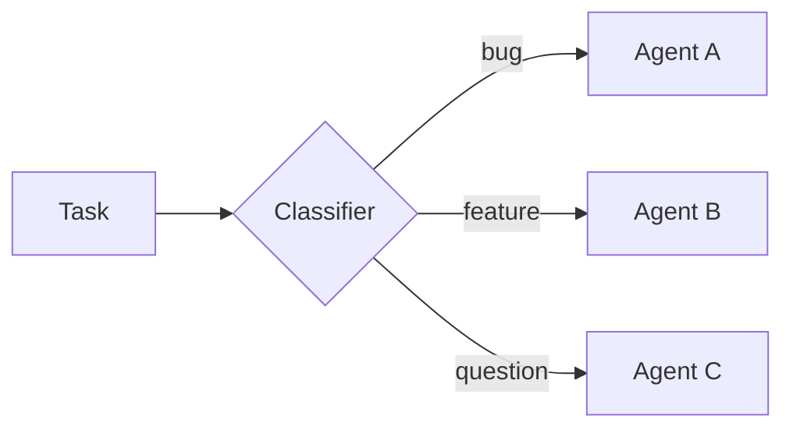
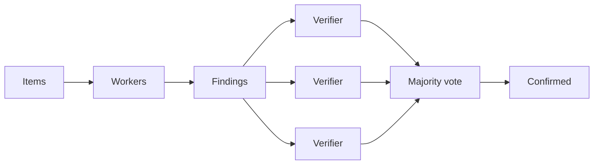
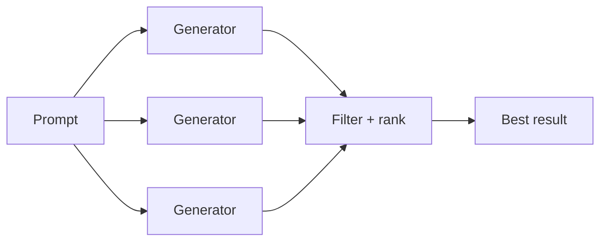
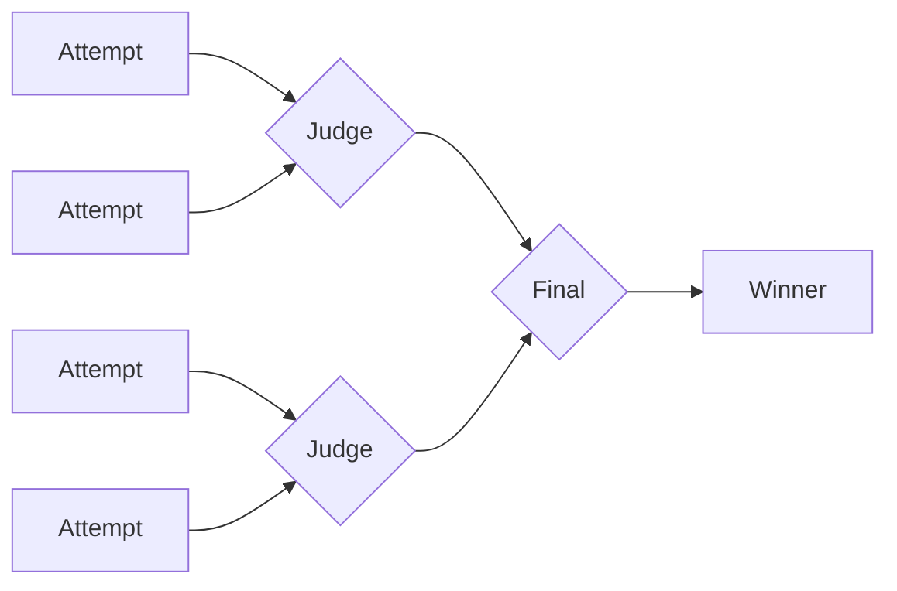
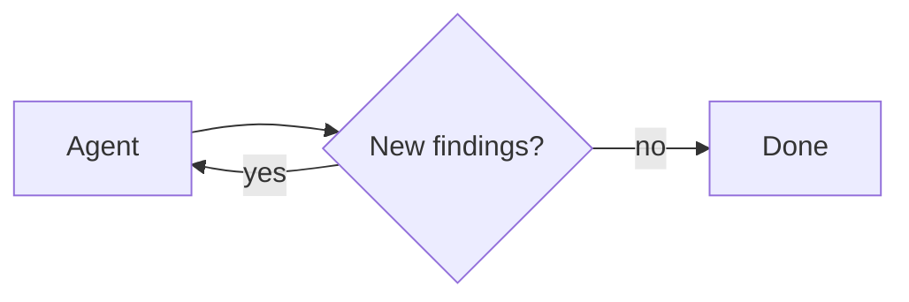

import DynamicSubagentsQuickstartPy from '/snippets/code-samples/dynamic-subagents-quickstart-py.mdx';
import DynamicSubagentsQuickstartJs from '/snippets/code-samples/dynamic-subagents-quickstart-js.mdx';
import DynamicSubagentsInvokePy from '/snippets/code-samples/dynamic-subagents-invoke-py.mdx';
import DynamicSubagentsInvokeJs from '/snippets/code-samples/dynamic-subagents-invoke-js.mdx';
import DynamicSubagentsTaskApiEvalJs from '/snippets/code-samples/dynamic-subagents-task-api-eval-js.mdx';
import DynamicSubagentsClassifyConfigurePy from '/snippets/code-samples/dynamic-subagents-classify-configure-py.mdx';
import DynamicSubagentsClassifyConfigureJs from '/snippets/code-samples/dynamic-subagents-classify-configure-js.mdx';
import DynamicSubagentsClassifyEvalJs from '/snippets/code-samples/dynamic-subagents-classify-eval-js.mdx';
import DynamicSubagentsFanoutConfigurePy from '/snippets/code-samples/dynamic-subagents-fanout-configure-py.mdx';
import DynamicSubagentsFanoutConfigureJs from '/snippets/code-samples/dynamic-subagents-fanout-configure-js.mdx';
import DynamicSubagentsFanoutEvalJs from '/snippets/code-samples/dynamic-subagents-fanout-eval-js.mdx';
import DynamicSubagentsAdversarialConfigurePy from '/snippets/code-samples/dynamic-subagents-adversarial-configure-py.mdx';
import DynamicSubagentsAdversarialConfigureJs from '/snippets/code-samples/dynamic-subagents-adversarial-configure-js.mdx';
import DynamicSubagentsAdversarialEvalJs from '/snippets/code-samples/dynamic-subagents-adversarial-eval-js.mdx';
import DynamicSubagentsGenerateConfigurePy from '/snippets/code-samples/dynamic-subagents-generate-configure-py.mdx';
import DynamicSubagentsGenerateConfigureJs from '/snippets/code-samples/dynamic-subagents-generate-configure-js.mdx';
import DynamicSubagentsGenerateEvalJs from '/snippets/code-samples/dynamic-subagents-generate-eval-js.mdx';
import DynamicSubagentsTournamentConfigurePy from '/snippets/code-samples/dynamic-subagents-tournament-configure-py.mdx';
import DynamicSubagentsTournamentConfigureJs from '/snippets/code-samples/dynamic-subagents-tournament-configure-js.mdx';
import DynamicSubagentsTournamentEvalJs from '/snippets/code-samples/dynamic-subagents-tournament-eval-js.mdx';
import DynamicSubagentsLoopConfigurePy from '/snippets/code-samples/dynamic-subagents-loop-configure-py.mdx';
import DynamicSubagentsLoopConfigureJs from '/snippets/code-samples/dynamic-subagents-loop-configure-js.mdx';
import DynamicSubagentsLoopEvalJs from '/snippets/code-samples/dynamic-subagents-loop-eval-js.mdx';
import DynamicSubagentsDisablePy from '/snippets/code-samples/dynamic-subagents-disable-py.mdx';
import DynamicSubagentsDisableJs from '/snippets/code-samples/dynamic-subagents-disable-js.mdx';

动态 subagent 允许 agent 通过 interpreter 代码调度 [subagents](/oss/deepagents/subagents)。与其让模型一次只决定一个 subagent 调用，不如让 agent 使用 JavaScript 的循环、分支和并行批次，把工作分发给已配置的 subagent，并综合最终结果。

当工作跨越许多独立单元、需要多个视角，或者适合递归分析时，就用这个模式。关于 interpreter 的通用设置，请参见 [Interpreters](/oss/deepagents/interpreters)。

<Warning>
    Dynamic subagent 使用 interpreter runtime，而它目前处于 [**beta**](/oss/versioning) 阶段。API 和生命周期行为在不同版本之间可能会变化。
</Warning>

:::python
<Note>
    Interpreters 需要 `langchain-quickjs>=0.2.0` 和 Python `>=3.11`。
</Note>
:::

:::js
<Note>
    Interpreters 需要 `@langchain/quickjs`。
</Note>
:::

## 快速开始

动态 subagent 需要 [interpreter](/oss/deepagents/interpreters) middleware。先安装并连接 interpreter。内置的 [通用 subagent](/oss/deepagents/subagents#default-subagent) 可以在没有额外配置的情况下处理基础 fan-out。

:::python
<DynamicSubagentsQuickstartPy />
:::

:::js
<DynamicSubagentsQuickstartJs />
:::

安装步骤和 interpreter 设置请参见 [Interpreters](/oss/deepagents/interpreters#quickstart)。

对于专门任务，可以配置自定义 [subagents](/oss/deepagents/subagents)，并为它们设置各自的 name、description 和 system prompt。subagent 的 name 和 description 会作为 agent 判断该使用哪个角色的信息。

要触发 dynamic subagent，可以在提示词里加入单词 "workflow"：

:::python
<DynamicSubagentsInvokePy />
:::

:::js
<DynamicSubagentsInvokeJs />
:::

<Tip>
    **单词 "workflow" 是一个很有用的触发器。** interpreter 的 system prompt 会把 "workflow" 视为一个信号：通过 interpreter 组织工作，用代码里的 `task()` 调度 subagent，而不是让模型一次一个工具调用地硬推任务。把请求表述成一个 "workflow"，就是你主动打开动态编排的一种方式。如果只需要一次直接委派，就把请求写得更直接。
</Tip>

### 在 coding agent 中使用

尝试 dynamic subagent 最快的方式是使用 `dcode`，也就是基于 Deep Agent 的 LangChain 终端 coding agent。它默认启用了 code interpreter，所以 dynamic subagent 开箱即用，不需要额外接线。

安装 `dcode`：

```bash
curl -LsSf https://langch.in/dcode | bash
```

运行它：

```bash
dcode
```

要触发 dynamic subagent，可以直接要求一个 "workflow"。agent 不会自己闷头做完，也不会只靠原生 `task` tool 手工管理 fan-out，而是会写一段编排脚本，在 code interpreter 里调用内置的 `task()` global。比如："Run a workflow to review every file in src/ for SQL injection."

当 subagent 被创建时，`dcode` 会在 dynamic subagent 面板里实时显示它们，并按 dispatch 阶段分组。

<Frame>
  
</Frame>

`dcode` 是试用这个功能最快的方式，但你也可以通过 [ACP](/oss/deepagents/acp) 在你喜欢的 coding agent 里使用 dynamic subagent（例如 Zed）。

## 工作原理

当 agent 同时具备 [subagents](/oss/deepagents/subagents) 和 interpreter middleware 时，interpreter 会暴露一个内置的 `task()` global，让代码可以调度 subagent。一个覆盖多个独立单元的任务（比如检查目录里的每个文件、分拣一批工单）会变成一个把工作 fan out 的循环，因此执行方式是确定性的，而不是一次只让模型选一个 tool call。

Subagent 编排也支持 recursive language model（RLM）工作流，也就是 [Recursive Language Models paper](https://arxiv.org/abs/2512.24601) 里描述的方法：把工作集保存在 interpreter 变量中，选择切片，用 `task()` 调用 subagent，再把结果综合起来。

许多编排工作流会把 dynamic subagent 和 [programmatic tool calling (PTC)](/oss/deepagents/interpreters#programmatic-tool-calling-ptc) 结合起来：在 interpreter 代码中使用 `tools.*` 发现或过滤输入，然后用 `task()` 调度 subagent。PTC 默认关闭；请在 interpreter middleware 上使用显式 allowlist 启用它。

`task()` 是进入 subagent 执行的能力桥，类似于工具的 PTC。关于隔离默认值、审批边界和 middleware 选项，请参见 [Security](/oss/deepagents/interpreters#security) 和 [Configuration](/oss/deepagents/interpreters#configuration)。

:::python
<Note>
    使用 `mode="thread"`（默认）时，多轮编排可以跨 agent turns 持久化 interpreter 变量。参见 interpreters 页面上的 [Persistence](/oss/deepagents/interpreters#persistence)。
</Note>
:::

`task()` 接受以下输入：

- `description`：传给 subagent 的提示词
- `subagentType`：要运行哪个已配置的 subagent
- `responseSchema`（可选）：结构化输出

`task()` 会运行完整的 agent 循环，并解析为 subagent 的结果：

<DynamicSubagentsTaskApiEvalJs />

当你传入 `responseSchema` 时，解析后的值已经是有类型的 JavaScript 对象；只有在 subagent 有意返回 JSON 字符串时，才需要调用 `JSON.parse`。

## 模式

agent 会根据任务形状选择策略；这些策略来自它如何编写 interpreter 代码，而不是来自配置，而你提供的 subagent 决定了它能做什么。每种模式都遵循同一种编排方式：把工作保存在 JS 变量里，用 `task()` 调度 subagent，再在代码中合并结果。下面的图展示了常见形状，每种都配有可运行示例。

### 分类后执行

条目会先被分类，然后每个条目都会根据分类交给专门的 subagent 处理。这样你就能处理混合输入，而不同条目可以使用不同的专长。



**适用场景：** 处理支持工单、错误日志、用户反馈，或任何需要根据类型分别处理的一批条目。

<Accordion title="Example: classify and act">

**你需要配置的内容**

:::python
<DynamicSubagentsClassifyConfigurePy />
:::

:::js
<DynamicSubagentsClassifyConfigureJs />
:::

**agent 会写出的内容**

<DynamicSubagentsClassifyEvalJs />
</Accordion>

### 分发并综合

agent 会把同一类工作并行分发到多个条目上，然后把结果合并起来。


**适用场景：** 对整个目录做 code review、分析一批文档、处理日志文件、对多个服务运行同一检查。

从 interpreter 代码中发现文件需要 [programmatic tool calling (PTC)](/oss/deepagents/interpreters#programmatic-tool-calling-ptc)。请在 interpreter middleware 的 PTC allowlist 中启用 `glob`。

<Accordion title="Example: fan-out and synthesize">

**你需要配置的内容**

:::python
<DynamicSubagentsFanoutConfigurePy />
:::

:::js
<DynamicSubagentsFanoutConfigureJs />
:::

**agent 会写出的内容**

<DynamicSubagentsFanoutEvalJs />
</Accordion>

### 对抗式验证

这是一个两阶段模式。第一阶段产出 findings，第二阶段把每个 finding 交给独立 verifier，只有经过一致确认的 findings 才会保留。当你更看重准确性而不是速度时，这能减少误报。



**适用场景：** 对误报代价很高的安全审计、合规检查，以及任何需要高置信度 findings 的 review。

<Accordion title="Example: adversarial verification">

**你需要配置的内容**

:::python
<DynamicSubagentsAdversarialConfigurePy />
:::

:::js
<DynamicSubagentsAdversarialConfigureJs />
:::

**agent 会写出的内容**

<DynamicSubagentsAdversarialEvalJs />
</Accordion>

### 生成并筛选

多个 subagent 会针对同一个问题生成相互独立的方案。agent 再在代码中比较、打分和筛选结果，只保留最好的那个。



**适用场景：** 架构提案、重构策略、内容变体，以及任何在最终决定前先探索多个选项会带来更好结果的任务。

<Accordion title="Example: generate and filter">

**你需要配置的内容**

:::python
<DynamicSubagentsGenerateConfigurePy />
:::

:::js
<DynamicSubagentsGenerateConfigureJs />
:::

**agent 会写出的内容**

<DynamicSubagentsGenerateEvalJs />
</Accordion>

### 锦标赛

不同变体会由 judge subagent 进行一对一比较，胜者会在淘汰轮次中继续晋级。



**适用场景：** 在主观标准下做优化、选择风格、在竞争实现之间做取舍。

<Accordion title="Example: tournament">

**你需要配置的内容**

:::python
<DynamicSubagentsTournamentConfigurePy />
:::

:::js
<DynamicSubagentsTournamentConfigureJs />
:::

**agent 会写出的内容**

<DynamicSubagentsTournamentEvalJs />
</Accordion>

### 循环直到完成

agent 会运行一个发现循环，把已经找到的内容去重，直到不再出现新结果。适用于一开始并不知道工作范围的场景。



**适用场景：** 穷尽式搜索、死代码检测、依赖审计，以及任何你更想要完整性而不是固定数量结果的扫描。

<Accordion title="Example: loop until done">

**你需要配置的内容**

:::python
<DynamicSubagentsLoopConfigurePy />
:::

:::js
<DynamicSubagentsLoopConfigureJs />
:::

**agent 会写出的内容**

<DynamicSubagentsLoopEvalJs />
</Accordion>

:::python
<Warning>
    `task()` 是在已经运行中的 `eval` 调用内部派发的。它不会走正常的 tool calling 路径，因此父 agent 上的 `interrupt_on` 审批流程不会对每次派发逐一生效。如果你需要在 subagent 编排开始前获得批准，请把 `eval` tool 本身纳入审批。
</Warning>
:::
:::js
<Warning>
    `task()` 是在已经运行中的 `eval` 调用内部派发的。它不会走正常的 tool calling 路径，因此父 agent 上的 `interruptOn` 审批流程不会对每次派发逐一生效。如果你需要在 subagent 编排开始前获得批准，请把 `eval` tool 本身纳入审批。
</Warning>
:::

## 禁用 dynamic subagent

只要 agent 有 subagent，dispatch 默认就是开启的。如果你想让 subagent 只能通过常规的 `task` tool 路径可用，就把它禁用。关于其他 middleware 选项，请参见 interpreters 页面上的 [Configuration](/oss/deepagents/interpreters#configuration)。

:::python
<DynamicSubagentsDisablePy />
:::

:::js
<DynamicSubagentsDisableJs />
:::

## See also

- [Interpreters](/oss/deepagents/interpreters)：QuickJS 设置、programmatic tool calling、persistence、security 和 middleware configuration
- [Subagents](/oss/deepagents/subagents)：配置 subagent name、description 和 system prompt
- [Event streaming](/oss/deepagents/event-streaming)：从 coordinator 和 delegated subagents stream updates
