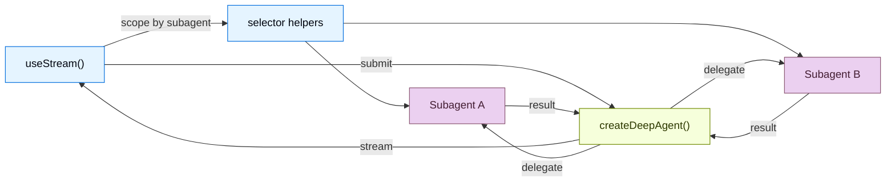

import FrontendOverviewBackendPy from '/snippets/code-samples/frontend-overview-backend-py.mdx';
import FrontendOverviewBackendJs from '/snippets/code-samples/frontend-overview-backend-js.mdx';
import FrontendOverviewUseStreamTs from '/snippets/code-samples/frontend-overview-use-stream-js.mdx';

构建能够实时可视化 deep agent 工作流的前端。这些模式展示了如何渲染 subagent 进度、任务规划、流式内容，以及由 `createDeepAgent` 创建的 agent 所提供的类 IDE sandbox 体验。

当 UI 能把委派过程显式展示出来时，deep agent 的价值最大。与其只显示一个模糊的 assistant 气泡，不如让 LangChain SDK 暴露 coordinator、subagent 发现、自定义状态和由 sandbox 支撑的制品，这样用户就能检查一个长任务是如何被拆解并完成的。

<Note>
这些模式使用 v1 frontend SDK package。如果你还在使用更早的版本，请查看 [React](https://github.com/langchain-ai/langgraphjs/blob/main/libs/sdk-react/docs/v1-migration.md)、[Vue](https://github.com/langchain-ai/langgraphjs/blob/main/libs/sdk-vue/docs/v1-migration.md)、[Svelte](https://github.com/langchain-ai/langgraphjs/blob/main/libs/sdk-svelte/docs/v1-migration.md) 和 [Angular](https://github.com/langchain-ai/langgraphjs/blob/main/libs/sdk-angular/docs/v1-migration.md) 的迁移指南。
</Note>

## 架构

Deep Agents 使用 coordinator-worker 架构。主 agent 负责规划任务并委派给专门的 subagent，每个 subagent 都在隔离环境中运行。在前端，v1 stream handle 会在根流里展示 coordinator 消息，并暴露 subagent 发现快照，用于展示有作用域限制的 subagent 视图。

:::python

<FrontendOverviewBackendPy />

:::

:::js

<FrontendOverviewBackendJs />

:::

在前端，像使用 `createAgent` 一样连接 @[useStream]。传入一个 [type parameter](/oss/langchain/frontend/overview) 以获得类型安全的 stream state。deep agent 模式会使用 `stream.subagents`、诸如 `useMessages(stream, subagent)` 这样的 selector helpers，以及 `stream.values.todos` 之类的自定义 state 值来渲染面向 subagent 的 UI。

<FrontendOverviewUseStreamTs />

## SDK 暴露了什么

Deep agent UI 通常需要的不只是最终答案。frontend SDK 会为运行中用户关心的部分提供结构化投影：

| 投影 | 用途 |
| --- | --- |
| `stream.messages` | coordinator 的对话和最终综合结果。 |
| `stream.subagents` | 对专门 worker 的实时发现，包括 status 和 task metadata。 |
| `stream.values` | 共享 state，例如 todos、计划、报告章节、sandbox metadata，或 agent 写入的任何自定义 key。 |
| Tool-call state | 将文件系统、搜索、浏览器或领域 tools 渲染为带有进度和结果的卡片。 |
| Interrupts | 在不丢失运行状态的情况下，暂停委派工作以等待用户批准或缺失输入。 |

这样你就能构建出更接近 IDE、任务面板或工作流监视器的界面，而不是一份普通的聊天记录。

## 模式

<CardGroup cols={3}>
  <Card title="Subagent 流式传输" icon="arrows-split" href="/oss/deepagents/frontend/subagent-streaming">
    使用流式内容、进度跟踪和可折叠卡片展示专门的 subagent。
  </Card>
  <Card title="Todo list" icon="list-check" href="/oss/deepagents/frontend/todo-list">
    使用与 agent state 同步的实时 todo list 跟踪 agent 进度。
  </Card>
  <Card title="Sandbox" icon="code" href="/oss/deepagents/frontend/sandbox">
    构建一个由 sandbox 支撑的、包含文件浏览器、代码查看器和 diff 面板的类 IDE UI。
  </Card>
</CardGroup>

## 相关模式

包括 markdown 消息、tool calling 和 human-in-the-loop 在内的 [LangChain frontend patterns](/oss/langchain/frontend/overview)，同样适用于 deep agent。Deep Agents 也是构建在同一个 LangGraph runtime 之上的，因此 `useStream` 提供了相同的核心 API。

如果你想看更底层的 graph 可视化，请参见 [LangGraph frontend patterns](/oss/langgraph/frontend/overview)。它们展示了如何把 graph node 和 state key 直接映射为 UI 组件。
