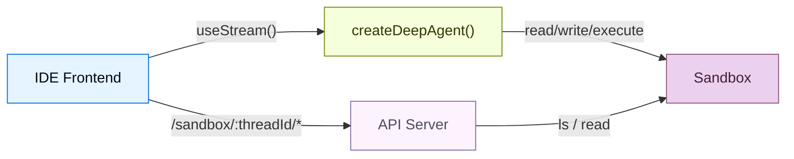
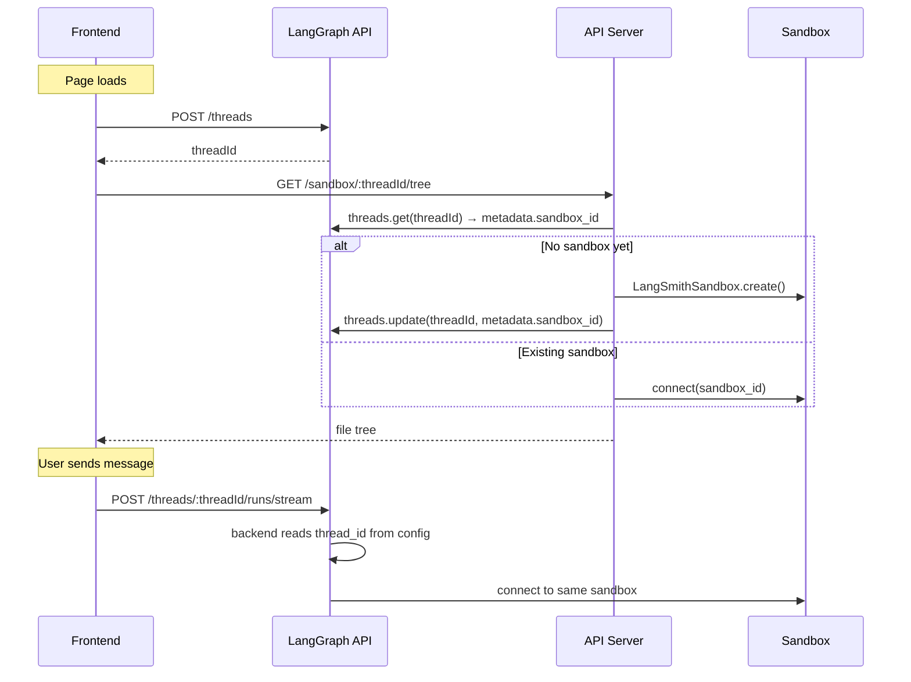

coding agent 需要的不只是一个聊天窗口。它们还需要文件浏览器、代码查看器和 diff 面板，也就是一种 IDE 体验。这个模式会把 deep agent 连接到一个 [sandbox](/oss/deepagents/sandboxes)，让它可以在隔离环境中读、写和执行代码；然后再通过自定义 API server 暴露 sandbox 文件系统，这样前端就能在 agent 工作时实时显示文件。

本页介绍 **三栏 UI**（文件树、代码查看器和聊天）以及把 sandbox 文件系统暴露给前端的 **自定义 API 路由**。关于 sandbox provider、生命周期作用域、文件种子、secret、部署以及生产环境中的 `useStream` 配置，请参见 [Going to production](/oss/deepagents/going-to-production)。

import { PatternEmbed } from "/snippets/pattern-embed.jsx";
import FrontendSandboxThreadBackendPy from "/snippets/code-samples/frontend-sandbox-thread-backend-py.mdx";
import FrontendSandboxUtilsJs from "/snippets/code-samples/api/frontend-sandbox-utils-js.mdx";
import FrontendSandboxAgentJs from "/snippets/code-samples/frontend-sandbox-agent-js.mdx";
import FrontendSandboxDetectChangesJs from "/snippets/code-samples/frontend-sandbox-detect-changes-js.mdx";

<PatternEmbed pattern="deep-agent-ide" minHeight={700} />

## 架构

这个方案包含三部分：

:::python

1. **带有 sandbox backend 的 deep agent：** agent 会自动从 sandbox 获得文件系统 tools
   （`read_file`、`write_file`、`edit_file`、`delete`、`execute`）

:::

:::js

1. **带有 sandbox backend 的 deep agent：** agent 会自动从 sandbox 获得文件系统 tools
   （`read_file`、`write_file`、`edit_file`、`execute`）

:::

:::python

2. **自定义 API server** — 通过 `langgraph.json` 的 `http.app` 字段暴露一个 FastAPI app，
   提供前端可以调用的文件浏览端点

:::

:::js

2. **自定义 API server：** 通过 `langgraph.json` 的 `http.app` 字段暴露一个 Hono app，
   提供前端可以调用的文件浏览端点

:::

3. **三栏前端：** 文件树、代码/diff 查看器和聊天面板，
   会随着 agent 的修改实时同步文件



## Sandbox 生命周期

在连接前端之前，先决定 sandbox 存活多久，以及谁来共享它。
关于 thread-scoped 与 assistant-scoped sandbox、异步 [graph factory](/langsmith/graph-rebuild)
设置、TTL 行为以及 SDK 调用示例，请参见 [Sandbox lifecycle](/oss/deepagents/going-to-production#lifecycle)。

本指南默认使用 **thread-scoped sandbox**。前端和自定义 API server 都会根据 LangGraph 的 [thread](/langsmith/use-threads) ID 解析 sandbox。这样可以保持对话隔离，并且在你 [持久化 thread ID](#thread-creation) 后，页面刷新也能重新连接到同一个环境。



对于 [multi-tenant](/oss/deepagents/going-to-production#multi-tenancy) 应用，则应在 backend factory 中按用户或 assistant 来划分 sandbox。对于没有 LangGraph threads 的演示，可以在 API URL 中传入一个由客户端生成的 session ID。这个 session ID 不会跨浏览器会话持久化。

## 连接 agent 和 API server

按照 [Execution environment](/oss/deepagents/going-to-production#execution-environment) 的说明，用一个 [sandbox backend](/oss/deepagents/sandboxes) 配置 deep agent。agent 会自动获得文件系统 tools 和 `execute` tool，不需要额外的 tool 配置。

在生产配置的基础上构建这个 UI 还会多出一个要求：需要一个运行在 agent graph 之外的 **custom API server**。因此，agent backend 和文件浏览路由都必须为每个 thread 解析到 **同一个 sandbox**。把 sandbox ID 存在 thread metadata 里，并在两边共用同一个查找函数。

### 从 thread metadata 解析 sandbox

:::js

在共享模块中定义 `getOrCreateSandboxForThread`。agent graph factory 和自定义 API 路由都会导入它：

<FrontendSandboxUtilsJs />

把 agent 作为一个异步 [graph factory](/langsmith/graph-rebuild) 来接线，它会从 run config 中读取
`thread_id`，并把解析出的 backend 传给 `createDeepAgent`：

<FrontendSandboxAgentJs />

:::

:::python

<FrontendSandboxThreadBackendPy />

:::

<Note>
  类似 [Going to production](/oss/deepagents/going-to-production#lifecycle) 中的示例，这个 agent 是一个会在每次运行时调用的 async graph factory。把 sandbox ID 存到 thread metadata 里，这样自定义 `http.app` 路由就可以调用同一个 `getOrCreateSandboxForThread` helper。当 LangGraph SDK 是唯一入口时，Going to production 会改用 provider label lookup。
</Note>

### 预置项目文件

在 agent 运行前，使用 `uploadFiles` / `upload_files` 上传起始文件。
关于种子文件模式、provider 示例，以及把 [memories](/oss/deepagents/memory) 或
[skills](/oss/deepagents/skills) 同步到 sandbox，请参见 [File transfers](/oss/deepagents/going-to-production#file-transfers)。
对于 LangSmith sandbox，在创建容器时可从 [sandbox snapshot](/langsmith/sandbox-snapshots) 传入 `templateName`。

<Tip>
  在上传 `package.json` 后运行 `sandbox.execute("cd /app && npm install")`，
  这样依赖就能在第一次 agent turn 之前准备好。
</Tip>

## 添加文件浏览 API

:::js

agent 可以读写文件，但前端也需要直接访问 sandbox 文件系统。添加一个自定义
[Hono](https://hono.dev) API server，并通过 `langgraph.json` 中的 `http.app` 字段暴露它。

:::

:::python

agent 可以读写文件，但前端也需要直接访问 sandbox 文件系统。添加一个自定义
[FastAPI](https://fastapi.tiangolo.com) API server，并通过 `langgraph.json` 中的 `http.app` 字段暴露它。

:::

### 创建 API server

sandbox API endpoint 会把 thread ID 当作 URL path parameter。这样可以确保前端始终访问当前 conversation，并且与 agent backend 使用同一个 `get_or_create_sandbox_for_thread` / `getOrCreateSandboxForThread` helper。

:::js

```ts
// src/api/app.ts
import { Hono } from "hono";
import { getOrCreateSandboxForThread } from "./utils.js";

export const app = new Hono();

app.get("/sandbox/:threadId/tree", async (c) => {
  const threadId = c.req.param("threadId");
  const rootPath = c.req.query("filePath") || "/app";

  const sandbox = await getOrCreateSandboxForThread(threadId);
  const result = await sandbox.execute(
    `find '${rootPath}' -printf '%y\\t%s\\t%p\\n' 2>/dev/null | sort -t$'\\t' -k3`,
  );

  const entries = result.output
    .trim()
    .split("\n")
    .filter(Boolean)
    .map((line) => {
      const [typeChar, sizeStr, fullPath] = line.split("\t");
      return {
        name: fullPath.split("/").pop(),
        type: typeChar === "d" ? "directory" : "file",
        path: fullPath,
        size: parseInt(sizeStr, 10) || 0,
      };
    });

  return c.json({ path: rootPath, entries, sandboxId: sandbox.id });
});

app.get("/sandbox/:threadId/file", async (c) => {
  const threadId = c.req.param("threadId");
  const filePath = c.req.query("filePath");
  if (!filePath) return c.json({ error: "filePath is required" }, 400);

  const sandbox = await getOrCreateSandboxForThread(threadId);
  const results = await sandbox.downloadFiles([filePath]);
  const file = results[0];
  if (file.error) return c.json({ error: file.error }, 404);

  const content = new TextDecoder().decode(file.content!);
  return c.json({ path: filePath, content });
});
```

:::

:::python

```python
# src/api/server.py
from fastapi import FastAPI, Query, Path
from utils import get_or_create_sandbox_for_thread

app = FastAPI()

@app.get("/sandbox/{thread_id}/tree")
async def list_tree(
    thread_id: str = Path(...),
    filePath: str = Query("/app"),
):
    sandbox = await get_or_create_sandbox_for_thread(thread_id)
    result = await sandbox.aexecute(
        f"find {filePath} -printf '%y\\t%s\\t%p\\n' 2>/dev/null | sort"
    )
    entries = []
    for line in result.output.strip().split("\n"):
        if not line:
            continue
        type_char, size_str, full_path = line.split("\t")
        entries.append({
            "name": full_path.split("/")[-1],
            "type": "directory" if type_char == "d" else "file",
            "path": full_path,
            "size": int(size_str),
        })
    return {"path": filePath, "entries": entries, "sandboxId": sandbox.id}

@app.get("/sandbox/{thread_id}/file")
async def read_file(
    thread_id: str = Path(...),
    filePath: str = Query(...),
):
    sandbox = await get_or_create_sandbox_for_thread(thread_id)
    results = await sandbox.adownload_files([filePath])
    return {"path": filePath, "content": results[0].content.decode()}
```

:::

<Note>
  Both the agent's backend and the API server call the same
:::python
  `get_or_create_sandbox_for_thread` function. This ensures they always resolve
:::
:::js
  `getOrCreateSandboxForThread` function. This ensures they always resolve
:::
  to the same sandbox for a given thread. The sandbox ID in thread metadata
  is the single source of truth — no in-memory caches needed.
</Note>

### 配置 `langgraph.json`

同时注册 agent graph 和 API server。`http.app` 字段会告诉 LangGraph platform
把你的自定义路由和默认路由一起提供。完整的 `langgraph.json` 选项请参见
[application structure](/oss/langgraph/application-structure) 和
[LangSmith Deployments](/oss/deepagents/going-to-production#langsmith-deployments)。

:::js

```json
{
  "node_version": "22",
  "graphs": {
    "deep_agent_ide": "./src/agents/deep-agent-ide.ts:agent"
  },
  "env": ".env",
  "http": {
    "app": "./src/api/app.ts:app"
  }
}
```

:::

:::python

```json
{
  "graphs": {
    "deep_agent_ide": "./src/agents/my_agent.py:agent"
  },
  "env": ".env",
  "http": {
    "app": "./src/api/server.py:app"
  }
}
```

:::

你的自定义路由会和 LangGraph API 共享同一个 host。使用 `langgraph dev` 进行本地开发时，
地址就是 `http://localhost:2024`。

<Note>
  在 `http.app` 中定义的自定义路由优先级高于默认的 LangGraph 路由。这意味着你可以在需要时覆盖内置端点，
  但要小心不要误覆写 `/threads` 或 `/runs` 之类的路由。
</Note>

## 构建前端

前端有三个面板：文件树侧边栏、代码/diff 查看器和聊天面板。它使用 @[useStream]
处理 agent 对话，并使用自定义 API endpoint 浏览文件。

对于生产部署，把 `apiUrl` 指向你的 [LangSmith Deployment](/langsmith/deployment)，
并在每次运行时传入稳定的 `thread_id`。关于这些设置，以及如何用 `thread_id`
和 runtime `context` [调用 agent](/oss/deepagents/going-to-production#invoking-the-agent)，
请参见 [Going to production](/oss/deepagents/going-to-production) 中的 [Frontend](/oss/deepagents/going-to-production#frontend)。

### 创建 thread

在页面加载时创建一个 LangGraph thread，并把它的 ID 持久化到 `sessionStorage`，
这样页面刷新后就能重新连接到同一个 sandbox：

```tsx
const THREAD_KEY = "sandbox-thread-id";

function IDEPreview() {
  const [threadId, setThreadId] = useState<string | null>(
    () => sessionStorage.getItem(THREAD_KEY),
  );

  const updateThreadId = useCallback((id: string | null) => {
    setThreadId(id);
    if (id) sessionStorage.setItem(THREAD_KEY, id);
    else sessionStorage.removeItem(THREAD_KEY);
  }, []);

  const stream = useStream<typeof myAgent>({
    apiUrl: AGENT_URL,
    assistantId: "deep_agent_ide",
    threadId,
    onThreadId: updateThreadId,
  });

  // 首次挂载时创建 thread
  useEffect(() => {
    if (threadId) return;
    stream.client.threads.create().then((t) => updateThreadId(t.thread_id));
  }, [stream.client, threadId, updateThreadId]);

  // 将 threadId 传给 sandbox 文件 hooks
  const { tree, files } = useSandboxFiles(threadId);
  // ...
}
```

“new thread” 按钮会清除已存储的 ID，这样下一次挂载时会创建一个新的 thread（以及 sandbox）：

```tsx
function handleNewThread() {
  updateThreadId(null);
}
```

### 文件状态管理

跟踪 sandbox 文件系统的两个快照：原始状态（agent 运行前）和当前状态（实时更新）。
thread ID 会包含在 API URL 中，因此请求始终会命中正确的 sandbox：

```ts
const AGENT_URL = "http://localhost:2024";

async function fetchTree(threadId: string): Promise<FileEntry[]> {
  const res = await fetch(
    `${AGENT_URL}/sandbox/${encodeURIComponent(threadId)}/tree?filePath=/app`,
  );
  const data = await res.json();
  return data.entries.filter((e: FileEntry) => !e.path.includes("node_modules"));
}

async function fetchFile(threadId: string, path: string): Promise<string | null> {
  const res = await fetch(
    `${AGENT_URL}/sandbox/${encodeURIComponent(threadId)}/file?filePath=${encodeURIComponent(path)}`,
  );
  const data = await res.json();
  return data.content ?? null;
}
```

### 实时文件同步

IDE 体验的关键在于，在 agent 工作时就更新文件，而不是等它结束之后。监控 stream 的 messages，
找出来自会修改文件的 tools 的 `ToolMessage`。当 `write_file` 或 `edit_file` tool call 完成时，
刷新对应文件；当 `execute` 完成时，则刷新全部内容，因为 shell command 可能修改任何文件：

<CodeGroup>
```tsx React
import { useStream } from "@langchain/react";
import { ToolMessage, AIMessage } from "langchain";

const FILE_MUTATING_TOOLS = new Set(["write_file", "edit_file", "execute"]);

export function IDEPreview() {
  const stream = useStream<typeof myAgent>({
    apiUrl: AGENT_URL,
    assistantId: "deep_agent_ide",
  });

  const processedIds = useRef(new Set<string>());

  useEffect(() => {
    // 从 AI messages 中构建会修改文件的 tool call 映射
    const toolCallMap = new Map();
    for (const msg of stream.messages) {
      if (!AIMessage.isInstance(msg)) continue;
      for (const tc of msg.tool_calls ?? []) {
        if (tc.id && FILE_MUTATING_TOOLS.has(tc.name)) {
          toolCallMap.set(tc.id, { name: tc.name, args: tc.args });
        }
      }
    }

    // 当某个会修改文件的 tool 出现 ToolMessage 时，刷新对应内容
    for (const msg of stream.messages) {
      if (!ToolMessage.isInstance(msg)) continue;
      const id = msg.id ?? msg.tool_call_id;
      if (!id || processedIds.current.has(id)) continue;

      const call = toolCallMap.get(msg.tool_call_id);
      if (!call) continue;
      processedIds.current.add(id);

      if (call.name === "write_file" || call.name === "edit_file") {
        refreshSingleFile(call.args.path ?? call.args.file_path);
      } else if (call.name === "execute") {
        refreshTreeAndFiles();
      }
    }
  }, [stream.messages]);
}
```

```vue Vue
<script setup lang="ts">
import { useStream } from "@langchain/vue";
import { ToolMessage, AIMessage } from "langchain";
import { watch } from "vue";

const FILE_MUTATING_TOOLS = new Set(["write_file", "edit_file", "execute"]);
const processedIds = new Set<string>();

const stream = useStream<typeof myAgent>({
  apiUrl: AGENT_URL,
  assistantId: "deep_agent_ide",
});

watch(
  () => stream.messages.value,
  (messages) => {
    const toolCallMap = new Map();
    for (const msg of messages) {
      if (AIMessage.isInstance(msg)) {
        for (const tc of msg.tool_calls ?? []) {
          if (tc.id && FILE_MUTATING_TOOLS.has(tc.name)) {
            toolCallMap.set(tc.id, { name: tc.name, args: tc.args });
          }
        }
      }
    }

    for (const msg of messages) {
      if (!ToolMessage.isInstance(msg)) continue;
      const id = msg.id ?? msg.tool_call_id;
      if (!id || processedIds.has(id)) continue;

      const call = toolCallMap.get(msg.tool_call_id);
      if (!call) continue;
      processedIds.add(id);

      if (call.name === "write_file" || call.name === "edit_file") {
        refreshSingleFile(call.args.path ?? call.args.file_path);
      } else if (call.name === "execute") {
        refreshTreeAndFiles();
      }
    }
  },
  { deep: true },
);
</script>
```

```svelte Svelte
<script lang="ts">
  import { useStream } from "@langchain/svelte";
  import { ToolMessage, AIMessage } from "langchain";

  const FILE_MUTATING_TOOLS = new Set(["write_file", "edit_file", "execute"]);
  const processedIds = new Set<string>();

  const stream = useStream<typeof myAgent>({
    apiUrl: AGENT_URL,
    assistantId: "deep_agent_ide",
  });

  $effect(() => {
    const msgs = stream.messages;
    const toolCallMap = new Map();
    for (const msg of msgs) {
      if (AIMessage.isInstance(msg)) {
        for (const tc of msg.tool_calls ?? []) {
          if (tc.id && FILE_MUTATING_TOOLS.has(tc.name)) {
            toolCallMap.set(tc.id, { name: tc.name, args: tc.args });
          }
        }
      }
    }

    for (const msg of msgs) {
      if (!ToolMessage.isInstance(msg)) continue;
      const id = msg.id ?? msg.tool_call_id;
      if (!id || processedIds.has(id)) continue;

      const call = toolCallMap.get(msg.tool_call_id);
      if (!call) continue;
      processedIds.add(id);

      if (call.name === "write_file" || call.name === "edit_file") {
        refreshSingleFile(call.args.path ?? call.args.file_path);
      } else if (call.name === "execute") {
        refreshTreeAndFiles();
      }
    }
  });
</script>
```

```ts Angular
import { Component, effect } from "@angular/core";
import { injectStream } from "@langchain/angular";
import { ToolMessage, AIMessage } from "langchain";

const FILE_MUTATING_TOOLS = new Set(["write_file", "edit_file", "execute"]);

@Component({
  selector: "app-ide-preview",
  template: `<!-- ... -->`,
})
export class IdePreviewComponent {
  stream = injectStream<typeof myAgent>({
    apiUrl: AGENT_URL,
    assistantId: "deep_agent_ide",
  });

  private processedIds = new Set<string>();

  constructor() {
    effect(() => {
      const messages = this.stream.messages();
      const toolCallMap = new Map();
      for (const msg of messages) {
        if (AIMessage.isInstance(msg)) {
          for (const tc of (msg as AIMessage).tool_calls ?? []) {
            if (tc.id && FILE_MUTATING_TOOLS.has(tc.name)) {
              toolCallMap.set(tc.id, { name: tc.name, args: tc.args });
            }
          }
        }
      }

      for (const msg of messages) {
        if (!ToolMessage.isInstance(msg)) continue;
        const id = (msg as ToolMessage).id ?? (msg as ToolMessage).tool_call_id;
        if (!id || this.processedIds.has(id)) continue;

        const call = toolCallMap.get((msg as ToolMessage).tool_call_id);
        if (!call) continue;
        this.processedIds.add(id);

        if (call.name === "write_file" || call.name === "edit_file") {
          this.refreshSingleFile(call.args.path ?? call.args.file_path);
        } else if (call.name === "execute") {
          this.refreshTreeAndFiles();
        }
      }
    });
  }
}
```

</CodeGroup>

### 检测已更改文件

在每次 agent 运行前，先快照当前文件内容。文件刷新后，把它和快照比较，
即可找出哪些文件发生了变化：

<FrontendSandboxDetectChangesJs />

当用户选择某个已更改文件时，默认显示 diff 视图，这样他们能立即看到 agent 改了什么。

### 显示 diff

使用适合对应 framework 的 diff library 来渲染 unified diff：

| Framework | Library                                                                    | Component                                                       |
| --------- | -------------------------------------------------------------------------- | --------------------------------------------------------------- |
| React     | [`@pierre/diffs`](https://diffs.com)                                       | 带有 `parseDiffFromFile` 的 `<FileDiff>`                         |
| Vue       | [`@git-diff-view/vue`](https://github.com/MrWangJustToDo/git-diff-view)    | 带有 `@git-diff-view/file` 中 `generateDiffFile` 的 `<DiffView>` |
| Svelte    | [`@git-diff-view/svelte`](https://github.com/MrWangJustToDo/git-diff-view) | 带有 `@git-diff-view/file` 中 `generateDiffFile` 的 `<DiffView>` |
| Angular   | [`ngx-diff`](https://github.com/rars/ngx-diff)                             | 带有 `[before]` 和 `[after]` 的 `<ngx-unified-diff>`             |

以 `@pierre/diffs`（React）为例：

```tsx
import { FileDiff } from "@pierre/diffs/react";
import { parseDiffFromFile } from "@pierre/diffs";

function DiffPanel({ original, current, fileName }) {
  const diff = parseDiffFromFile(
    { name: fileName, contents: original },
    { name: fileName, contents: current },
  );

  return (
    <FileDiff
      fileDiff={diff}
      options={{ theme: "github-dark", diffStyle: "unified", diffIndicators: "bars" }}
    />
  );
}
```

### 已更改文件摘要

显示所有修改过的文件摘要，并给出按行统计的新增/删除数量。
这会给用户一个类似 `git status` 的快速概览，帮助他们了解 agent 造成了哪些影响：

```tsx
function ChangedFilesSummary({ changedFiles, files, originalFiles, onSelect }) {
  const stats = [...changedFiles].map((path) => {
    const oldLines = (originalFiles[path] ?? "").split("\n");
    const newLines = (files[path] ?? "").split("\n");
    // Compute additions/deletions by comparing lines
    return { path, additions, deletions };
  });

  return (
    <div>
      <h3>{stats.length} 个文件已更改</h3>
      {stats.map((file) => (
        <button key={file.path} onClick={() => onSelect(file.path)}>
          {file.path}
          <span className="text-green-400">+{file.additions}</span>
          <span className="text-red-400">-{file.deletions}</span>
        </button>
      ))}
    </div>
  );
}
```

## 使用场景

sandbox 适合以下场景：

- **Coding agents**：当 agent 需要创建、修改和运行代码时，除了聊天之外还需要一个可视化界面
- **Code review workflows**：当 agent 提出变更，而用户在接受前需要审查 diff 时
- **Tutorial or learning apps**：当 AI assistant 帮助用户一步一步构建项目，并在上下文中展示改动时
- **Prototyping tools**：用户用自然语言描述功能，然后看着 agent 实时实现它们

## 最佳实践

前端相关：

- **把 `threadId` 持久化到 `sessionStorage`**，这样页面刷新后会重新连接到同一个 thread 和 sandbox，而不是创建新的。
:::python
- **在每次相关 tool call 后同步文件**，而不是只在运行结束时同步。监控 `write_file`、`edit_file`、`delete` 和 `execute` 的 tool message，并立刻刷新。
:::
:::js
- **在每次相关 tool call 后同步文件**，而不是只在运行结束时同步。监控 `write_file`、`edit_file` 和 `execute` 的 tool message，并立刻刷新。
:::
- **更改过的文件默认显示 diff 视图**。当用户点击一个被 agent 修改过的文件时，先展示 diff，因为这才是他们最关心的。
- **只读操作显示简洁结果**。不要把 `read_file` 的完整输出直接灌进聊天里，而是显示类似 `Read router.js L1-42` 这样的单行摘要。完整输出留给会修改文件的 tools。
- **从文件树中过滤 `node_modules`**。没人想浏览成千上万的依赖文件，抓取 tree 时把它们过滤掉。

对于 backends 和 sandboxes：

- **生产应用使用 thread-scoped sandbox**。见 [Sandbox lifecycle](/oss/deepagents/going-to-production#lifecycle)。
- **通过 thread metadata 共享 sandbox 解析**，让 agent backend 和 API server 都解析到同一个环境，不依赖内存缓存。
- **用真实项目给 sandbox 预置种子**。见 [File transfers](/oss/deepagents/going-to-production#file-transfers)。
- **把 secret 留在 sandbox 外部**。API key 应使用 [sandbox auth proxy](/oss/deepagents/going-to-production#managing-secrets)，而不是环境变量或文件上传。
- **在上线前加上 guardrail**。为自治 coding agent 配置 [rate limits](/oss/deepagents/going-to-production#rate-limiting)、[error handling](/oss/deepagents/going-to-production#handling-errors) 和 [data privacy](/oss/deepagents/going-to-production#data-privacy) middleware。

## 相关内容

<CardGroup cols={2}>
  <Card title="Going to production" icon="rocket" href="/oss/deepagents/going-to-production">
    使用持久化 sandbox、认证、guardrail 和生产环境 `useStream` 设置来部署 agent。
  </Card>
  <Card title="Sandboxes" icon="box" href="/oss/deepagents/sandboxes">
    sandbox provider、安全模型和文件传输 API。
  </Card>
  <Card title="Frontend overview" icon="layout" href="/oss/deepagents/frontend/overview">
    其他 deep agent UI 模式：subagent 流式传输、todo list 和自定义 state。
  </Card>
  <Card title="Application structure" icon="file-code" href="/oss/langgraph/application-structure">
    完整的 `langgraph.json` 参考，包括自定义 `http.app` 路由。
  </Card>
</CardGroup>
