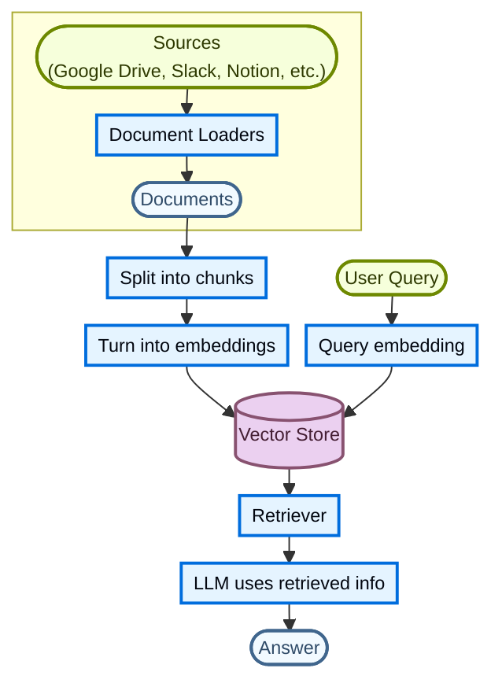
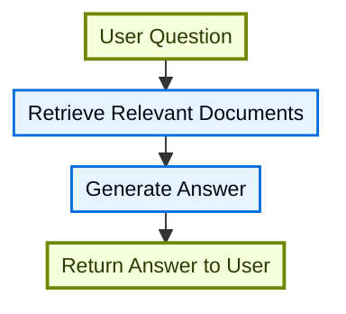
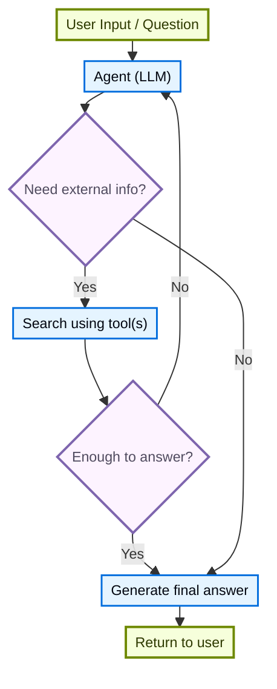
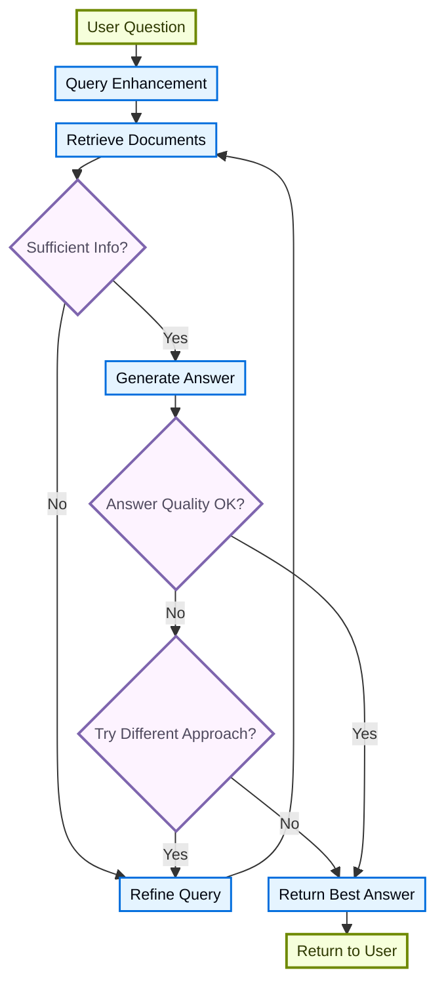

大语言模型（LLM）非常强大，但有两个关键限制：

* **有限的上下文**：它们无法一次性摄取整个语料库。
* **静态的知识**：它们的训练数据停留在某个时间点。

检索通过在查询时获取相关的外部知识来解决这些问题。这是**检索增强生成（RAG）**的基础，用上下文相关的信息增强 LLM 的回答。

## 构建知识库

**知识库**是检索过程中使用的文档或结构化数据的仓库。

如果你需要一个自定义知识库，可以使用 LangChain 的 document loaders 和 vector stores，用你自己的数据构建一个。

<Note>
    如果你已经拥有一个知识库（例如 SQL 数据库、文档数据库、CRM 或内部文档系统），你**不需要**重建它。你可以：
    - 将它作为**工具**连接到 Agentic RAG 中的 agent。
    - 查询它，并将检索到的内容作为上下文提供给 LLM [(2-Step RAG)](#2-step-rag)。
</Note>

更多信息请参见以下教程，学习如何构建一个可搜索的知识库和最小 RAG 工作流：

<Card
    title="教程：语义搜索"
    icon="database"
    href="/oss/langchain/knowledge-base"
    arrow cta="Learn more"
>
    学习如何使用 LangChain 的 document loaders、embeddings 和 vector stores，用你自己的数据创建一个可搜索的知识库。
    在本教程中，你将基于一个 PDF 构建一个搜索引擎，从而检索与查询相关的段落。你还将在这个引擎之上实现一个最小 RAG 工作流，看看外部知识如何被整合到 LLM 的推理中。
</Card>

### 从检索到 RAG

检索让 LLM 可以在运行时访问相关上下文。但大多数真实应用更进一步：它们**将检索与生成整合在一起**，产生有据可依、能感知上下文的回答。

这就是**检索增强生成（RAG）**背后的核心思想。检索管道成为一个更广泛系统的基础，该系统将搜索与生成结合起来。

### 检索管道

一个典型的检索工作流如下所示：



每个组件都是模块化的：你可以在不重写应用逻辑的情况下替换 loaders、splitters、embeddings 或 vector stores。

### 构建组件

<Columns cols={2}>
    <Card
        title="Document loaders"
        icon="file-import"
        href="/oss/integrations/document_loaders"
        arrow cta="Learn more"
    >
        从外部来源（Google Drive、Slack、Notion 等）摄取数据，返回标准化的 @[`Document`] 对象。
    </Card>

    :::python
    <Card
        title="Text splitters"
        icon="scissors"
        href="/oss/integrations/splitters"
        arrow
        cta="Learn more"
    >
        把大文档拆分成更小的 chunk，这些 chunk 可以被单独检索，并适配模型的上下文窗口。
    </Card>
    :::
    <Card
        title="Embedding models"
        icon="sitemap"
        href="/oss/integrations/embeddings"
        arrow
        cta="Learn more"
    >
        Embedding model 将文本转换为数字向量，使含义相近的文本在该向量空间中彼此靠近。
    </Card>

    <Card
        title="Vector stores"
        icon="database"
        href="/oss/integrations/vectorstores/"
        arrow
        cta="Learn more"
    >
        用于存储和搜索 embeddings 的专用数据库。
    </Card>

    <Card
        title="Retrievers"
        icon="binoculars"
        href="/oss/integrations/retrievers/"
        arrow
        cta="Learn more"
    >
        Retriever 是一个在给定非结构化查询时返回文档的接口。
    </Card>
</Columns>

## RAG 架构

RAG 可以通过多种方式实现，具体取决于你的系统需求。我们在以下章节中介绍每种类型。

| 架构            | 说明                                                                | 控制   | 灵活性 | 延迟        | 示例用例                                   |
|-------------------------|----------------------------------------------------------------------------|-----------|-------------|----------------|----------------------------------------------------|
| **2-Step RAG**          | 检索总是发生在生成之前。简单且可预测         | ✅ 高    | ❌ 低       | ⚡ 快速         | FAQ、文档 bot                           |
| **Agentic RAG**         | 由 LLM 驱动的 agent 在推理过程中决定*何时*以及*如何*检索 | ❌ 低     | ✅ 高      | ⏳ 可变     | 可以访问多种工具的研究助手  |
| **混合**              | 结合两种方式的特点，并带有验证步骤          | ⚖️ 中等 | ⚖️ 中等   | ⏳ 可变     | 带质量验证的领域问答        |

<Info>
**延迟**：**2-Step RAG** 的延迟通常更**可预测**，因为 LLM 调用的最大次数是已知且有上限的。这种可预测性假设 LLM 推理时间是主导因素。然而，真实世界的延迟也可能受到检索步骤性能的影响，例如 API 响应时间、网络延迟或数据库查询，这些会因使用的工具和基础设施而异。
</Info>

### 2-step RAG

在 **2-Step RAG** 中，检索步骤总是在生成步骤之前执行。这种架构直接且可预测，适用于许多应用场景，在这些场景中检索相关文档是生成回答的明确前提。


<br/>
<CardGroup cols={2}>
    <Card
        title="教程：语义搜索"
        icon="database"
        href="/oss/langchain/knowledge-base"
        arrow
        cta="Learn more"
    >
        使用 document loaders、embeddings 和 vector stores 构建一个可搜索的知识库，然后在它之上运行一个最小的先检索后生成 RAG 工作流。
    </Card>
    <Card
        title="教程：评估 RAG 应用"
        icon="clipboard-check"
        href="/langsmith/evaluate-rag-tutorial"
        arrow
        cta="Learn more"
    >
        构建一个简单的先检索后生成 RAG 应用，并使用 LangSmith 衡量回答的正确性、相关性、有据性和检索质量。
    </Card>
</CardGroup>

### Agentic RAG

**Agentic Retrieval-Augmented Generation (RAG)** 将检索增强生成的优势与基于 agent 的推理结合起来。agent（由 LLM 驱动）不是在回答之前检索文档，而是逐步推理，并在交互过程中决定**何时**以及**如何**检索信息。

<Tip>
agent 启用 RAG 行为唯一需要的是访问一个或多个可以获取外部知识的**工具**，例如 document loaders、web API 或数据库查询。
</Tip>



:::python
```python
import requests
from langchain.tools import tool
from langchain.chat_models import init_chat_model
from langchain.agents import create_agent


@tool
def fetch_url(url: str) -> str:
    """Fetch text content from a URL"""
    response = requests.get(url, timeout=10.0)
    response.raise_for_status()
    return response.text

system_prompt = """\
Use fetch_url when you need to fetch information from a web-page; quote relevant snippets.
"""

agent = create_agent(
    model="claude-sonnet-4-6",
    tools=[fetch_url], # A tool for retrieval [!code highlight]
    system_prompt=system_prompt,
)
```
:::

:::js
```typescript
import { tool, createAgent } from "langchain";

const fetchUrl = tool(
    (url: string) => {
        return `Fetched content from ${url}`;
    },
    { name: "fetch_url", description: "Fetch text content from a URL" }
);

const agent = createAgent({
    model: "claude-sonnet-4-6",
    tools: [fetchUrl],
    systemPrompt,
});
```
:::

<Expandable title="扩展示例：面向 LangGraph llms.txt 的 Agentic RAG">

此示例实现了一个 **Agentic RAG 系统**，帮助用户查询 LangGraph 文档。agent 首先加载 [llms.txt](https://llmstxt.org/)（其中列出了可用的文档 URL），然后可以根据用户的问题动态使用 `fetch_documentation` 工具检索并处理相关内容。

:::python
```python
import requests
from langchain.agents import create_agent
from langchain.messages import HumanMessage
from langchain.tools import tool
from markdownify import markdownify


ALLOWED_DOMAINS = ["https://langchain-ai.github.io/"]
LLMS_TXT = 'https://langchain-ai.github.io/langgraph/llms.txt'


@tool
def fetch_documentation(url: str) -> str:  # [!code highlight]
    """Fetch and convert documentation from a URL"""
    if not any(url.startswith(domain) for domain in ALLOWED_DOMAINS):
        return (
            "Error: URL not allowed. "
            f"Must start with one of: {', '.join(ALLOWED_DOMAINS)}"
        )
    response = requests.get(url, timeout=10.0)
    response.raise_for_status()
    return markdownify(response.text)


# We will fetch the content of llms.txt, so this can
# be done ahead of time without requiring an LLM request.
llms_txt_content = requests.get(LLMS_TXT).text

# System prompt for the agent
system_prompt = f"""
You are an expert Python developer and technical assistant.
Your primary role is to help users with questions about LangGraph and related tools.

Instructions:

1. If a user asks a question you're unsure about—or one that likely involves API usage,
   behavior, or configuration—you MUST use the `fetch_documentation` tool to consult the relevant docs.
2. When citing documentation, summarize clearly and include relevant context from the content.
3. Do not use any URLs outside of the allowed domain.
4. If a documentation fetch fails, tell the user and proceed with your best expert understanding.

You can access official documentation from the following approved sources:

{llms_txt_content}

You MUST consult the documentation to get up to date documentation
before answering a user's question about LangGraph.

Your answers should be clear, concise, and technically accurate.
"""

tools = [fetch_documentation]

model = init_chat_model("claude-sonnet-4-6", max_tokens=32_000)

agent = create_agent(
    model=model,
    tools=tools,  # [!code highlight]
    system_prompt=system_prompt,  # [!code highlight]
    name="Agentic RAG",
)

response = agent.invoke({
    'messages': [
        HumanMessage(content=(
            "Write a short example of a langgraph agent using the "
            "prebuilt create react agent. the agent should be able "
            "to look up stock pricing information."
        ))
    ]
})

print(response['messages'][-1].content)
```
:::
:::js
```typescript
import { tool, createAgent, HumanMessage } from "langchain";
import * as z from "zod";

const ALLOWED_DOMAINS = ["https://langchain-ai.github.io/"];
const LLMS_TXT = "https://langchain-ai.github.io/langgraph/llms.txt";

const fetchDocumentation = tool(
  async (input) => {  // [!code highlight]
    if (!ALLOWED_DOMAINS.some((domain) => input.url.startsWith(domain))) {
      return `Error: URL not allowed. Must start with one of: ${ALLOWED_DOMAINS.join(", ")}`;
    }
    const response = await fetch(input.url);
    if (!response.ok) {
      throw new Error(`HTTP error! status: ${response.status}`);
    }
    return response.text();
  },
  {
    name: "fetch_documentation",
    description: "Fetch and convert documentation from a URL",
    schema: z.object({
      url: z.string().describe("The URL of the documentation to fetch"),
    }),
  }
);

const llmsTxtResponse = await fetch(LLMS_TXT);
const llmsTxtContent = await llmsTxtResponse.text();

const systemPrompt = `
You are an expert TypeScript developer and technical assistant.
Your primary role is to help users with questions about LangGraph and related tools.

Instructions:

1. If a user asks a question you're unsure about—or one that likely involves API usage,
   behavior, or configuration—you MUST use the \`fetch_documentation\` tool to consult the relevant docs.
2. When citing documentation, summarize clearly and include relevant context from the content.
3. Do not use any URLs outside of the allowed domain.
4. If a documentation fetch fails, tell the user and proceed with your best expert understanding.

You can access official documentation from the following approved sources:

${llmsTxtContent}

You MUST consult the documentation to get up to date documentation
before answering a user's question about LangGraph.

Your answers should be clear, concise, and technically accurate.
`;

const tools = [fetchDocumentation];

const agent = createAgent({
  model: "claude-sonnet-4-6"
  tools,  // [!code highlight]
  systemPrompt,  // [!code highlight]
  name: "Agentic RAG",
});

const response = await agent.invoke({
  messages: [
    new HumanMessage(
      "Write a short example of a langgraph agent using the " +
      "prebuilt create react agent. the agent should be able " +
      "to look up stock pricing information."
    ),
  ],
});

console.log(response.messages.at(-1)?.content);
```
:::
</Expandable>

<Card
    title="教程：使用 Deep Agents 的 RAG"
    icon="robot"
    href="/oss/deepagents/rag"
    arrow cta="Learn more"
>
    构建一个文档问答 agent，它在查询时检索相关 chunk，将它们卸载到文件系统，并把分析委派给 subagents。
</Card>

### 混合 RAG

混合 RAG 结合了 2-Step RAG 和 Agentic RAG 两种方式的特点。它引入了中间步骤，例如查询预处理、检索验证和生成后检查。这些系统比固定管道更灵活，同时对执行保持一定控制。

典型的组件包括：

* **查询增强**：修改输入问题以提高检索质量。这可以包括重写不清晰的查询、生成多个变体，或用额外的上下文扩展查询。
* **检索验证**：评估检索到的文档是否相关且充分。如果不充分，系统可以细化查询并再次检索。
* **回答验证**：检查生成的回答是否准确、完整，并与源内容一致。如有需要，系统可以重新生成或修订回答。

该架构通常支持这些步骤之间的多次迭代：



该架构适用于：

* 具有模糊或欠明确查询的应用
* 需要验证或质量控制步骤的系统
* 涉及多个来源或迭代细化的工作流

<Card
    title="教程：带自我纠正的 Agentic RAG"
    icon="robot"
    href="/oss/langgraph/agentic-rag"
    arrow cta="Learn more"
>
    一个**混合 RAG** 的示例，它将 agentic 推理与检索和自我纠正结合起来。
</Card>
